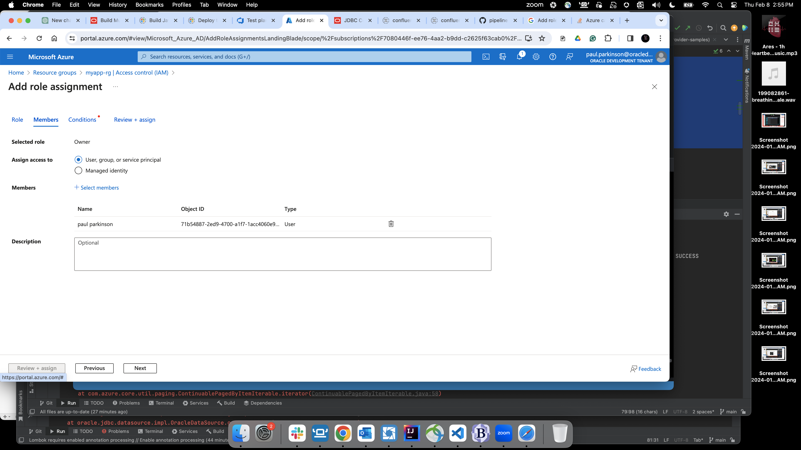

# Setup environment

## Introduction

In this lab, we will set up Azure Vault and Azure Config access to it for microservices/applications.
We will add the vault secrets and config that will be used by the microservice(s) in AKE to make connections to the Oracle Database in OCI.

*Estimated Time:* 10 minutes

### Objectives

* Create an Application Registration and obtain values for AZURE_TENANT_ID, AZURE_CLIENT_ID, and AZURE_CLIENT_SECRET
* Create and Configure Azure Vault.  
* Add secrets for password and wallet to the vault.
* Setup App Config access to the vault.

### Prerequisites

This lab assumes you have completed previous labs.

## Task 1: Create Application Registration

   1. Click `New Registration`

      

   2. Create a new registration

      

      

## Task 2: Create Azure Vault and Secrets For Wallet and Password

   1. From the home screen, click `Key Vaults` and `Create`

      

   2. Select the correct resource group, provide a name, and create the vault. (this is the equivalent of issuing the command `az keyvault create --name multicloudvault --resource-group myapp-rg`)

      

   3. Select `Secrets` on the sidebar menu of the vault created in the previous step and then click `Generate/Import`

      

   4. Name the secret `wallet` and provide the base64 value of the contents of cwallet.sso in the wallet zip as the secret value.
      You can issue the command `base64 -i /Users/pparkins/Downloads/Wallet_IndADW/cwallet.sso` to get this value.
      (this is the equivalent of issuing the command `az keyvault secret set --name wallet --vault-name multicloudvault --value "base64walletcontents"`

      

   5. Repeat the same for `password`

## Task 3: Configure Azure Vault for Access from Application Config (and thus the application)

   1. Make sure your user is explicitly owner of the resource group.

      

   2. add vault and secret roles - not actually sure if both are required

      

   3. under "access policies" add vault get, set ,etc. to app

      

   4. asdf

      

   5. asdf
      
      

## Task 4: Create Application Config with Access Roles

   1. Click `New Registration`

      

      

      

   2. Click `Access Control (IAM)` and click `Add role assignment`

      
 
      Search for and add App Config ownership/access roles.  Then click `Next`.
      
      
      Search for and add members. Then click `Next`. 
      

      View Conditions. Then click `Next` and `Review + assign`.
      

      Click `Check access` to verify access for user`.
      

## Task 5 : Create App Config Secrets

   1. From the application configuration page click `Create` and then `Key Vault reference`

      

   2. Create the reference using the appropriate `Key`, `Key Vault`, and `Secret` value as shown here for the `wallet_location`.

      

   3. Do the same for the `password` 

   4. Do the same for the `connect_descriptor` and `user` except select `Key-value` when creating rather than `Key Vault reference` 

This concludes this lab. You can **proceed now to the next lab**.

## Learn More

* [OCI Documentation](https://docs.oracle.com/en-us/iaas/Content/home.htm)

## Acknowledgements

* **Author** - Paul Parkinson, Architect and Developer Advocate, Oracle Database

* **Last Updated By/Date** - Paul Parkinson, 2024.