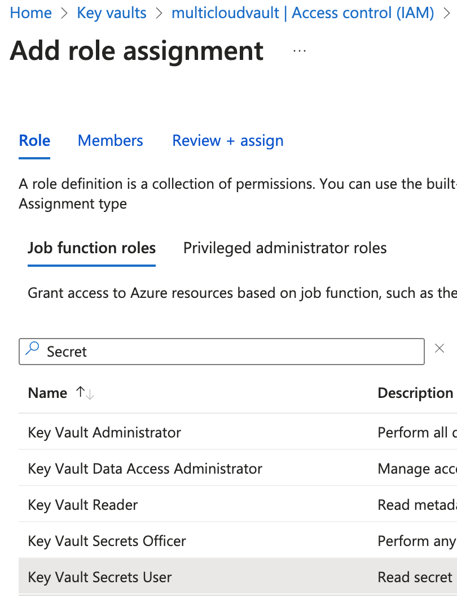

# Application Registration, Configure Azure Vault, and App Config 

## Introduction

In this lab, we will set up Azure Vault and Azure Config access to it for microservices/applications.
We will add the vault secrets and config that will be used by the microservice(s) in AKE to make application s connections to the Oracle Database in OCI.

*Estimated Time:* 15 minutes

### Objectives

* Create an Application Registration and obtain values for AZURE\_TENANT\_ID, AZURE\_CLIENT\_ID, and AZURE\_CLIENT\_SECRET
* Create and Configure Azure Vault.  
* Add secrets for password and wallet to the vault.
* Setup App Config access to the vault.


### Prerequisites

This lab assumes you have completed previous labs.

## Task 1: Create and Configure Application Registration and obtain values for access

   Azure Application Registrations are part of Azure Active Directory. 
   When you register an application in Azure AD, you're creating an identity configuration for your application so that it can authenticate and communicate securely with other services that use Azure AD for authentication.
   Application Registrations allow your application to obtain tokens from Azure AD, enabling it to authenticate and access resources that are secured by Azure AD.

   1. Click `New Registration`

      

   2. Create a new registration (Eg `multicloud app`)

      


   3. Note the value of the `Application (client) ID` (that will be used as the value for `AZURE_CLIENT_ID` later) and the `Directory (tenant) ID` (that will be used as the value for `AZURE_TENANT_ID` later)

      

   4. Create a client secret for the app registration by clicking `Certificates & Secrets` on the left sidebar menu, then `+ New client secret` 

      

   5. Note the value (not the ID) of the client secret. 
      This will be used as the value for `AZURE_TENANT_ID` and, along with the `AZURE_CLIENT_ID` and `AZURE_TENANT_ID` values noted earlier, will be used by the Kubernetes microservice(s) to access to the Application Config and Azure Vault in order obtain information to connect to the Oracle Database on OCI.


## Task 2: Create Azure Vault and Secrets For Wallet and Password

   1. From the home screen, click `Key Vaults` and `Create`

      

   2. Select the correct resource group, provide a name, and create the vault. (this is the equivalent of issuing the command `az keyvault create --name multicloudvault --resource-group myapp-rg`)

      

   3. Select `Secrets` on the sidebar menu of the vault created in the previous step and then click `Generate/Import`

      

   4. If a wallet is not used (eg with Exadata), proceed to next step, otherwise name the secret `wallet` and provide the base64 value of the contents of cwallet.sso in the wallet zip as the secret value.
      You can issue the following command to get this value: 
      ```bash
      <copy>
         base64 -i /Users/pparkins/Downloads/Wallet_IndADW/cwallet.sso` 
      </copy>
      ```
            
      (this is the equivalent of issuing the command `az keyvault secret set --name wallet --vault-name multicloudvault --value "[base64walletcontents]"`

      

   5. Repeat the same for `password`

   6.  Add `Key Vault Administrator` and `Key Vault Secrets User` roles to the app registration created earlier.

      

      

      

   7.  Click `Access Policies` on the sidebar menu of the Vault screen and 'Create an access policy' and select all or applicable permissions and click `Next`

      

      Under `Principal` search for and select the app registration created earlier. Choose remaining defaults and create the access policy.

      

      Verify the creation of the access policy.

      

## Task 3: Create Application Config with Access Roles

   1. Click `New Registration`

      

      

      


   2. Click `Access Control (IAM)` and click `Add role assignment`

      
 
      Search for and add App Config ownership/access roles.  Then click `Next`.
      
      
      Search for and add your user as a member. Then click `Next`. 
      

      View Conditions. Then click `Next` and `Review + assign`.
      

      Click `Check access` to verify access for user`.
      


## Task 4: Create App Config Secrets

   1. From the application configuration page click `Create` and then `Key Vault reference`

      


   2. Create the reference using the appropriate `Key`, `Key Vault`, and `Secret` value as shown here for the `wallet_location`.

      


   3. Do the same for the `password` 


   4. Do the same for the `connect_descriptor` and `user` except select `Key-value` when creating rather than `Key Vault reference` 


This concludes this lab. You can **proceed now to the next lab**.


## Acknowledgements

* **Author** - Paul Parkinson, Architect and Developer Advocate, Oracle Database

* **Last Updated By/Date** - Paul Parkinson, 2024.