# Setup environment

## Introduction

In this lab, we will create an Azure Kubernetes cluster and look at a couple options to access it.

*Estimated Time:* 5 minutes

### Objectives

* Create Azure Kubernetes cluster.
* Access the cluster and issue kubectl commands.

### Prerequisites

This lab assumes you have completed previous labs.

## Task 1: Create Resource Group

This task can be skipped if an existing Resource Group will be used.

In Azure, a Resource Group is a fundamental organizational block within which resources like Azure Application Registrations, Azure App Configuration, Azure Key Vault, and many other Azure services are deployed and managed. A resource group is essentially a container that holds related resources for an Azure solution. The primary purpose of a resource group is to help organize and manage resources that share a common lifecycle, permissions, and policies.

   1. Click `New Registration Group`

      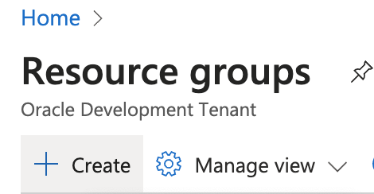

   2. Provide a `Resource group` name

      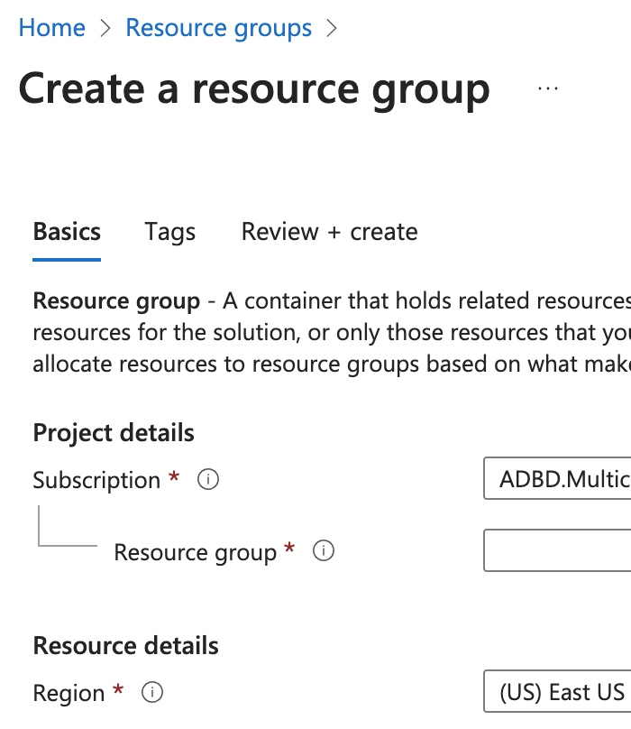

   3. Once, created Make sure your user is explicitly owner of the resource group by clicking `Access control (IAM)` and `Add role assignment`.  Then search on and select `Owner`.

      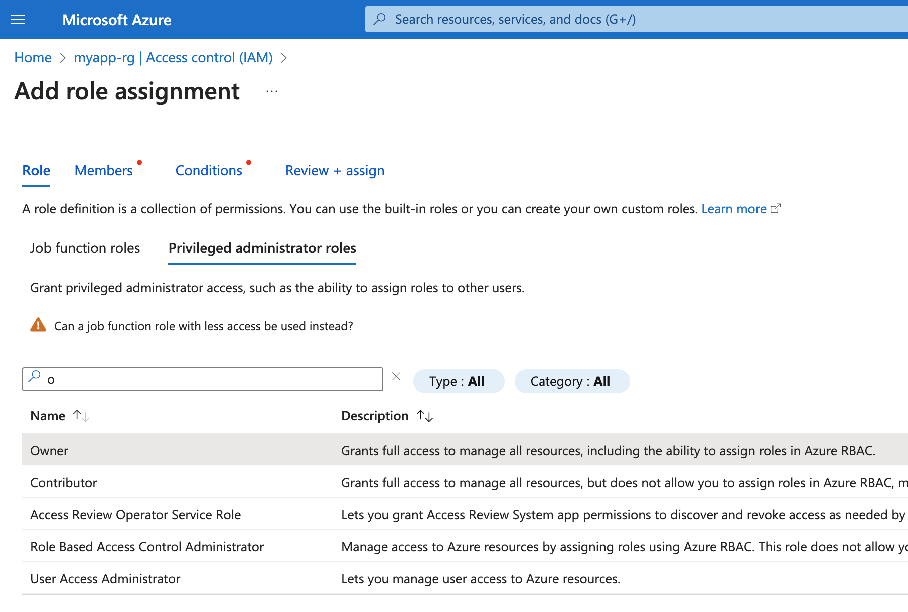

   4. Search on and add your user as member and click `next`.

      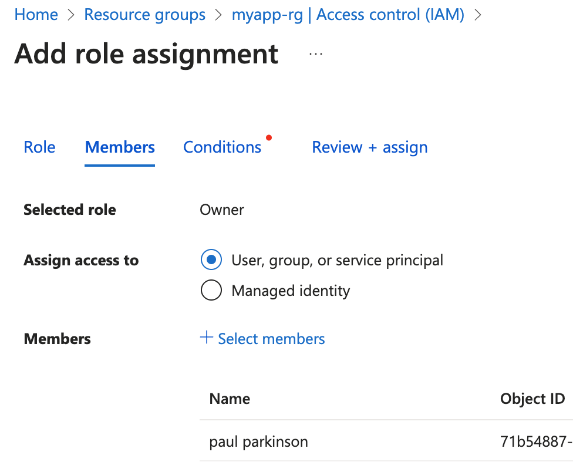

   5. Select `Review + assign` on the Conditions page and complete the assignment.

      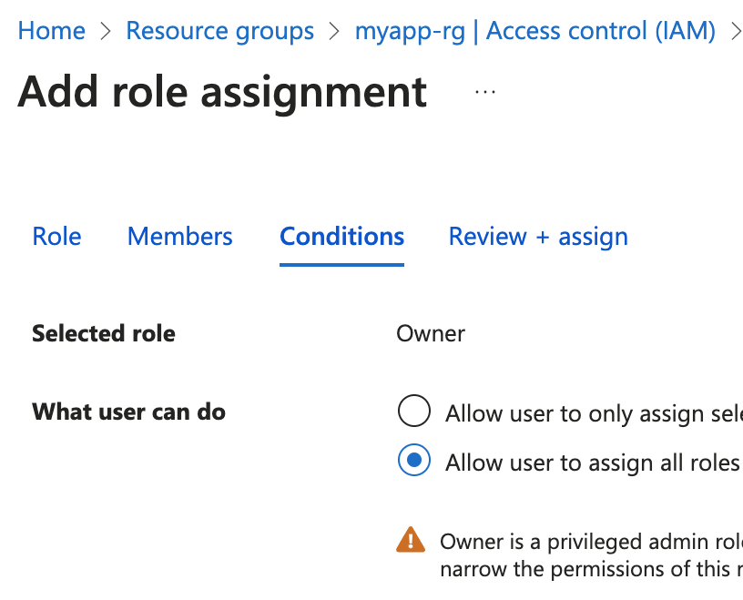

## Task 2: Create Azure Kubernetes cluster

   1. Search for and select `Kubernetes services` in Azure console.

      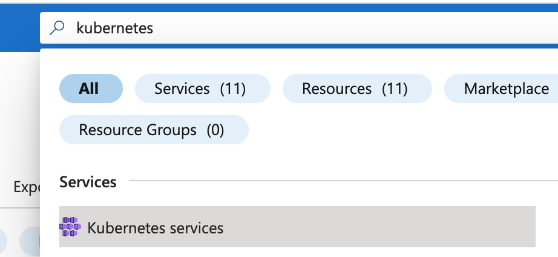

   2. Click `Create a Kuberenetes cluster`

      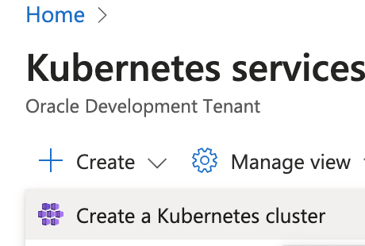

   3. Click `Name and create the cluster`

      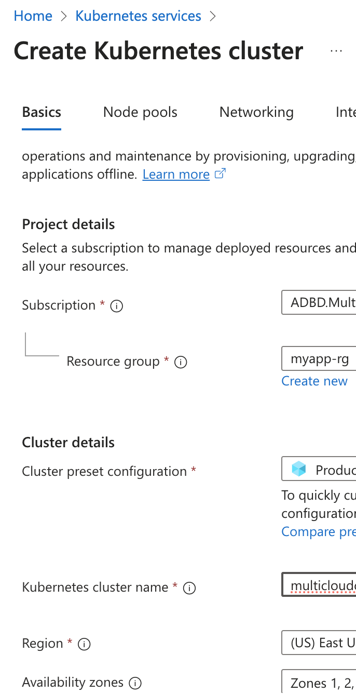

   4. Verify connectivity by navigating to the Kubernetes service and the cluster that was created and selecting one of the techniques to connect (Cloud Shell, Azure CLI, or Run Command)

      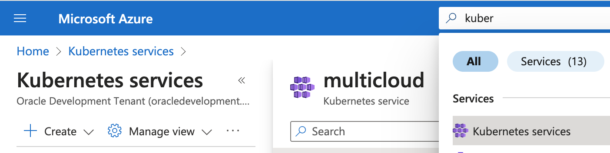
      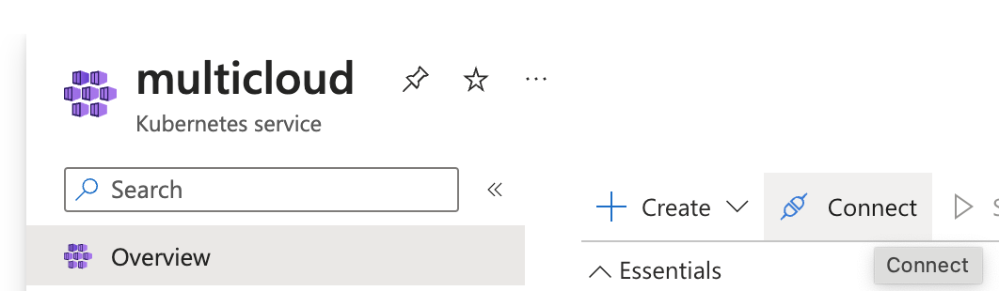
      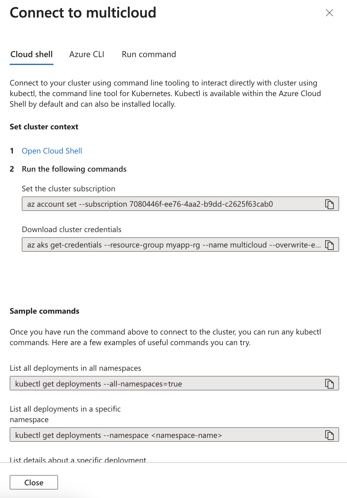

## Task 3: Create Azure Container Registry

   1. Similar to creating the Kubernetes cluster, simply search on `Container registries` and create a container registry by providing a name (Eg `multicloud` or `mycontainerregistry`).

      

This concludes this lab. You can **proceed now to the next lab**.

## Learn More

* [OCI Documentation](https://docs.oracle.com/en-us/iaas/Content/home.htm)

## Acknowledgements

* **Author** - Paul Parkinson, Architect and Developer Advocate, Oracle Database

* **Last Updated By/Date** - 2024.