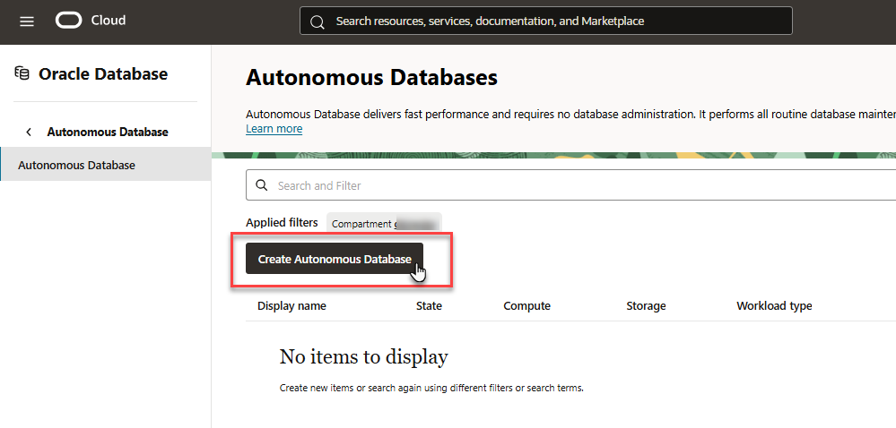
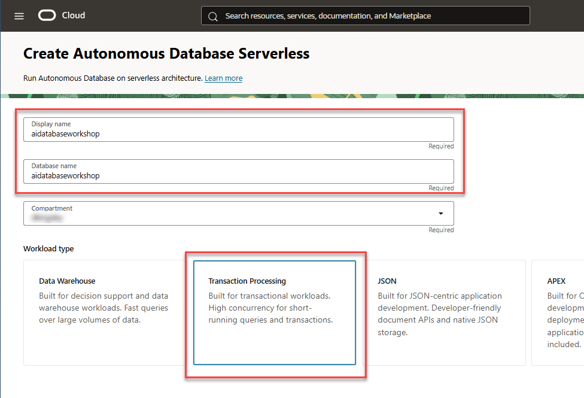
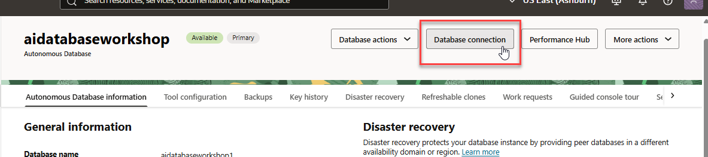
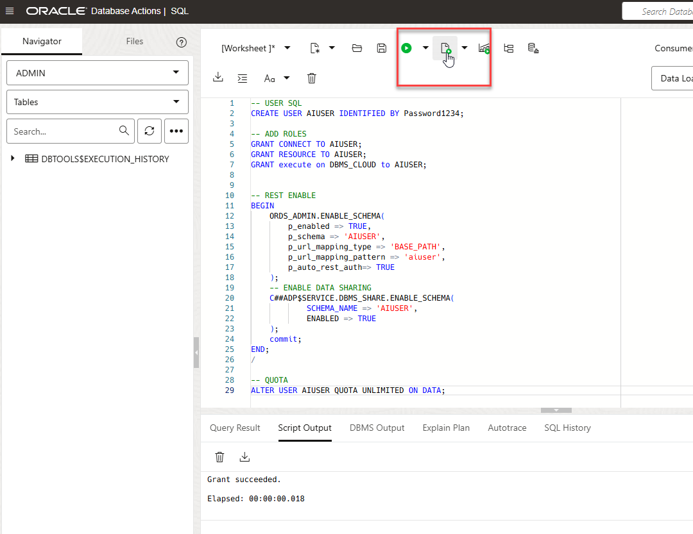
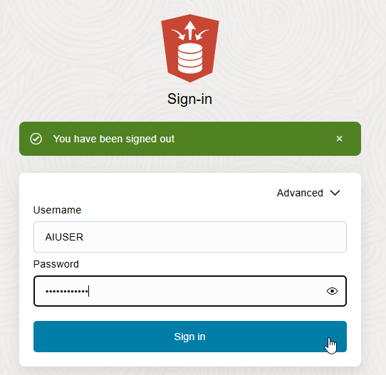

# Create an Oracle Database

## Introduction

In this lab, we will set up an Oracle Database and create a user and table.

Estimated time: 5 minutes

### Objectives

* Create the Oracle Database (if one does not exist already)
* Obtain the connection information (and wallet if applicable)
* Create a user and table

### Prerequisites

This lab assumes:

* You have an Oracle Cloud account.

## Task 1: Determine the Oracle Database Being Used

   1. If using Oracle Autonomous Database you may follow the quick process outline in Task 2
   2. If using Exadata Database Service on Dedicated Infrastructure on Oracle Database@Azure please refer to the Workshop found here for setup steps: https://apexapps.oracle.com/pls/apex/f?p=133:180:111974277500753::::wid:4010
   3. If using Exadata Database Service on Exascale Infrastructure on Oracle Database@Azure, please refer to the Workshop found here for setup steps: https://apexapps.oracle.com/pls/apex/f?p=133:180:13724477313165::::wid:4159

## Task 2: Create an Oracle Autonomous Database if necessary, download the connection information, create user and table.

   If you have a database instance already, you may skip this task.

   1. From the OCI console select `Oracle Database` and then `Autonomous Database`.

      

   2. Click the `Create Autonomous Database` button.

      
   
   3. Provide a Display name, Database name (*any name will suffice*), select the appropriate compartment, and choose `Transaction Processing` for the workload type.
   
      

   4. In the `Database configuration` section, choose `23ai` for the database version.

      
   
   5. In the `Administrator credentials section` provide a password for the `ADMIN` user.
   
      
   
   6. Click the `Create Autonomous Database` button. The database will begin provisioning.
   
      
   
   7. After the database has finished provisioning, click the `Database connection` button.
   
   

   8. Then click `Download wallet` to save the wallet.

   

   9. Provide and confirm a password for the wallet, then click `Download`.

   

## Task 3: Create user and table.

   1. Click the `Database actions` button and the `SQL` item from the drop-down list. After a moment the SQL Worksheet will appear.

      
  
   2. Copy and paste the following and replace `[Yourpassword]` with the password for the `AIUSER`.

      You may use a user/name other than `AIUSER`. If so, be sure to use it consistently in the workshop and regardless note the password used.

<!-- Original SQL from original lab
      ```sql
      <copy>
      CREATE USER aiuser identified BY [Yourpassword];
      GRANT CREATE session TO aiuser;
      GRANT RESOURCE TO aiuser;
      GRANT unlimited tablespace TO aiuser;
      GRANT execute on DBMS_CLOUD to aiuser;
      </copy>
      ```
-->

<!-- New create user command added by Dan Kingsley to avoid an ORDs login error  -->

```sql
<copy>
-- USER SQL
CREATE USER AIUSER IDENTIFIED BY [YourPassword];

-- ADD ROLES
GRANT CONNECT TO AIUSER;
GRANT RESOURCE TO AIUSER;
GRANT execute on DBMS_CLOUD to AIUSER;


-- REST ENABLE
BEGIN
    ORDS_ADMIN.ENABLE_SCHEMA(
        p_enabled => TRUE,
        p_schema => 'AIUSER',
        p_url_mapping_type => 'BASE_PATH',
        p_url_mapping_pattern => 'aiuser',
        p_auto_rest_auth=> TRUE
    );
    -- ENABLE DATA SHARING
    C##ADP$SERVICE.DBMS_SHARE.ENABLE_SCHEMA(
            SCHEMA_NAME => 'AIUSER',
            ENABLED => TRUE
    );
    commit;
END;
/

-- QUOTA
ALTER USER AIUSER QUOTA UNLIMITED ON DATA;
</copy>
```

   3. Select the run script button to execute the SQL statements.

      

   4. Select the drop-down menu in the upper right (which should currently show as `ADMIN`), and click `Sign Out`.

      

   5. Login as `AIUSER`.

      

   6. Select `SQL` from Database Actions launchpad screen.

      

   7. Copy and paste the following to create a test table you'll use in your microservice that is part of the CI/CD pipeline later.

       ```sql
       <copy>
       CREATE TABLE cicd_test_table (testvalue varchar2(64));
       </copy>
       ```

   8. Select the run script button to execute the SQL statements.

      

   9. Verify the SQL statements ran correctly. 

This concludes this lab. You can **proceed now to the next lab**.
   
## Learn More

* [OCI Documentation](https://docs.oracle.com/en-us/iaas/Content/home.htm)
 
## Acknowledgements

* **Author** - Paul Parkinson, Architect and Developer Advocate, Oracle Database

* **Last Updated By/Date** - Dan Kingsley, Product Management, August 2025