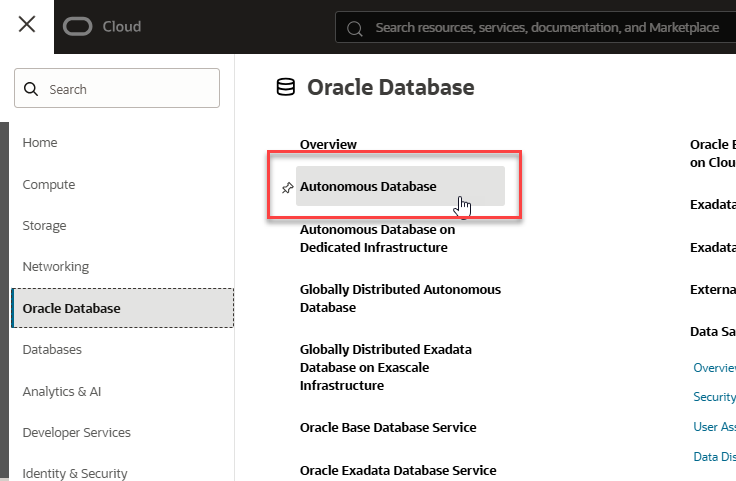
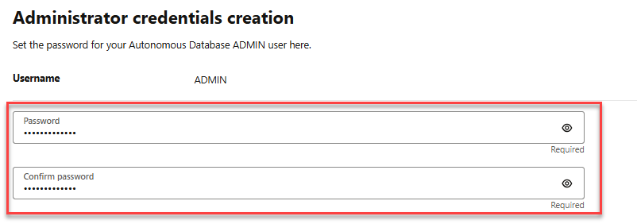
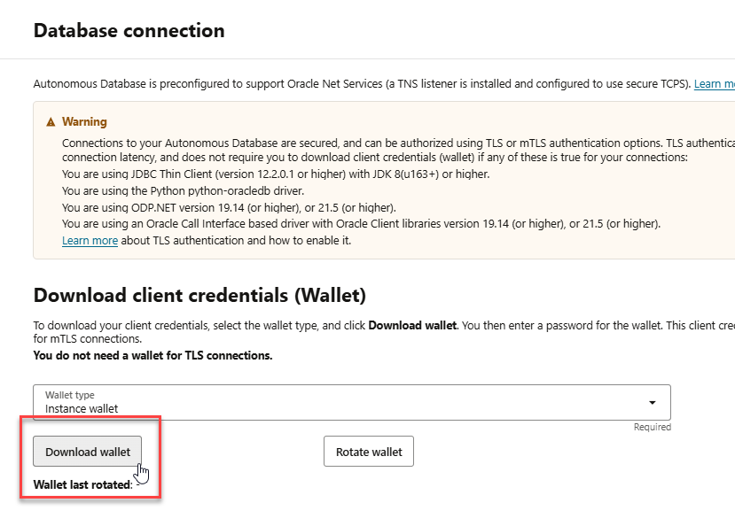
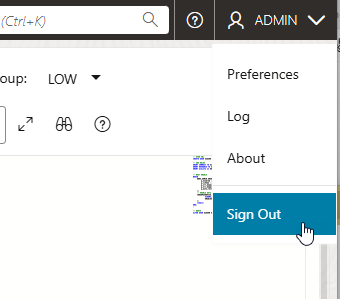
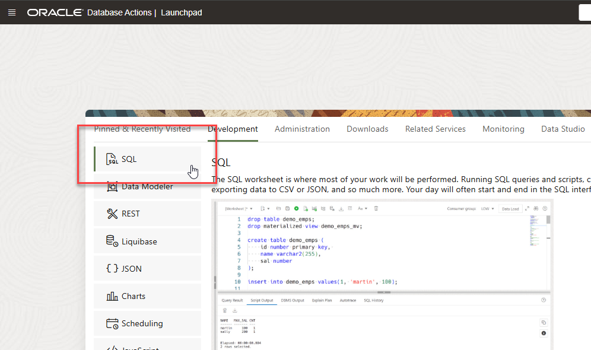

# Setup environment

## Introduction

In this lab, we will set up an Oracle Database and create a user and table.

Estimated time: 5 minutes

### Objectives

In this lab, you will:

* Create the Oracle Database
* Obtain the connection information and wallet
* Create a user and table

### Prerequisites

This lab assumes:

* You have an Oracle Cloud account.

## Task 1: Create an Oracle Autonomous Database if necessary, download the connection information (wallet), and create user and table.

If you have a database instance already, you may skip this task.

   1. From the OCI console select `Oracle Database` and then `Autonmous Transaction Processing`.
      
   2. Click the `Create Autonomous Database` button.
      
   3. Select the appropriate compartment to place the database in and provide a database name (any name will suffice).
      
   4. Provide a password for the `ADMIN` user.
      
   5. Click the `Create Autonomous Database` button. The database will begin provisioning.
      
   6. Click the `Database connection` button and then `Download wallet` to save the wallet.
      
      
   7. Click the `Database actions` button and the `SQL` item from the drop-down list. After a moment the SQL Worksheet will appear.
      
   8. Copy and paste the following and replace `[Yourpassword]` with a password for the `AIUSER`.  
      You may use a user/name other than `AIUSER`. If so, be sure to use it consistently in the workshop and regardless note the password used.
      ```sql
      CREATE USER aiuser identified BY [Yourpassword];
      GRANT CREATE session TO aiuser;
      GRANT RESOURCE TO aiuser;
      GRANT unlimited tablespace TO aiuser;
      GRANT execute on DBMS_CLOUD to aiuser;
      ```
   9. Select the run script button to execute the SQL statements.
      
   7. Select the drop-down menu in the upper right (which should currently show as `ADMIN`), and click `Sign Out`.
      
   8. Now log back in as the `AIUSER`.
      
   9. Select `SQL` from the options on the screen.
      
   10. Copy and paste the following to create a test table you'll use in your microservice that is part of the CI/CD pipeline later.
       ```sql
       CREATE TABLE cicd_test_table (testvalue varchar2(64))
       ```
   11. Select the run script button to execute the SQL statements.
      
   13. Verify the SQL statements ran correctly. 

This concludes this lab. You can **proceed now to the next lab**.
   
## Learn More

* [OCI Documentation](https://docs.oracle.com/en-us/iaas/Content/home.htm)
 
## Acknowledgements

* **Author** - Paul Parkinson, Architect and Developer Advocate, Oracle Database

* **Last Updated By/Date** - 2024.