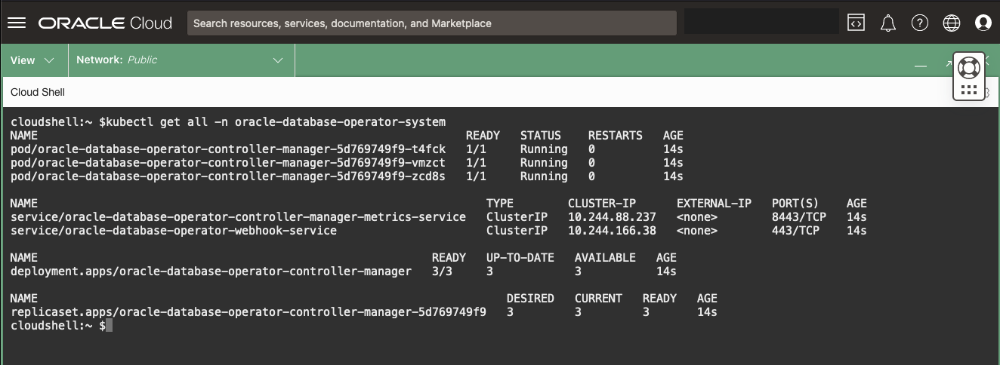

# Deploy the Oracle Operator for Kubernetes (OraOperator)

## Introduction

This lab will walk you through deploying the Oracle Operator for Kubernetes (OraOperator).  

The Oracle Database Operator for Kubernetes (a.k.a. OraOperator) helps developers, DBAs, DevOps and GitOps teams reduce the time and complexity of deploying and managing Oracle Databases. It eliminates the dependency on a human operator or administrator for the majority of database operations.


*Estimated Time:* 5 minutes

[Lab 6](videohub:1_in973skw)


### Objectives

* Have a Running and Healthy OraOperator

### Prerequisites

This lab assumes you have:

* A Kubernetes cluster and client environment with kubectl installed.

## Task 1: Install OraOperator

The **OraOperator** is developed and supported by Oracle, with *Custom Controllers* for provisioning, configuring, and managing the lifecycle of Oracle Databases, defined by *CRDs*, deployed within or outside Kubernetes clusters.

To install the OraOperator, you will first need to install a dependency, **cert-manager**:

1. Install **cert-manager**:

    ```bash
    <copy>
    kubectl apply -f https://github.com/jetstack/cert-manager/releases/latest/download/cert-manager.yaml
    </copy>
    ```

2. Check the **cert-manager** installed resources:

    ```bash
    <copy>
    kubectl get all -n cert-manager
    </copy>
    ```

    

3. Install the **OraOperator**:

    ```bash
    <copy>
    kubectl apply -f https://raw.githubusercontent.com/oracle/oracle-database-operator/main/oracle-database-operator.yaml
    </copy>
    ```

    

4. Check **OraOperator** installed resources:

    ```bash
    <copy>
    kubectl get all -n oracle-database-operator-system
    </copy>
    ```

    

    The output shows a *Deployment* named `oracle-database-operator-controller-manager`. This is the **Operator's Custom Controller** manager which will watch your Kubernetes cluster for any Oracle Database *CRDs* and ensure that they are always running in their desired state.

## Task 5: OraOperator CRDs

1. Rerun the query which returned the `api-resources`, but this time filter it on the new **database.oracle.com** group:

    ```bash
    <copy>
    kubectl api-resources --api-group=database.oracle.com
    </copy>
    ```

    You will now see all the new *CRDs* introduced by the **OraOperator** that will be managed by the `oracle-database-operator-controller-manager`.

    

You may now **proceed to the next lab**

## Learn More

* [Oracle Operator for Kubernetes](https://github.com/oracle/oracle-database-operator)

## Acknowledgements

* **Authors** - [Paul Parkinson, Architect and Developer Advocate](var:authors)
* **Contributors** - [](var:contributors)
* **Last Updated By/Date** - Paul Parkinson, 2024