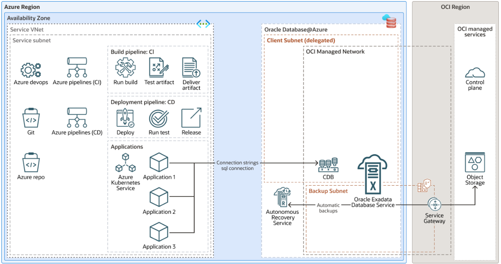

# Introduction

## About this Workshop

This workshop will help you build and understand a comprehensive, multi-cloud DevSecOps Solution.

You will build a CI/CD pipeline in Azure DevOps for a microservice architecture using AKS (Azure Kubernetes Services) and Oracle Database, providing automation, security, and efficiency throughout the development lifecycle.
In doing so you will understand, build, test, and deploy a multi-cloud application using Azure Pipelines and Oracle Cloud Database.

The application source code is hosted on Azure DevOps code repository or Github or similar. A user commits changes into the code repository which triggers the CI pipeline. This phase includes running unit tests, integration tests, static code analysis, and also testing of containers within the AKS cluster to verify deployment readiness.

Once testing is complete, the build pipeline creates Docker images and pushes them to the Azure container registry. These build artifacts then initiate the CD pipeline. In the CD phase, the artifacts are deployed to Azure Kubernetes Service (AKS) where end-to-end and systems tests are run to ensure microservices operate correctly within the Kubernetes environment.  Staging and production environments, using strategies like blue/green or canary deployments, are then initiated for zero downtime deployment of the new changes.

A key component of this architecture is the Oracle Database Operator, which manages the lifecycle of the Oracle Database, automating tasks such as provisioning, scaling, backups, updates, and maintenance. This integration ensures efficient database management and seamless interaction between the microservices in AKS and the Oracle Database. Microservices securely connect to the Oracle Database over an Interconnect using Azure ExpressRoute and Oracle FastConnect, maintaining a secure and reliable database connection, with credentials managed via Azure Key Vault.

Metrics, logs, and tracing of the entire CI/CD process are observed continuously using tools like Azure Monitor and OCI and Oracle Database's Unified Observability OpenTelemetry framework which provides traces from the entry point of the application residing on Azure, across all subsystems, and into the Oracle Database ensuring the performance and reliability of both the microservices and the database. This approach ensures a robust, efficient, and scalable solution for deploying and managing modern applications in a cloud-native environment.

The following diagram illustrates this reference architecture.

  

Estimated Workshop Time: 120 minutes

### Objectives

* Setup Azure Pipelines and create an application that runs on Azure and connects to Oracle Cloud Database
 
### Prerequisites

- This workshop requires an Oracle Cloud account as well as an Azure Cloud Account.

### Let's Get Started

You may now **proceed to the next lab.**..

## Want to Learn More?

* [Related Blogs](https://dzone.com/users/4571557/paulparkinson.html)
* [https://developer.oracle.com/](http://developer.oracle.com/microservices/)

## Acknowledgements

* **Author** - Paul Parkinson, Architect and Developer Advocate
* **Last Updated By/Date** - Leo Alvarado, Product Management, April 2025
