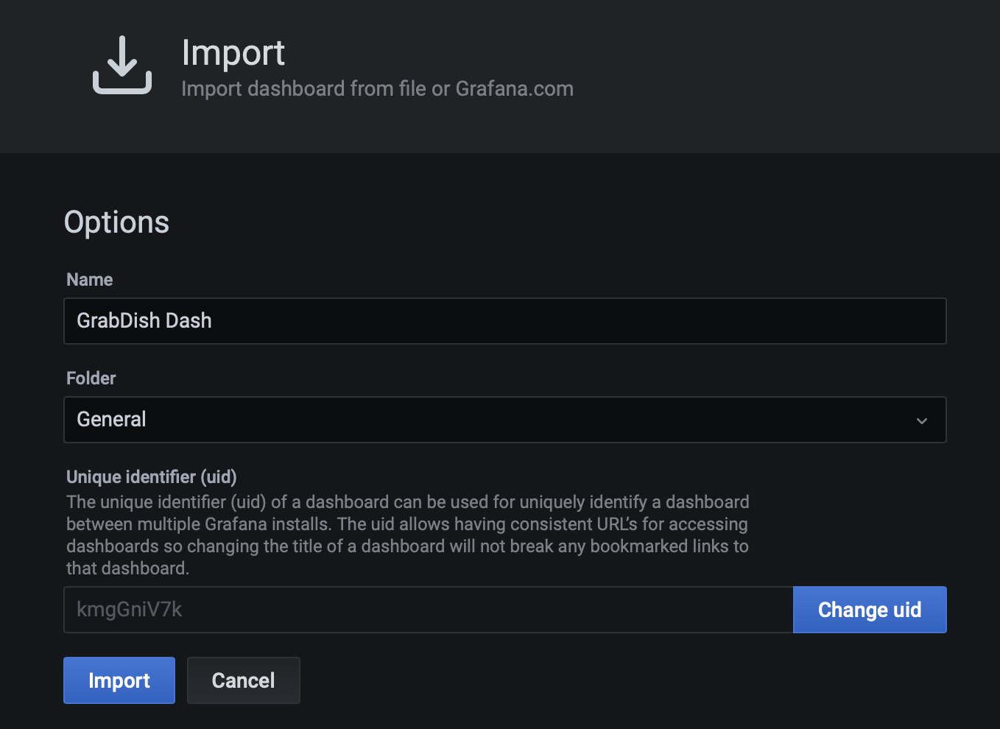
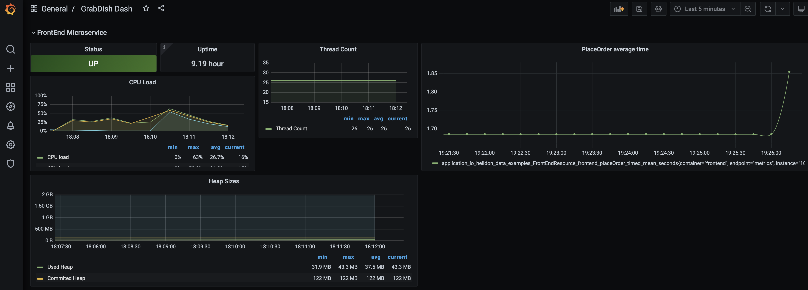
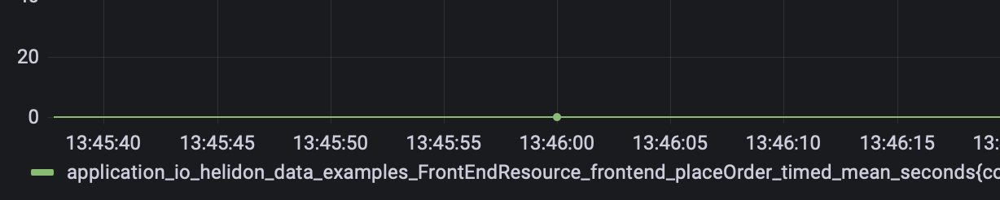

# Unified Observability

## Introduction

This lab will show you how to view metrics of the Azure application and Oracle data tiers in a single Grafana dashboard.

Please see the  [Unified Observability in Grafana with converged Oracle Database Workshop](http://bit.ly/unifiedobservability)
for an more in-depth look at this topic including details of the metrics, logs, and tracing exporters.

Estimated Time: 15 minutes

### Objectives

* Install and configure Prometheus and Grafana
* Use Grafana to analyze metrics of the microservices architecture across the Azure application and Oracle database tier.

### Prerequisites

- This lab presumes you have already completed the earlier labs.

## Task 1: Access the previously created AKE/Kubernetes cluster.

   1. Navigate to the Kubernetes service and the cluster that was created and access it via Cloud Shell or 

## Task 2: Install Prometheus and Grafana

   1. Run the following command to install Prometheus And Grafana

      ```
      <copy>./installPrometheusAndGrafana</copy>
      ```

      You should see the following output
      

## Task 3: Configure and Deploy the Oracle Database Metrics Exporter and Install Grafana Dashboard

   1. Copy `createWalletConfigMap.sh` to the directory of the wallet for the Oracle database (unzip the wallet zip file if downloaded from the OCI console)  :

      ```
      <copy>cp [azure-devops-oracle-database_DIR]/observability/db-metrics-exporter/createWalletConfigMap.sh [WALLET_DIR]/ </copy>
      ```

      Run the createWalletConfigMap.sh file from the wallet directory to create the Kubernetes config map

      ```
      <copy>cd [WALLET_DIR] ; ./createWalletConfigMap.sh</copy>
      ```

      Run the createDBExporterResources.sh file from source repos `observability` directory.

      ```
      <copy>cd [azure-devops-oracle-database_DIR]/observability/db-metrics-exporter ; ./createDBExporterResources.sh</copy>
      ```

   2. Run the following command to port-forward the Grafana port and then open `http://localhost:3000` in a browswer
      ```
      <copy>kubectl port-forward deployment/prometheus-grafana 3000</copy>
      ```

   3. Login to Grafana using the default username `admin` and password `prom-operator` . Do not save the login as part of browser settings if prompted.

      

   4. View pre-configured Prometheus data source:

      Select the `Configuration` gear icon on the left-hand side and select `Data Sources`.

      

      Click the Prometheus option.

      

      The URL for Prometheus should be pre-populated

      

      Click `Test` button and verify success.

      

      Click the `Back` button.

      5. Install the  Dashboard

         Select the `+` icon on the left-hand side and select `Import`

         

          Copy the contents of `[azure-devops-oracle-database_DIR]/observability/dashboards/multicloudapp-dashboard.json`

         Paste the contents in the `Import via panel json` text field and click the `Load` button
         

         Confirm upload and click `Import` button.
        

## Task 4: Open and Study the Grafana Dashboard Screen and Metrics

   1. Select the four squares icon on the left-hand side and select 'Dashboards'
      

   2. In the `Dashboards` panel select `MultiCloud Azure DevOps Oracle Database Dashboard`

      

   3. Notice the collapsible panels for each microservices and their content which includes
       - Metrics about the kubernetes microservice
       - Metrics about the PDB specific to that microservice (inventory count)
      

       * Note that you may need to click the metric description(s) at the bottom of a panel in order to see them represented on the graph.
      


You may now proceed to the next lab.

## Learn More

* Ask for help and connect with developers on the [Oracle DB Microservices Slack Channel](https://bit.ly/oracle-db-microservices-help-slack)

## Acknowledgements
* **Author** - Paul Parkinson, Architect and Developer Advocate;
* **Last Updated By/Date** - Paul Parkinson, 2024

