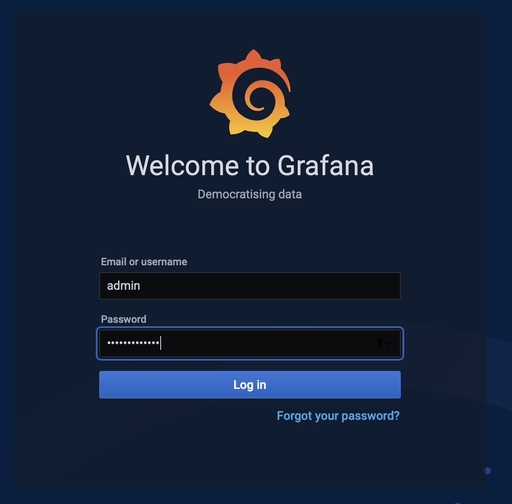

# Unified Observability

## Introduction

This lab will show you how to view and correlate metrics, logs, and tracing of application and data tiers in a single Grafana dashboard.

Please see the  [Unified Observability in Grafana with converged Oracle Database Workshop](http://bit.ly/unifiedobservability) 
for an more in-depth look at this topic including details of the metrics, logs, and tracing exporters.

Estimated Time: 25 minutes

Watch the video below for a quick walk through of the lab.

[](youtube:hg2gihhblZ8)

### Objectives

* Install and configure Grafana, Prometheus, Loki, Promtail, and Jaeger
* Understand single-pane-of glass unified observability using Grafana to analyze metrics, logs, and tracing of the microservices architecture across the application and Oracle database tier.

### Prerequisites

- This lab presumes you have already completed the earlier labs.
 

## Task 1: Install and Configure Observability Software and Metrics with Log Exporters

1. Run the following to install Prometheus and Grafana and an SSL secured LoadBalancer for Grafana

    ```
    <copy>cd $GRABDISH_HOME/observability;./install.sh</copy>
    ```

   You will see some warning messages related to versions, .kube/config, etc. that may safely be ignored.


2. Run the `/createMonitorsAndExporters.sh` script. This will do the following:
   - Create Prometheus ServiceMonitors to scrape the Frontend, Order, and Inventory microservices.
   - Create Prometheus ServiceMonitors to scrape the Order PDB, and Inventory PDB metric exporter services.
   - Create configmpas, deployments, and services for PDB metrics exporters.
   - Create configmaps, deployments, and services for PDB log exporters.

    ```
    <copy>cd $GRABDISH_HOME/observability;./createMonitorsAndExporters.sh</copy>
    ```

   You will see some warning messages related to configmaps not existing, as this is the initial setup, that may safely be ignored.

## Task 2: Configure Grafana

1. Identify the EXTERNAL-IP address of the `ingress-nginx-controller` service by executing the following command:

       ```
       <copy>services</copy>
       ```

     

     Note, it will take a few minutes for the LoadBalancer to provision during which time it will be in a `pending` state

2. Open a new browser tab and enter the external IP of the `ingress-nginx-controller` appended with the `grafana` path as the URL :

   `https://<EXTERNAL-IP>/grafana`

      Note, for convenience a self-signed certificate is used to secure this https address and so you will be prompted by the browser to allow access.

3. Login using the default username `admin` and password `prom-operator` . Do not save the login as part of browser settings if prompted. 

      

   #### Note that if the Grafana console is not used for a period of time, when attempting to access the url again you may encounter a `invalid username or password` error in which case you will need to clear the history/cache for the Grafana console (admin user) to log in again.

5. View pre-configured Prometheus data source:

    Select the `Configuration` gear icon on the left-hand side and select `Data Sources`.

      

    Click the Prometheus option.

      

    The URL for Prometheus should be pre-populated

      

    Click `Test` button and verify success.

      

    Click the `Back` button.

6. Install the  Dashboard

     Select the `+` icon on the left-hand side and select `Import`

      

     Copy the contents of the [Dashboard JSON](https://raw.githubusercontent.com/oracle/microservices-datadriven/main/grabdish/observability/dashboards/grabdish-dashboard.json)

     Paste the contents in the `Import via panel json` text field and click the `Load` button
      

     Confirm upload and click `Import` button.
      


## Task 3: Open and Study the Grafana Dashboard Screen and Metrics

1. Select the four squares icon on the left-hand side and select 'Dashboards'
      

2. In the `Dashboards` panel select `MultiCloud Dashboard`

      

3. Notice the collapsible panels for each microservices and their content which includes
    - Metrics about the kubernetes microservice runtime (CPU load, etc.)
    - Metrics about the kubernetes microservice specific to that microservice (`PlaceOrder Count`, etc.)
    - Metrics about the PDB used by the microservice (open sessions, etc.)
    - Metrics about the PDB specific to that microservice (inventory count)
      
      
      

   * Note that you may need to click the metric description(s) at the bottom of a panel in order to see them represented on the graph.
     
   
4. If not already done, place an order using the curl command in `curlpod` as described in Task 1, steps 3 and 4, of the previous `Deploy and Test Data-centric Microservices Application` lab.

5. Select the 'Explore' option from the drop-down menu of any panel to show that metric and time-span on the Explore screen

      
      


You may now proceed to the next lab.

## Learn More

* Ask for help and connect with developers on the [Oracle DB Microservices Slack Channel](https://bit.ly/oracle-db-microservices-help-slack)   

## Acknowledgements
* **Author** - Paul Parkinson, Architect and Developer Advocate;
* **Last Updated By/Date** - Paul Parkinson, June 2022

