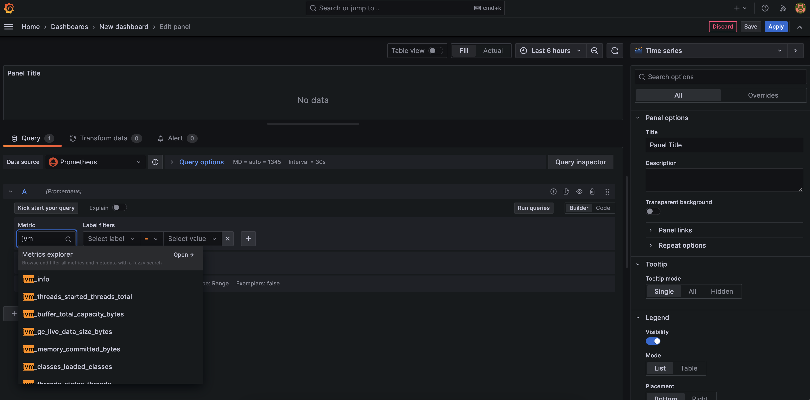

# OpenTelemetry Observability of Multi-Cloud Architecture

## Introduction

This lab will show you how to view metrics of the Azure application and Oracle data tiers in a single Grafana dashboard and using the CI/CD pipeline created earlier.

Please see the  [Unified Observability in Grafana with converged Oracle Database Workshop](http://bit.ly/unifiedobservability)
for an more in-depth look at this topic including details of the metrics, logs, and tracing exporters.

Estimated Time: 15 minutes

### Objectives

* Install and configure Prometheus and Grafana
* Use Grafana to analyze metrics of the microservices architecture across the Azure application and Oracle database tier.

### Prerequisites

- This lab presumes you have already completed the earlier labs.

## Task 1: Access the previously created AKE/Kubernetes cluster.

   1. Navigate to the Kubernetes service and the cluster that was created and access it via Cloud shell or a terminal (`Run command` option will not work for the following steps).

   2. Note the `[azure-devops-oracle-database_DIR]` value referred to in the following tasks refers to the directory where you cloned the fork of the https://github.com/oracle-devrel/azure-devops-oracle-database repos you used for the pipeline.

## Task 2: Install Prometheus and Grafana and Create Kubernetes Service Connection (Used to deploy Prometheus service monitor later in the lab)

   1. Run the following command to install Prometheus And Grafana

      ```
      <copy>[azure-devops-oracle-database_DIR]/observability/installPrometheusAndGrafana</copy>
      ```

      You should see the following output
      
 
      Note that AKS does provide the capability to install prometheus to the cluster as well.  This lab follows the popular install conducted using helm above.
      

   2. We will now create a Kubernetes Service Connection to be used in the pipeline.  
      This service connection is useful for a number of Kubernetes operations. We will be using it to deploy Prometheus service monitor later in the lab.
       
      First, expand the `Project Settings` menu in the bottom left-hand side of the DevOps/pipeline screen.
      
      Then click `Service connections`
      
      Then click `New service connection` in the upper right corner.
      
      Then type `Kubernetes` and click `next`.
      
      Then select your AKS cluster, give it a `Service connection name`, note that name, insure `Grans access permission to all pipelines` is selected, and click `Save`.
      
      Then type `Kubernetes` and click `next`.
      


   3. Add a pipeline variable to reference the Kubernetes Service connection just created.  

      Click the edit menu next to the pipeline.
      
      Enter a new variable named `kubernetesServiceConnection` and provide the Service connection name from the previous step.
      
      Save and verify the variable now exists for the pipeline.
      
      Then click the `Variables` button.
      

## Task 3: Configure and Deploy the Oracle Database Metrics Exporter and Install Grafana Dashboard

   1. Copy `createWalletConfigMap.sh` to the directory of the wallet for the Oracle database (unzip the wallet zip file if downloaded from the OCI console)  :

      ```
      <copy>cp [azure-devops-oracle-database_DIR]/observability/db-metrics-exporter/createWalletConfigMap.sh [WALLET_DIR]/ </copy>
      ```

      Run the createWalletConfigMap.sh file from the wallet directory to create the Kubernetes config map

      ```
      <copy>cd [WALLET_DIR] ; ./createWalletConfigMap.sh</copy>
      ```

      Run the createDBExporterResources.sh file from source repos `observability` directory.

      ```
      <copy>cd [azure-devops-oracle-database_DIR]/observability/db-metrics-exporter ; ./createDBExporterResources.sh</copy>
      ```

   2. Run the following command to port-forward the Grafana port and then open `http://localhost:3000` in a browswer
      ```
      <copy>kubectl port-forward deployment/prometheus-grafana 3000</copy>
      ```

   3. Login to Grafana using the default username `admin` and password `prom-operator` . Do not save the login as part of browser settings if prompted.

      

   4. View pre-configured Prometheus data source:

      Select the `Configuration` gear icon on the left-hand side and select `Data Sources`.

      

      Click the Prometheus option.

      

      The URL for Prometheus should be pre-populated

      

      Click `Test` button and verify success.

      

      Click the `Back` button.

   5. Install the  Dashboard

      Select the `+` icon on the left-hand side and select `Import`

      

       Copy the contents of `[azure-devops-oracle-database_DIR]/observability/dashboards/multicloudapp-dashboard.json`

       Paste the contents in the `Import via panel json` text field and click the `Load` button
       

       Confirm upload and click `Import` button.
       

## Task 4: Open and Study the Grafana Dashboard Screen and Metrics

   1. If not already in the dashboard, select the four squares icon on the left-hand side, select `Dashboards` and then `MultiCloud Azure DevOps Oracle Database Dashboard`

      

      

   3. Notice the collapsible panels for each microservices and their content which includes
       - Metrics about `Microservice Running in Kubernetes(AKS)`
       - Metrics about `Oracle Database Used By AKS Microservice`

      You can then add panels and click the edit menu of any panel to define the metrics, etc. that it displays.

      

      

      

      


You may now proceed to the next lab.

## Acknowledgements
* **Author** - Paul Parkinson, Architect and Developer Advocate
* **Last Updated By/Date** - Paul Parkinson, 2024

