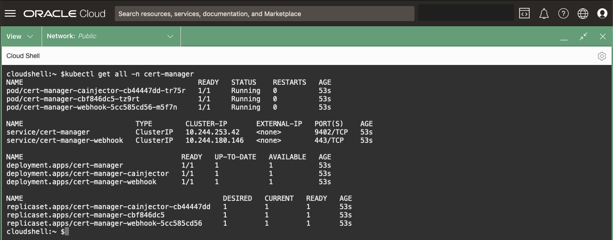
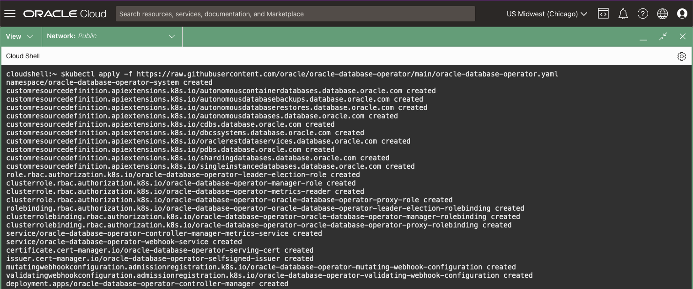
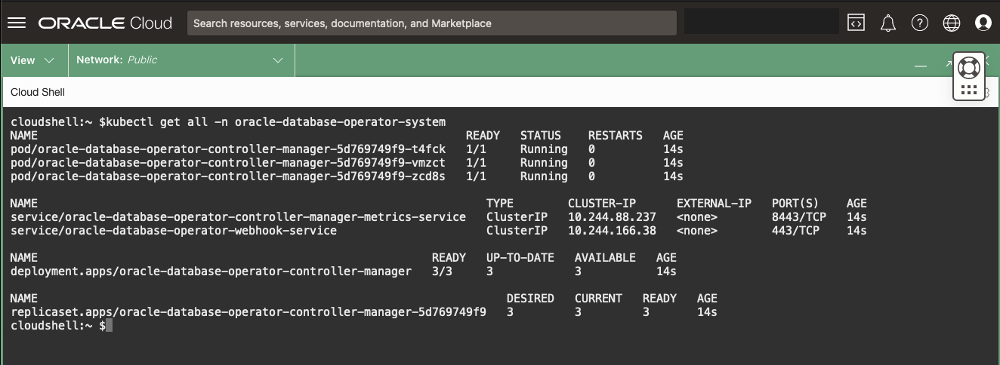
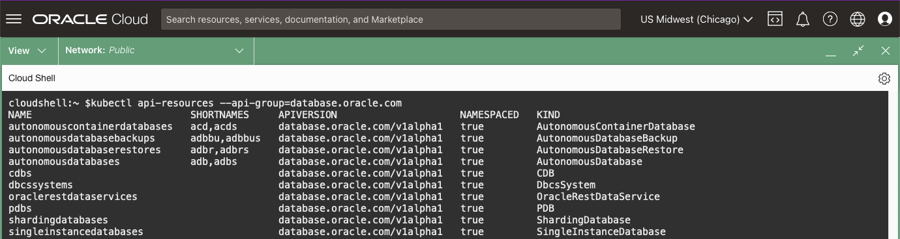
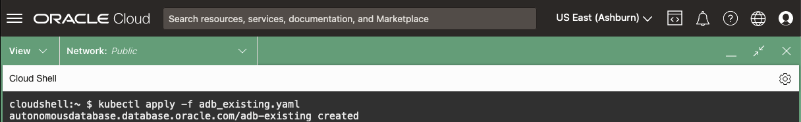

# Deploy the Oracle Operator for Kubernetes (OraOperator)

## Introduction

This lab will walk you through deploying the Oracle Database Operator for Kubernetes (OraOperator).  

The Oracle Database Operator for Kubernetes (a.k.a. OraOperator) helps developers, DBAs, DevOps and GitOps teams reduce the time and complexity of deploying and managing Oracle Databases. It eliminates the dependency on a human operator or administrator for the majority of database operations.

The current release of the operator supports the following lifecycle operations:

- ADB-S/ADB-D: Provision, Bind, Start, Stop, terminate (soft/hard), scale (up/down), Manual Backup, Manual Restore
- ACD: provision, bind, restart, terminate (soft/hard)
- SIDB: Provision, clone, patch (in-place/out-of-place), update database initialization parameters, update database configuration (Flashback, archiving), Oracle Enterprise Manager (EM) Express (a basic observability console), Oracle REST Data Service (ORDS) to support REST based SQL, PDB management, SQL Developer Web, and Application Express (Apex)
- SHARDED: Provision/deploy sharded databases and the shard topology, Add a new shard, Delete an existing shard
- Oracle Multitenant Database: Bind to a CDB, Create a  PDB, Plug a  PDB, Unplug a PDB, Delete a PDB, Clone a PDB, Open/Close a PDB
- Oracle Base Database Cloud Service (BDBCS): provision, bind, scale shape Up/Down, Scale Storage Up, Terminate and Update License
- Oracle Data Guard: Provision a Standby for the SIDB resource, Create a Data Guard Configuration, Perform a Switchover, Patch Primary and Standby databases in Data Guard Configuration

The upcoming releases will support new configurations, operations and capabilities.


*Estimated Time:* 5 minutes

[Lab 6](videohub:1_in973skw)


### Objectives

* Install OraOperator
* Use OraOperator to bind to Oracle Database

### Prerequisites

This lab assumes you have:

* A Kubernetes cluster.

## Task 1: Access the previously created AKE/Kubernetes cluster.

   1. Navigate to the Kubernetes service and the cluster that was created and select one of the techniques to connect (Cloud Shell, Azure CLI, or Run Command)

## Task 2: Install OraOperator

   The **OraOperator** is developed and supported by Oracle, with *Custom Controllers* for provisioning, configuring, and managing the lifecycle of Oracle Databases, defined by *CRDs*, deployed within or outside Kubernetes clusters.

   To install the OraOperator, you will first need to install a dependency, **cert-manager**:

   1. Install **cert-manager**:

       ```bash
       <copy>
       kubectl apply -f https://github.com/jetstack/cert-manager/releases/latest/download/cert-manager.yaml
       </copy>
      ```

   2. Check the **cert-manager** installed resources:

       ```bash
       <copy>
       kubectl get all -n cert-manager
       </copy>
       ```

   

   3. Install the **OraOperator**:

       ```bash
       <copy>
       kubectl apply -f https://raw.githubusercontent.com/oracle/oracle-database-operator/main/oracle-database-operator.yaml
       </copy>
       ```

       

   4. Check **OraOperator** installed resources:

       ```bash
       <copy>
       kubectl get all -n oracle-database-operator-system
       </copy>
       ```

       

       The output shows a *Deployment* named `oracle-database-operator-controller-manager`. This is the **Operator's Custom Controller** manager which will watch your Kubernetes cluster for any Oracle Database *CRDs* and ensure that they are always running in their desired state.

   5. Rerun the query which returned the `api-resources`, but this time filter it on the new **database.oracle.com** group:

       ```bash
       <copy>
       kubectl api-resources --api-group=database.oracle.com
       </copy>
       ```

       You will now see all the new *CRDs* introduced by the **OraOperator** that will be managed by the `oracle-database-operator-controller-manager`.

       


## Task 4: Configure OraOperator with OCI credentials

   See https://github.com/oracle/oracle-database-operator/blob/main/docs/adb/README.md for details

## Task 4: Retrieve the existing ADB OCID

   1. Retrieve the OCID for the ADB either by copying from the OCI console or by running the following using the OCI CLI:

       ```bash
       <copy>
       # Get the Compartment OCID
       COMPARTMENT_OCID=$(oci iam compartment list \
         --name [](var:oci_compartment) |
         jq -r '.data[].id')

       # Get the ADB OCID from the Compartment
       ADB_OCID=$(oci db autonomous-database list \
         --lifecycle-state AVAILABLE \
         --compartment-id $COMPARTMENT_OCID |
         jq -r '.data[].id')

       echo "ADB OCID: $ADB_OCID"
       </copy>
       ```

## Task 5: Create a manifest to Bind

   1. Create a *manifest file* to define the resource of an existing ADB, leveraging the *AutonomousDatabase CRD* from the OraOperator:

       ```bash
       <copy>
       cat > adb_existing.yaml << EOF
       ---
       apiVersion: database.oracle.com/v1alpha1
       kind: AutonomousDatabase
       metadata:
         name: adb-existing
       spec:
         hardLink: false
         details:
           autonomousDatabaseOCID: $ADB_OCID
       EOF
       </copy>
       ```

   The above YAML sends a request to the `database.oracle.com/v1alpha1` API exposed by the **OraOperator** to define a resource of `kind: AutonomousDatabase`.

   The resource `name` will be called `adb-existing`.

   It will bind to an existing ADB with `autonomousDatabaseOCID` equal to `$ADB_OCID` (substituted by the real value stored in *Task 1*).

   **Important:** the `spec.hardLink: false` (default) field indicates that if you delete this `AutonomousDatabase` resource from the Kubernetes cluster, *do not* delete the ADB associated with it.

   > Good for Production... Bad for DevOps!

   If it were set to `true` then deleting the resource from Kubernetes *WOULD* delete ADB itself.

## Task 6: Apply the existing ADB Manifest

   1. Define the **AutonomousDatabase** *CRD* in Kubernetes by applying the *manifest file*:

       ```bash
       <copy>
       kubectl apply -f adb_existing.yaml
       </copy>
       ```

   

## Task 7: Review the Existing ADB Custom Resource

   1. Retrieve the `adb-existing` resource details by running (`kubectl get <resource> <resource_name> [-n <namespace>]`).  You can omit the `-n <namespace>` as your *kubeconfig* context has already set it for you:

       ```bash
       <copy>
       kubectl get AutonomousDatabase adb-existing
       </copy>
        ```

      With the exception of the **DISPLAY NAME** and **DB NAME**, you should see similar output:

      

   2. Describe the `adb-existing` resource (`kubectl describe <resource_type> <resource_name> [-n <namespace>]`) to get more details.

      Use the resource_type alias `adb` for `AutonomousDatabase` to save some typing.

      You can view all the resource_type alias short names by running: `kubectl api-resources`

       ```bash
       <copy>
       kubectl describe adb adb-existing
       </copy>
       ```

   
Various useful information will be displayed including CPU and Storage settings, Connection Strings, and its Lifecycle State (AVAILABLE).  You will modify these fields later to manage the ADB via K8s.


From here you can do a number of database administration functions as describe in the [OraOperator documentation](https://github.com/oracle/oracle-database-operator).

You can also create Kubernetes secrets for connecting to the database, however, we will use a more secure approach which is described in the next lab.


You may now **proceed to the next lab**

## Learn More

* [Oracle Operator for Kubernetes](https://github.com/oracle/oracle-database-operator)

## Acknowledgements

* **Authors** - [John Lathouwers, Developer Evangelist, Oracle Database](var:authors)
* **Authors** - [Paul Parkinson, Architect and Developer Advocate](var:authors)
* **Contributors** - [](var:contributors)
* **Last Updated By/Date** - Paul Parkinson, 2024