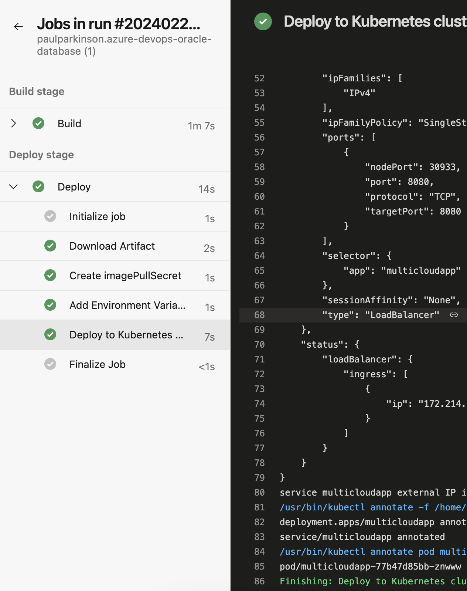

# Setup pipeline

## Introduction

In this lab, we will set up the Azure pipeline.

### Objectives

* Setup the pipeline
* Test the AKE microservice and verify  

### Prerequisites

This lab assumes you have completed previous labs.

## Task 1: If you have not already, Sign Up For Azure Pipeline

1. Follow the directions found here to https://learn.microsoft.com/en-us/azure/devops/pipelines/get-started/pipelines-sign-up?view=azure-devops


## Task 2: Fork the `azure-devops-oracle-database` Github repos.

1. Create a fork of the repos found at: https://github.com/oracle-devrel/azure-devops-oracle-database

## Task 3: Create a pipeline for the fork you just created.

1. Follow the directions found here to create a pipeline, replacing the example repos given with the one you created in Task 2: https://learn.microsoft.com/en-us/azure/devops/pipelines/create-first-pipeline?view=azure-devops&tabs=java

## Task 4: Add pipeline variables for the (Azure Vault backed) application config created in preview lab.

1. Follow the directions found here to create the following variables: https://learn.microsoft.com/en-us/azure/devops/pipelines/process/variables

   Select menu to edit pipeline.
   
   Select `Variables`.
   
   Enter variable values for the following.
   

## Task 5: Customize the pipeline, adding details for the microservice build and container push and Kubernetes deploy and service

1. Modify `azure-pipelines.yml` to look like the following (replacing the `environment` value as appropriate). This file can also be found at `azure-pipelines-example.yml` in your github repos.

   (Convenience tasks are also available for this, however, they simply insert templates and so knowing the format is most useful.)
```yaml
# Deploy to Azure Kubernetes Service
# Build and push image to Azure Container Registry; Deploy to Azure Kubernetes Service
# https://docs.microsoft.com/azure/devops/pipelines/languages/docker

trigger:
  - main

resources:
  - repo: self

variables:

  # Container registry service connection established during pipeline creation
  dockerRegistryServiceConnection: 'ba554595-2da8-4cf6-88c4-a57c75966491'
  imageRepository: 'multicloudapp'
  containerRegistry: 'multicloud.azurecr.io'
  dockerfilePath: '**/Dockerfile'
  tag: '$(Build.BuildId)'
  imagePullSecret: 'multicloud2012b828-auth'

  # Agent VM image name
  vmImageName: 'ubuntu-latest'

  # Name of the new namespace being created to deploy the PR changes.
  k8sNamespaceForPR: 'review-app-$(System.PullRequest.PullRequestId)'

stages:
  - stage: Build
    displayName: Build stage
    jobs:
      - job: Build
        displayName: Build
        pool:
          vmImage: $(vmImageName)
        steps:
          - task: JavaToolInstaller@0
            inputs:
              versionSpec: '17'
              jdkArchitectureOption: 'x64'
              jdkSourceOption: 'PreInstalled'
          - task: Maven@4
            inputs:
              mavenPomFile: 'pom.xml'
              publishJUnitResults: true
              testResultsFiles: '**/surefire-reports/TEST-*.xml'
              javaHomeOption: 'JDKVersion'
              mavenVersionOption: '1.17'
              mavenAuthenticateFeed: false
              effectivePomSkip: false
              sonarQubeRunAnalysis: false
          - task: Docker@2
            displayName: Build and push an image to container registry
            inputs:
              command: buildAndPush
              repository: $(imageRepository)
              dockerfile: $(dockerfilePath)
              containerRegistry: $(dockerRegistryServiceConnection)
              tags: |
                $(tag)

          - upload: manifests
            artifact: manifests


  - stage: Deploy
    displayName: Deploy stage
    dependsOn: Build

    jobs:

      - deployment: Deploy
        condition: and(succeeded(), not(startsWith(variables['Build.SourceBranch'], 'refs/pull/')))
        displayName: Deploy
        pool:
          vmImage: $(vmImageName)
        environment: 'paulparkinsonazuredevopsoracledatabase-8684.default'
        strategy:
          runOnce:
            deploy:
              steps:
                - task: KubernetesManifest@0
                  displayName: Create imagePullSecret
                  inputs:
                    action: createSecret
                    secretName: $(imagePullSecret)
                    dockerRegistryEndpoint: $(dockerRegistryServiceConnection)

                - script: |
                    yq eval '.spec.template.spec.containers[0].env += [{"name": "AZURE_LOG_LEVEL", "value": "verbose"},  {"name": "AZURE_CLIENT_ID", "value": "$(AZURE_CLIENT_ID)"}, {"name": "AZURE_CLIENT_SECRET", "value": "$(AZURE_CLIENT_SECRET)"}, {"name": "AZURE_TENANT_ID", "value": "$(AZURE_TENANT_ID)"}]' -i $(Pipeline.Workspace)/manifests/deployment.yml
                  displayName: 'Add Environment Variable with yq'
                - task: KubernetesManifest@0
                  displayName: Deploy to Kubernetes cluster
                  inputs:
                    action: deploy
                    manifests: |
                      $(Pipeline.Workspace)/manifests/deployment.yml
                      $(Pipeline.Workspace)/manifests/service.yml
                    imagePullSecrets: |
                      $(imagePullSecret)
                    containers: |
                      $(containerRegistry)/$(imageRepository):$(tag)

```
Note the build stage:
- installing Java 17
- building the Spring Boot microservice with maven
- building and pushing the container image
- uploading manifests.

Note the deploy stage: 
- creating the pull secret
- modifying the deployment to contain env values for application config access of the Oracle Database connection information.
- creating a Kubernetes deployment and service for the microservice

Other details on customizing pipelines can be found here. https://learn.microsoft.com/en-us/azure/devops/pipelines/customize-pipeline?view=azure-devops

Once modifications to the pipeline yaml are made, commit and push changes to your git repos.

## Task 5: Test the microservice

1. The IP location of the microservice will be displayed at the end of the pipeline run.
    
 
2. Access the test endpoint. For, example `http://[ENDPOINT_IN_PIPELINE_LOG]/data/test` and verify the reply showing the connection and some query output.
  `"got the conn :" + returnString'`


This concludes this lab. You can **proceed now to the next lab**.

## Learn More

* [Azure DevOps Documentation](https://learn.microsoft.com/en-us/azure/devops/?view=azure-devops)

## Acknowledgements

* **Author** - Paul Parkinson, Architect and Developer Advocate, Oracle Database

* **Last Updated By/Date** - 2024.