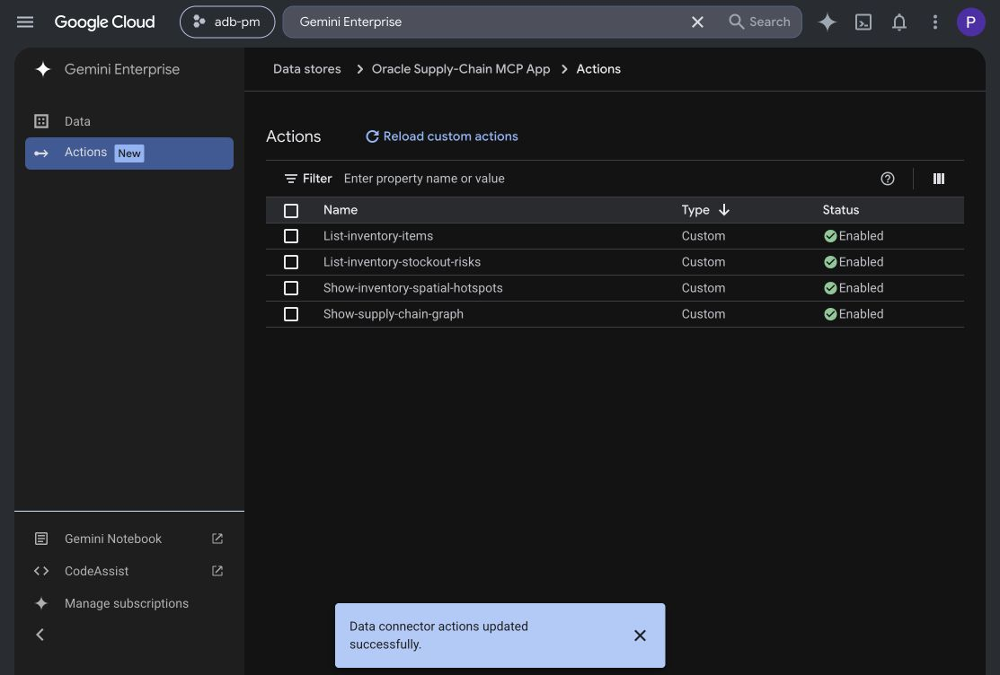
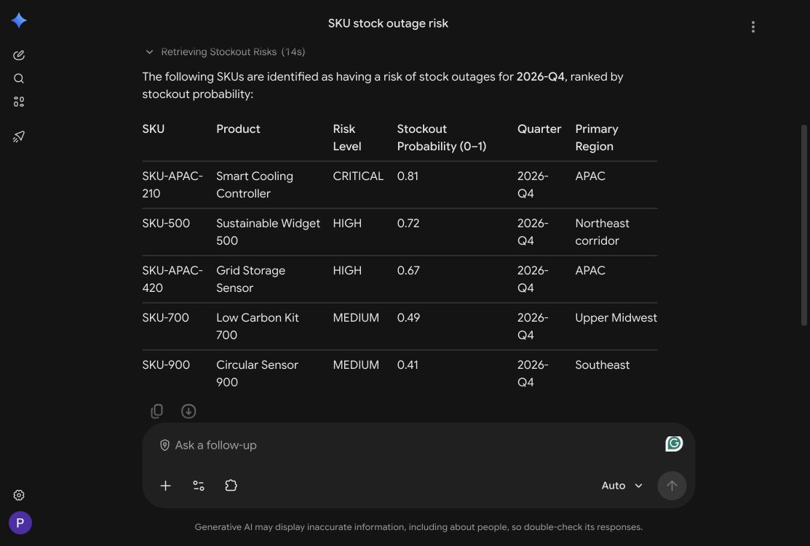
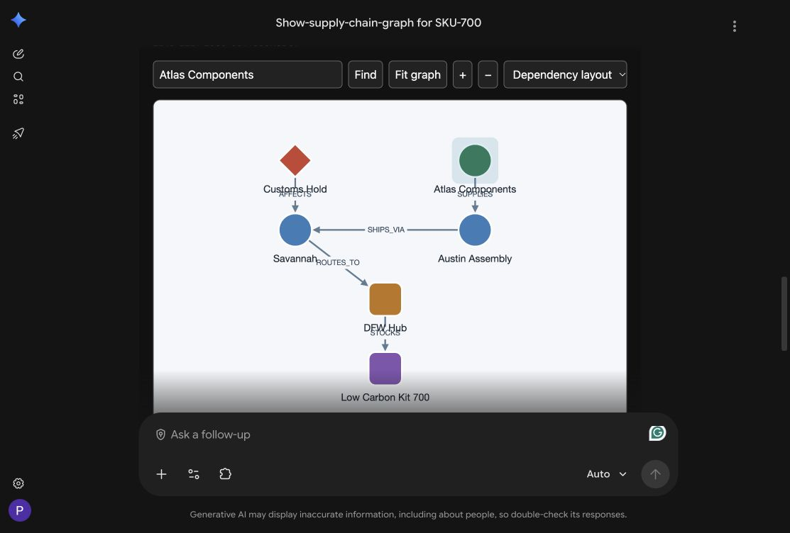
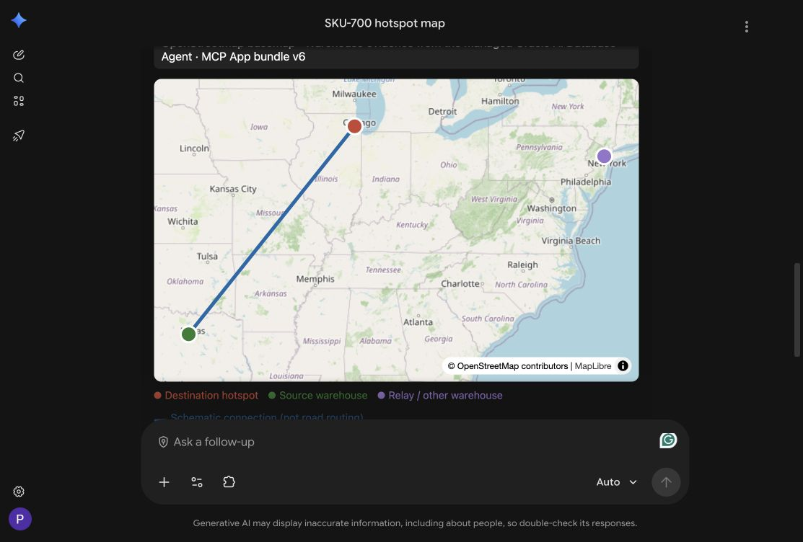
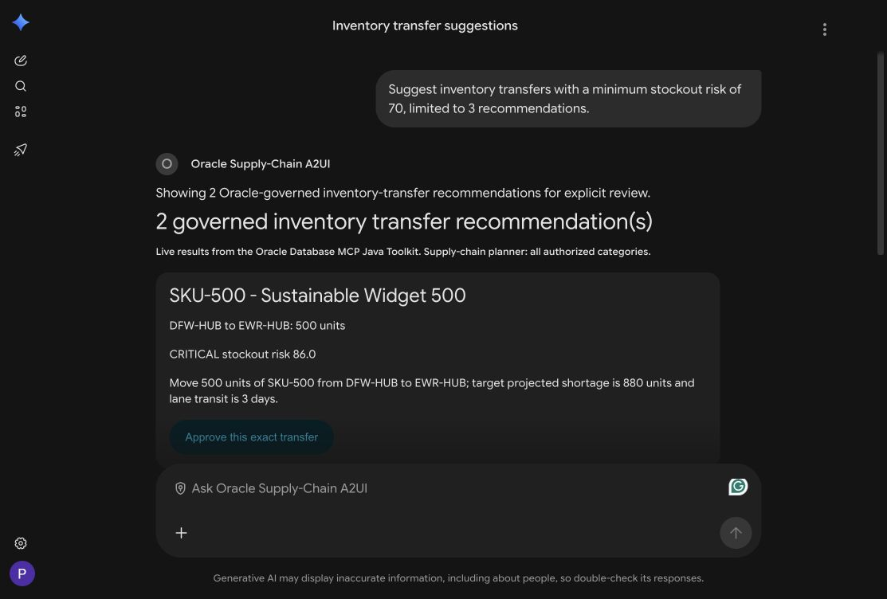

# Test A2A, A2UI, MCP Server, and MCPApps (graph, spatial, form actions, ...)

Watch the demonstration: **Oracle AI Database Agent in Gemini Enterprise with A2UI, MCP Apps, A2A, and MCP**.

[](youtube:oqQpabC2kxo)

[Open the video on YouTube](https://www.youtube.com/watch?v=oqQpabC2kxo) if the embedded player is unavailable.

## Introduction

Explore Oracle supply-chain dependencies with an interactive **Cytoscape.js
graph**, inspect warehouse hotspots on a **MapLibre map**, and use **A2UI** for
the separate inventory decision/review flow. The applications run in GCP and
render inside Gemini Enterprise. No desktop server is needed for this lab.

Estimated time: 20 minutes.

### Objectives

- Query an Oracle property graph through the managed Oracle AI Database Agent.
- Explore different SKUs without supplying model-generated evidence.
- Distinguish database evidence, UI interactions and agent narration.
- Keep read-only MCP Apps separate from A2UI transfer review.

### Prerequisites

- Complete Lab 5's [development and deployment setup](?lab=a2a-agents).
- Use the workshop's Gemini Enterprise application and Google Cloud account.
- Deploy the Java gateway and MCP App server in GCP, with the private Oracle
  A2A relay and server-side OAuth grant configured. Operator setup is in the
  [application runbook](https://github.com/paulparkinson/oracle-ai-database-gcp-gemini/blob/main/docs/MCP_APP_ORACLE_AGENT_SPATIAL.md).
- The database contains the seeded supply-chain dataset and a valid
  `FINANCIAL.SUPPLY_CHAIN_GRAPH`. Its `SC_SUPPLY_CHAIN_GRAPH_V` query view must
  be included in the managed agent's active Select AI profile. See the
  [graph runbook](https://github.com/paulparkinson/oracle-ai-database-gcp-gemini/blob/main/docs/MCP_APP_ORACLE_AGENT_GRAPH.md).

## Task 1: Enable the existing connector

1. In the Google Cloud console, open **Gemini Enterprise → Data stores →
    Oracle Supply-Chain MCP App → Actions**.
2. After a deployment changes the tool definitions, choose **Reload custom
    actions**. Enable these four actions on the **same connector**:
    **List-inventory-items**, **List-inventory-stockout-risks**, **Show-supply-chain-graph**, and
    **Show-inventory-spatial-hotspots**.
3. Open a new Gemini Enterprise conversation. Enable the Oracle connector in
    the prompt's connector menu. For an isolated provenance test, turn off
    Google Search for this conversation.

    

    The read path is:

    ```text
    Gemini Enterprise → MCP App server → Java gateway
      → OAuth token exchange/cache → Oracle AI Database Agent via A2A
        → Oracle query → validated result
          → Cytoscape.js graph / MapLibre map MCP App
    ```

    The **Java gateway** is an adapter in the application's existing Spring Boot
    service. It centralizes token renewal, bounded requests and result validation.
    OAuth client secrets and refresh grants stay in GCP server configuration,
    not the browser, iframe or model arguments. Initial Oracle consent uses a
    browser; repeated reads normally reuse the valid grant. A revoked or expired
    grant requires reauthorization, not a different data source.

## Task 2: List stockout risks without opening a visualization

Start with a plain risk list in the main chat; do not select a separate agent:

```text
List SKUs with risk of stock outages.
```

Expect one short table, not maps for every product. **List-inventory-stockout-risks**
queries the managed Oracle agent once and returns product-level
`STOCKOUT_PROBABILITY` (0–1), database risk level, quarter and primary region.
It has no visual resource. Do not substitute spatial `HOTSPOT_SCORE` or infer
transfers. For names/IDs without risk, use **List-inventory-items** instead.



This exact main-chat question was tested with Google Search enabled: the trace
called **List-inventory-stockout-risks**, not Google Search or the visualization
tools. Its deployed request was independently matched to a successful Oracle
SQL_TOOL execution. See the source runbook's
[dated verification record](https://github.com/paulparkinson/oracle-ai-database-gcp-gemini/blob/main/docs/MCP_APP_ORACLE_AGENT_SPATIAL.md#plain-stockout-risk-list).

## Task 3: Explore the Oracle property graph

In the same chat, ask:

```text
Show the supply chain graph for SKU-500.
```

The managed agent queries `SC_SUPPLY_CHAIN_GRAPH_V`, whose definition uses
SQL/PGQ `GRAPH_TABLE` and `MATCH` against `FINANCIAL.SUPPLY_CHAIN_GRAPH`, not
a join-based substitute. It follows active
supplier → plant → port → warehouse → product paths and attached alert → port
relationships. The MCP tool accepts a SKU only; it does not accept nodes or
edges invented or passed in by Gemini.



1. Click a node to inspect its database ID, name, type and adjacent relationships.
2. Click an edge to inspect its relationship and endpoints.
3. Drag a node, pan and zoom, search by name or ID, change the layout, then
    choose **Fit graph**. These operations inspect the result; they do not
    query Oracle again or change inventory.
4. Try another product and an empty-result case:

    | Prompt | What to verify |
    | --- | --- |
    | `Use Show-supply-chain-graph for SKU-500.` | Product-specific dependencies and a fresh agent task ID. |
    | `Show the dependency graph for SKU-900 using Show-supply-chain-graph.` | Another product's returned path, not reused SKU-700 nodes. |
    | `Use Show-supply-chain-graph for SKU-501. Do not substitute another product.` | Explicit NO_DATA if no complete active path exists. |

    The examples query **seeded Oracle demo data at request time**, not production
    telemetry or frontend fixtures. Catalog membership does not guarantee a
    complete graph path. NO_DATA means unknown in this view, not a safe supply chain.

## Task 4: Explore warehouse hotspots

Ask:

```text
Show the spatial hotspot map for SKU-500.
```



1. Click a warehouse for its returned ID, role and hotspot score.
2. Pan and zoom. Markers and schematic connections must remain geographically
    anchored. A connection is not a road route or an approved inventory transfer.
3. Compare other live reads:

    | Prompt | What to verify |
    | --- | --- |
    | `Show the spatial hotspot map for SKU-APAC-210.` | Singapore/Sydney warehouse evidence rather than SKU-700's US warehouses. Both are seeded Oracle data. |
    | `Use Show-inventory-spatial-hotspots for SKU-900. Summarize only returned roles and scores.` | Every warehouse row belongs to the requested product. |
    | `Show the spatial hotspot map for SKU-700 with maximumRows set to 2.` | A display limit; check the total and truncation indicator. |
    | `Show the spatial hotspot map for SKU-501.` | NO_DATA, not invented warehouses or a claim of safety. |

    Map tiles come from the configured basemap provider; **warehouse evidence
    comes from the Oracle agent**. A tile request is not Google Search or a
    database query. Hotspot scores are 0–1 scores, not stockout probabilities.

## Task 5: Verify the data source

1. Expand Gemini's trace. Expect **List-inventory-stockout-risks** for the
    plain risk list, and **Show-supply-chain-graph** or
    **Show-inventory-spatial-hotspots**. **Load Skill** loads instructions;
    Google Search and host narration are not evidence of an Oracle query.
2. Inspect the result's SKU, scope, database IDs and A2A task ID. The Oracle
    call happens behind the MCP action, so Gemini need not show a separate
    Oracle agent card. Ask for another SKU to test product isolation.
3. For operator verification, use the
    [graph runbook](https://github.com/paulparkinson/oracle-ai-database-gcp-gemini/blob/main/docs/MCP_APP_ORACLE_AGENT_GRAPH.md)
    to test the deployed HTTPS endpoint and correlate the request with Oracle
    diagnostics. For a graph query, inspect `GRAPH_TABLE`/`MATCH` and the
    intended property graph, not merely a source label.

    A task ID and requested SQL are not signed proof of database execution.
    Independent Oracle-side query records provide stronger evidence than matching
    rows alone. For graph reads, match the returned `contextId` to Oracle's
    `USER_AI_AGENT_TEAM_HISTORY.CONVERSATION_ID`, then inspect the matching
    `TEAM_EXEC_ID` in `USER_AI_AGENT_TOOL_HISTORY` for successful `SQL_TOOL`
    output and returned rows. Verify the view definition uses `GRAPH_TABLE/MATCH`.
    The [read-only verification script](https://github.com/paulparkinson/oracle-ai-database-gcp-gemini/blob/main/sql/verify_managed_graph_read.sql)
    documents these checks. Report any missing audit correlation. Authentication, query or
    validation errors must remain errors: no Google Search, Toolkit, direct-JDBC,
    static-data or model-payload fallback is permitted for these reads.

## Task 6: Review an inventory decision with A2UI

Select **Agents → Oracle Supply-Chain A2UI** in Gemini Enterprise and ask:

```text
Suggest inventory transfers with a minimum stockout risk of 70, limited to 3 recommendations.
```

Inspect the SKU, proposed route, quantity and risk on the native A2UI cards.
Review is the default for ordinary text requests; no “review only” suffix is
required. A separate explicit approval action is necessary to execute a transfer.
The existing GCP A2A/A2UI service queries governed Toolkit recommendations;
it is not the older VM `oracle_inventory_action_agent`. It independently reads
its recommendation dataset; the previous map/graph conversation is not an
automatic handoff, and spatial scores do not establish transfer quantities.



For a read-only demo, select **Cancel review without writing**. Only if you
intend to change inventory, verify the exact recommendation and click
**Approve this exact transfer**. The server uses a short-lived, single-use
review handle and the governed Toolkit operation. Do not substitute a prose
approval prompt. Refresh the recommendations if the review has expired.
The October 4 host test verified recommendation rendering, not execution;
no transfer was approved during that test.

MCP Apps render developer-built sandboxed interfaces. A2UI instead sends a
declarative UI for the host's approved component catalog; A2A carries the agent
messages. Neither UI protocol is the database authority. The exploration
connector remains read-only; the separate Toolkit-backed approval service
owns the inventory-write boundary. The demo uses a configured service actor,
not automatic per-Gemini-user database delegation.

## Learn more

Application source and operator instructions live in
[`oracle-ai-database-gcp-gemini`](https://github.com/paulparkinson/oracle-ai-database-gcp-gemini).
For architecture and reusable ChatGPT/Claude guidance, provide the
[`inventory-ui-architecture` skill](https://github.com/paulparkinson/oracle-ai-database-gcp-gemini/blob/main/.agents/skills/inventory-ui-architecture/SKILL.md)
and its linked runbooks. The skill is development guidance, not a database query.

You have completed the workshop. Use the runbook's
[cleanup and troubleshooting checklist](?lab=workshop-runbook#9cleanupandtroubleshooting)
when you finish; preserve shared workshop resources.

## Acknowledgements

- **Author** — Paul Parkinson, Architect and Developer Advocate, Oracle AI Database
- **Last updated** — October 2026
