# Build the RAG Chatbot engine

## Introduction

In this lab we will implement a RAG (Retrieval Augmented Generation) chatbot using vector similarity search and Generative AI / LLMs.

We will guide you through the process of loading and parsing a pdf file, integrating it with an Oracle 23ai database, and employing the Google Cloud Platform to order it and run the Python code and Generative AI services needed for the chatbot.

Oracle Database 23ai will be used as the vector store. In this lab, we will use a pdf file as the source data, but you can apply these steps to other data types including audio and video. **Gemini 2.5 Flash (gemini-2.5-flash)**, a multimodal model from Google AI, is leveraged for RAG.

High-level steps followed in this lab:

1. Load your document.

2. Transform the document to text.

3. Chunk the text document into smaller pieces.

4. Using an embedding model, embed the chunks as vectors into Oracle Database 23ai.

5. Ask the question for the prompt, the prompt will use the same embedding model to vectorize the question.

6. The question will be passed to Oracle Database 23ai and a similarity search is performed on the question.

7. The results (context) of the search and the prompt are passed to the LLM to generate the response.

    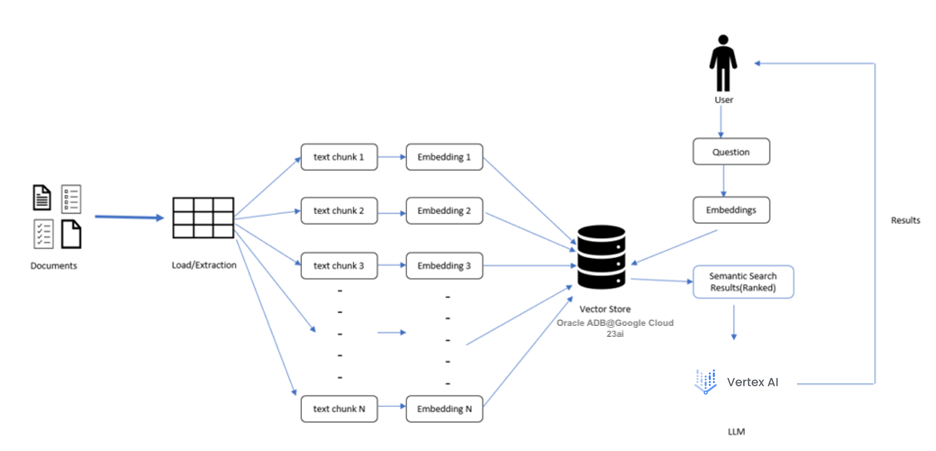

### Concepts

- What is a Vector?

    A vector is like a fingerprint for information. Just like every person’s fingerprint is unique and gives us lots of details about them, a vector in AI is a unique set of numbers representing the important semantic features of a piece of information, like a block of text, an image, a sound, or a video.

- What is Similarity Search and Outlier Search?

    A similarity search helps you find semantically similar things, like Google or Bing does. But imagine being able to do that in the database, with text, audio, image, and video files and the full power of SQL and PL/SQL at your disposal. An outlier search does the opposite: it retrieves the most dissimilar results.

- What is a LLM?

    LLMs, or Large Language Models, are AI algorithms that use deep learning techniques and large data sets to understand, summarize, generate, and predict new content. Oracle AI Vector Search works well with any Large Language Model [LLM] and vector embedding model.

- What is RAG?

    Retrieval Augmented Generation (RAG) is a technique that enhances LLMs by integrating Similarity Search. This enables use cases such as a corporate chatbot responding with private company knowledge to make sure it’s giving answers that are up-to-date and tailored to your business.

Estimated Time: 10 minutes

### Objectives

As a database user, DBA or application developer:

1. Implement a RAG chatbot using vector similarity search and Generative AI/LLMs.
2. Load and parse a FAQ-like text file, integrating it with an Oracle 23ai database.
3. Employ the Google Cloud Platform to order and run the Python code and Generative AI services needed for the chatbot.
4. Use the Oracle Database 23ai vector database to store and retrieve relevant information.
5. Leverage the Gemini Generative AI service (Vertex AI) to generate high-quality responses to user queries.

### Required Artifacts

- A pre-provisioned instance of an Autonomous Database.
- Google Cloud Compute VM instance.
- Downloaded Source pdf file and Jupyter Notebook.

## Task 1: Enable Vertex AI API

In this section, you will be enabling Vertex AI API to be used later in the lab.

1.	From Google Cloud Console go to the main menu and click **Vertex AI** and **Dashboard**.

    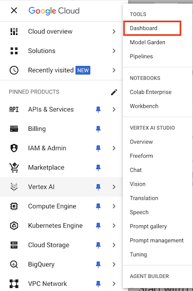

2. The will launch the **Vertex AI Dashboard**. On the Dashboard click **Enable all recommended APIs**.

    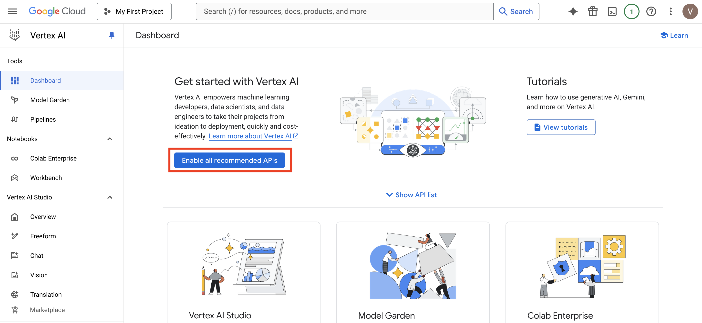

3. After the API is enabled, confirm the same from the **Dashboard**.

    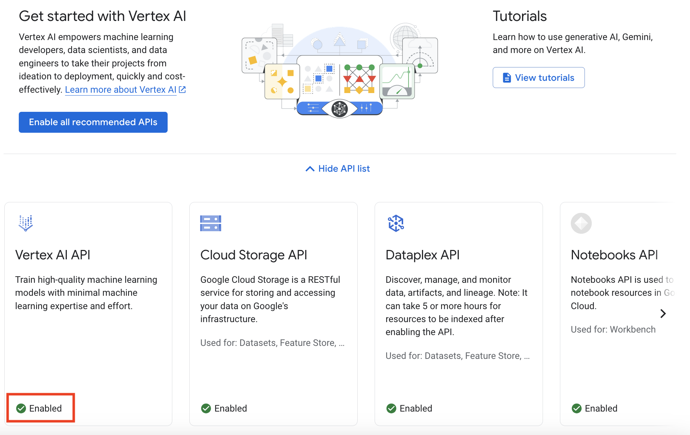

## Task 2: Launch VSCode

We will use Visual Studio Code (VSCode) to connect to our Google Cloud VM and run our Jupyter Notebook.

Please use VSCode's Remote Explorer function to connect to your remote VM. If you don't know how to do that, please see [this tutorial first](https://code.visualstudio.com/docs/remote/ssh).

1. Launch VSCode on your local machine and connect to the remote VM. Click the **Search Bar** and select **Show and Run Commands**.

    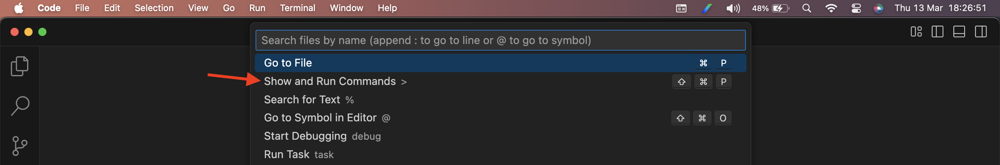

2. Type **Remote-SSH** and select **Remote-SSH: Connect to Host...**.

    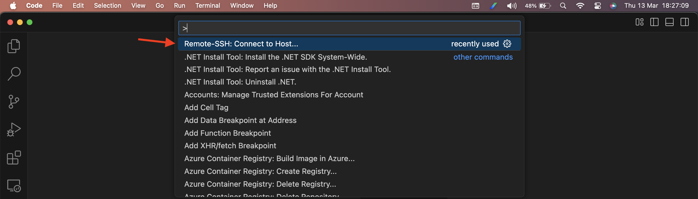

3. Enter the IP address of the Google Compute VM Instance that we provisioned earlier in this workshop and press **Enter**.

    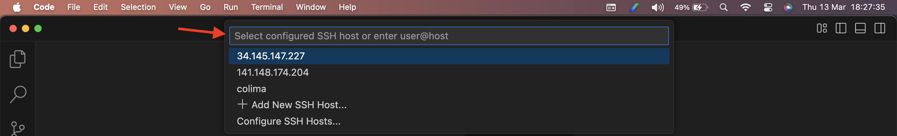

4. On the next VSCode Window, verify that you have remotely connected to the Compute VM instance. Left bottom corner has a message **SSH: IP Address**.

    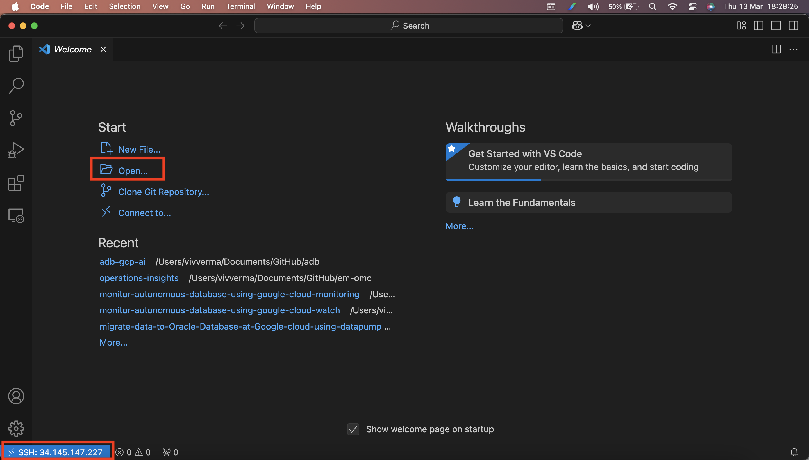

## Task 3:  Setup the Python environment

1. Launch a terminal session in VSCode. After connecting to the VM instance update the softwares installed.

    ```
    <copy>
    sudo apt update
    </copy>
    ```

2. Install `pyenv` on the Compute VM. This is our way to quickly and neatly manage multiple Python versions on the same machine. For this lab, we will use Python 3.12. Run the following commands (for the latest version of this procedure, see [the official pyenv page here](https://github.com/pyenv/pyenv-installer)):

    ```
    <copy>    
    sudo apt install -y make build-essential libssl-dev zlib1g-dev libbz2-dev \
    libreadline-dev libsqlite3-dev wget curl llvm libncurses5-dev libncursesw5-dev \
    xz-utils tk-dev libffi-dev liblzma-dev python3-openssl git

    curl https://pyenv.run | bash

    echo 'export PYENV_ROOT="$HOME/.pyenv"' >> ~/.profile
    echo 'command -v pyenv >/dev/null || export PATH="$PYENV_ROOT/bin:$PATH"' >> ~/.profile
    echo 'eval "$(pyenv init -)"' >> ~/.profile

    echo 'export PYENV_ROOT="$HOME/.pyenv"' >> ~/.bashrc
    echo 'command -v pyenv >/dev/null || export PATH="$PYENV_ROOT/bin:$PATH"' >> ~/.bashrc
    echo 'eval "$(pyenv init -)"' >> ~/.bashrc

    exec "$SHELL"
    </copy>
    ```

3. Install Python 3.12 on the VM:

    ```
    <copy>
    pyenv install 3.12
    </copy>
    ```

4. Create a new folder called `vectors` . Go to the `vectors` folder and make Python 3.12 the active kernel for it:

    ```
    <copy>
    mkdir vectors
    cd vectors
    pyenv local 3.12
    </copy>
    ```

5. Last step in this phase is installing the Python libraries for accessing the Oracle Database and sentence transformers (to convert strings to vectors):

    ```
    <copy>
    pip install --upgrade pip
    pip install oracledb
    pip install dotenv
    pip install sentence-transformers
    pip install PyPDF2
    pip install langchain
    pip install langchain_community
    pip install streamlit
    pip install oci
    pip install langchain_huggingface
    pip install -U langchain-google-vertexai
    pip install -U langchain-community
    pip install --upgrade google-cloud-aiplatform
    </copy>
    ```

6. Download the [Source pdf file](https://objectstorage.us-phoenix-1.oraclecloud.com/p/DiuTfuapQc-nDTpWUbWJuLbn35KsNuhN-HxqvidF-s6IrdCqKRtJvgxkSAqlAz4w/n/axxduehrw7lz/b/gcp-ai-lab/o/oracle-database-23ai-new-features-guide.pdf) and the [Jupyter Notebook](https://objectstorage.us-phoenix-1.oraclecloud.com/p/O8WKC75TW_sZNHIaGKHeBw_KmHNJ89hux_UfjwrH7WUSpUTR3gDXcxp0DvPBYuj6/n/axxduehrw7lz/b/gcp-ai-lab/o/database-rag.ipynb) to the `vectors` directory.

    ```
    <copy>
    wget https://objectstorage.us-phoenix-1.oraclecloud.com/p/DiuTfuapQc-nDTpWUbWJuLbn35KsNuhN-HxqvidF-s6IrdCqKRtJvgxkSAqlAz4w/n/axxduehrw7lz/b/gcp-ai-lab/o/oracle-database-23ai-new-features-guide.pdf
    wget https://objectstorage.us-phoenix-1.oraclecloud.com/p/O8WKC75TW_sZNHIaGKHeBw_KmHNJ89hux_UfjwrH7WUSpUTR3gDXcxp0DvPBYuj6/n/axxduehrw7lz/b/gcp-ai-lab/o/database-rag.ipynb
    wget https://objectstorage.us-phoenix-1.oraclecloud.com/p/6ulMJ9B8Dlr1EVVA4WqgDOVfPrWkwKIYRDfV7vgsl90CnqCBDcuqCY0vOspN8ih9/n/axxduehrw7lz/b/gcp-ai-lab/o/rag_app_ui.py
    </copy>
    ```

## Task 4: Run the RAG application code snippets in Jupyter notebook

1. Open the `database-rag.ipynb` file in VSCode and continue reading while executing the code cells below. Click **Open** to open the Juniper Notebook.

    
    
2. Select the `database-rag.ipynb` file present under `vectors` directory.

    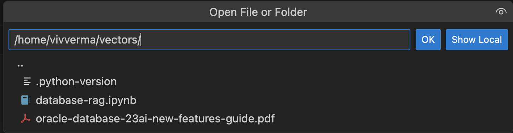

3. On clicking Run to execute the first code snippet, you will be prompted to install and enable extensions (Python and Jupyter).

    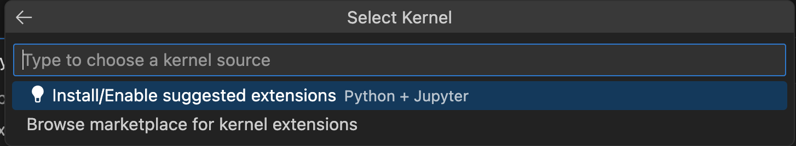

    After installing the required extensions you will be prompted to choose the **Kernel Source**. Select **Python Environments**.

    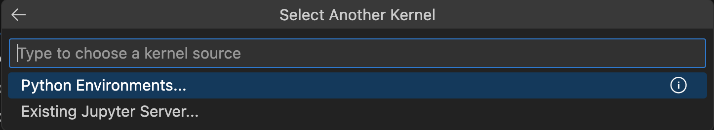

    Upon installing required Python Kernel, select the Python Envinronment.

    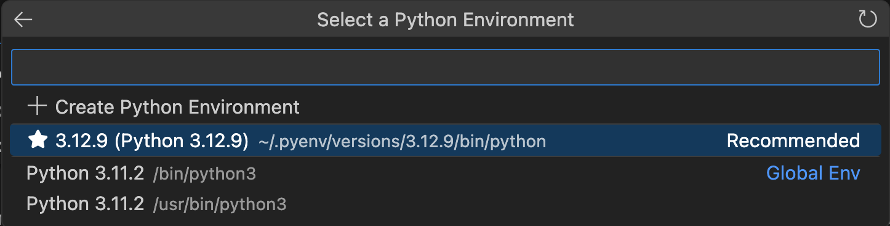

    Running cells with '3.12.9 (Python 3.12.9)' requires the ipykernel package. Click **Install**.

4. Run the RAG application code snippets in Jupyter notebook.

    Now you're ready to run each code snippet in sequence starting from the top in Jupyter. To run a code snippet, select the cell of the code and click Run to execute the code.

    When the code snippet has completed running a number will appear in the square brackets. You can then proceed to the next cell and code snippet. Some of the code will print an output so you can get feedback.At any time you can also re-run the code snippets in the Jupyter cell.

    Python libraries and modules have already been installed for this RAG application. Note the libraries for LangChain and a new library for the Oracle AI Vector Search, OracleVS and Vertex AI, vertexai.

    ```
    <copy>
    # Import libraries and modules

    import sys
    import array
    import time
    import oci
    import os
    from dotenv import load_dotenv
    from PyPDF2 import PdfReader
    #from sentence_transformers import CrossEncoder
    from langchain.text_splitter import CharacterTextSplitter
    from langchain_community.embeddings import HuggingFaceEmbeddings
    from langchain_community.vectorstores.utils import DistanceStrategy
    from langchain_community.llms import OCIGenAI
    from langchain_core.prompts import PromptTemplate
    from langchain.chains import LLMChain
    from langchain_core.runnables import RunnablePassthrough
    from langchain_core.output_parsers import StrOutputParser
    from langchain_community.vectorstores import oraclevs
    from langchain_community.vectorstores.oraclevs import OracleVS
    from langchain_core.documents import BaseDocumentTransformer, Document
    from langchain_community.chat_models.oci_generative_ai import ChatOCIGenAI
    from langchain_core.messages import AIMessage, HumanMessage, SystemMessage
    import oracledb

    from langchain_huggingface import HuggingFaceEmbeddings

    # suppersing warning messages
    from tqdm import tqdm, trange

    print("Successfully imported libraries and modules")
    </copy>
    ```

5. This next code snippet defines the function to include metadata with the chunks. Select the code snippet and click Run.

    ```
    <copy>
    # Function to format and add metadata to Oracle 23ai Vector Store

    def chunks_to_docs_wrapper(row: dict) -> Document:
        """
        Converts text into a Document object suitable for ingestion into Oracle Vector Store.
        - row (dict): A dictionary representing a row of data with keys for 'id', 'link', and 'text'.
        """
        metadata = {'id': row['id'], 'link': row['link']}
        return Document(page_content=row['text'], metadata=metadata)
    print("Successfully defined metadata wrapper")
    </copy>
    ```

6. This code connects to Oracle Database 23ai with the credentials and connection string. Select the code snippet and click Run. Update the code with the Username, Password, Connection String (eg. d5kas9zhfydbe31a_high) and Wallet Password.

    ```
    <copy>
    import oracledb

    un = "username" # Enter Username
    pw = "password" # Enter Password
    dsn = 'connection string' # Enter Connection String
    wpwd = "wallet password" # Enter Wallet Password

    connection = oracledb.connect(
        config_dir = '../wallet', 
        user=un, 
        password=pw, 
        dsn=dsn,
        wallet_location = '../wallet',
        wallet_password = wpwd)
    </copy>
    ```

7. Load the Document

    The document in our use case is in PDF format. We are loading a PDF document and printing the total number of pages, and printing page 1 for your visual feedback.

    ```
    <copy>
    # Load the document

    # creating a pdf reader object
    pdf = PdfReader('oracle-database-23ai-new-features-guide.pdf')

    # print number of pages in pdf file 
    print("The number of pages in this document is ",len(pdf.pages)) 
    # print the first page 
    print(pdf.pages[0].extract_text())
    </copy>
    ```

8. The code transforms each page of the PDF document to text. Click Run to execute the code.

    ```
    <copy>
    # Transform the document to text

    if pdf is not None:
    print("Transforming the PDF document to text...")
    text=""
    for page in pdf.pages:
        text += page.extract_text()
    print("You have transformed the PDF document to text format")
    </copy>
    ```

9. Split the text into chunks

    Our chunk size will be 800 characters, with an overlap of 100 characters with each chunk. Note: Chunk sizes vary depending on the type of document you are embedding. Chat messages may have smaller chunk size, and larger 100 page essays may have larger chunk sizes.

    ```
    <copy>
    # Chunk the text document into smaller chunks
    text_splitter = CharacterTextSplitter(separator="\n",chunk_size=800,chunk_overlap=100,length_function=len)
    chunks = text_splitter.split_text(text)
    print(chunks[0])
    </copy>
    ```

10. The code adds metadata such as id to each chunk for the database table. Click Run to execute the code.

    ```
    <copy>
    # Create metadata wrapper to store additional information in the vector store
    """
    Converts a row from a DataFrame into a Document object suitable for ingestion into Oracle Vector Store.
    - row (dict): A dictionary representing a row of data with keys for 'id', 'link', and 'text'.
    """
    docs = [chunks_to_docs_wrapper({'id': f'{page_num}', 'link': f'Page {page_num}', 'text': text}) for page_num, text in enumerate(chunks)]
    print("Created metadata wrapper with the chunks")
    </copy>
    ```

11. Set up Oracle AI Vector Search and insert the embedding vectors

    The embedding model used in this lab is **all-MiniLM-L6-v2** from HuggingFace. **docs** will point to the text chunks. The connection string to the database is in the object **connection**. The table to store the vectors and metadata are in **RAG_TAB**. We use **DOTPRODUCT** as the algorithm for the nearest neighbor search. Note: Embedding models are used to vectorize data. To learn more about embedding models, see the LiveLabs on Oracle AI Vector Search.

    ```
    <copy>
    # Using an embedding model, embed the chunks as vectors into Oracle Database 23ai.

    # Initialize embedding model
    model_4db = HuggingFaceEmbeddings(model_name="sentence-transformers/all-MiniLM-L6-v2")

    # Configure the vector store with the model, table name, and using the indicated distance strategy for the similarity search and vectorize the chunks
    s1time = time.time()
    knowledge_base = OracleVS.from_documents(docs, model_4db, client=connection, table_name="RAG_TAB", distance_strategy=DistanceStrategy.DOT_PRODUCT, )     
    s2time =  time.time()      
    print( f"Vectorizing and inserting chunks duration: {round(s2time - s1time, 1)} sec.")
    You have successfully uploaded the document, transformed it to text, split into chunks, and embedded its vectors in Oracle Database 23ai.
    </copy>
    ```

12. Connect to the database and run a sample query on the table to confirm records were inserted into the table.

    ```
    <copy>
    table_name = "RAG_TAB"

    with connection.cursor() as cursor:
        # Define the query to select all rows from a table
        query = f"SELECT * FROM {table_name}"

        # Execute the query
        cursor.execute(query)

        # Fetch all rows
        rows = cursor.fetchall()

        # Print the rows
        for row in rows[:5]:
            print(row)
    </copy>
    ```

13. The code issues a prompt related to the document we loaded. Click Run to execute the code.

    ```
    <copy>
    user_question = 'List maximum availability features of 23ai'
    print ("The prompt to the LLM will be:",user_question)
    </copy>
    ```

14. The code records the timing for searching the database. It's quick! Click Run to execute the code.

    ```
    <copy>
    # Setup timings to check performance

    # code not needed, only used for measuring timing
    if user_question:
        s3time =  time.time()
        result_chunks=knowledge_base.similarity_search(user_question, 5)
        print(result_chunks)
        s4time = time.time()
        print( f"Search user_question and return chunks duration: {round(s4time - s3time, 1)} sec.")
        print("")
    </copy>
    ```

15. Execute the following in the VSCode Terminal to set up Application Default Credentials (ADC) for your local development environment. Enter **Y** to continue.

    ```
    <copy>
    gcloud auth application-default login
    </copy>
    ```

    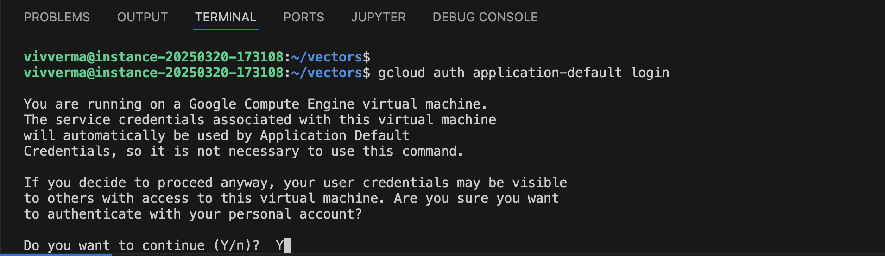

16. Copy the link and paste it in a browser.

    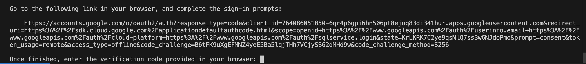

    The browser will prompt you to login to your Google Cloud Account. Post login allow the application to use your cloud credentials.

    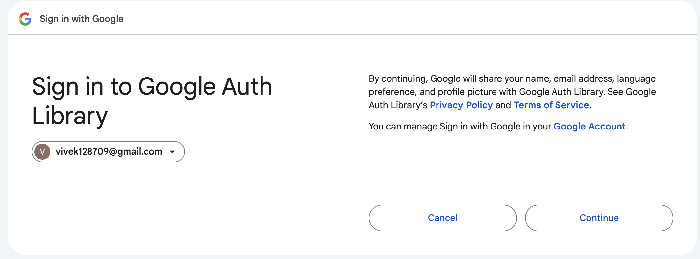
    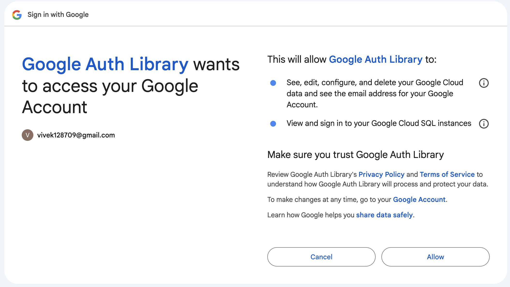

17. Copy the code and paste it back in the terminal window.

    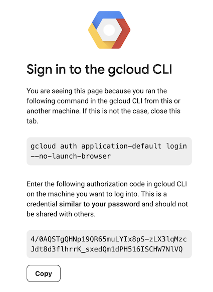
    

18. LLM to generate your response.

    Continue running the code from Jupyter Notebook. We will be using Vertex AI for this lab. From your Google Cloud Console confirm the Project ID and region that you want to use and enter the details. Import the library vertexai and initiate Vertex AI.

    ```
    <copy>
    import vertexai

    PROJECT_ID = "project_id"  # Enter Project ID
    REGION = "region"  # Enter Region eg. us-east4

    # Initialize Vertex AI SDK
    vertexai.init(project=PROJECT_ID, location=REGION)
    import time
    </copy>
    ```

    ```
    <copy>
    from google.cloud import aiplatform

    # LangChain
    import langchain
    from langchain.chat_models import ChatVertexAI
    from langchain.embeddings import VertexAIEmbeddings
    from langchain.llms import VertexAI

    # Utils
    from langchain.schema import HumanMessage, SystemMessage
    from pydantic import BaseModel

    print(f"LangChain version: {langchain.__version__}")

    # Vertex AI

    print(f"Vertex AI SDK version: {aiplatform.__version__}")
    </copy>
    ```

19. The code below sets up the **Vertex AI Service** to use **gemini-2.5-flash**. Click Run to execute the code.

    ```
    <copy>
    import vertexai
    from langchain_google_vertexai import VertexAI

    # set the LLM to get response
    llm = VertexAI(
        model_name="gemini-2.5-flash",
        max_output_tokens=8192,
        temperature=1,
        top_p=0.8,
        top_k=40,
        verbose=True,
    )
    </copy>
    ```

20. The code below builds the prompt template to include both the question and the context, and instantiates the knowledge base class to use the retriever to retrieve context from Oracle Database 23ai. Click Run to execute the code.

    ```
    <copy>
    # Set up a template for the question and context, and instantiate the database retriever object

    template = """Answer the question based only on the following context:
                {context} Question: {question} """
    prompt = PromptTemplate.from_template(template)
    retriever = knowledge_base.as_retriever(search_kwargs={"k": 10})
    print("The template is:",template)
    print(retriever)
    </copy>
    ```

21. Invoke the chain

    This is the key part of the RAG application. It is the LangChain pipeline that chains all the components together to produce an LLM response with context. The chain will embed the question as a vector. This vector will be used to search for other vectors that are similar. The top similar vectors will be returned as text chunks (context). Together the question and the context will form the prompt to the LLM for processing. And ultimately generating the response.

    The code defines the RAG chain process and invokes the chain. Click Run to execute the code.

    ```
    <copy>
    # Chain the entire process together, retrieve the context, construct the prompt with the question and context, and pass to LLM for the response

    s5time = time.time()
    print("We are sending the prompt and RAG context to the LLM, wait a few seconds for the response...")
    chain = (
        {"context": retriever, "question": RunnablePassthrough()}
            | prompt
            | llm
            | StrOutputParser()
    )

    response = chain.invoke(user_question)
    print(user_question)
    print(prompt)
    print(response)
    # Print timings for the RAG execution steps

    s6time = time.time()
    print("")
    print( f"Send user question and ranked chunks to LLM and get answer duration: {round(s6time - s5time, 1)} sec.")
    </copy>
    ```

    Click Run to execute the congrats code.

    ```
    <copy>
    print("")
    print("Congratulations! You've completed your RAG application with AI Vector Search in Oracle Database 23ai running on Oracle Database@Google Cloud using Vertex AI - Gemini")
    </copy>
    ```

You may now **proceed to the next lab**.

## Acknowledgements

- **Authors/Contributors** - Vivek Verma, Master Principal Cloud Architect, North America Cloud Engineering
- **Last Updated By/Date** - Vivek Verma, July 2025