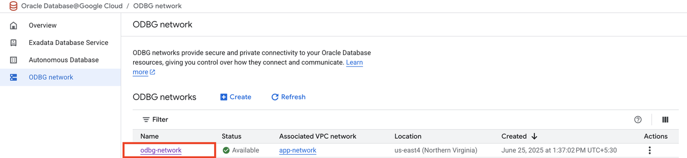
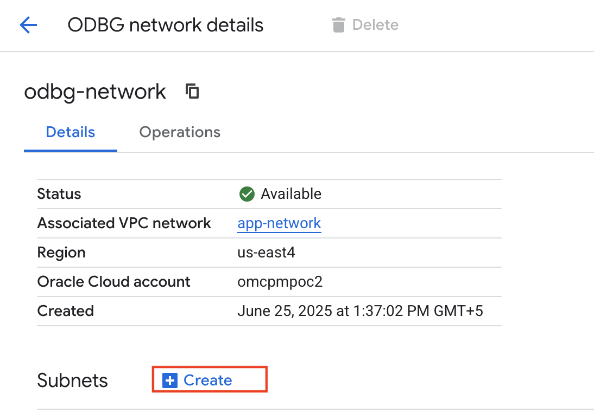
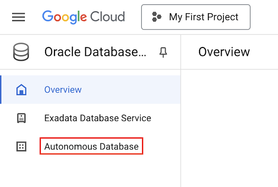
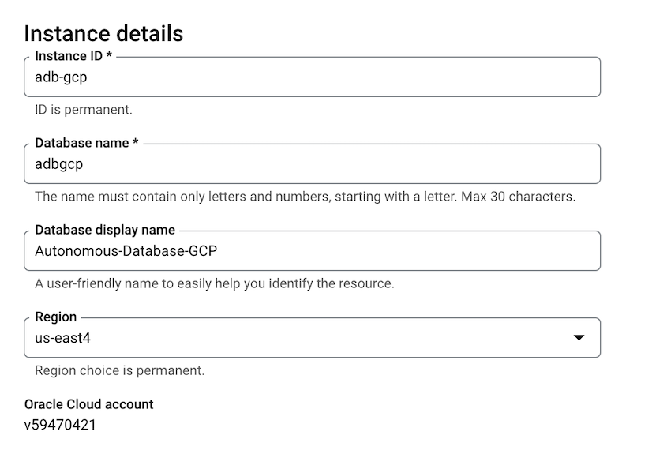
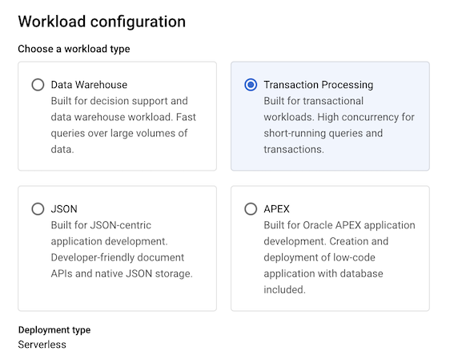
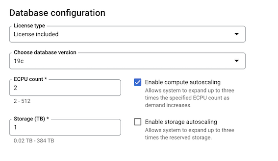
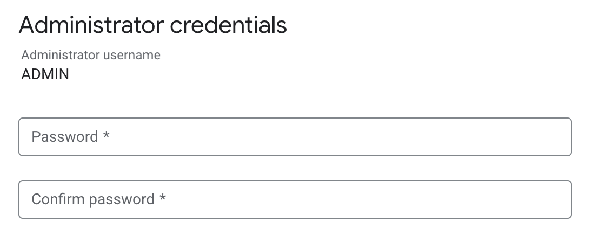
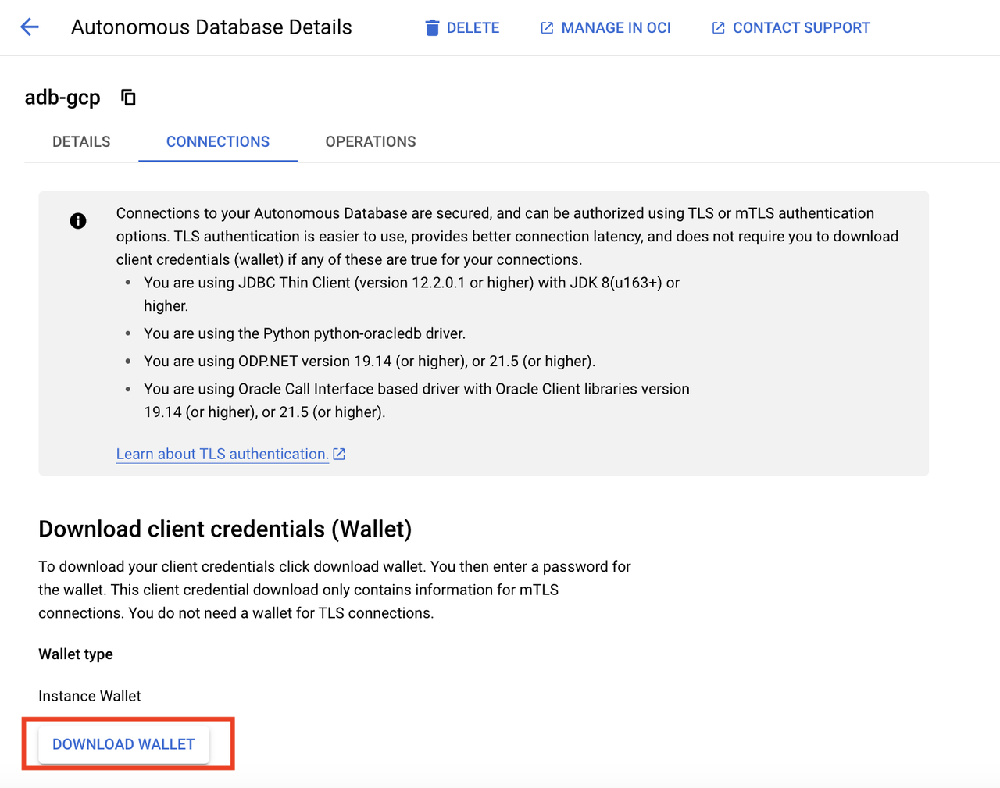

# Provisioning Autonomous Database

## Introduction

This lab provisions Oracle Database@Google Cloud Autonomous Database. The sample tables are populated in Lab 2 after the private-network VM is available.

Estimated Time: 10 minutes

### Objectives

As a database user, DBA or application developer:

1. Create an ODBG network.
2. Provision an Autonomous Transaction Processing database.

### Required Artifacts

- A Google Cloud account and an existing VPC network to associate with Oracle Database@Google Cloud. If you still need to create the VPC, complete [Lab 2, Task 1](?lab=gcp-get-started#task1createavirtualprivatecloudvpc) first, then return here. The remaining Lab 2 tasks require the provisioned database.

## Task 1: Create an ODBG Network

In this section, you will create an ODBG Network. **ODBG networks** provide secure and private connectivity to your Oracle Database resources, giving you control over how they connect and communicate.

1. Login to Google Cloud Console (console.cloud.google.com) and search for **Oracle Database** in the **Search Bar** on the top of the page. Click on **Oracle Database@Google Cloud**.

    

2. Click **ODBG network** from the left menu.

    

3. Click **Create** on the ODBG network page.

    

4. This will bring up the **Create ODBG network** screen where you specify the configuration of the ODBG network.

5. Enter the following for **ODBG network**:

    * **Associated network** - app-network
    * **Region** - us-east4
    * **ODBG network name** - odbg-network

    Click **Create**.

    

6. On the **ODBG network** page click on the ODBG network that we just created **odbg-network**.

    

7. On the **ODBG network details** page click **Create** to create a Subnet.

    

8. Enter the following for **ODBG subnet**:

    * **Subnet name** - db-subnet
    * **Subnet range** - 10.2.0.0/24
    * **Subnet type** - Client

    Click **Create**.

    

9. On the **ODBG network details** page, verify the details of the ODBG Network and confirm the **Status** of subnet **db-subnet** is set to **Available**.

    

## Task 2: Create Autonomous Database

In this section, you will be provisioning an Autonomous Database using the Google Cloud Console.

1. Login to Google Cloud Console (console.cloud.google.com) and search for **Oracle Database** in the **Search Bar** on the top of the page. Click on **Oracle Database@Google Cloud**.

    

2. Click **Autonomous Database** from the left menu.

    

3. Click **Create** on the Autonomous Database details page.

    

4. This will bring up the **Create an Autonomous Database** screen where you specify the configuration of the database.

5. Enter the following for **Instance details**:

    * **Instance ID** - adb-gcp
    * **Database name** - adbgcp
    * **Database display name** - Autonomous-Database-GCP
    * **Region** - us-east4

    

6. Select **Transaction Processing** for **Workload configuration**

    

7. Leave all defaults for **Database configuration**

    

8. Enter the password for admin user under **Administrator credentials**

    

9. Under the **Networking** section, select **Private endpoint access only** for **Access type**.

10. For **Private endpoint**, enter the following:

    * **Network project** - Select the default project name for the VPC network
    * **ODBG Network** - odbg-network
    * **Client subnet** - db-subnet (10.2.0.0/24)

    

11. Leave the rest as defaults and click **CREATE** to create the Autonomous Database.

    

12. Post creation the Autonomous Database will appear on the **Autonomous Database** page.

    

## Task 3: Download the Autonomous Database wallet file

**Oracle Autonomous Database** only accepts secure connections to the database. This requires a **'wallet'** file that contains the SQL\*NET configuration files and the secure connection information. Wallets are used by client utilities such as SQL Developer, SQL\*Plus etc.

1. On the **Autonomous Database** page click the Autonomous Database that was provisioned.

    

2. Go to the **CONNECTIONS** tab.

    

3. Click **DOWNLOAD WALLET** on the **Connections** page.

    

4. Set a password for the wallet on the **Download your wallet** page and click **DOWNLOAD**

    

5. Keep the downloaded wallet private. After creating the VM in [Lab 2, Task 2](?lab=gcp-get-started#task2provisiongooglecloudcomputevminstance), follow the runbook's [wallet transfer instructions](?lab=workshop-runbook#3provisionnetworkdatabaseandwallet) to copy and extract it on that VM before connecting with SQLcl.

## Acknowledgements

*All Done! You may proceed to the next lab.*

- **Authors/Contributors** - Paul Parkinson, Architect and Dev Advocate, Oracle AI Database
- **Last Updated By/Date** - Paul Parkinson, October 2026
