# GCP networking and VM setup and populate database tables

## Introduction

This lab prepares Google Cloud networking and a Compute Engine VM for SQLcl access to the private Oracle Database@Google Cloud Autonomous Database endpoint, then populates the sample tables. The same VM can also be used later by the workshop's A2A agents.

Estimated Time: 30 minutes

### Objectives

As a database user, DBA, or application developer:

1. Create a Virtual Private Cloud (VPC) Network in Google Cloud.
2. Provision a Compute Engine VM instance that can access the private database endpoint.
3. Populate the supply-chain graph and inventory-risk sample tables.

## Task 1: Create a Virtual Private Cloud (VPC)

In this section, you will create a VPC which will have two subnets:

* A private subnet where your Autonomous Database is deployed (created as part of your ADB deployment). A private subnet will protect your database endpoint from internet access.
* A public subnet where you will deploy a virtual machine. You will use this VM to access Autonomous Database.

1. Sign in to Google Cloud Console (console.cloud.google.com) and click on the **Navigation Menu**. Then click on **VPC Networks** under **VPC Network**.

    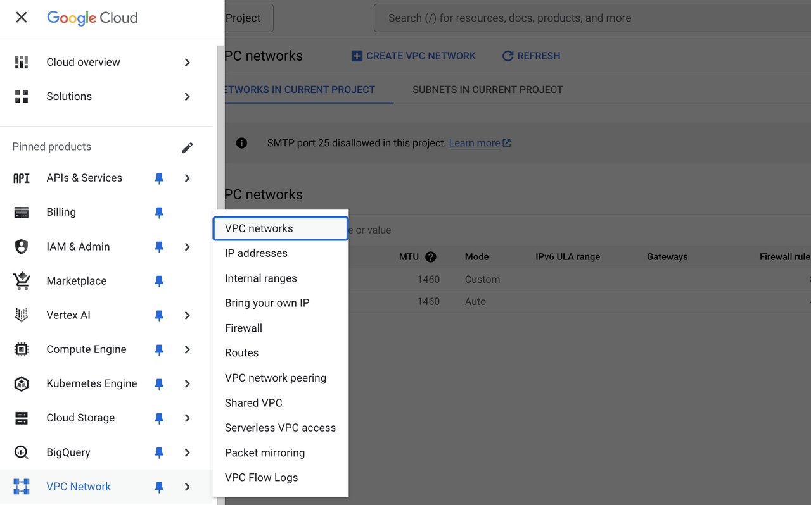

2. On the **VPC networks** page, click on the **CREATE VPC NETWORK** button.

    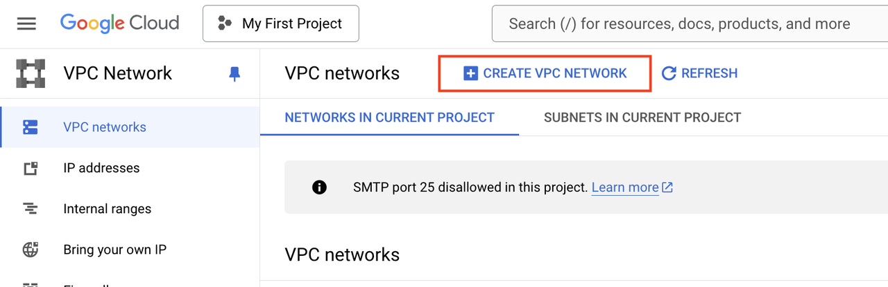

3. On **Create a VPC Network** provide details as mentioned below.

    * **VPC Name** - app-network
    * **Description** - Application Database Network

    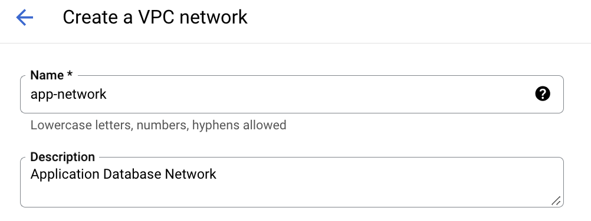

    Under **Subnets** enter the details of the Subnet -

    * **Subnet Name** - public-subnet
    * **Description** - Public Subnet
    * **Region** - us-east4
    * **IPv4 range** - 10.1.0.0/24
    * Leave the rest as defaults under **Subnets**

    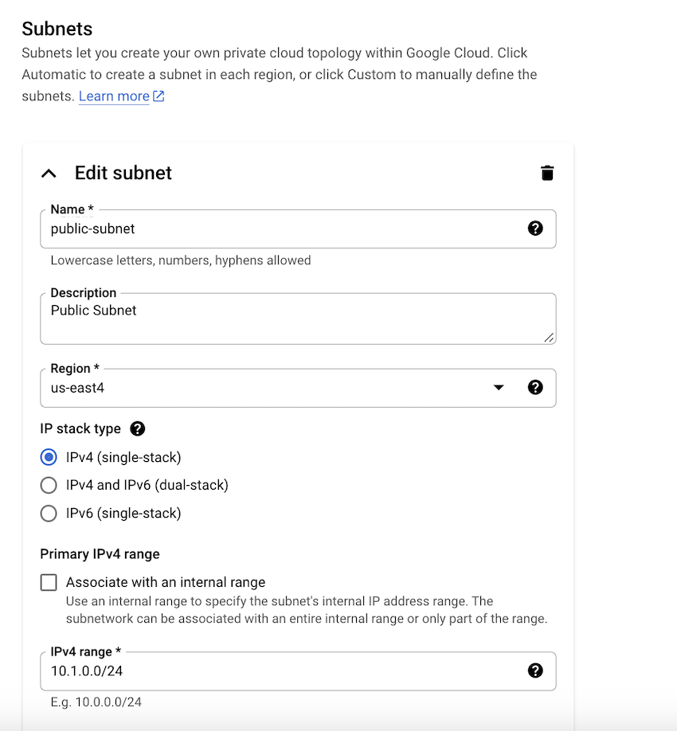

    Under **Firewall rules** select all rules -

    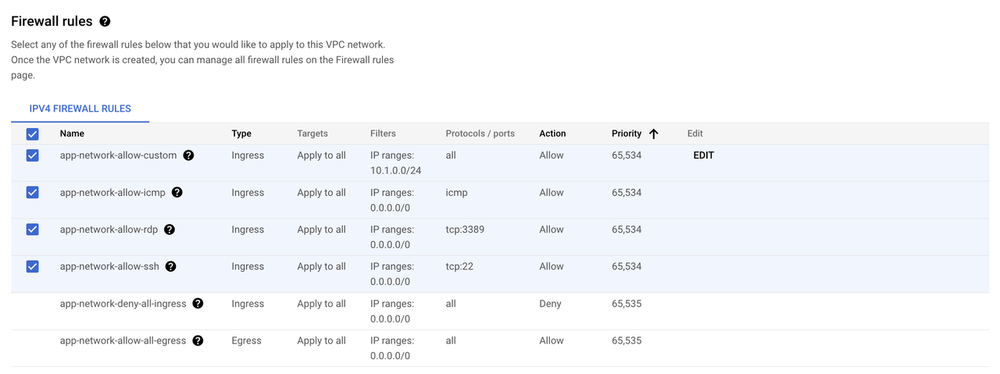

    Click **CREATE** to create the VPC Network.

    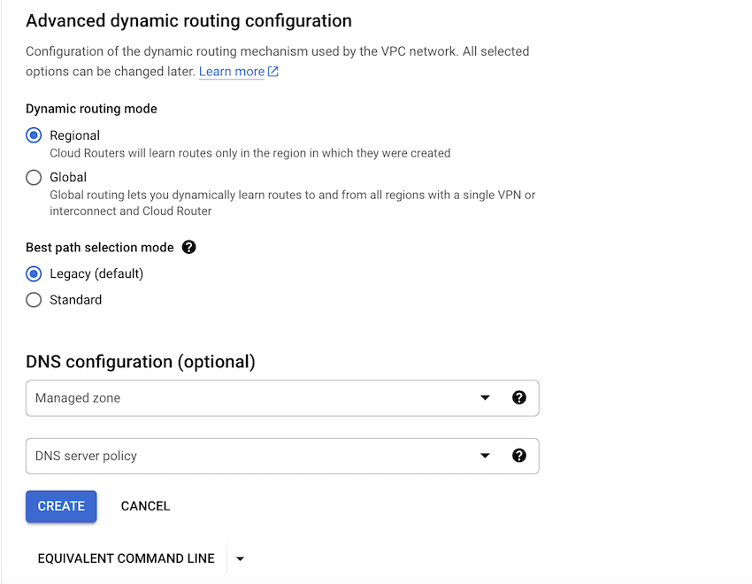

4. The created VPC will show up on the **VPC networks** page -

    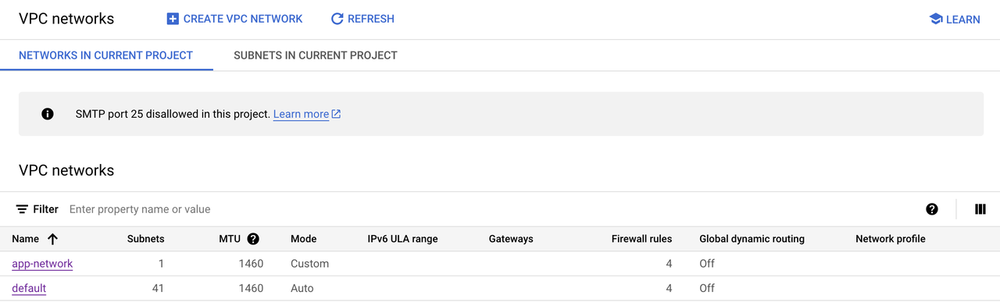

## Task 2:  Provision Google Cloud Compute VM Instance

1. Generating ssh key pairs

    SSH keys are required to access a running compute VM instance securely. You can use an existing SSH-2 RSA key pair or create a new one. Instructions for creating SSH keys can also be found on the [OCI documentation page](https://docs.cloud.oracle.com/iaas/Content/GSG/Tasks/creatingkeys.htm). For Linux instances you can generate SSH keys [here](https://docs.oracle.com/en-us/iaas/Content/Compute/Tasks/managingkeypairs.htm#Managing_Key_Pairs_on_Linux_Instances).

2. From the Google Cloud Console (console.cloud.google.com), click on the **Navigation Menu**. Then click on **VM instances** under **Compute Engine**.

    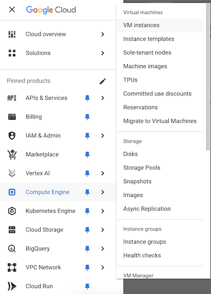

3. On the **VM instances** page click **CREATE INSTANCE**

    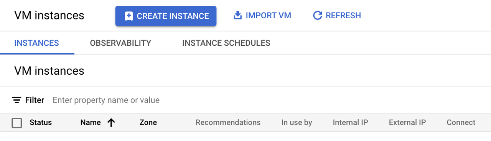

4. Under **Machine configuration** enter the following -

    * **Name** - app-instance
    * **Region** - us-east4
    * Leave the rest as default.

    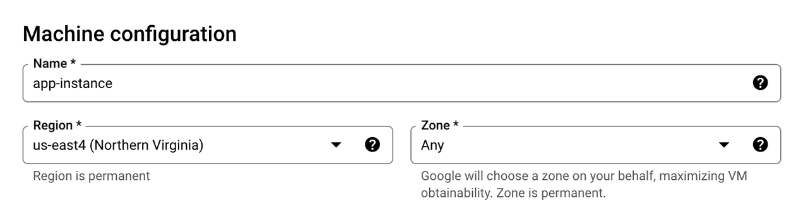

5. Under **OS and storage**, click **Change** to update the **Storage** from 10 GB to 20 GB.

    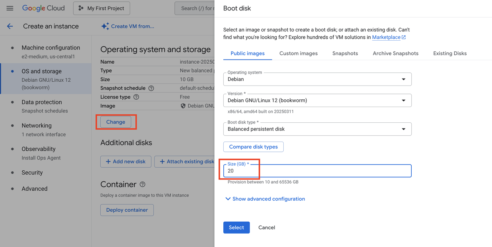

6. Click **Networking** on the left tab and enter the following -

    * **Allow HTTP traffic** - Checkmark
    * **Allow HTTPS traffic** - Checkmark

    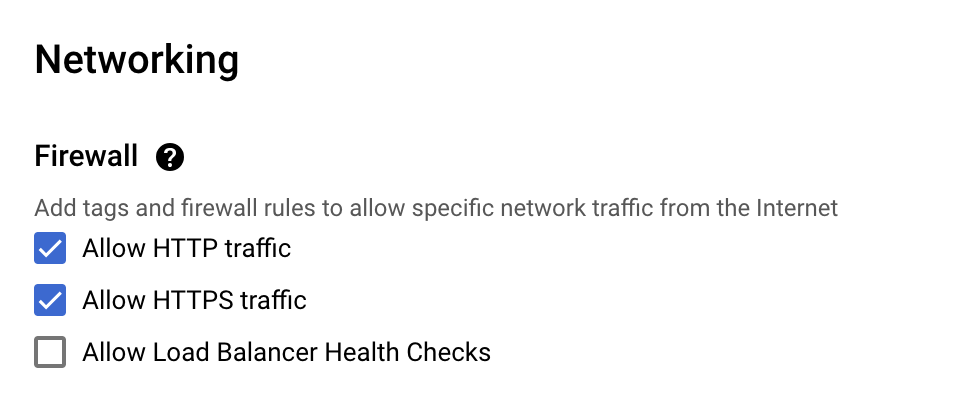

    Click the drop down for **Network interfaces**

    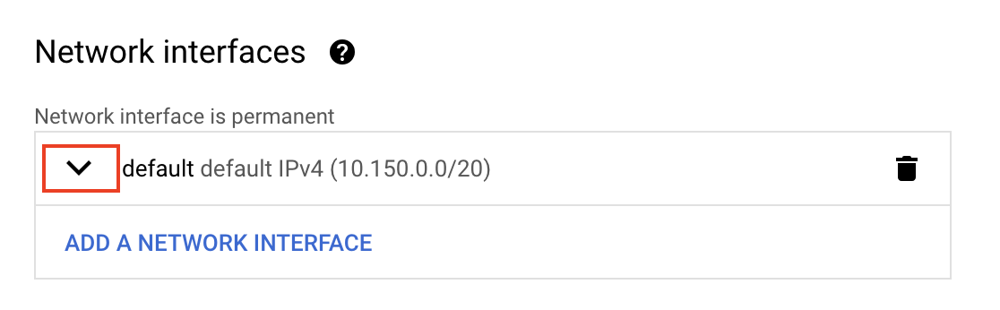

    Enter the following under **Edit network interface**

    * **Network** - app-network
    * **Subnetwork** - public-subnet

    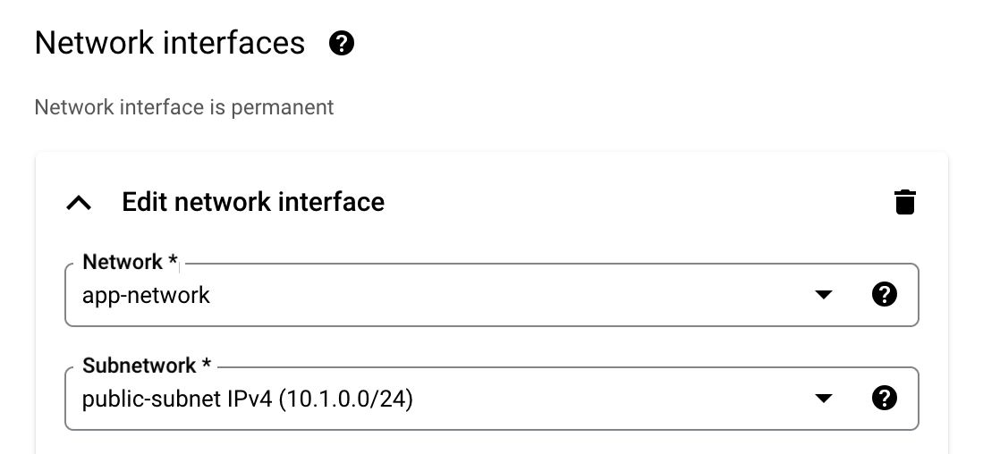

7. Click **Security** on the left tab and enter the following. Click **MANAGE ACCESS** and click **ADD ITEM** under **Add manually generated SSH keys**. Enter the public ssh key. Click **CREATE** to create the VM instance.

    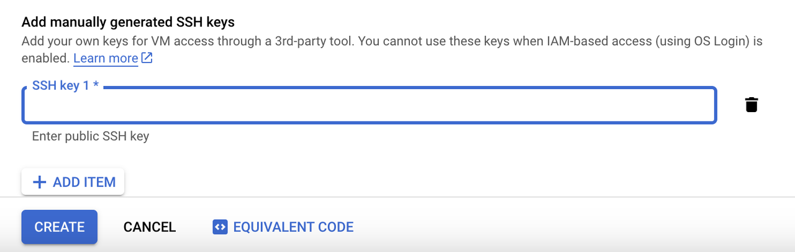

8. The created VM instance will show up on the **VM instances** page -

    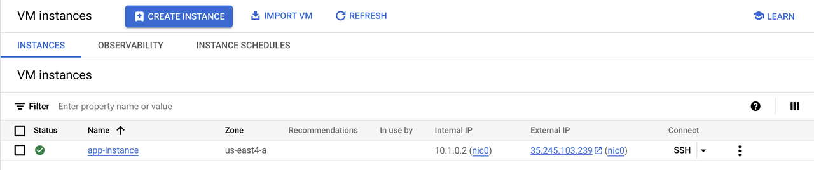

## Task 3: Clone the sample repository

Before connecting to Oracle, complete the runbook's [wallet transfer instructions](?lab=workshop-runbook#3provisionnetworkdatabaseandwallet) using the wallet downloaded in Lab 1 and the VM just created.

Run these commands on this VM. If the repository was already cloned, reuse the existing checkout.

```bash
git clone https://github.com/paulparkinson/oracle-ai-database-gcp-gemini.git
cd oracle-ai-database-gcp-gemini
```

## Task 4: Populate the sample tables

The [data tables README](https://github.com/paulparkinson/oracle-ai-database-gcp-gemini/blob/main/sql/DATA_TABLES_README.md) documents SQLcl scripts. SQLcl is the recommended path here because it runs the checked-out files in order and prompts for database passwords. Install it from [Oracle SQLcl Downloads](https://www.oracle.com/database/sqldeveloper/technologies/sqlcl/download/) if it is not already available on the VM. Keep `TNS_ADMIN` set to the directory containing the extracted wallet, then connect using a service alias from the wallet's `tnsnames.ora` file:

```bash
export TNS_ADMIN="$HOME/wallet"
sql ADMIN@your_adb_service_alias
```

Enter the `ADMIN` password when prompted. The README targets a `FINANCIAL` schema but does not create it. Check whether the schema already exists; only if it does not, create it as `ADMIN` and grant the required table privileges:

```sql
SELECT username FROM all_users WHERE username = 'FINANCIAL';

CREATE USER FINANCIAL IDENTIFIED BY "Replace_With_A_Strong_Password";
GRANT CREATE SESSION, CREATE TABLE TO FINANCIAL;
ALTER USER FINANCIAL QUOTA 100M ON DATA;
```

If the query returns `FINANCIAL`, do not run the `CREATE USER` statement. Confirm that the existing schema can create tables and has quota on `DATA`.

Still connected as `ADMIN`, run the one-time preparation script:

```sql
@sql/admin_prepare_paulparkdb_demo.sql
EXIT
```

Reconnect as `FINANCIAL`, enter its password when prompted, and run these scripts in order:

```bash
sql FINANCIAL@your_adb_service_alias
```

```sql
@sql/setup_supply_chain_graph_schema.sql
@sql/seed_supply_chain_graph_data.sql
@sql/setup_inventory_risk_demo_schema.sql
@sql/seed_inventory_risk_demo_data.sql
```

Verify the created tables, views, and graph:

```sql
SELECT object_name, object_type, status
FROM user_objects
WHERE object_name LIKE 'SC_%' OR object_name = 'SUPPLY_CHAIN_GRAPH'
ORDER BY object_type, object_name;
```

The scripts are intended to be rerunnable. Review errors and existing-object messages; do not drop objects in a shared database. The source README documents the SQLcl command-line workflow, not a Database Actions SQL Worksheet workflow, so SQLcl on this Lab 2 VM is the clearest and most reproducible option for this private-endpoint setup.

### Alternative: Database Actions SQL Worksheet

You can also run the SQL statements from [Oracle Database Actions](https://docs.oracle.com/en/cloud/paas/autonomous-database/serverless/adbsb/connect-database-actions.html). From the Autonomous Database details page, select **Database actions** and open **SQL**. Database Actions supports SQL statements, queries, and scripts in a browser-based worksheet.

For a private-endpoint database, Database Actions must be accessed from a client in the same VCN. If the OCI Console or your browser is outside the VCN, the worksheet will not provide a route to the database; use the Lab 2 VM or establish approved private connectivity first. Upload or paste the scripts in the worksheet and run them in the same order shown above, using separate `ADMIN` and `FINANCIAL` sessions as appropriate. Review each result before continuing, and do not run `CREATE USER` if `FINANCIAL` already exists.

SQLcl on the VM remains the primary workshop path. It is reproducible for the checked-out scripts, keeps the wallet and credentials with the private client, and the VM will be reused later to host the workshop's A2A agents. Database Actions is included as a useful alternative for users who already have in-VCN browser access.

## Acknowledgements

*All Done! You may proceed to the next lab.*

- **Authors/Contributors** - Paul Parkinson, Architect and Dev Advocate, Oracle AI Database
- **Last Updated By/Date** - Paul Parkinson, October 2026
