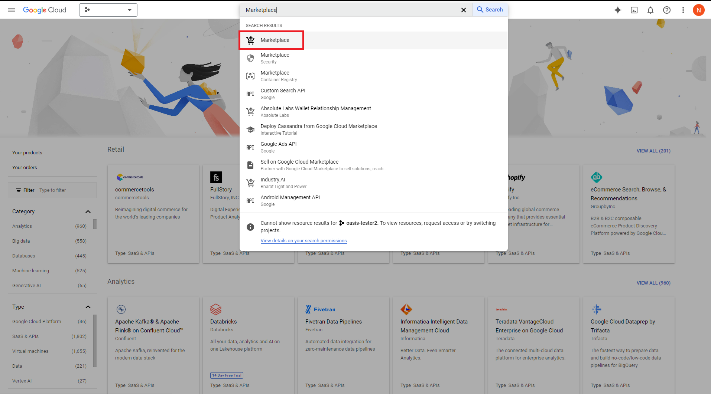
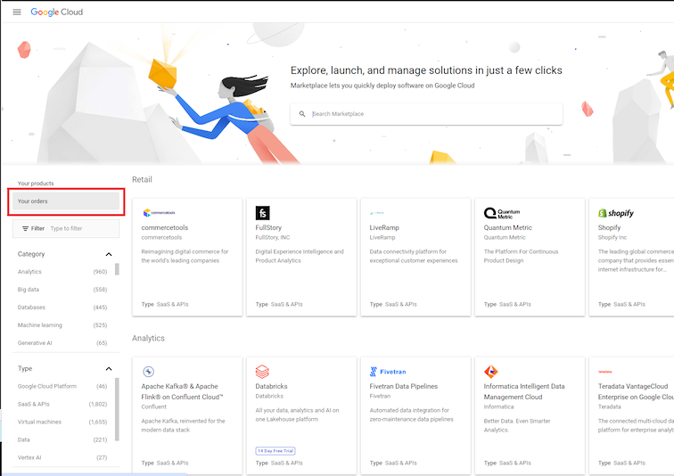
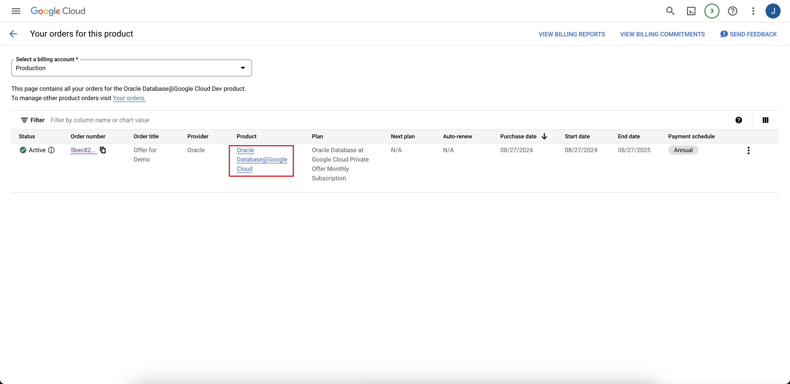
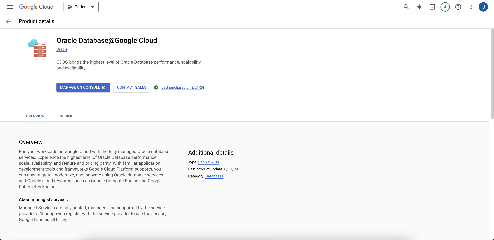
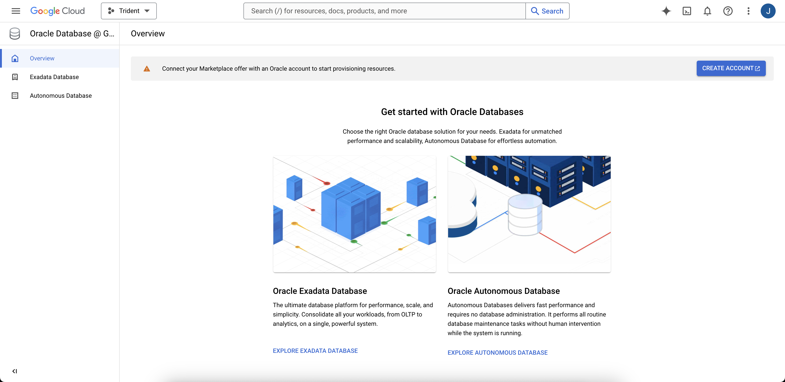
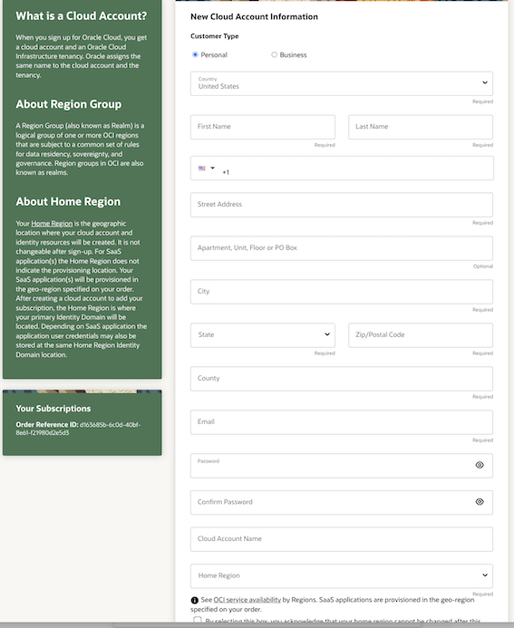
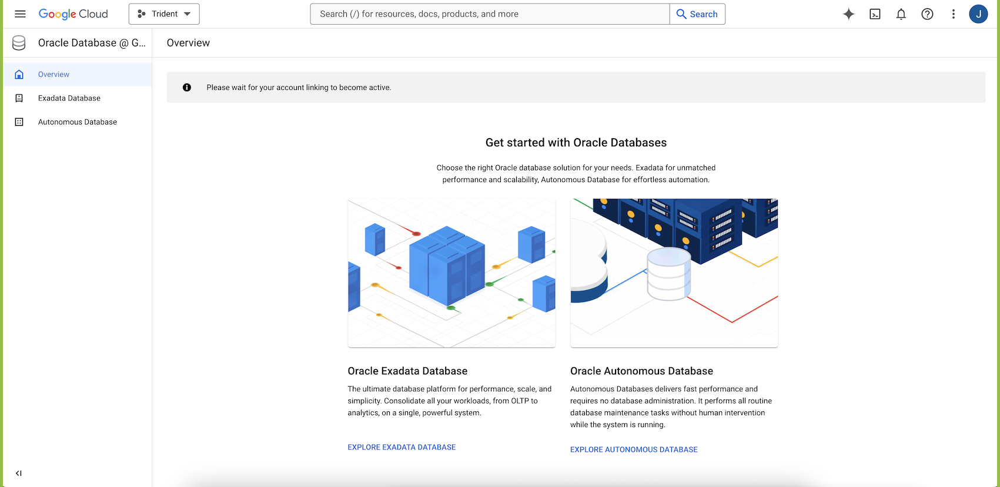

# Get started - Oracle Database@Google Cloud - Autonomous Database

## Introduction

Oracle Database@Google Cloud is an Oracle Cloud Database service that runs Oracle Database workloads in your Google Cloud environment. When you implement this solution, you deploy resources in two cloud environments: database resources are in Google Cloud, while the database administration control plane is in Oracle Cloud Infrastructure (OCI). This lets you to deploy Oracle Database products in your Google Cloud environment while OCI maintains the administration capabilities.

Your Google Cloud-based applications access Oracle Databases directly from within the Google Cloud environment. You perform most database administrative operations in the Google Cloud Console as well. Maintaining the database control plane in OCI lets Oracle Database@Google Cloud be easily managed and upgraded with the latest operational and administrative capabilities.

All hardware for Oracle Database@Google Cloud uses Google Cloud networking. The service benefits from the simplicity, security, and low latency of a single operating environment within Google Cloud.

### Available Database Services

Oracle Database@Google Cloud offers the following Oracle Database services:

* Oracle Exadata Database Service (available only with the purchase of a private offer)
* Oracle Autonomous Database (available for Pay As You Go and Private Offer purchases)

Both Oracle Autonomous Database and Oracle Exadata Database Service use the same underlying high-performance hardware optimized for database workloads, but they each offer distinct advantages to meet different customer needs.

### Purchase Offer Options

Oracle has two options for purchasing Oracle Database@Google Cloud:

* Private offer: With this option, you first contact Oracle's sales team to negotiate a contract for Oracle Database@Google Cloud. To use Oracle Exadata Database Service, you must purchase Oracle Database@Google Cloud using a private offer. You can also provision Autonomous Database after purchasing a private offer.
* Pay As You Go offer: You can purchase this offer in the Google Cloud Marketplace without contacting Oracle Sales. Oracle offers Autonomous Database for customers purchasing the Pay As You Go offer. Pay as You Go offers the most flexibility, letting you start and stop using the service at any time.

**For this workshop we will be using the Pay-As-You-Go offer.**

### Offer Activation

To activate an order, an authorized user with the required permissions signs in to the Google Cloud console and follows the steps based on the offer type selected:

* Public Offer: Open the Google Cloud Marketplace in a browser window, then search for and select the "Oracle Database@Google Cloud" offering.
* Private Offer: Click the link in the email you received from Oracle, or open the Google Cloud Marketplace Orders page, then click the link for your offer.

At this point, you connect your Google Cloud billing account with a new or existing OCI cloud account. **Oracle does not charge you for the new OCI Cloud account**. Here's what happens during this process:

Google Cloud Marketplace prompts you to select an existing OCI cloud account (this option is only available for private offers), or create a new OCI cloud account to use with the Oracle Database@Google Cloud. An OCI account is required because, while the databases are deployed in your Google Cloud environment, some resource components like the Database control plane and metrics are deployed in OCI.

Estimated Time: 30 minutes

### Objectives

As a database user, DBA, or application developer:

1. Google Cloud Onboarding

## Task 1: Google Cloud Onboarding

In this section, you will perform the steps for Onboarding with Oracle Database@Google Cloud.

1.  Sign in to the Google Cloud console at https://console.cloud.google.com.

2. In the Google Cloud console search field, search for "Marketplace" and navigate to the **Google Cloud Marketplace**.

    

3. In Marketplace, click **Your orders** in the left navigation menu to view your Marketplace orders.

    

4. Click Oracle Database@Google Cloud in the **Product** column to navigate to the product details page.

    

5. On the page, click **Manage on Console**.

    

6. On the Oracle Database@Google Cloud **Overview** page, click **Create Account**.

    

7. Enter the details for creating a new OCI account.

    

8. Return to the browser window displaying the Google Cloud console. The console displays a message that says "Please wait for your account linking to become active." The account creation and inking takes a few minutes.

    

You may now **proceed to the next lab** to provision Google Cloud resources.

## Acknowledgements
- **Authors/Contributors** - Vivek Verma, Master Principal Cloud Architect, North America Cloud Engineering
- **Last Updated By/Date** - Vivek Verma, July 2025