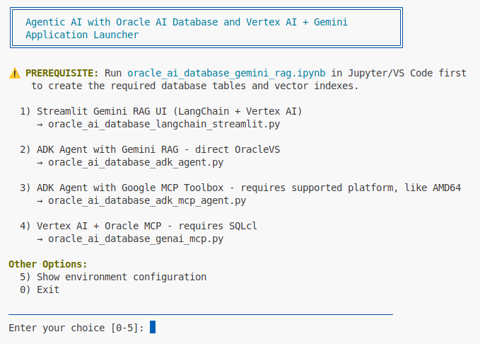

# Oracle AI Database RAG with Google Vertex AI Agents

## Introduction

This lab demonstrates building AI agents using Google's Agent Development Kit (ADK) and Model Context Protocol (MCP) with Oracle AI Database 26ai vector search. You'll learn how to implement different agent architectures that combine multi-step reasoning with vector-based retrieval augmented generation (RAG).

The ADK provides a code-first approach to building agents with full control over behavior, tools, and workflows. This contrasts with Agent Builder's no-code interface (covered in a separate lab).

**Prerequisites:** You must complete the previous RAG lab ([adb-ai.md](../adb-ai/adb-ai.md)) which covers:
- Setting up the Python environment with venv
- Running the Jupyter notebook to create vector tables
- Understanding basic RAG concepts with Streamlit UI

Estimated Time: 45 minutes

### Objectives

* Implement ADK agents with custom Oracle AI Database tools
* Use Google MCP Toolbox for database operations
* Integrate Vertex AI with Oracle SQLcl MCP Server
* Compare different agent architectures

### Prerequisites

* Completion of previous lab 
* Oracle Autonomous Database 26ai with populated RAG_TAB table
* GCP Compute VM with Python venv configured
* GCP authentication completed

## Task 1: Understand the Agent Menu Options

The `run.sh` script in the `python/` directory provides access to different agent implementations. Each option demonstrates a different architectural approach to building AI agents.

1. Navigate to the python directory:
   ```bash
   <copy>
   cd oracle-ai-for-sustainable-dev/oracle-ai-database-gcp-vertex-ai/python
   source ../venv/bin/activate
   </copy>
   ```

2. Launch the menu:
   ```bash
   <copy>
   ./run.sh
   </copy>
   ```

   You'll see these options:
   
   - **Option 1**: Streamlit Gemini RAG UI (covered in previous lab)
   - **Option 2**: ADK Agent with direct OracleVS integration
   - **Option 3**: ADK Agent with Google MCP Toolbox
   - **Option 4**: Vertex AI + Oracle SQLcl MCP Server

## Task 2: ADK Agent with Direct OracleVS Integration

This option implements a custom ADK agent that directly connects to Oracle Database 26ai using the OracleVS vector store from LangChain.

### Architecture

````
User Query → ADK Agent (Gemini 2.5 Flash)
              ↓
         Custom BaseTool
              ↓
    OracleVS Vector Store
              ↓
    Oracle Database 26ai
````

### Key Features

- **Direct database access**: No middleware required
- **Custom BaseTool**: Full control over search parameters
- **LangChain integration**: Uses OracleVS for vector operations
- **Multi-step reasoning**: Agent can make multiple tool calls

### Implementation Details

File: `oracle_ai_database_adk_agent.py`

1. **Custom OracleRAGTool**:
   ````python
   class OracleRAGTool(BaseTool):
       """Tool for searching Oracle Database knowledge base."""
       
       def __call__(self, query: str, top_k: int = 5) -> dict:
           docs = self.vector_store.similarity_search(query, k=top_k)
           return {
               "documents": [doc.page_content for doc in docs],
               "metadata": [doc.metadata for doc in docs],
               "count": len(docs)
           }
   ````

2. **ADK Agent Configuration**:
   - Model: `gemini-2.5-flash`
   - Tools: Custom Oracle RAG tool
   - System instruction: Oracle Database expert persona

### Running the Agent

1. From the menu, select **Option 2**

2. Test with these queries:
   ````
   What are the new vector search features in Oracle 26ai?
   
   Tell me about JSON Relational Duality
   
   How do I enable the MCP Server in Autonomous Database?
   ````

3. Observe the agent workflow:
   - User query → Agent reasoning → Tool call → Database search → Response generation

4. Try follow-up questions to test context retention

## Task 3: ADK Agent with Google MCP Toolbox

This option uses Google's MCP (Model Context Protocol) Toolbox to provide standardized database operations through a protocol-based interface.

### Architecture

````
User Query → ADK Agent (Gemini 2.5 Flash)
              ↓
      Google MCP Toolbox
              ↓
    MCP Protocol Layer
              ↓
    Oracle Database 26ai
````

### Key Features

- **Protocol-based**: Uses MCP standard for tool communication
- **Toolbox abstraction**: Pre-built database operations
- **AMD64 requirement**: Native binaries only support AMD64 architecture
- **Structured operations**: Standardized query/insert/update operations

### Prerequisites

**Important**: This option requires AMD64 architecture. If you're on ARM64 (Apple Silicon), it won't work natively.

Platform check:
```bash
<copy>
uname -m
# Should show: x86_64 (AMD64) ✅
# If shows: aarch64 or arm64 ❌ (not supported)
</copy>
```

### Running the Agent

1. From the menu, select **Option 3**

2. If on unsupported platform, you'll see:
   ````
   Note: Requires AMD64 platform or Docker
   ````

3. The script `run_oracle_ai_database_adk_mcp_agent.sh` handles:
   - Platform detection
   - MCP Toolbox initialization
   - Agent startup with MCP tools

4. Test database operations:
   ````
   Search for information about AI Vector Search
   
   Query the database for SELECT AI features
   
   Find documentation about spatial enhancements
   ````

### MCP Toolbox vs Custom Tools

| Aspect | Custom Tool (Option 2) | MCP Toolbox (Option 3) |
|--------|----------------------|---------------------|
| **Setup** | Direct connection | Protocol layer |
| **Flexibility** | Full control | Standard operations |
| **Platform** | Any | AMD64 only |
| **Maintenance** | Custom code | Managed by Google |
| **Use Case** | Custom workflows | Standard CRUD ops |

## Task 4: Vertex AI with Oracle SQLcl MCP Server

This option connects Google's Vertex AI directly to Oracle's native MCP Server running in SQLcl (SQL Command Line).

### Architecture

````
User Query → Vertex AI GenerativeModel
              ↓
      Function Calling
              ↓
    Oracle SQLcl MCP Server
              ↓
    Oracle Database 26ai
````

### Key Features

- **Native Oracle integration**: Uses Oracle's official MCP implementation
- **SQLcl powered**: Full SQL and PL/SQL capabilities
- **OAuth authentication**: Secure token-based access
- **Direct tool execution**: No custom tool wrappers needed

### Prerequisites

1. **Oracle SQLcl with MCP support**:
   - SQLcl 24.4 or later
   - Download from: [Oracle SQLcl Downloads](https://www.oracle.com/database/sqldeveloper/technologies/sqlcl/)


### Running the Agent

1. From the menu, select **Option 4**

2. You'll see:
   ````
   Starting GenerativeModel + Oracle SQLcl MCP...
   Note: Requires SQLcl with MCP support AND Java
   ````

3. The script starts:
   - SQLcl MCP Server connection
   - Vertex AI GenerativeModel initialization  
   - OAuth token refresh

4. Test SQL operations:
   ````
   Show me the schema of the RAG_TAB table
   
   Run a query to count the number of vector embeddings
   
   Execute: SELECT * FROM rag_tab WHERE ROWNUM <= 5
   ````

### MCP Server Advantages

- **Full SQL access**: Execute any SQL/PL/SQL
- **Native vector operations**: Use Oracle's vector functions directly
- **Secure by default**: OAuth 2.0 authentication
- **No middleware**: Direct database-to-AI communication

### Configuration

File: `oracle_ai_database_genai_mcp.py`

Key settings:
````python
MCP_ENDPOINT = "https://dataaccess.adb.us-ashburn-1.oraclecloudapps.com/adb/mcp/v1/databases/{database-ocid}"

model = GenerativeModel(
    "gemini-2.5-flash",
    tools=[Tool.from_google_search_retrieval(), oracle_mcp_tools]
)
````

## Task 5: Compare Agent Architectures

Now that you've tested all three agent options, let's compare them:

### Decision Matrix

| Requirement | Best Option |
|------------|-------------|
| Maximum control over search | Option 2 (Direct OracleVS) |
| Standard database operations | Option 3 (MCP Toolbox) |
| Full SQL capabilities | Option 4 (SQLcl MCP) |
| Simple setup | Option 2 (Direct OracleVS) |


## Task 6: (Optional) Advanced Customization

### Custom System Instructions

Each agent can be customized with different personas:

**Technical Expert**:
````python
system_instruction = """You are a database architect specializing in 
Oracle Database 26ai. Provide technical, detailed answers with SQL 
examples when relevant."""
````

**Business Analyst**:
````python
system_instruction = """You are a business analyst explaining Oracle 
features in simple terms. Focus on business value and use cases."""
````

### Multi-Tool Agents

Combine multiple tools in a single agent:

````python
tools = [
    oracle_rag_tool,        # Vector search
    sql_execution_tool,      # Direct SQL
    documentation_tool,      # Web scraping
]

agent = LlmAgent(
    model="gemini-2.5-flash",
    tools=tools,
    system_instruction=instructions
)
````

### Conversation Memory

Implement conversation history:

````python
chat_history = []

def add_to_history(role, message):
    chat_history.append({"role": role, "message": message})

# Use in agent
runner = Runner(
    agent=agent,
    history=chat_history
)
````

## Troubleshooting

### Common Issues

1. **"ModuleNotFoundError: No module named 'google.adk'"**
   ```bash
   <copy>
   pip install google-adk>=1.4.2
   source ../venv/bin/activate
   </copy>
   ```

2. **"Platform not supported" (Option 3)**
   - MCP Toolbox requires AMD64
   - If on ARM64, use Option 2 or 4 instead

3. **"SQLcl not found" (Option 4)**
   ```bash
   <copy>
   # Download and install SQLcl
   wget https://download.oracle.com/otn_software/java/sqldeveloper/sqlcl-latest.zip
   unzip sqlcl-latest.zip
   export PATH=$PATH:$(pwd)/sqlcl/bin
   </copy>
   ```

4. **Connection errors**
   - Check .env file credentials
   - Verify database wallet path
   - Test with: `python -c "import oracledb; print('OK')"`

5. **Agent returns "I don't know"**
   - Ensure RAG_TAB has data (run Jupyter notebook first)
   - Check vector index: `SELECT * FROM USER_INDEXES WHERE TABLE_NAME='RAG_TAB'`
   - Verify embeddings exist: `SELECT COUNT(*) FROM rag_tab WHERE embedding IS NOT NULL`

## Summary

In this lab, you explored three different approaches to building AI agents with Oracle Database 26ai:

✅ **Option 2**: Direct OracleVS integration for maximum control  
✅ **Option 3**: Google MCP Toolbox for standardized operations  
✅ **Option 4**: Oracle SQLcl MCP for native database integration

**Key Takeaways**:
- ADK provides code-first agent development
- Multiple integration patterns available
- Choose based on your requirements (control vs standardization)
- All options support multi-step reasoning and RAG

Congratulations! You now understand how to build production-ready AI agents with multiple architectural patterns.

You may now **proceed to the next lab**.

## Learn More

* [Google Agent Development Kit (ADK)](https://cloud.google.com/vertex-ai/docs/adk)
* [Model Context Protocol (MCP)](https://modelcontextprotocol.io/)
* [Oracle AI Vector Search](https://docs.oracle.com/en/database/oracle/oracle-database/26/vecse/)
* [Oracle SQLcl MCP Server](https://docs.oracle.com/en/cloud/paas/autonomous-database/mcp-server/)
* [Vertex AI Gemini API](https://cloud.google.com/vertex-ai/docs/generative-ai/model-reference/gemini)

## Acknowledgements

* **Author** - Paul Parkinson, Architect and Developer Advocate
* **Last Updated By/Date** - Paul Parkinson, January 2026
