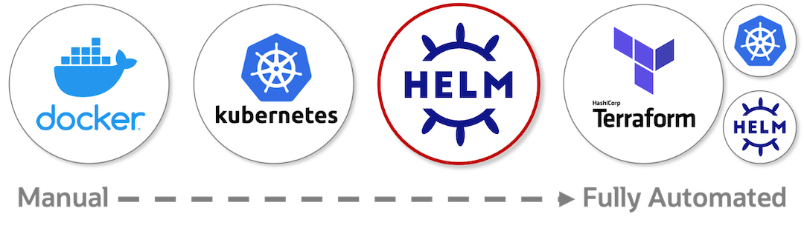
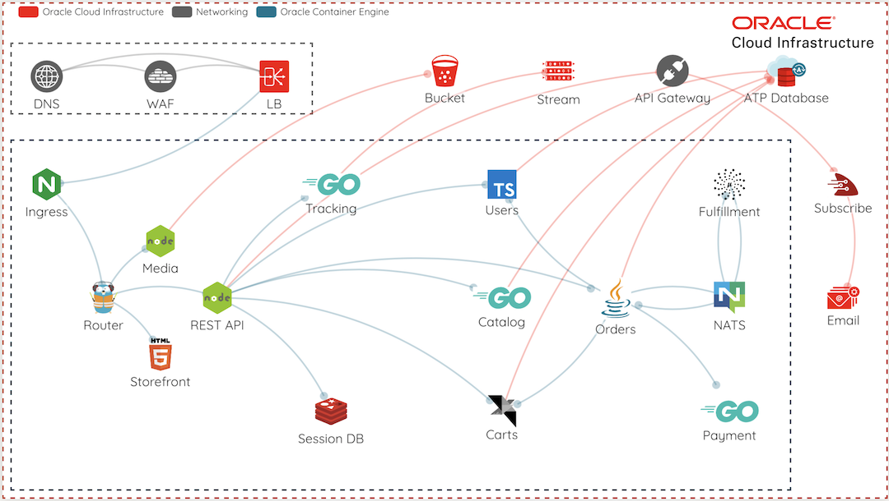
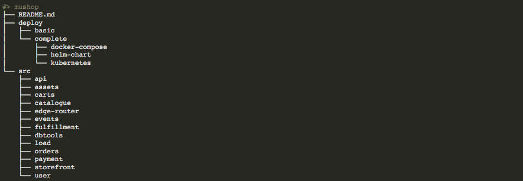
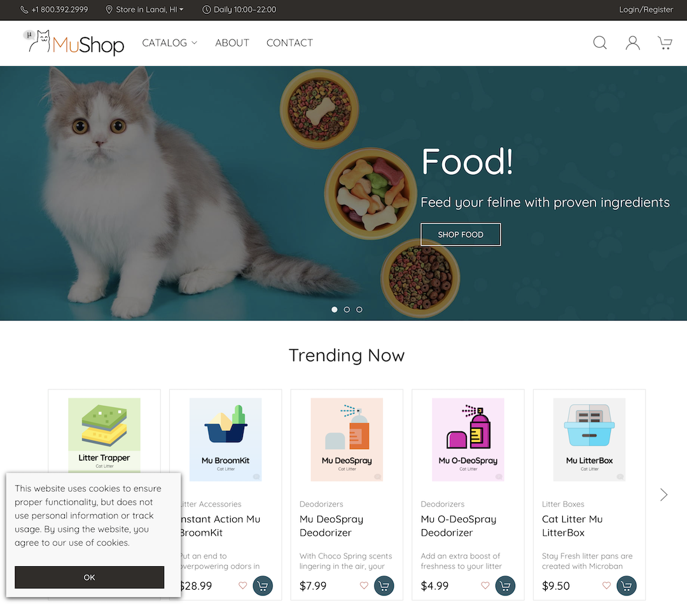

# Deploy the MuShop Application

## Introduction

There are four options for deploying MuShop. They range from manual (docker), automated (Helm) to fully automated (Terraform).  



Designing in microservices offers excellent separation concerns and provides developer independence.  While these benefits are clear, they can often introduce some complexity for the development environment.  Services support configurations that offer flexibility, when necessary, and establish parity as much as possible.  It is essential to use the same tools for development to production.

  
*Note: This diagram contains services not covered by these labs.*

Estimated Lab Time: 30 minutes

### Objectives

In this lab, you will:

* Gather Cloud Information
* Download Source Code
* Setup Kubernetes Cluster on OKE
* Deploy with Helm
* Expose your app publicly
* Explore under the Hood

### Prerequisites

* An Oracle Free Tier(Trial), Paid or LiveLabs Cloud Account
* Completed the **Setup Cloud Environment** lab

## Task 1: Obtain MuShop source code

1. Open up Cloud Shell and clone the github repo.

    ````shell
    <copy>
    git clone https://github.com/oracle-quickstart/oci-cloudnative.git mushop
    </copy>
    ````

    Sample response:

    ````shell
    Cloning into 'mushop'...
    remote: Enumerating objects: 542, done.
    remote: Counting objects: 100% (542/542), done.
    remote: Compressing objects: 100% (313/313), done.
    remote: Total 15949 (delta 288), reused 424 (delta 200), pack-reused 15407
    Receiving objects: 100% (15949/15949), 17.59 MiB | 33.71 MiB/s, done.
    Resolving deltas: 100% (9557/9557), done.
    ````

1. Change to the mushop directory

    ````shell
    <copy>
    cd mushop
    </copy>
    ````

    

    *./deploy:* Collection of application deployment resources  
    *./src:* MuShop individual service code, Dockerfile, etc

1. Check **kubectl** context

    ````shell
    <copy>
    kubectl config current-context
    </copy>
    ````

    Sample response:

    ````shell
    cluster-c4daylfgvrg
    ````

1. Create a namespace for MuShop App (microservices will reside on this namespace)

    ````shell
    <copy>
    kubectl create namespace mushop
    </copy>
    ````

    Sample response:

    ````shell
    namespace/mushop created
    ````

1. Set the default **kubectl** namespace to skip adding **--namespace _mushop_** to every command.  You can replace *mushop* with *your name*.

    ````shell
    <copy>
    kubectl config set-context --current --namespace=mushop
    </copy>
    ````

## Task 2: Cluster Setup for the App with Helm

MuShop provides an umbrella helm chart called setup, which includes several recommended installations on the cluster. These installations represent common 3rd party services, which integrate with Oracle Cloud Infrastructure or enable certain application features.

| Chart | Purpose | Option |
  | --- | --- | --- |
| [Prometheus](https://github.com/helm/charts/blob/master/stable/prometheus/README.md) | Service metrics aggregation | prometheus.enabled |
| [Grafana](https://github.com/helm/charts/blob/master/stable/grafana/README.md) | Infrastructure/service visualization dashboards | grafana.enabled |
| [Metrics Server](https://github.com/helm/charts/blob/master/stable/metrics-server/README.md) | Support for Horizontal Pod Autoscaling | metrics-server.enabled |
| [Ingress Nginx](https://kubernetes.github.io/ingress-nginx/) | Ingress controller and public Load Balancer | ingress-nginx.enabled |
| [Service Catalog](https://github.com/kubernetes-sigs/service-catalog/blob/master/charts/catalog/README.md) | Service Catalog chart utilized by Oracle Service Broker | catalog.enabled |
| [Cert Manager](https://github.com/jetstack/cert-manager/blob/master/README.md) | x509 certificate management for Kubernetes | cert-manager.enabled |  

1. Create a namespace for MuShop utilities

    ````shell
    <copy>
    kubectl create namespace mushop-utilities
    </copy>
    ````

    Sample response:

    ````shell
    namespace/mushop-utilities created
    ````

1. Install cluster dependencies using helm:

    ````shell
    <copy>
    helm dependency update deploy/complete/helm-chart/setup
    </copy>
    ````

    Sample response:

    ````shell
    Hang tight while we grab the latest from your chart repositories...
    ...Successfully got an update from the "stable" chart repository
    Update Complete. ⎈Happy Helming!⎈
    Saving 7 charts
    Downloading prometheus from repo https://kubernetes-charts.storage.googleapis.com
    Downloading grafana from repo https://kubernetes-charts.storage.googleapis.com
    Downloading metrics-server from repo https://kubernetes-charts.storage.googleapis.com
    Downloading ingress-nginx from repo https://kubernetes.github.io/ingress-nginx
    Downloading catalog from repo https://svc-catalog-charts.storage.googleapis.com
    Downloading cert-manager from repo https://charts.jetstack.io
    Downloading jenkins from repo https://kubernetes-charts.storage.googleapis.com
    Deleting outdated charts
    ````

1. Install setup helm chart:

    ````shell
    <copy>
    helm install mushop-utils deploy/complete/helm-chart/setup --namespace mushop-utilities
    </copy>
    ````

*Note:* When you install the mushop-utils chart release, Kubernetes will create an OCI LoadBalancer to the be used by the ingress kubernetes.

## Task 3: Get Ingress IP Address

Part of the cluster setup includes the installation of an nginx ingress controller. This resource exposes an OCI load balancer, with a public ip address mapped to the OKE cluster.

By default, the mushop helm chart creates an Ingress resource, routing ALL traffic on that ip address to the svc/edge component.

1. Locate the EXTERNAL-IP assigned to the ingress controller:

    ````shell
    <copy>
    kubectl get svc mushop-utils-ingress-nginx-controller --namespace mushop-utilities
    </copy>
    ````

    Sample response:

    ````shell
    NAME                                    TYPE           CLUSTER-IP      EXTERNAL-IP       PORT(S)                      AGE
    mushop-utils-ingress-nginx-controller   LoadBalancer   10.96.150.230   129.xxx.xxx.xxx   80:30195/TCP,443:31059/TCP   1m
    ````

1. Explore the cluster services deployments:

    ````shell
    <copy>
    kubectl get deployments --namespace mushop-utilities
    </copy>
    ````

## Task 4: Deploy the eCommerce App with Helm

Remembering that helm provides a way of packaging and deploying configurable charts, next we will deploy the application in "mock mode" where cloud services are mocked, yet the application is fully functional

1. Deploy the application in "mock mode" where cloud services are mocked, yet the application is fully functional

    ````shell
    <copy>
    helm install mushop deploy/complete/helm-chart/mushop --set global.mock.service="all"
    </copy>
    ````

1. Please be patient. It may take a few moments to download all the application images.

    ````shell
    <copy>
    kubectl get pods --watch
    </copy>
    ````

    *Note:* To leave the _watch_ press `CTRL-C` anytime. If do not want to keep watching and just see the current list of PODS, just use `kubectl get pods`

1. After inspecting the resources created with helm install, launch the application in your browser using the **EXTERNAL-IP** from the nginx ingress.

1. Find the EXTERNAL-IP assigned to the ingress controller.  Open the IP address in your browser.

    ````shell
    <copy>
    kubectl get svc mushop-utils-ingress-nginx-controller --namespace mushop-utilities
    </copy>
    ````

1. Open to the MuShop Storefront by using your browser connecting to http://< EXTERNAL-IP >

    

## Task 5: Explore the deployed app

When you create a Deployment, you'll need to specify the container image for your application and the number of replicas that you want to run.

Kubernetes created a Pod to host your application instance. A Pod is a Kubernetes abstraction that represents a group of one or more application containers (such as Docker), and some shared resources for those containers. Those resources include:

* Shared storage, as Volumes
* Networking, as a unique cluster IP address
* Information about how to run each container, such as the container image version or specific ports to use

The most common operations can be done with the following kubectl commands:

* **kubectl get** - list resources
* **kubectl describe** - show detailed information about a resource
* **kubectl logs** - print the logs from a container in a pod
* **kubectl exec** - execute a command on a container in a pod

You can use these commands to see when applications were deployed, what their current statuses are, where they are running and what their configurations are.

1. Check the microservices deployments for MuShop

    ````shell
    <copy>
    kubectl get deployments
    </copy>
    ````

    *Note:* You should use `kubectl get deployments --namespace mushop` if you didn't set _mushop_ as default namespace

1. Check the pods deployed

    ````shell
    <copy>
    kubectl get pods
    </copy>
    ````

1. Get the last created pod to inspect

    ````shell
    <copy>
    export POD_NAME=$(kubectl get pods -o go-template --template '{{range .items}}{{.metadata.name}}{{"\n"}}{{end}}'|awk '{print $1}'|tail -n 1) && \
    echo Using Pod: $POD_NAME
    </copy>
    ````

1. View what containers are inside that Pod and what images are used to build those containers

    ````shell
    <copy>
    kubectl describe pod $POD_NAME
    </copy>
    ````

1. Anything that the application would normally send to `STDOUT` becomes logs for the container within the Pod. We can retrieve these logs using the `kubectl logs` command:

    ````shell
    <copy>
    kubectl logs $POD_NAME
    </copy>
    ````

1. Execute commands directly on the container once the Pod is up and running.

    ````shell
    <copy>
    kubectl exec $POD_NAME env
    </copy>
    ````

1. List the content of the Pod’s container work folder:

    ````shell
    <copy>
    kubectl exec -ti $POD_NAME ls
    </copy>
    ````

    *Note:* You can also start a `bash` session on the Pod's container, just change the `ls` to `bash`. Remember that you need to type `exit` to exit the bash session.

## Task 6: Under the Hood

1. To get a better look at all the installed Kubernetes manifests by using the template command.

    ````shell
    <copy>
    mkdir ./out
    <copy>
    ````

    ````shell
    <copy>
    helm template mushop deploy/complete/helm-chart/mushop --set global.mock.service="all" --output-dir ./out
    <copy>
    ````

1. Explore the files, and see each output.

You may now [proceed to the next lab](#next).

## Learn More

* [MuShop Github Repo](https://github.com/oracle-quickstart/oci-cloudnative)
* [MuShop Deployment documentation](https://oracle-quickstart.github.io/oci-cloudnative/cloud/)
* [Terraform Deploymment scripts](https://github.com/oracle-quickstart/oci-cloudnative/tree/master/deploy/complete/terraform)
* Full Solution deployment with one click - launches in OCI Resource Manager directly [](https://console.us-ashburn-1.oraclecloud.com/resourcemanager/stacks/create?region=home&zipUrl=https://github.com/oracle-quickstart/oci-cloudnative/releases/latest/download/mushop-stack-latest.zip)  

## Acknowledgements

* **Author** - Adao Junior
* **Contributors** -  Kay Malcolm (DB Product Management), Adao Junior
* **Last Updated By/Date** - Adao Junior, October 2020

## Need Help?

Please submit feedback or ask for help using our [LiveLabs Support Forum](https://community.oracle.com/tech/developers/categories/livelabsdiscussions). Please click the **Log In** button and login using your Oracle Account. Click the **Ask A Question** button to the left to start a *New Discussion* or *Ask a Question*.  Please include your workshop name and lab name.  You can also include screenshots and attach files.  Engage directly with the author of the workshop.

If you do not have an Oracle Account, click [here](https://profile.oracle.com/myprofile/account/create-account.jspx) to create one.
