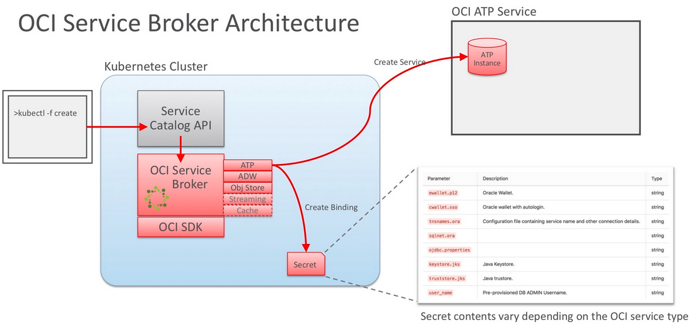

# Service Broker and ATP

## Introduction



Estimated Lab Time: n minutes

### Objectives

In this lab, you will:
* Install Service Catalog
* Deploy OCI Service Broker
* Provision ATP
* Bind to Created ATP (wallet auto-creation)
* Deploy catalogue app

### Prerequisites

* An Oracle Free Tier, Always Free, Paid or LiveLabs Cloud Account
* Lab:  Deploy Mushop

## Task 1: Install Service Catalog and Create Credentials

1.  Good news! You already installed svc-cat/catalog as part of the umbrella chart during setup. Verify that the chart was installed.
   
    ````
    <copy>
    kubectl get pod -A -l chart=catalog-0.3.0
    </copy>
    ````
2.  If the service catalog is installed, proceed to Step 2.  If it **is not installed**, follow the subsequent steps to proceed.
3.   Create namespace for supporting services
   
    ````
    <copy>
    kubectl create namespace mushop-utilities
    </copy>
    ````

4.   Add the Kubernetes Service Catalog helm repository
   
    ````
    <copy>
    helm repo add svc-cat https://svc-catalog-charts.storage.googleapis.com
    </copy>
    ````
5. Install the Kubernetes Service Catalog helm chart.
  
    ````
    <copy>
    helm install catalog svc-cat/catalog --namespace mushop-utilities 
    </copy>
    ````

    *Note:* The above command will deploy the OCI Service Broker using an embedded etcd instance. It is not recommended to deploy the OCI Service Broker using an embedded etcd instance and tls disabled in production environments, instead a separate etcd cluster should be setup and used by the OSB. The open source etcd operator project or a commercial offering may be used to setup a production quality etcd cluster. The recommended setup can be found [here](https://github.com/oracle/oci-service-broker/blob/master/charts/oci-service-broker/docs/installation.md#recommended-setup)

6.  The OCI Service Broker for Kubernetes requires tenancy credentials to provision and manage services and resources. Create a secret containing these values.  Replace these values with your actual values.
   
    ````
    kubectl create secret generic oci-credentials \
      --namespace mushop-utilities \
      --from-literal=tenancy=<TENANCY_OCID> \
      --from-literal=user=<USER_OCID> \
      --from-literal=region=<USER_OCI_REGION> \
      --from-literal=fingerprint=<PUBLIC_API_KEY_FINGERPRINT> \
      --from-literal=passphrase=<PRIVATE_API_KEY_PASSPHRASE> \
      --from-file=privatekey=<PATH_OF_PRIVATE_API_KEY>

    ````
    *Note:* The account used must have sufficient policies in IAM to manage resources provisioned with Service Broker 

   
## Task 2: Add OCI Service Broker and Register Cluster Broker
Next, deploy the OCI service broker on your cluster. This is done with the Oracle OCI Service Broker helm chart.


1.  Enter the command below to install the oci broker using *helm*
   
    ````
    <copy>
    helm install oci-broker https://github.com/oracle/oci-service-broker/releases/download/v1.5.0/oci-service-broker-1.5.0.tgz \
      --namespace mushop-utilities \
      --set ociCredentials.secretName=oci-credentials \
      --set storage.etcd.useEmbedded=true \
      --set tls.enabled=false
    </copy>
    ````
    *Note:* the secretName=oci-credentials secret created before. 

2. Establish the link between Service Catalog and the OCI Service Broker implementation by creating a ClusterServiceBroker resource. Create file *oci-service-broker.yaml* with the following:

    ````
    <copy>
    apiVersion: servicecatalog.k8s.io/v1beta1
    kind: ClusterServiceBroker
    metadata:
      name: oci-service-broker
    spec:
      url: http://oci-broker.mushop-utilities:8080
    </copy>
    ````
3. Run the create command on the file you just created
  
    ````
    <copy>
    kubectl create -f oci-service-broker.yaml
    </copy>
    ````

## Task 3: Verify Service Broker

1. Verify that the Service Broker is available and ready by running the command below
   
    ````
    <copy>
    kubectl get clusterservicebrokers -o 'custom-columns=BROKER:.metadata.name,STATUS:.status.conditions[0].reason'
    </copy>
     ````   
2. Review the status, service and plans available.
  
    ````
    <copy>
    kubectl get clusterservicebrokers
    kubectl get clusterserviceclasses -o=custom-columns=CLASS:.spec.externalName,DESCRIPTION:.spec.description,CLASS\ ID:.metadata.name
    kubectl get clusterserviceplans -o=custom-columns=PLAN:.spec.externalName,DESCRIPTION:.spec.description,CLASS\ ID:.spec.clusterServiceClassRef.name`
    </copy>
     ````   

## Task 4: Provision ATP
Follow the steps outlined here to provision an ATP instance and resolve a binding secret with its DB Connection Wallet.

*Note:* The sample files in this exercise are using plain password instead of secrets for the sake of simplicity.

For detailed instructions on how to use proper secrets, please refer to the MuShop source repo, under src/catalogue/kubernetes/ folder.  

Resources provisioned (or claimed) by Service Broker are called Service Instances. 

1. Create an ATP Service Instance by first creating the file catalogue-oadb-instance.yaml with the following contents.  Use vi to create the file.

    ````
    <copy>
    vi catalogue-oadb-instance.yaml
    </copy>
    ````
2. Enter the file information below and click **:w** to save.
  
    ````
    <copy>
    apiVersion: servicecatalog.k8s.io/v1beta1
    kind: ServiceInstance
    metadata:
      name: catalogue-db-dev
    spec:
      clusterServiceClassExternalName: atp-service
      clusterServicePlanExternalName: standard
      parameters:
        name: "MuShop Catalogue DB - dev"
        compartmentId: #[target compartment id. e.g.: ocid1.compartment.oc1..aaaaaaa...]
        dbName: cataloguedev
        cpuCount: 1
        storageSizeTBs: 1
        password: s123456789S@
        licenseType: BYOL
        autoScaling: false
    </copy>
    ````

3.  Use *kubectl* to create the instance using the yaml file you just created.

      ````
      <copy>
      kubectl create -f catalogue-oadb-instance.yaml
      kubectl get serviceinstances
      </copy>
      ````

## Task 5: Service Binding

When Service Instances finish Provisioning, secrets in the form of a *ServiceBinding* will be created, and become available for application use.

1.  Use vi to create a file named catalogue-oadb-binding.yaml. 

    ````
    <copy>
    vi catalogue-oadb-instance.yaml
    </copy>
    ````

2. Enter the file information below and click **:w** to save.

    ````
    <copy>
    apiVersion: servicecatalog.k8s.io/v1beta1
    kind: ServiceBinding
    metadata:
      name: catalogue-oadb-wallet-binding
    spec:
      instanceRef:
        name: catalogue-db-dev
      parameters:
        walletPassword: "Welcome_123"
    </copy>
    ````

3. Use kubectl to create the wallet binding.

    ````
    <copy>
    kubectl create -f catalogue-oadb-binding.yaml
    kubectl get servicebindings
    </copy>
    ````

4. Once the binding shows READY, a secret will also be available. For ATP, this secret is in the form of a Base64 encoded DB Connection Wallet:
    
    ````
    <copy>    
    kubectl get secret catalogue-oadb-wallet-binding -o yaml
    </copy>
    ```` 

## Task 6: Run MuShop

A new ATP instance is now ready and available. The next step is to configure access secrets, and (re)deploy the application.

*Note:* it is assumed that a MuShop chart configuration: myvalues.yaml already exists. 

1.  If applicable, remove a previous deployment.  If no previous deployment, skip to #2.
   
    ````
    <copy>  
    helm delete mushop
    </copy>
    ```` 

2.  Create catalogue-oadb-admin secret.
   
    ````
    <copy>  
    kubectl create secret generic catalogue-oadb-admin \
      --from-literal=oadb_admin_pw='s123456789S@'
    </copy>
    ```` 

3. Define catalogue-oadb-connection secret.
   
    ````
    <copy>  
    kubectl create secret generic catalogue-oadb-connection \
      --from-literal=oadb_service=cataloguedev_tp \
      --from-literal=oadb_user=CATALOGUE_USER  \
      --from-literal=oadb_pw='default_Password1'
    </copy>
    ```` 
    
4. From the source code, traverse into the helm chart deployment directory
   
    ````
    <copy>  
    cd deploy/complete/helm-chart
    </copy>  
    ````


5. Deploy MuShop with a flag indicating that the catalogue service is using an OCI Service Broker binding: --set catalogue.osb.atp=true

    ````
    <copy>  
    helm install mushop mushop \
      --set catalogue.osb.atp=true \
      -f myvalues.yaml
    </copy>  
    ````

## Task 7: Under the Hood

Once again, the use of helm adds some mystery to the ultimate deployment of the catalogue service. Inspect the following for additional information. 

1.  Inspect the catalogue deployment:

    ````
    <copy>  
    kubectl get deploy mushop-catalogue -o yaml
    </copy>  
    ````
2.  Inspect the db init pod (name will vary)
   
    ````
    <copy>  
    kubectl logs mushop-catalogue-1.2-init-d475m
    </copy>  
    ````

3. Remove previous deployment (if applicable).
   
    ````
    <copy>  
    helm delete mushop
    </copy>  
    ````

## Task 8: Full Automation

1. The processes contained in this exercise may be automated through the use of another helm chart included in the repo.
   
    ````
    <copy>  
    deploy/complete/helm-chart/provision
    </copy>  
    ````

2. The provision chart includes:

      - OCI Service Broker API Secret
      - OCI ClusterServiceBroker
      - Global ATP Instance/Binding
      - Optional service-specific instance(s)
      - Auto-generated *-oadb-admin secrets
      - Auto-generated *-oadb-connection secrets


3. Provision instance(s) and binding(s).  Replace COMPARTMENT_OCID with the Oracle Cloud ID for your compartment.

    ````
    <copy> 
    helm install provision provision \
      --set skip.clusterBroker=true \
      --set global.osb.oss=false \
      --set global.osb.objectstorage=false \
      --set global.osb.compartmentId=</copy><COMPARTMENT_OCID>
    ````

4.  Wait for servicebindings to be READY.
   
    ````
    <copy> 
    kubectl get servicebindings -A
    </copy>  
    ````
5. Deploy MuShop again, now indicating the use of Service Broker ATP backing:

    ````
    <copy> 
    helm install mushop mushop \
      --set global.osb.atp=true \
      --set tags.streaming=false
    </copy>  
    ````

You may now [proceed to the next lab](#next).

## Learn More

[Kubernetes Service Catalog](https://svc-cat.io/)
[Open Service Broker API](https://www.openservicebrokerapi.org/)
[Github: OCI Service Broker](https://github.com/oracle/oci-service-broker)
[Adding OCI Service Broker for Kubernetes to Clusters](https://docs.cloud.oracle.com/iaas/Content/ContEng/Tasks/contengaddingservicebrokers.htm)

## Acknowledgements
* **Author** - Adao Junior
* **Contributors** -  Kay Malcolm, DB Product Management
* **Last Updated By/Date** - October 2020


## Need Help?
Please submit feedback or ask for help using our [LiveLabs Support Forum](https://community.oracle.com/tech/developers/categories/livelabsdiscussions). Please click the **Log In** button and login using your Oracle Account. Click the **Ask A Question** button to the left to start a *New Discussion* or *Ask a Question*.  Please include your workshop name and lab name.  You can also include screenshots and attach files.  Engage directly with the author of the workshop.

If you do not have an Oracle Account, click [here](https://profile.oracle.com/myprofile/account/create-account.jspx) to create one.
