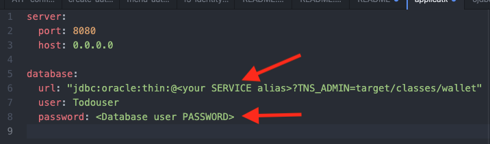
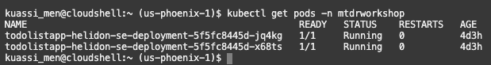

# Deploy the Backend Docker Image to Kubernetes

## Introduction

In this lab, you will deploy the pre-built Helidon Java backend Docker image to OKE, then configure the API Gateway.

Estimated time: 25 minutes

Watch the video below for a quick walk through of the lab.

[](youtube:Th7YCV6e8CE)

### Understand the Java backend application

As with most React applications (https://reactjs.org/), this application uses remote APIs to handle data persistence. The backend implements five REST APIs including:

* Retrieving the current list of todo items
* Adding a new todo item
* Finding a todo item by its ID
* Updating an existing todo item
* Deleting a todo item

The APIs are documented using Swagger at http://130.61.67.158:8780/swagger-ui/#/.

The backend is implemented using the following Java classes (under ./backend/src/...):

* Main.java: starts and configures the main entry points
* ToDoItem.java: maps a Todo Item instance to and from the JSON document
* ToDoItemStorage.java: stores the Todo item in a persistent store that is the Oracle Autonomous database
* ToDoListAppService.java: implements the Helidon service and exposes the REST APIs


### Objectives

* Set values for environment variables
* Build and deploy the Docker image of the application
* Deploy the image on the Oracle Kubernetes Engine (OKE)
* Describe the steps for undeploying
* Configure the API Gateway
* Test the backend application

### Prerequisites

* This lab requires the completion of the **Setup Dev Environment** tutorial and the provision of the Orace Cloud Infrastructure (OCI) components.

## Task 1: Set values for workshop environment variables

1. Set the root directory of the workshop.

    ``` bash
    <copy>export MTDRWORKSHOP_LOCATION=~/mtdrworkshop</copy>
    ```

2. Run `source addAndSourcePropertiesInBashrc.sh`.
The following command will set the values of environment variables in `mtdrworkshop.properties` and source `~/.bashrc`.

    ``` bash
    <copy>cd $MTDRWORKSHOP_LOCATION; source addAndSourcePropertiesInBashrc.sh</copy>
    ```

## Task 2: Build and push the Docker images to the OCI Registry

1. Ensure that the "DOCKER\_REGISTRY" variable is set.

    ``` bash
    <copy>echo $DOCKER_REGISTRY</copy>
    ```

    It should look like the following example:
    `<region-key>.ocir.io/<object-storage-namespace>/<firstname.lastname>/<repo-name>`.
    If the variable is not set or is an empty string, the push will fail (but the docker image will be built).

2. Unzip the wallet.zip under the `~/mtdrworkshop/backend/target/classes/wallet` directory.

    ``` bash
    <copy>cd ~/mtdrworkshop/backend/target/classes/wallet; unzip ~/mtdrworkshop/setup-dev-environment/wallet.zip</copy>
    ```

3. Copy the `mtdrdb_tp` alias (see the list of aliases in
./backend/target/classes/wallet/tnsnames.ora).


4. Edit \~/mtdrworkshop/backend/target/classes/application.yaml to set the database service and user password.


5. Copy the edited application.yaml to ./backend/src/main/resources/application.yaml.

    ``` bash
    <copy>cp ~/mtdrworkshop/backend/target/classes/application.yaml ~/mtdrworkshop/backend/src/main/resources/application.yaml</copy>
    ```

6. Edit \~/mtdrworkshop/backend/src/main/java/com/oracle/todoapp/Main.java.

7. Locate the following code fragment.


8. Replace `eu-frankfurt-1` in `https://objectstorage.eu-frankfurt-1.oraclecloud.com` with your region.

    \* Hint: your region id is displayed in the cloud shell prompt, between parenthesis, as in: joe@cloudshell:classes (**us-phoenix-1**)$

9. Save the file.

10. Run `build.sh` script to build and push the
microservices images into the repository.

    ``` bash
    <copy>cd $MTDRWORKSHOP_LOCATION/backend; ./build.sh</copy>
    ```

    In a few minutes, you would have successfully built and pushed the images into the OCIR repository.

11. Check your container registry **from the root compartment**.
Go to the Oracle Cloud Console, click the navigation menu in the top-left corner and open **Developer Services** then **Container Registry**.


12. Mark **Access** as **Public** (if **Private**).

13. From the Actions drop-down list, select **Actions** and **Change to public**.


## Task 3: Deploy on Kubernetes and Check the Status

1. Run the `deploy.sh` script.

    ```
    <copy>cd $MTDRWORKSHOP_LOCATION/backend; ./deploy.sh</copy>
    ```

    
2. Check the status using the following command; it returns the Kubernetes service of MyToDo application with a load balancer exposed through an external IP address.
    
    **$ kubectl get services**

    Repeat the command until the External IP address is shown.

    ``` bash
    <copy>kubectl get services</copy>
    ```

    
3. The following command displays the list of PODs.
    
    **$ kubectl get pods**

    ``` bash
    <copy>kubectl get pods</copy>
    ```
    

    If the Docker image cannot be retrieved from the registry, you may see  an `ImagePullBackOff` error; in that case, you need to check that the OCR repository is Public then Undeploy the re-deploy.

4. Use the following command to continuously tail the log of one of the PODs.
    
    **$ kubectl logs -f**

    ``` bash
    <copy>kubectl logs -f <POD-name></copy>
    ```

    **Example:** kubectl logs -f todolistapp-helidon-se-deployment-7fd6dcb778-c9dbv

    Returns http://130.61.66.27/todolist

5. Test end to end from the OKE cluster to the Autonomous database.

    ``` bash
    <copy>curl http://155.248.198.248/todolist</copy>
    ```

    ```
    You should see the record you have created in Lab 1 after the database creation.
    ```

* In **Cloud Shell**, issue the following command (replace the IP address with the **External IP** of your OKE cluster).
    
    **$ kubectl logs -f**

## Task 4: UnDeploy (Only if you must Re-Deploy)

If you make changes to the image, then you need to delete the service and the pods by running undeploy.sh, then redo the following tasks: **Build and push the Docker images to the OCI Registry** and **Deploy on Kubernetes and Check the Status**.

1. Run the `undeploy.sh` script.

    ``` bash
    <copy>cd $MTDRWORKSHOP_LOCATION/backend; ./undeploy.sh</copy>
    ```

2. Rebuild the image + Deploy + (Re)Configure the API Gateway

## Task 5: Configure the API Gateway

The API Gateway protects any RESTful service running on Container Engine for Kubernetes, Compute, or other endpoints through policy enforcement, metrics, and logging.
Rather than exposing the Helidon service directly, we will use the API Gateway to define cross-origin resource sharing (CORS).

1. From the navigation menu select **Developer Services** then under API Management, select **Gateways**.


2. Specify the `mtdrworkshop` compartment on the left side then click **Create Gateway**.


3. Configure the basic info: name, compartment, VCN, and Subnet.
    * VCN: pick the virtual circuit networks
    * Subnet: pick the public subnet starting with `oke-svclbsubnet-quick-mtdrworkshopcluster`
    
    Then click **Create Gateway**.

Observe that the ToDolist gateway has been successfully created.


4. Copy the OCID of the newly created Gateway.

In the following command, replace $Gateway\_OCID with the copied OCID and save it to the mtdrworkshopgatewayid.txt file.

    ``` bash
    <copy>echo $Gateway_OCID > ~/mtdrworkshop/workingdir/mtdrworkshopgatewayid.txt</copy>
    ```

5. Click **Deployments**.


6. Click **Create Deployment**.


7. Create a **ToDolist deployment**.


8. Configure the Basic info.


9. Configure CORS policies.

    * Allowed methods GET, POST, PUT, DELETE, and OPTIONS are all needed
    * CORS is a security mechanism that will prevent running application loaded from origin A from using resources from origin B
    * Allowed Origins is the list of all servers (origins) that are allowed to access the API deployment typically of a Kubernetes cluster IP. Replace **us-sanjose-1** by your region, and **155.248.198.248** by the **External IP** of your Kubernetes cluster

10. Configure the headers.

\* Click **Apply changes** to create the CORS policy.

11. Click **Next** to configure two routes.

    \* /todolist for the first two APIs: GET, POST, OPTIONS.
    
    
    \* After defining a route for `/todolist`, click **Another Route** to define a route for `/todolist/{id}` for the remaining three APIs: GET, PUT, DELETE.
    

\* After defining both routes, click **Next**, then click **Create**.

## Task 6: Test the backend application through the API Gateway

1. Navigate to the newly created Gateway Deployment Detail and copy the endpoint.


2. Test through the **API Gateway endpoint**.
Postfix the gateway endpoint with "/todolist" as shown in the following screenshot.


It should display the row you have created in **Setup Dev Environment**.

You may now **proceed to the next lab**.

## Acknowledgements

* **Author** - Kuassi Mensah, Dir. Product Management, Java Database Access
* **Contributors** - Jean de Lavarene, Sr. Director of Development, JDBC/UCP
* **Last Updated By/Date** - Arabella Yao,  Database Product Manager, October 2021