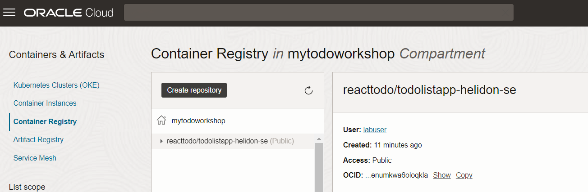
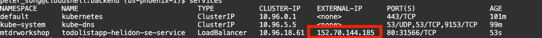
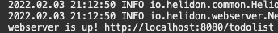
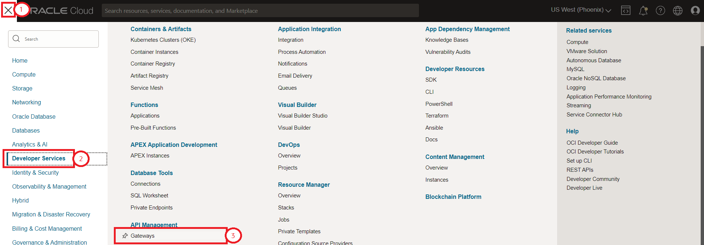
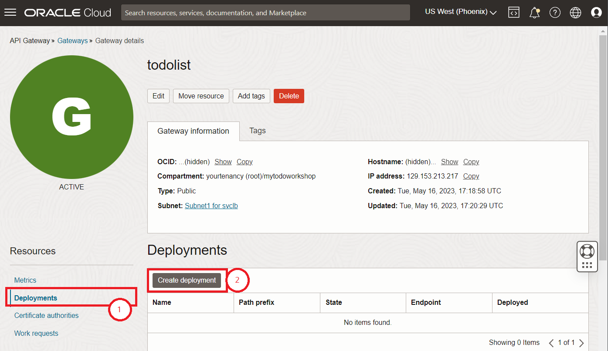
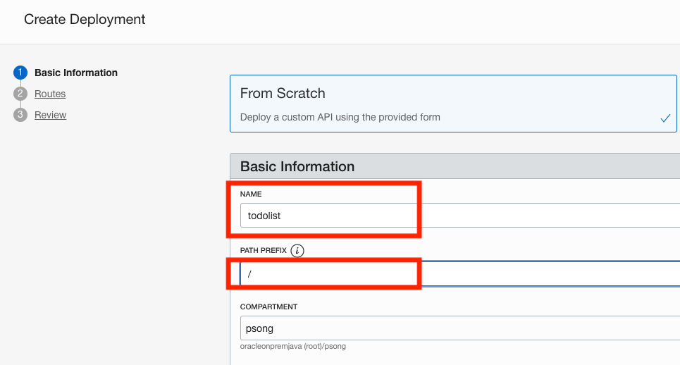
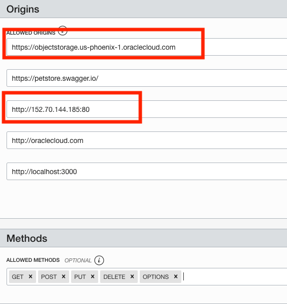
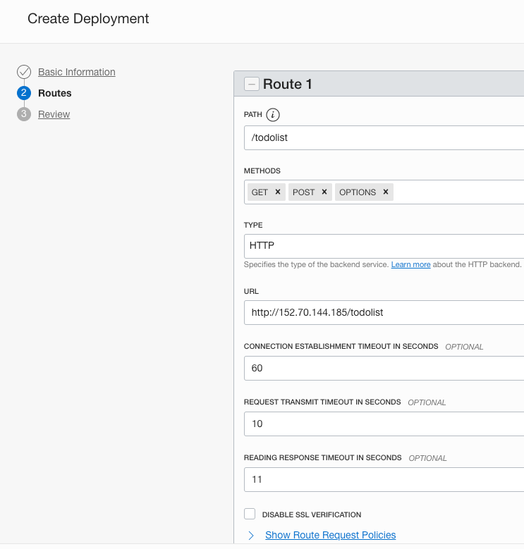
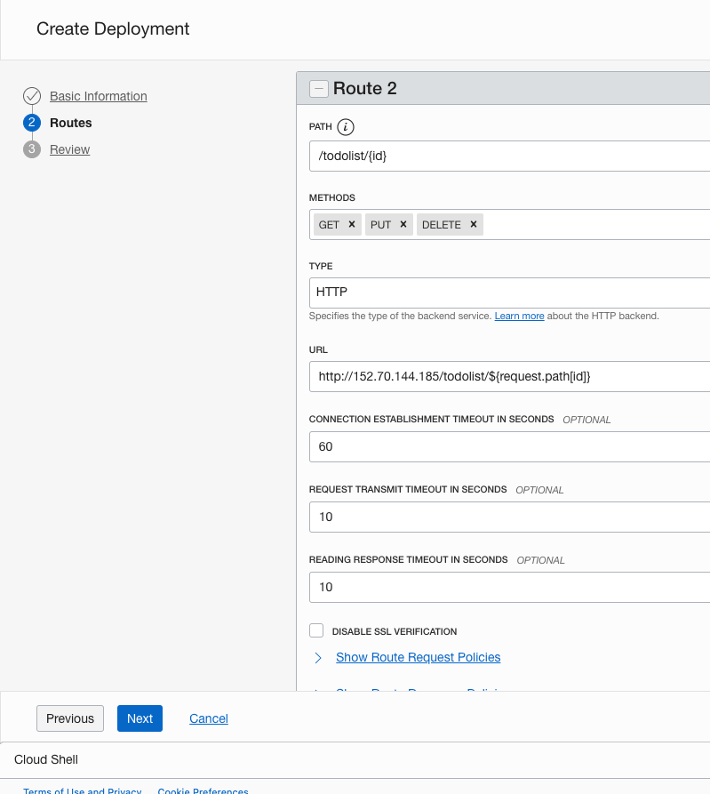
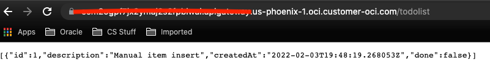

# Deploy the Backend Docker Image to Kubernetes

## Introduction

In this lab, you will build and deploy the pre-built Helidon Java backend Docker image to OKE, then configure the API Gateway.

Estimated time: 25 minutes

Watch the video below for a quick walk through of the lab.

[](youtube:Th7YCV6e8CE)

### Understand the Java backend application

As with most React applications (https://reactjs.org/), this application uses remote APIs to handle data persistence. The backend implements five REST APIs including:

* Retrieving the current list of todo items
* Adding a new todo item
* Finding a todo item by its ID
* Updating an existing todo item
* Deleting a todo item

The APIs are documented using Swagger. You can look it up at for the following address: https://bit.ly/3piu4cp in Swagger's console

The backend is implemented using the following Java classes (under ./backend/src/...):

* Main.java: starts and configures the main entry points
* ToDoItem.java: maps a Todo Item instance to and from the JSON document
* ToDoItemStorage.java: stores the Todo item in a persistent store that is the Oracle Autonomous database
* ToDoListAppService.java: implements the Helidon service and exposes the REST APIs


### Objectives

* Build and deploy the Docker image of the application
* Deploy the image on the Oracle Kubernetes Engine (OKE)
* Describe the steps for Undeploying
* Configure the API Gateway
* Test the backend application

### Prerequisites

* This lab requires the completion of the **Setup Dev Environment** tutorial and the provisioning of the Orace Cloud Infrastructure (OCI) components.

## **Task 1**: Build and Push the Docker Images to the OCI Registry

The OCI Container Registry is where your Docker images are managed. A container registry should have been created for you in Lab 1 in your compartment.

1. Edit ./backend/src/main/java/com/oracle/todoapp/Main.java

    - Locate the following code fragment

    
    - Replace `eu-frankfurt-1` in  `"https://objectstorage.eu-frankfurt-1.oraclecloud.com"` with your region

    - Save the file

This will allow the appropriate object storage bucket to access your application.

2. Run `build.sh` script to build and push the helidon-se image into the repository

    ```
    <copy>
    cd $MTDRWORKSHOP_LOCATION/backend
    ./build.sh
    </copy>
    ```
  In a couple of minutes, you should have successfully built and pushed the images into the OCI repository.

3. Check your container registry in your compartment
    - Go to the Console, click the hamburger menu in the top-left corner and open
    **Developer Services > Container Registry**.
   
    

## **Task 2**: Deploy on Kubernetes and Check the Status

1. Run the `deploy.sh` script

    ```
    <copy>
    cd $MTDRWORKSHOP_LOCATION/backend 
    ./deploy.sh
    </copy>
    ```

   If everything runs correctly the script will output something like the following. 

    


2. Check the status using the following commands

    The following command returns the Kubernetes service of MyToDo application with a load balancer exposed through an external API
        ```
        <copy>
        services
        </copy>
        ```
    This will run `kubectl get services` in the background, but the setup script creates aliases for ease of use. Wait till the external IP address is displayed.


3. The following command returns all the pods running in your kubernetes cluster:
    ```
    <copy>
    pods
    </copy>
    ```
This will run `kubectl get pods` in the background, but the setup script creates aliases for ease of use

  

5. You can tail the log of one of the pods by running:

    ```
    <copy>
    kubectl -n mtdrworkshop logs -f <pod name>
    </copy>
    ```

  $ kubectl logs -f <pod name>
  Example: `kubectl -n mtdrworkshop logs -f todolistapp-helidon-se-deployment-7fd6dcb778-c9dbv`

 

  If the logs return `webserver is up!` then you have done everything correctly.
## **Task 3**: UnDeploy (optional)

  If you make changes to the image, you need to delete the service and the pods by running undeploy.sh then redo Steps 2 & 3.

  1. Run the `undeploy.sh` script
    ```
    <copy>
    cd $MTDRWORKSHOP_LOCATION/backend
    ./undeploy.sh
    </copy>
    ```
  2. Rebuild the image + Deploy + (Re)Configure the API Gateway

## **Task 4**: Configure the API Gateway

The API Gateway protects any RESTful service running on Container Engine for Kubernetes, Compute, or other endpoints through policy enforcement, metrics and logging.
Rather than exposing the Helidon service directly, we will use the API Gateway to define cross-origin resource sharing (CORS).

The setup script already creates an API gateway, but you still need to create the deployments in the API gateway.

1. From the hamburger  menu navigate **Developer Services** > **API Management > Gateways**
   

2. Click on the todolist gateway that has been created for you 
   
   \- Click on Deployments on the left pane.

3. Create a todolist deployment by clicking create deployment
   

4. Fill out the basic information like so:

5. Configure Cross-origin resource sharing (CORS) policies.
  - CORS is a security mechanism that will prevent loading resources from unspecified origins (domain, scheme, or port).
  - Allowed Origins: is the list of all servers (origins) that are allowed to access the API deployment typically your Kubernetes cluster IP.
  - Replace the `.us-phoenix-1` portion with whichever region you replaced with in task 1.
  - Replace the 3rd IP address with the external IP address of your Load Balancer and postfix with `:80`
  - Allowed methods: GET, PUT, DELETE, POST, OPTIONS are all needed.

  To configure CORS, scroll down and click add next to CORS and fill in this information under allowed origins. These are the origins that can load resources to your application.

  

6. Configure the Headers and apply changes


7. Configure the routes: we will define two routes (for URL, replace 152.70.144.185 with the external IP address of your Load Balancer):
    - /todolist for the first two APIs: GET, POST and OPTIONS




    - /todolist/{id} for the remaining three APIs: (GET, PUT and DELETE)



Click **Next**, review, and **Create**


Wait a moment for the deployment to be created.
## **Task 5**: Testing the Backend Application Through the API Gateway

1. Navigate to the newly create Gateway Deployment Detail and copy the endpoint
   

2. Testing in a browser, through the API Gateway endpoint; postfix the gateway endpoint with "/todolist" as shown in the image below

   

  It should display the Todo Item(s) in the TodoItem table that was created during the setup.

You may now **proceed to the next lab**.

## Acknowledgements

* **Author** -  Kuassi Mensah, Dir. Product Management, Java Database Access, Peter Song Developer Advocate JDBC
* **Contributors** - Jean de Lavarene, Sr. Director of Development, JDBC/UCP
* **Last Updated By/Date** - Peter Song Developer Advocate  February 2022
