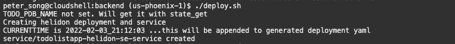
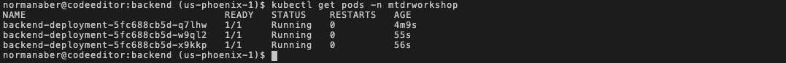
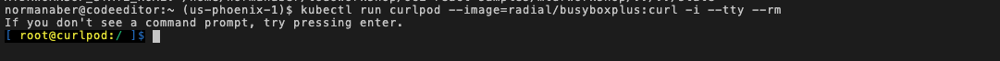

# Deploy the Backend Docker Image to Kubernetes

## Introduction

In this lab, you will build and deploy the pre-built Java backend (uses Helidon SE) into an image easily deployable to OKE, then finally test the backend application.

Estimated time: 25 minutes

Watch the video below for a quick walk through of the lab.

[](youtube:Th7YCV6e8CE)

### Understand the Java backend application

As with most React applications (https://reactjs.org/), this application uses remote APIs to handle data persistence. The backend implements five REST APIs including:

* `GET /api/todolist` - Get the current list of todo items
* `POST /api/todolist` - Post a new todo item
* `GET /api/todolist/:id` - Get a todo item by its ID
* `PUT /api/todolist/:id` - Update an existing todo item
* `DELETE /api/todolist/:id` - Delete a todo item

The backend is implemented using the following Java classes (under `./backend/src/...`):

* Main.java: starts and configures the main entry points
* ToDoItem.java: maps a Todo Item instance to and from the JSON document
* ToDoItemStorage.java: stores the Todo item in a persistent store that is the Oracle Autonomous database
* ToDoListAppService.java: implements the Helidon service and exposes the REST APIs

### Objectives

* Build and push the Docker image of the application to Oracle Container Registry (OCR)
* Deploy the application on the Oracle Kubernetes Engine (OKE)
* Test the backend application using curl
* Undeploy (optional)

### Prerequisites

* This lab requires the completion of the **Setup Dev Environment** tutorial and the provisioning of the Orace Cloud Infrastructure (OCI) components.

## Task 1: Build and Push the Docker Images to the OCI Registry

The OCI Container Registry is where your Docker images are managed. A container registry should have been created for you in Lab 1 in your compartment.


1. Run `build.sh` script to build and push the helidon-se image into the repository

	```
	<copy>
	cd $MTDRWORKSHOP_LOCATION/backend
	./build.sh
	</copy>
	```
	In a couple of minutes, you should have successfully built and pushed the backend image into the designated Oracle Container Registry. The `build.sh` script automates:

	1. Runs `mvn clean package` to remove previously generated build files and create the application JAR file
	2. Runs `docker build -t <image>:<tag> .` to build the application into the specified containerized image with the provided tag
	3. Runs `docker push <image>:<tag>` to push the image to Oracle Container Registry (OCR)


## Task 2: Deploy on Kubernetes and Check the Status

The deploy script takes the template YAML file that holds the specifications for the native Kubernetes objects related to the backend application: one (1) deployment and one (1) service. The script automates:

- Replaces the deployment `spec.template.spec.containers[0].image` with the proper container image name and tag

- Updates the environment variable that contains the database connection string and plugs in the proper database name

- Updates the region environment variable

- Runs `kubectl apply -f <generated-manifest-name>.yaml` to apply the generated YAML file to create the application deployment and service on your OKE cluster

To deploy the back-end container images on Kubernetes, 

1. Run the `deploy.sh` script

    ```
    <copy>
    cd $MTDRWORKSHOP_LOCATION/backend 
    ./deploy.sh
    </copy>
    ```

	If everything runs correctly the script will output something like the following. 

    


	To view the generated YAML file, you can run the following shell command: 
	`more $MTDRWORKSHOP_LOCATION/backend/manifest-*.yaml`


2. The following command returns all the pods running in your kubernetes cluster:
    
	```
    <copy>
    pods
    </copy>
    ```

	This alias is equivalent to `kubectl get pods -A`.

	

## Task 3: Test the backend application

To test the application, you will need to run a pod that will allow you to run `curl` commands to run REST API requests against the backend application in-cluster. To do so, you will temporarily run an image that enables us to make these curl requests.

1. Start a single instance of the curl image

	```bash
	<copy>
	kubectl run curlpod --image=radial/busyboxplus:curl -i --tty --rm
	</copy>
	```

	A command prompt should appear as shown below

	

2. Run a GET request against the backend API using curl within the pod, curlpod

	```bash
	<copy>
	curl http://backend-service.mtdrworkshop/api/todolist
	</copy>
	```

	The curl request makes a GET request against the backend-service in the mtdrworkshop namespace, against the `/api/todolist` endpoint and should return a response similar to the following output:

	<code>
	{"items":[{"id":1,"description":"Manual item insert","createdAt":"2023-08-25T19:36:52.701008Z","done":false}]}
	</code>

	You can make further requests within the pod (e.g. add a new item). When you are done testing the application, enter
	
	```bash
	<copy>
	exit
	</copy>
	```

## Task 4: Undeploy (Optional)

If you make changes to the image, you need to delete the service and the pods by running undeploy.sh then redo Steps 2 & 3.

1. Run the `undeploy.sh` script
    ```
    <copy>
    cd $MTDRWORKSHOP_LOCATION/backend
    ./undeploy.sh
    </copy>
    ```

2. Rebuild the image and deploy


You may now **proceed to the next lab**.

## Acknowledgements

* **Author** -  Kuassi Mensah, Dir. Product Management, Java Database Access, Norman Aberi, Developer Advocate JDBC
* **Contributors** - Jean de Lavarene, Sr. Director of Development, JDBC/UCP
* **Last Updated By/Date** - Norman Abering Developer Advocate  August 2023
