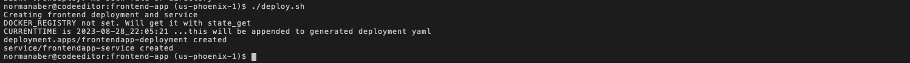

# Deploy the Frontend React JS Application

## Introduction

In this lab you will build and deploy the pre-built Next.JS application on Oracle Kubernetes Engine (OKE).

Estimated time: 15 minutes


### Understand the ReactJS Application

The application is simple; it uses "functional components" with "state hooks" for managing states. There is a main part called "Home," which renders components called NewItem and TodoItems. The NewItem component displays the text field for adding a new item and a button for adding. The TodoItem component provides a reusable component for displaying both complete and incomplete tasks with buttons to mark them either as done, to be deleted or to unmark as done.

The App part includes the items state ([]) which contains the list of todo items. When setItems is called with a new array of items, the part will re-render.

The App part also maintains the following states:

* "isLoading" is true when waiting for the Java tier to return the list of items. We use this state to display a spinning wheel while loading.
* "isInserting" is true when waiting for the Java tier to process a newly inserted item. The **Add** button will display a spinning wheel during this time.
* "error" stores the error messages received during the API calls.

The Next.js application can be run alone in development mode and is functional, however the tasks will only be temporary and the data will not be persisted elsewhere. Refreshing the browser will revert the application to its default states.

In production mode, the application will make requests against the todolist endpoint: `/api/todolist`.

### Objectives

In this lab, you will:

* Build and push a docker image of the frontend code to Oracle Container Registry (OCR)
* Deploy the container on the Oracle Kubernetes Engine (OKE)
* Undeploy (optional)


### Prerequisites
 
* This lab requires the completion of the **Setup Dev Environment** tutorial and the provisioning of the Orace Cloud Infrastructure (OCI) components.

## Task 1: Build and Push the Docker Images to the OCI Registry

The OCI Container Registry is where your Docker images are managed. A container registry should have been created for you in Lab 1 in your compartment for both the front-end and back-end applications.


1. Run `build.sh` script to build and push the Next.JS container image into the next-frontendapp repository.

	```
	<copy>
	cd $MTDRWORKSHOP_LOCATION/frontend-app
	./build.sh
	</copy>
	```
	In a couple of minutes, you should have successfully built and pushed the container image into the designated Oracle Container Registry. The `build.sh` script automates:

	1. Runs `docker build -t <image>:<tag> .` to build the application into the specified containerized image with the provided tag
	2. Runs `docker push <image>:<tag>` to push the image to Oracle Container Registry (OCR)

## Task 2: Deploy on Kubernetes and Check the Status

1. Run the `deploy.sh` script

    ```
    <copy>
    cd $MTDRWORKSHOP_LOCATION/frontend-app 
    ./deploy.sh
    </copy>
    ```

	If everything runs correctly the script will output something like the following. 

    

	The deploy script takes the template YAML file that holds the specifications for the native Kubernetes objects related to the backend application: one (1) deployment and one (1) service. The script automates:

	1. Replaces the deployment `spec.template.spec.containers[0].image` with the proper container image name and tag
	2. Runs `kubectl apply -f <generated-manifest-name>.yaml` to apply the generated YAML file to create the application deployment and service on your OKE cluster

	To view the generated YAML file, you can run the following shell command: `more $MTDRWORKSHOP_LOCATION/frontend-app/manifest-*.yaml`


3. View the created pods by running the following command, which returns all the pods running in your kubernetes cluster:
    
	```
    <copy>
    kubectl get pods -n mtdrworkshop
    </copy>
    ```

## Task 3: UnDeploy (Optional)

If you make changes to the image, you need to delete the service and the pods by running undeploy.sh then redo Steps 1 & 2.

1. Run the `undeploy.sh` script
    ```
    <copy>
    cd $MTDRWORKSHOP_LOCATION/frontend-app
    ./undeploy.sh
    </copy>
    ```

2. Rebuild the image and deploy

You may now **proceed to the next lab**.

## Acknowledgements

* **Authors**  Kuassi Mensah, Dir. Product Management, Java Database Access; Norman Aberin, Developer Advocate JDBC
* **Contributors**  Jean de Lavarene, Sr. Director of Development, JDBC/UCP
* **Last Updated By/Date**  Norman Aberin, August 2023