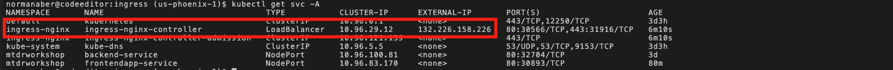
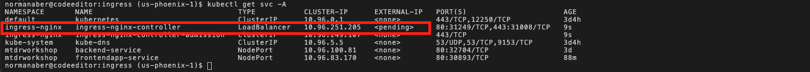
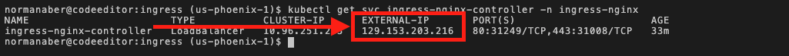
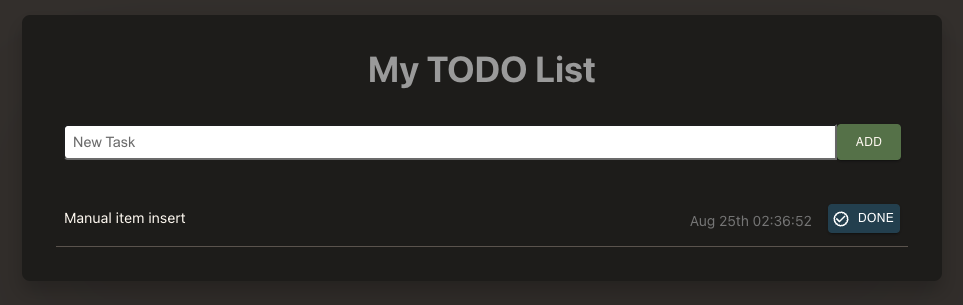

# Deploy Ingress

## Introduction
In this lab, you will install an ingress controller to enable external HTTP access to the application services in the cluster through a LoadBalancer.

To learn more about ingresses, and ingress-nginx, you can check their documentation available at: 
- About ingress-nginx: https://kubernetes.github.io/ingress-nginx/
- About ingresses in general: https://kubernetes.io/docs/concepts/services-networking/ingress/

Estimated time: 5 minutes

### Objectives
- Install ingress-nginx
- Deploy an Ingress resource
- Test the TODO List application

### Prerequisites
- Helm (pre-installed and included with Oracle Cloud Shell)

## Task 1: Install Ingress Controller

1. Run the following command to install `ingress-nginx`.

    Ingress nginx

    ```
    <copy>
    cd $MTDRWORKSHOP_LOCATION/ingress
    ./install.sh
    </copy>
    ```

2. Once installed, you can check the services to see if the following has been successfuly installed.

    ```bash
    <copy>
    kubectl get svc -A
    </copy>
    ```

    The above command should give similar results to either the following:

    The ingress-nginx-controller appears below with an external IP Address
    

    The ingress-nginx-controller appears below with a `<pending>` message under EXTERNAL-IP, in which the load balancer may still be being provisioned.
    

## Task 2: Deploy Ingress resource

1. Run the following `kubectl` command to create the rules for accessing the front-end and back-end services through HTTP

    ```
    <copy>
    cd $MTDRWORKSHOP_LOCATION/ingress && kubectl apply -f ingress.yaml
    </copy>
    ```

    The `ingress.yaml` file defines the mapping of requests against two different paths to our application services:
    - requests on the `/api/todolist` path are mapped to the back-end service named `backend-service`
    - requests on the `/` path are mapped to the front-end service named `frontendapp-service`


    The following text should appear as output, indicating that the resource todo-ingress has been created `ingress.networking.k8s.io/todo-ingress created`

2. You can view and retrieve the list of ingress resources in all namespaces

    ```bash
    <copy>
    kubectl get ingress -A
    </copy>
    ```


## Task 3: Test the TODO Application

Finally, to access and test the TODO-list application, you will need to get the Load Balancer's IP.

1. Retrieve the `EXTERNAL-IP` of the `ingress-nginx-controller` of type `LoadBalancer` to retrieve the IP Address to visit

    ```bash
    <copy>
    kubectl get svc ingress-nginx-controller -n ingress-nginx
    </copy>
    ```

    

2. Copy what appears under External-IP and paste it on your browser's address bar. The React application should appear with at least one task. This record was inserted during setup of the database tables.

    

3. Test the remaining REST APIs by:

    * creating a new task (POST) 
    * marking items as done (PUT)
    * deleting items that are done (DELETE)

## Acknowledgements

* **Authors** -  Norman Aberin, Developer Advocate JDBC
* **Original Author** - Norman Aberin, Developer Advocate JDBC
* **Last Updated By/Date** - Norman Aberin, August 2023
