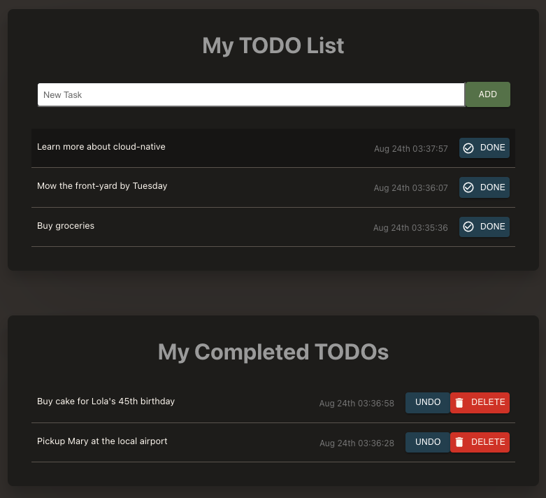

# Introduction

## About this Workshop

In this workshop, you will learn how to use Oracle Cloud Infrastructure (OCI) services to build and deploy a simple cloud native application using some of the most commonly-used frameworks in the industry.

Estimated Time: 50 minutes

### About Product/Technology

Learn how to use an Oracle Autonomous Database, the Oracle Container Registry (OCR) service, the Oracle Kubernetes Engine (OKE) service and GraalVM and deploy a simple todo-list application using Next.js, an open-source React framework, and Helidon SE, an open-source cloud-native ready microframework for writing Java microservices.

### Objectives

In this 3 parts workshop, you will:

* Provision all resources including: a Kubernetes cluster, a working network in the cloud, an Oracle Autonomous Database instance and container registries
* Understand, build, and deploy a Java tier implementing the REST APIs, using the Helidon SE framework, Docker, the OCI Container Registry, and a Kubernetes service
* Understand, build, and deploy a ReactJS frontend/UI making REST calls to the Helidon service implementing the REST APIs using the Next.js framework
* Understand and deploy an ingress controller on your Kubernetes cluster to make the application accessible through a Load Balancer on OCI

### Prerequisites

* An Oracle Free Tier or Paid Cloud Account
* Please refer to "Get Started"

You may now **proceed to the next lab**.

## Learn More

* [Deploying a Java Helidon Application](https://docs.oracle.com/en-us/iaas/developer-tutorials/tutorials/helidon-k8s/01oci-helidon-k8s-summary.htm)

## Acknowledgements

* **Author** - Kuassi Mensah, Dir. Product Management, Java Database Access; Norman Aberin, Developer Advocate, Java Database Access
* **Contributors** - Jean de Lavarene, Sr. Director of Development, JDBC/UCP
* **Last Updated By Date** - Norman Aberin, Developer Advocate, August 2023
