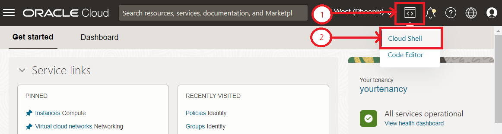

# Setup the development environment

## Introduction

In this lab, you will configure your development environment and collect information that will be used later throughout this workshop.

Estimated time: 30 minutes

Watch the video below for a quick walk through of the lab.

[](youtube:l6hEDTdOiEI)

### Objectives

* Launch the Cloud Shell
* Download the workshop code and scripts from GitHub
* Set up an Oracle Cloud Infrastructure (OCI) compartment and install a two-nodes Oracle Kubernetes Engine (OKE) cluster
* Create an Oracle Autonomous Transaction Procesing (ATP) database, the user schema, and a database table
* Install GraalVM
* Create an OCI Registry and an authentication key
* Access OKE from the Cloud Shell

### Prerequisites

* This lab requires an [Oracle Cloud account](https://www.oracle.com/cloud/free/). You may use your own cloud account, a cloud account that you obtained through a trial, a Free Tier account, or a LiveLabs account.

## Task 1: Launch the Cloud Shell and Clone mtdrworkshop GitHub repository

1. Launch the Oracle Cloud Shell.
	
	The Oracle Cloud Shell is a small virtual machine running a Bash shell that you access through the Oracle Cloud Console. It comes with a pre-authenticated Command Line Interface (CLI) pre-installed and configured, so you can immediately start working in your tenancy without spending time on its installation and configuration!
2. Click the Cloud Shell icon in the top-right corner of the Console.
	
3. Clone the GitHub repo and move up the `mtdrworkshop` directory.

	``` bash
	<copy>
	git clone https://github.com/oracle/oci-react-samples.git
	</copy>
	```

	``` bash
	<copy>
	cd ~/oci-react-samples; mv mtdrworkshop ..
	</copy>
	```

	

    You should now see `mtdrworkshop` in your root directory.

4. Change to `mtdrworkshop` directory.

	``` bash
	<copy>
	cd ~/mtdrworkshop
	</copy>
	```

5. Set the execution mode for all Shell scripts.

	``` bash
	<copy>chmod +x *.sh */*.sh</copy>
	```

> **Note:**

* The Cloud shell will disconnect after a certain period of inactiity
* If you are disconnected or logged off and return to Cloud shell, make sure you are back in the \~/mtdrworkshop directory

## Task 2: Create an OCI compartment and an OKE cluster in that compartment

1. Open up the navigation menu in the top-left corner of the Oracle Cloud Console. Select **Identity & Security**, then select **Compartments**.
	

2. Click your **root Compartment**.
	

3. Click **Create Compartment** with the following parameters, then click **Create Compartment**.
	
	
    * Compartment name: `mtdrworkshop`
    * Description: `My ToDo React workshop compartment`

4. Once the compartment is created, click the name of the compartment and then click **Copy** to copy the OCID.
	
	

5. Go back into your cloud shell and verify you are in the `mtdrworkshop` directory.

6. Run `./setCompartmentId.sh <COMPARTMENT_OCID> <REGION_ID>` where your `<COMPARTMENT_OCID>` and `<REGION_ID>` values are set as arguments.

	**For example**:
	`./setCompartmentId.sh ocid1.compartment.oc1..aaaaaaaaxbvaatfz6yourcomparmentidhere5dnzgcbivfwvsho77myfnqq us-ashburn-1`.
		

7. To create an OKE cluster, return to the OCI console and open up the navigation menu in the top-left corner of the Console and go to **Developer Services** and select **Kubernetes Clusters (OKE)**.
	

8. Make sure you are in the newly created compartment and click **Create Cluster**.
(Please use the default schema in the unlikely situation that the newly created compartment is not quickly visible on the left menu.)
	

9. Click **Quick Create**. It will create the new cluster along with the new network resources, such as virtual cloud network, internet gateway, NAT Gateway (NAT), regional subnet for worker nodes, and a regional subnet for load balancers. Click **Launch Workflow**.
	

10. Change the name of the cluster to `mtdrworkshopcluster`, accept all the other defaults, and click **Next** to review the cluster settings.
	
	Click **Create Cluster**.
	

11. Close the window once you can.
	

12. Once launched, it usually takes about 5 minutes or less for the cluster to be fully provisioned and the **Cluster Status** should show as **Active**.
	
	
    **Note:** There is no need to wait for the cluster to be fully provisioned at this point, as we will verify cluster creation and create a kubeconfig to access it in a later step.

## Task 3: Create the Autonomous Transaction Processing database, the TODOUSER, and the TODOITEM table

1. Open up the navigation menu in the top-left corner of the Oracle Cloud Console. Select **Oracle Database**, then click **Autonomous Transaction Processing**.
	

2. Click **Create Autonomous Database**.

	
    * Set the **Compartment**, **Display name**, and **Database name**
	* Set `MTDRDB` as the database name and the display name (that name is being used in future commands)
	* Set the workload type to **Transaction Processing**
    * Accept the default Deployment Type - **Shared Infrastructure**

3. Set the **ADMIN password, Network Access Type** and **License Type**.
	
    * Set the database ADMIN password (12 to 30 characters, at least one uppercase letter, one lowercase letter, and one number) and confirm.
    
	    Please write down the ADMIN password; it will be required later
	
	* Set the license type to **Bring Your Own License (BYOL)** (does not matter for this workshop)

    * Set the **Access type** to **Secure access from everywhere**
	

    
    * Click **Create Autonomous Database**

> **Note:** The database creation will take a few minutes.

4. Copy the **database OCID**  and replace $DBOCID with it in the following command to populate mtdrworkshopdbid.txt.

	

	``` bash
	<copy>echo $DBOCID > ~/mtdrworkshop/workingdir/mtdrworkshopdbid.txt</copy>
	```

5. Generate the wallet for your Autonomous Transaction Processing connectivity. A wallet.zip file will be created in the current directory.

	\* Copy the following command and replace `$DBOCID` with the copied **database OCID**.

	``` bash
	<copy>cd ~/mtdrworkshop/setup-dev-environment; ./generateWallet.sh $DBOCID</copy>
	```

	**Example:** `./generateWallet.sh ocid1.autonomousdatabase.oc1.phx.abyhqlj....`

	\* You will be requested to enter a password for wallet encryption. This password is separate from the ADMIN password, but you could reuse the same.

	\* Wait for a little moment while the command executes.

6. 
	Stay in the mtdrwokshop/setup-dev-environment directory and launch sql with /nolog option.
	Launch the sql utility in Cloud Shell.

	``` SQL
	<copy>sql /nolog</copy>
	```

	
		\* Point the tool at your wallet.zip file.

	``` sql
	<copy>set cloudconfig wallet.zip</copy>
	```

	``` sql
	<copy>show tns</copy>
	```

	

7. Connect to mtdrdb\_tp service as database ADMIN user (remember the password given to ADMIN above).

	``` sql
	<copy>connect ADMIN@mtdrdb_tp</copy>
	```

	
	
8. Create a TODOUSER with a strong password, using the sql utility.

	\* Suggest reusing the admin password, not a good practice in real life, but easy for this workshop.

	\* Replace the password **in quotes** in the following command.
	``` sql
	<copy> CREATE USER todouser IDENTIFIED BY "password" DEFAULT TABLESPACE data QUOTA UNLIMITED ON data;</copy>
	```

	\* After typing the `password` in the middle of the CREATE USER command, move the cursor to the end of the command, where the semicolon `;` is
	

	\* Grant some privileges to TODOUSER by executing the following command.

	``` sql
	<copy>grant create session, create view, create sequence, create procedure, create table, create trigger, create type, create materialized view to todouser;</copy>
	```

9. Connect as TODOUSER.

	``` sql
	<copy> connect todouser@mtdrdb_tp</copy>
	```

	
	\* Copy and paste the following command in the worksheet and execute it.

	``` sql	
	<copy>CREATE TABLE todoitem (id NUMBER GENERATED ALWAYS AS IDENTITY, description VARCHAR2(4000), creation_ts TIMESTAMP WITH TIME ZONE DEFAULT CURRENT_TIMESTAMP, done NUMBER(1,0), PRIMARY KEY (id)); 	
	</copy>
	```
	

10. Insert the first row, manually into TODOITEM table.

	``` sql
	<copy>insert into todoitem  (description) values ('Manual item insert');</copy>
	```

	\* Then commit the inserted row.

	``` SQL
	<copy>commit;</copy>
	```
<br>
	

	\* Execute "exit ;" after committing.

	``` SQL
	<copy>exit;</copy>
	```

## Task 4: Create an OCI Registry and a pre-authentication key

You are now going to create an Oracle Cloud Infrastructure (OCI) Registry and an Auth key. The OCI Registry is an Oracle-managed registry that enables you to simplify your development-to-production workflow by storing, sharing, and managing development artifacts such as Docker images.

1. Open up the navigation menu in the top-left corner of the console and go to **Developer Services** and select **Container Registry**.
	

2. Take note of the *Namespace* (for example, `axhpdrizd2ai` shown in the image below).
	

3. Click **Create Repository**. Specify the following details for your new repository, and click **Create repository**.
    * Repository name: `<tenancy name>/mtdrworkshop`
    * Access: `Public`
    

4. Go to Cloud Shell and run `./addOCIRInfo.sh` with the **namespace and repository name** as arguments.

	``` bash	
	<copy>cd ~/mtdrworkshop; ./addOCIRInfo.sh <namespace> <repository_name></copy>
	```

	**Example:** `./addOCIRInfo.sh axhpdrizd2ai treehacks01/mtdrworkshop`
	

5. You will now create the authentication token by going back to the User Settings page. Click the Profile icon in the top-right corner of the Oracle Cloud Console and select **User Settings**.
	

6. Scroll down, click **Auth Tokens** and select **Generate Token**.
	

7. In the **Description** field, type `mtdrworkshoptoken` and click **Generate Token**.
	

8. **Copy** the token value.
	

9. Go to Cloud Shell, at the workshop root directory, and run the
dockerLogin.sh scripts:
`./dockerLogin.sh <USERNAME> "<AUTH_TOKEN>"` where
    * `<USERNAME>`: the user name used to log in (typically your email address). If your user name is federated from Oracle Identity Cloud Service, then it is your Profile (with) `oracleidentitycloudservice/` prefix. 
	**Example:** `oracleidentitycloudservice/firstname.lastname@something.com`
    * `"<AUTH_TOKEN>"`: paste the generated token value and enclose the value in quotes.
    **Example:** `dockerLogin.sh user.foo@bar.com "8nO[BKNU5iwasdf2xeefU;yl"`

10. Once successfully logged into the Container Registry, we can list the existing docker images. Since this is the first time logging into Registry, no images will be shown.

	``` bash
	<copy>docker images </copy>
	```

## Task 5: Install GraalVM in Cloud Shell

We will be using the Java Development Kit (JDK) 11 in the Cloud Shell to build the Helidon image.

1. Set some environment variables and run the following commands.

	``` bash
	<copy>export MTDRWORKSHOP_LOCATION=~/mtdrworkshop</copy>
	```

	``` bash
	<copy>export WORKINGDIR=$MTDRWORKSHOP_LOCATION/workingdir</copy>
	```

	\*  Execute the following script.

	``` bash
	<copy>cd ~/mtdrworkshop/setup-dev-environment; ./installGraalVM.sh</copy>
	```

## Task 6: Access OKE from the Cloud Shell

1. Copy the **Cluster ID** from the Cloud console, then replace `$ClusterID` with it in the following command, and create the ~/mtdrworkshop/workingdir/mtdrworkshopclusterid.txt file.
**Alternatively**, you can first copy the clusterid and export it into the env variable ClusterID as in `export ClusterID=....`. 

	``` bash
	<copy>echo $ClusterID > ~/mtdrworkshop/workingdir/mtdrworkshopclusterid.txt</copy>
	```

2. Run `./verifyOKEAndCreateKubeConfig.sh`.

	```
	<copy>cd ~/mtdrworkshop; ./verifyOKEAndCreateKubeConfig.sh</copy>
	```

> **Note:** `/.kube/config` is created for the OKE cluster.
> 	

## Task 7: Configure Network Security Rules

1. The network security rules control the inbound (Ingress) and the outbound (Egress) traffic. As we will be configuring the API Gateway in Part II, we will not set tight security rules at the Kubernetes cluster level.

2. Navigate to **Developer Services** then select **Kubernetes Clusters (OKE)**.
	
    * Click **mtdrworkshopcluster**.

3. Click the VCN named starting with **oke-svclbsubnet-quick-mtdrworkshopcluster**.
	

4. Click the existing security list.
	

5. Add an **ingress rule**.
Set the Source CIDR as indicated (leave other fields as-is) and then click **Add Ingress Rules**.
	

6. Add an **egress rule**.
Set stateless and the Destination CIDR as indicated in the image (leave other fields as-is) and then click **Add Egress Rules**
	

You may now **proceed to the next lab**.

## Acknowledgements

* **Author** - Kuassi Mensah, Dir. Product Management, Java Database Access
* **Contributors** - Jean de Lavarene, Sr. Director of Development, JDBC/UCP
* **Last Updated By/Date** - Arabella Yao,  Database Product Manager, October 2021