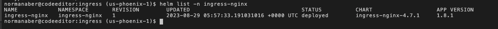

# Teardown workshop resources

## Introduction
In this lab, you will tear down the resources created in your tenancy and the directory in the Oracle Cloud shell

Estimated time: 10 minutes

### Objectives
- Delete the ingress controller
- Run destroy script
- Edit ~/.bashrc
- Delete the Compartment (optional)

### Prerequisites
- Have successfully completed the earlier labs

## Task 1: Delete the Ingress Controller

The deployment of Ingress controller creates a LoadBalancer on Oracle Cloud. You can delete the resource by deleting the controller.

1. You can view the controller installed by running the following command
    ```bash
    <copy>
    helm list -n ingress-nginx
    </copy>
    ```

    The above command should display a similar output:

    

1. Delete the Ingress controller by running the following:

    ```bash
    <copy>
    helm delete ingress-nginx -n ingress-nginx
    </copy>
    ```

## Task 2: Run the Destroy Script

1. Run the following command to delete the resources created in your tenancy. It will delete everything except the compartment, and may take several minutes to run.

    ```
    <copy>
    cd $MTDRWORKSHOP_LOCATION
    source destroy.sh
    </copy>
    ```
## Task 3: Delete the Directory

1. Once the destroy script is completed, delete the directory in your cloud shell where you installed the workshop

    ```
    <copy>
    cd $MTDRWORKSHOP_STATE_HOME/../.. && rm -rf <directory_name>
    </copy>
    ```

## Task 4: Edit ~/.bashrc

1. You need to remove the line you added to ~/.bashrc in Lab 1. Run the following command to remove

    ```
    <copy>
    vi ~/.bashrc
    </copy>
    ```

2. Once you're inside ~/.bashrc, find the line that ends with `/oci-react-samples/mtdrworkshop/env.sh` and delete the line (usually found at the bottom and is serving as an argument to `source`)

## Task 5: Delete the Compartment (optional)

If you let the setup provision a compartment in Lab 1, Task 5, you can choose to delete the provisioned compartment. 

1. In the Oracle Cloud Console, navigate to the **compartments** screen in the **Identity** section. Select the compartment that was created for the workshop (if you didn't provide one) and delete it

Congratulations! You have completed the workshop

## Acknowledgements

* **Authors** -  Kuassi Mensah, Dir. Product Management, Java Database Access; Norman Aberin, Developer Advocate JDBC
* **Original Author** - Richard Exley, Consulting Member of Technical Staff, Oracle MAA and Exadata
* **Last Updated By/Date** - Norman Aberin, August 2023
