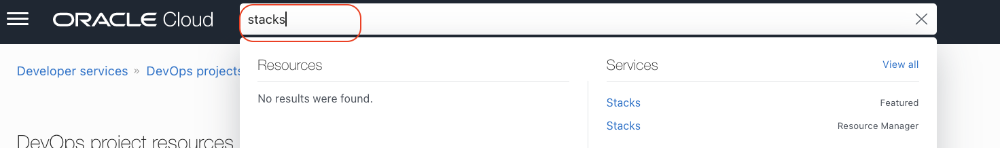
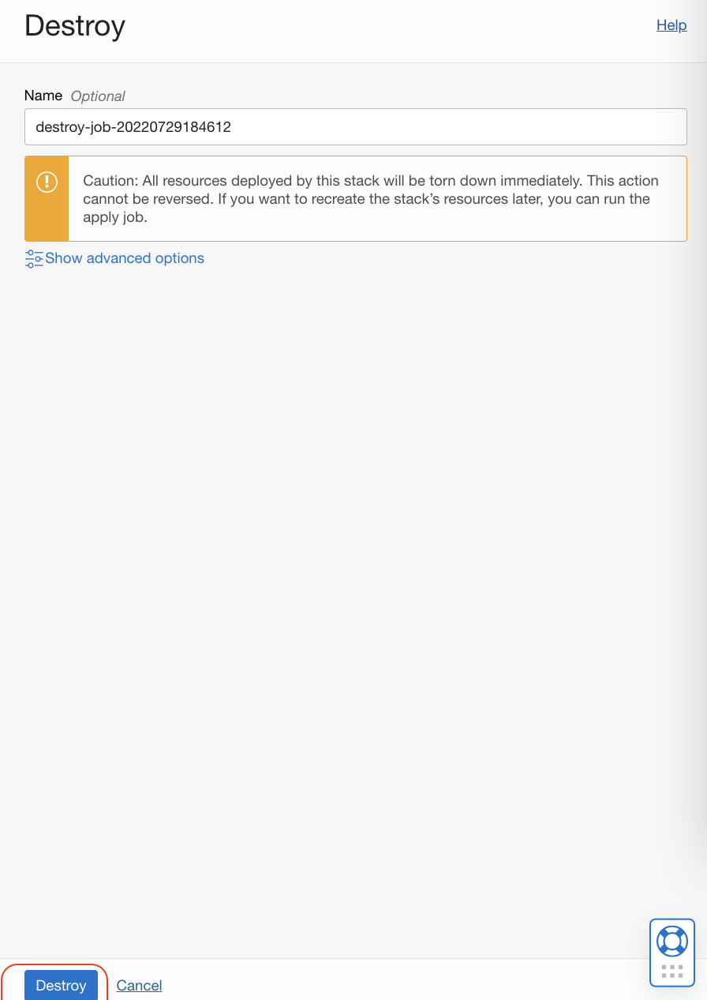
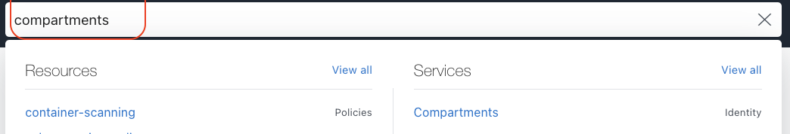

# Release resources created through the workshop

## Introduction

Congratulations, you complete the workshop. You may want to release the cloud resources created through this workshop. We first delete all resources using OCI Resource manager and  few of the manual ones 


Estimated Lab time: 30 minutes

### Objectives

In this lab, you will:

* Release Infrastructure Resources

### Prerequisites

* An Oracle Free Tier(Trial), Paid or LiveLabs Cloud Account
* GitHub account


##Task1: Release resources mannualy. 

As we have installed Nginx ingress controller on to OKE , this will create necessary load balancers.Since these resources are created out side of Oracle resource manager ,these must be cleaned manually .

1. Open `OCI Cloud shell`. Fetch all the ingress load-balancer IPs created by Nginx.

```markdown
kubectl get svc -n ingress-nginx

```
This should show two external IP address that we have created. If  you are seeing more than two and not sure , do check with the cluster admin or concerned team before removing it.Removal of ingress service will revoke the application access and it can cause outage.

    


2. Once confirmed , clean those two service controller by running below commands.

```markdown
kubectl delete svc ingress-nginx-controller -n ingress-nginx
kubectl delete svc ingress-nginx -n ingress-nginx
```
Each  command will take some seconds to a minute to finish the job.


##Task2: Delete the stack via OCI Resource manager.

The rest of the infra strecture components can remove via OCI ORM Jobs.

1. Type `stacks` on OCI Console search view and cliek on `Stacks Resource manager` via Services sub view.




2. Ensure you are on the `cicd` compartment and click on the `stack name` created earlier.

3. Click and `Destroy` option.


4. Validate the details (Stack,compartment) and provide the confirmation by click on `Destroy`.



It will start the delettion job and which is un attended.This would run for 20 to 30mnts.You check back the status of the job after a while.Incase of any error ,reffer the `Logs` to know more and act accordingly.The job will considerably long time in deleting notification topic and the architecture tag ,which is normal.


5. Once it completes the job  all our workshop related resources are cleaned using `Tenacy explore`.Type tenancy explore and select it from the services.


6. You will see some of the resources like  `DevOpsBuildPipelineStage` , `DevOpsBuildRun` ,`CustomerDnsZone` ,but the rest of all should be cleaned now . 

7. If there are no other resources and you dont need this compartment any more ,you can proceed to delete the `compartment` named `cicd`. Type `compartments` in the OCI Console search bar.Select `Compartments` from services window.



8. Click on the compartment name `cicd`. Use the option `delete` and delete the compartment


You may now **proceed to the next **.

## Acknowledgements

* **Author** - Rahul M R
* **Contributors** -  
* **Last Updated By/Date** - Rahul M R - July 2022
