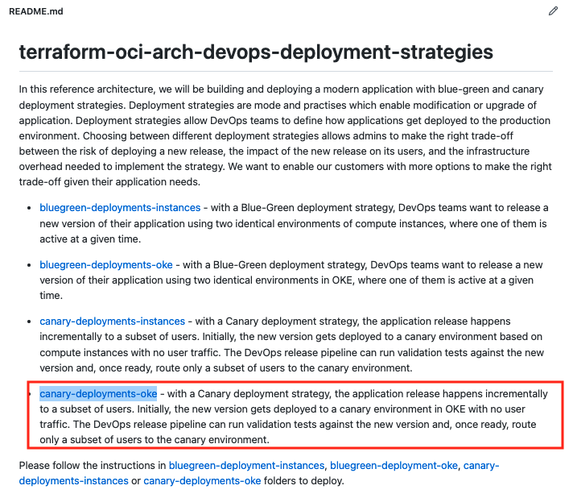
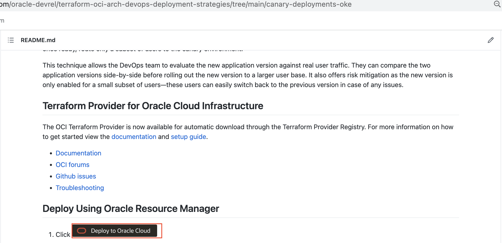
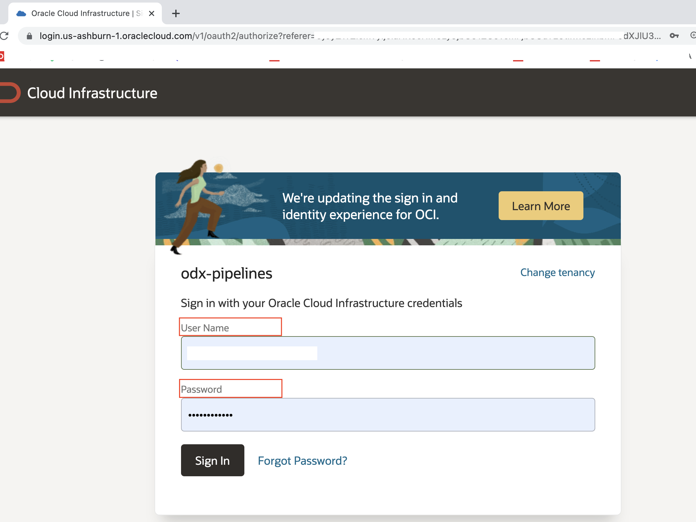
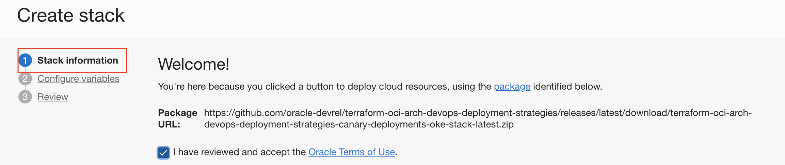
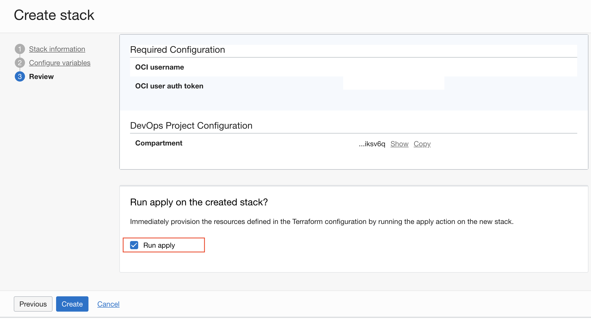
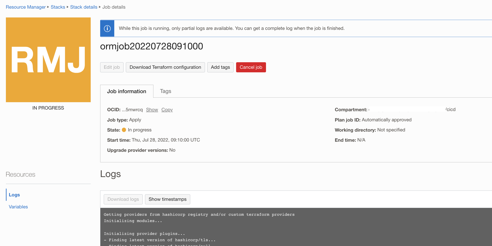

# Provision the Infrastructure using Resource Manager

## Introduction

In this lab exercise, you will provide all the Infrastructure resources used by your applications through Infrastructure As Code (IaC) using [Terraform](https://www.terraform.io) on [Oracle Cloud Infrastructure Resource Manager service (ORM)](https://docs.oracle.com/en-us/iaas/Content/ResourceManager/Concepts/resourcemanager.htm).

If you are not familiar with Terraform, this is an open-source tool that allows you to write infrastructure as code using declarative configuration files that will represent the state of your infrastructure. OCI Resource Manager allows you to share and manage Terraform configurations and state files across multiple teams and platforms. You can connect Resource Manager to your Git repository by setting up a Configuration Source Provider.

Estimated time: 40 minutes

### Objectives

In this lab, you will:

* Create an IAM compartment to isolate and organize your CI/CD cloud resources
* Create ORM Stack and configuration pointing to a git repository.
* Provision Infrastructure: Network, IAM, OCI Container registry, OCI OKE and, DevOps elements.

### Prerequisites

* An Oracle Free Tier(Trial), Paid or LiveLabs Cloud Account
* GitHub account
* User that belongs to the Administrator group or has granted privileges to manage multiple OCI resources (IAM, ORM, DevOps, OKE, Network, etc).

## Task 1: Create CICD Compartment

Compartments are used to organize and isolate your cloud resources. It is always recommended to carefully design your compartment structure and which groups will have access to them. In this lab exercise, we will create the `cicd` compartment for managing all resources created through the cicd pipeline. You can create [IAM Groups and Policies](https://docs.oracle.com/en-us/iaas/Content/Identity/Concepts/policygetstarted.htm) to control who has access to visualize/manage the resources in that compartment.

1. Go to Navigation Menu (aka "Hamburger" menu on the top left side of the page ) -> Identity & Security -> Identity -> Compartments

1. To create a compartment in the tenancy (root compartment) click Create Compartment.
   Otherwise, click through the hierarchy of compartments until you reach the detail page of the compartment in which you want to create the compartment. On the Compartment Details page, click Create Compartment.

1. Enter the compartment name and description and create a compartment:

## Task 2: Create a user access token

We will be creating *Auth Tokens* in this step. The same will be used while deploying the stack or creating new pull requests in the further steps.

1. Go to OCI Console > Identity & Security

   

2. Select Users under the Identity option.

   

3. Click the name of the respective OCI user.

4. From the left pane select Auth Tokens.

   

5. Click on Generate Token.
6. Give a description

   

7. Click on Generate Token.
8. Copy and save the token securely.

The token is essential for further steps, so save it securely and do not expose it as it has the same privilege as the user credentials.Read more [here](https://docs.oracle.com/en-us/iaas/Content/Identity/Tasks/managingcredentials.htm#Working)

## Task 3: Provision of the infrastructure

Oracle has published a [Reference Architecture](https://docs.oracle.com/en/solutions/build-cicd-pipelines-devops-function/) which contains a  [repository](https://github.com/oracle-devrel/terraform-oci-arch-devops-deployment-strategies) that contains Terraform templates and we will use them to automate the provisioning of OCI DevOps service and all target services/environments.

1. Open the [URL](https://github.com/oracle-devrel/terraform-oci-arch-devops-deployment-strategies) via browser.

   

2. The repository contains 4 reference architectures that explain various OCI DevOps deployment strategies. In this we will be using the reference architecture name . `canary-deployments-oke`
3. From the readme click the link [canary-deployments-oke](https://github.com/oracle-devrel/terraform-oci-arch-devops-deployment-strategies/tree/main/canary-deployments-oke)

   

4. We are going to use OCI Resource Manager (ORM) to provide the infrastructure. To do so click on the `Deploy to Oracle Cloud ` button within the `README`

   

5. Up on clicking this will take you to Oracle Cloud Console, when prompted use the appropriate tenancy & login details for the console. This will take you to the `Create stack ` page.

   

6. On the upper right-hand side, validate and ensure you are in the correct OCI region, where you wish to deploy the infrastructure.

   

7. On the `Create stack` page, read and accept the `Oracle Terms of Use

   
8. You will see the stack information as follows.

   

9. You may optionally give a custom name and description for the stack.

   

10. Select the compartment `cicd` for the drop-down for `Create in compartment` and click `Next`

    

11. Provide the `OCI Username` with the `Username` of your login. Follow the instruction to use it with federated logins and `OCI user auth token` with the user access token created in `Step 2`

    

12. Under the `DevOps Project Configuration` select the compartment `cicd`

    

13. For the rest of the variables, you can leave them as default or you may change them accordingly.
14. Click `Next` and move to the review page. On the `Run apply on the created stack` block, select `Run apply`, if it's not checked already. This will make the infrastructure plan and start creating them without additional manual action.

    

15. Click `Create`.
16. This will start with an `Apply for Job`.This would take around 20+ months to finish the job.

    

17. Wait until the application job gets completed. You may refer to `Logs` for more details.

    
    

Note: in case of quota/service limit/permission issues, Apply job will fail and partial resources will be provisioned. Click on the *Destroy* button will trigger the job to remove provisioned resources.

You may now **proceed to the next lab**.

## Acknowledgements

* **Author** - Rahul M R
* **Contributors** -
* **Last Updated By/Date** - Rahul M R, July 2022

