# Get to know OCI Devops and OCI Function resources.

## Introduction

In this lab you will be taking a close look of major OCI  resources ,which were provisioned in the previous lab of this series.The same included OCI Devops and OCI Function resources mentioned below.

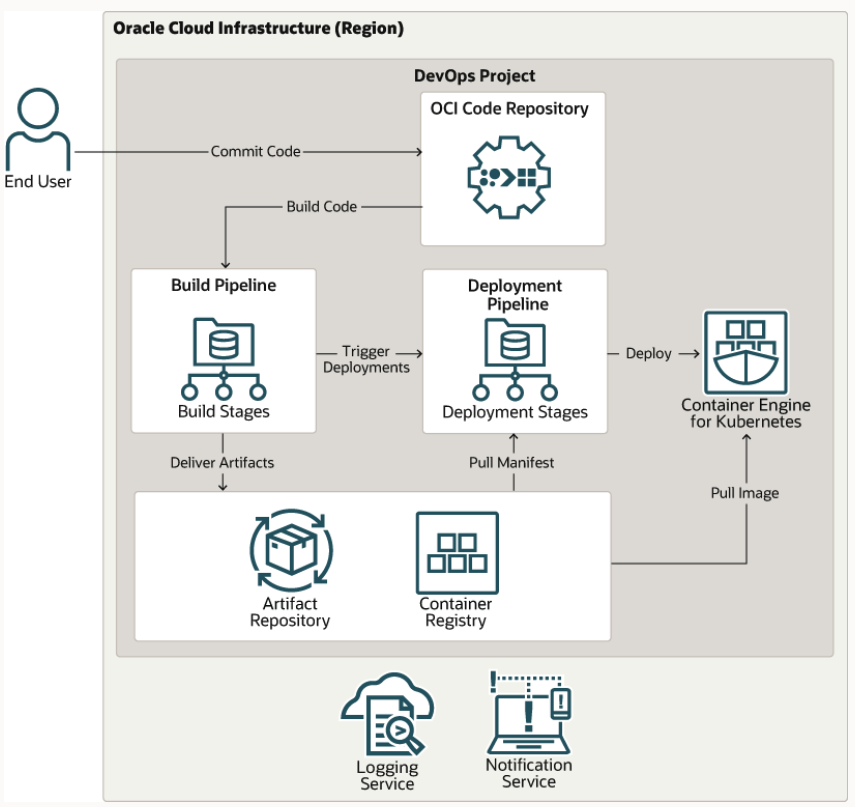


Estimated time: 30 minutes

### Objectives

In this lab, as a developer or SRE,

* Validate the OCI devops components.
* Validate the OCI function components.
* Do a manual build and deploy pipeline run.. 
* A manual function invokation and validate the outcome.

## Task 1: Validate the OCI devops components.

1. Go to Navigation Menu (aka "Hamburger" menu on the top left side of the page ) on the OCI Console -> Developer Services

    

1. Select Devops -> Project


    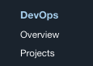


1. On the Project page ensure that you are on the right compartment ,in our case it should be `cicd`.

    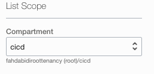

1. In the samepage you should see a project named as `oci-function-cicd-<Unique Key>-devops-project`,click on it.

    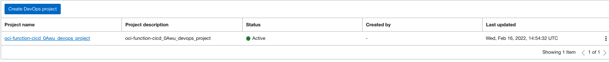


1. It will lead to a summary of all the devops resources that we created.

    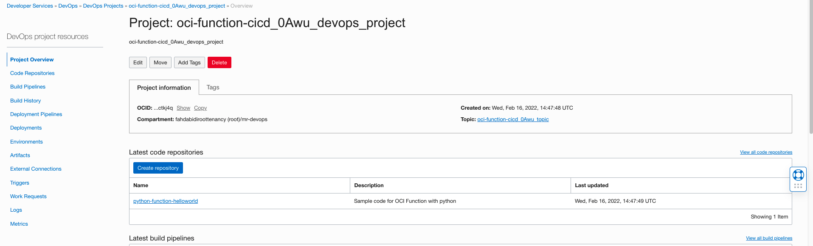

1. Click on the repository named `python-function-helloworld` under Latest code repositories.That will lead to the code repo and the python code which will be deployed to the functions.

    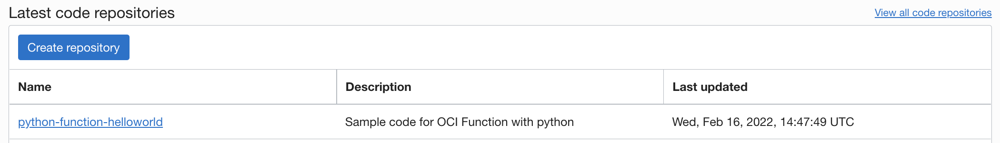

     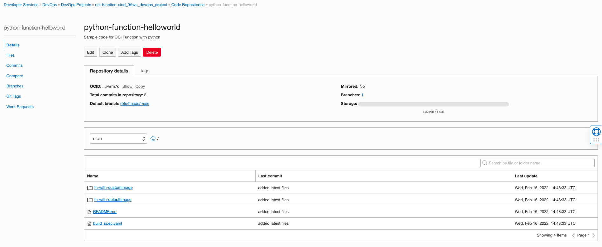

1. Open the file `build-spec.yaml` to know more about the build instructions.

    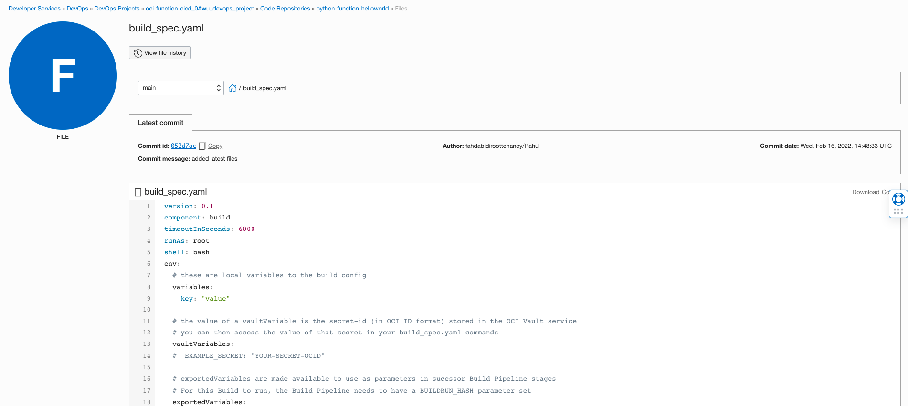

    Optional : You can check all the options in the code repo and read more about [OCI code repo here.](https://docs.oracle.com/en-us/iaas/Content/devops/using/managing_coderepo.htm)

1. Go back to the project overview page ,click on the Latest Build Pipeline named `Function-Python-Buildpipeline`.It will open up the build pipeline and show the different stages. 

    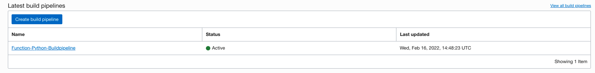

    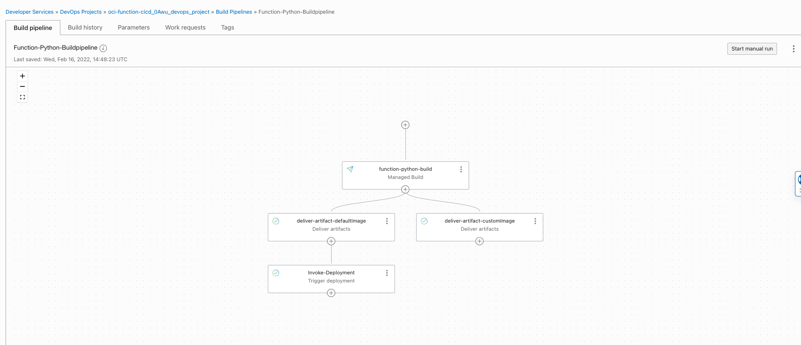

    Our build pipeline include 4 stages 

        function-python-build - Managed build stage to build the python code in to function container image.

        deliver-artifact-defaultImage - The stage to upload container images to OCI Container repo for default image.

        deliver-artifact-customImage - The stage to upload container images to OCI Container repo for custom image.

        Invoke-Deployment - It is the final stage to invoke a deployment once all the build and upload artiiacts are completed.


1. Click on 3 dots on each of the stage and can verify the details.

    


    Optional : Read more about OCI Build stages [here.](https://docs.oracle.com/en-us/iaas/Content/devops/using/managing_build_pipelines.htm)


1. Go back to the project overview page ,click on the Latest Deployment  Pipeline named `function-python-pipeline-<XXXX>`.It will open up the deployment  pipeline and show the different stages.

    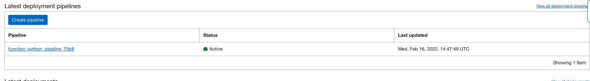
    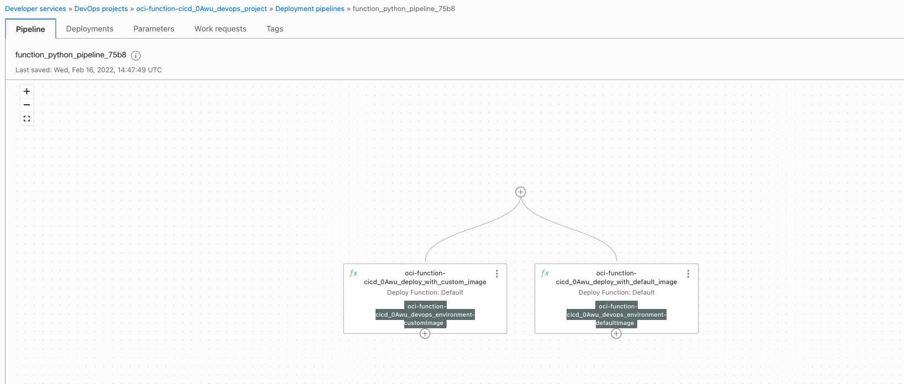

1. Click on the 3 dots on each of the deployment stage to get know more about the details .

    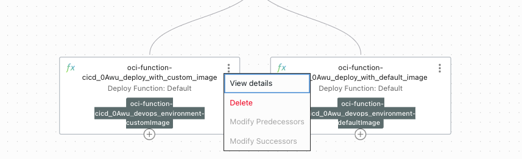

1. Click on the `Parameters` options on the top to see the paramters will be used with in the deployment stage

    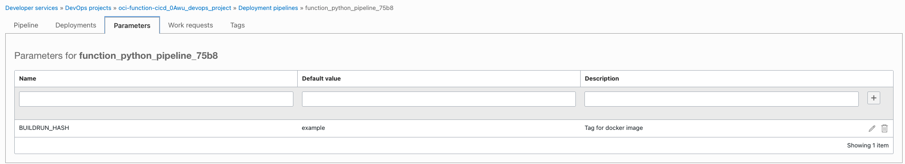

    The parameter `BUILDRUN-HASH` is the value that will be parsed from build pipeline which will be used as a docker container image tag for the upload and deployment of applications.

    Optional : Read more about OCI Deployment pipeline and deployment  stages [here.](https://docs.oracle.com/en-us/iaas/Content/devops/using/deployment_pipelines.htm)


1. Go back to the project overview page ,under the Latest environments.Click on each of the enviroments and view the details.

    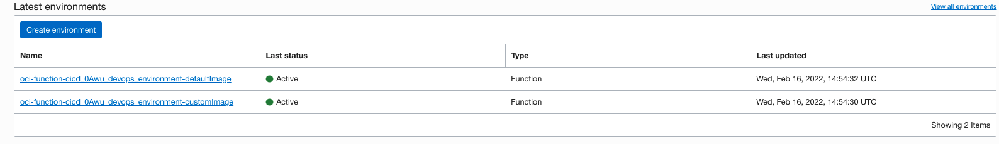

    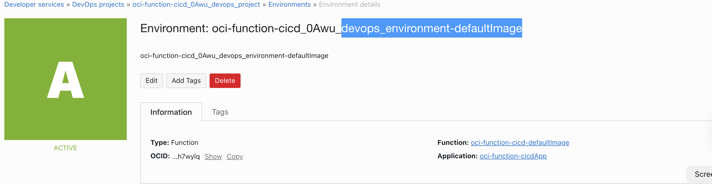

    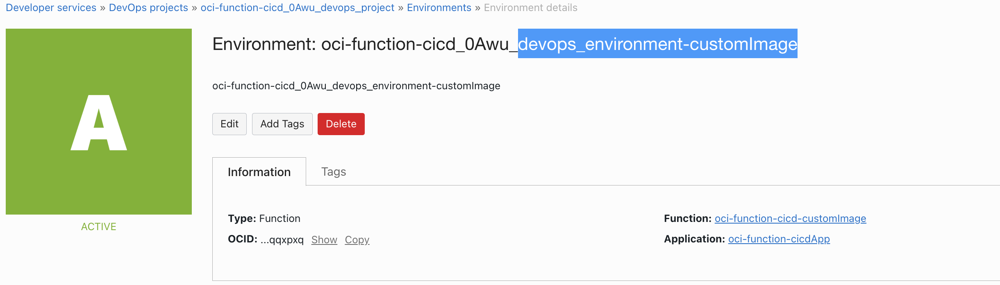

    Optional : Read more about devops project [here.](https://docs.oracle.com/en-us/iaas/Content/devops/using/environments.htm)

1. Go back to the project overview page ,under the Latest artifacts,click on each of the artifacts  

    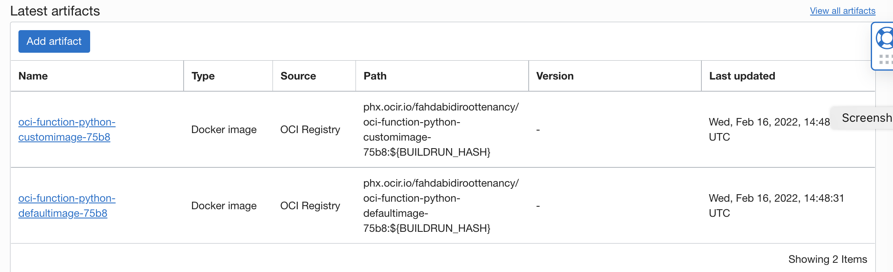

    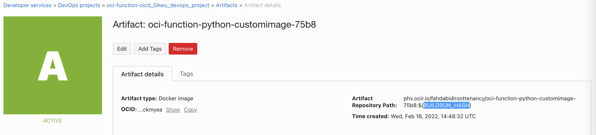

    It will display the container registry path to which each of the docker images will be uploaded .The path is postfixed with a variable `BUILDRUN-HASH`.Its dynamically populated from build pipeline and will be used as a docker tag.

    Optional : Read more about devops artifacts [here.](https://docs.oracle.com/en-us/iaas/Content/devops/using/artifacts.htm)


1. Go back to the project overview page ,under the Latest triggers,click on triggers

    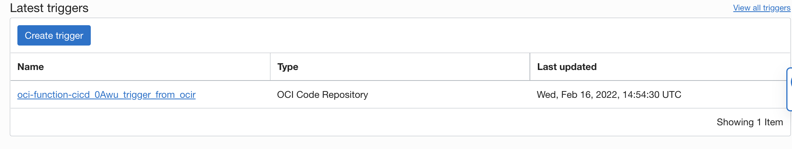

    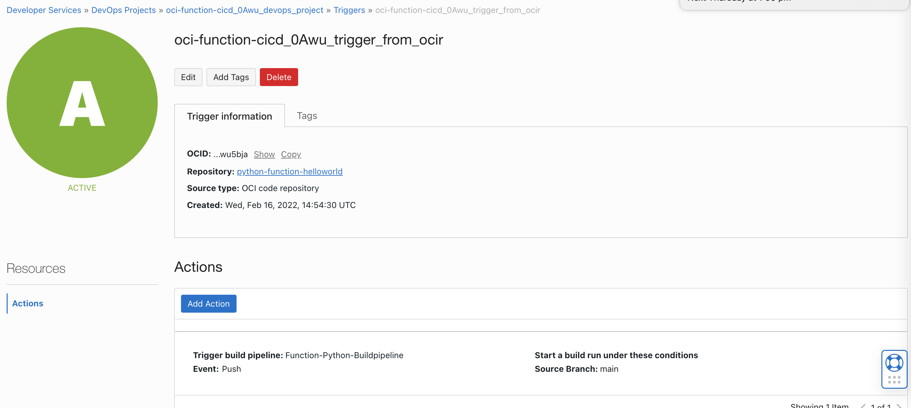

    Triggers will enable us to trigger our build pipeline automatically  when we update the OCI devops code repo.

    Optional : Read more about devops triggers [here.](https://docs.oracle.com/en-us/iaas/Content/devops/using/trigger_build.htm)


## Task 2: Validate the OCI function  components.

1. Go to Navigation Menu (aka "Hamburger" menu on the top left side of the page ) on the OCI Console -> Developer Services

    

1. Select Applications under Functions menu.

    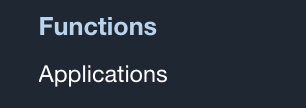

    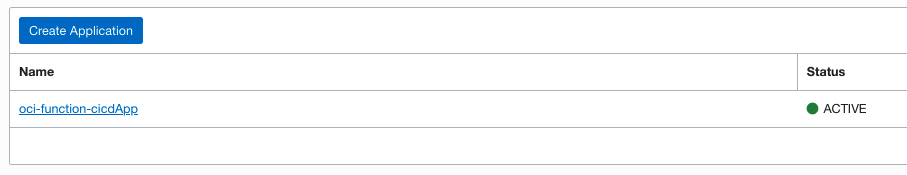

    In Oracle Functions, an application is:

    - a logical grouping of functions.
    - a way to allocate and configure resources for all functions in the application.
    - a common context to store configuration variables that are available to all functions in the application.
    - a way to ensure function runtime isolation.

1. Click on the application name and this will give the details about our target functions.

    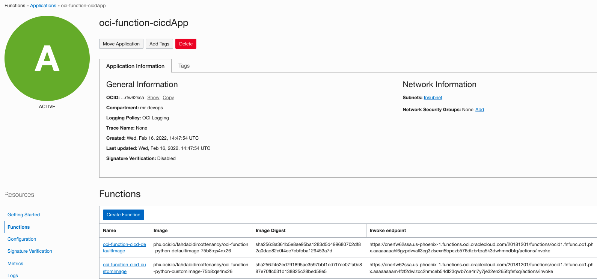

    In Oracle Functions, functions are:

    -  small but powerful blocks of code that generally do one simple thing
    - grouped into applications.
    - stored as Docker images in a specified Docker registry.
    - invoked in response to a CLI command or signed HTTP request.

    Optional : Read more about OCI Functions [here.](https://docs.oracle.com/en-us/iaas/Content/Functions/home.htm) 

1. Under Resources tab select `Logs` and ensure that its enabled

    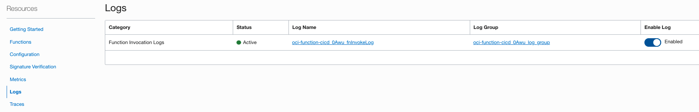


## Task 3: Do a manual build and deploy pipeline run.

1. Go to Navigation Menu (aka "Hamburger" menu on the top left side of the page ) on the OCI Console -> Developer Services

    

1. Select Devops -> Project


    


1. On the Project page ensure that you are on the right compartment ,in our case it should be `cicd`.

    

1. In the samepage you should see a project named as `oci-function-cicd-<Unique Key>-devops-project`

    


1. It will lead to a summary of all the devops resources that we created.

    


1. Click on the Latest Build Pipeline named `Function-Python-Buildpipeline`.It will open up the build pipeline and show the different stages. 

    

    

1. On the top right corner click `Start manual run` and 

    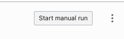

1. Provide a name for the manual run `sample run` and click on `Start manual run`.

    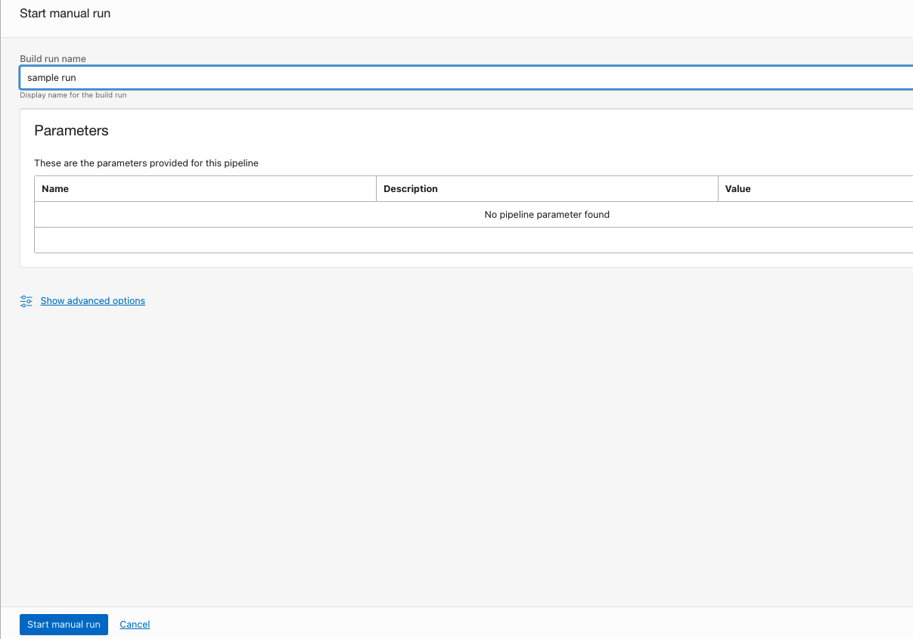

1. Follow build run actions untill its complted 

    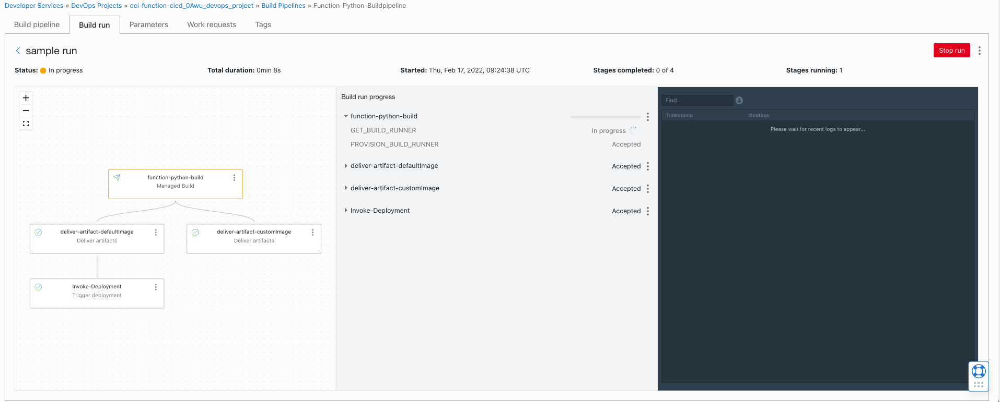

1. Validate the managed build stage is completed by expanding the stage.

    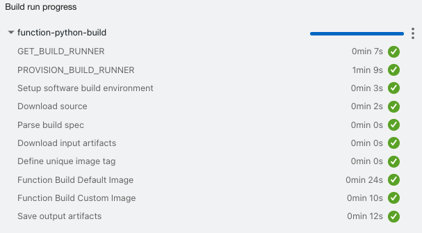

1. Verify the both the upload artifacts steps are completed . They are parallel steps which will push the container images to Oracle Container Repo.

    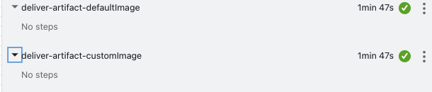

1. The last build steps will be to `invoke deployment pipeline` and ensure its completed.

    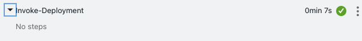

1. Go back to the project overview page , select `Deployments` from DevOps project resources.

    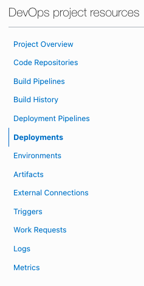

    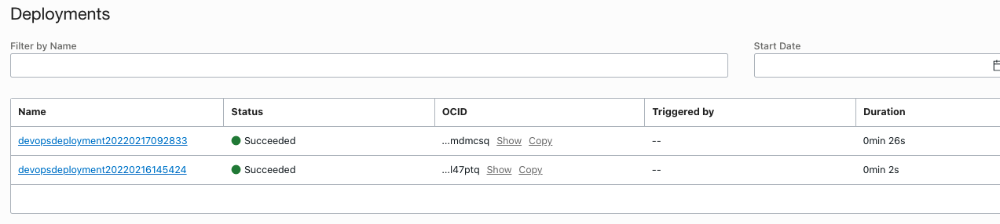

1. Click on the very latest deployment to get stage details.If the stages in progress wait till their completion and verify all the steps are complted .

    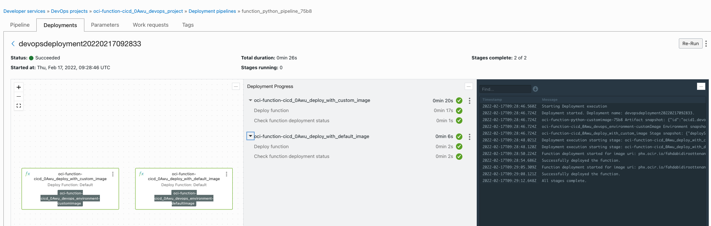

     Optional :You may use the log window to get more details about deployment and build pipeline stage details .

     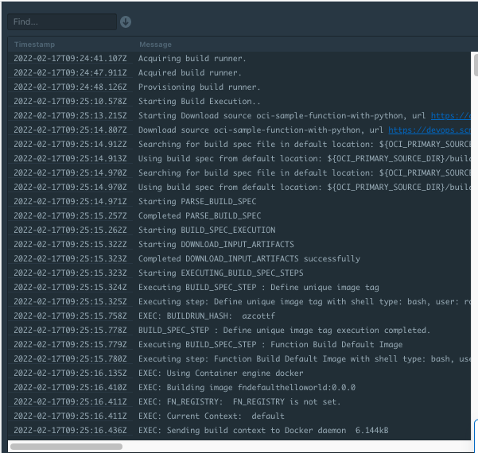

## Task 4: A manual function invokation and validate the outcome

As a developer /SRE we will be validating the function deployments here by invoking them using OCI Cloud shell and FN Cli.

1.  Go to Navigation Menu (aka "Hamburger" menu on the top left side of the page ) on the OCI Console -> Developer Services

    

1. Select Applications under Functions menu.

    

    

1. Click on the application name and this will give the details about our target functions.

    

    Always ensure you are on the right compartment.In this case it should be `cicd`.

1. Under Resources tab select `Logs` and ensure that its enabled

    

1. Under Resources tab select `Getting Started` option.

    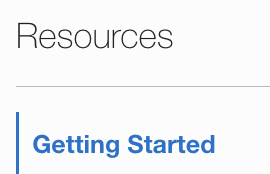

1. Click on `Launch Cloud Shell` button.

    

     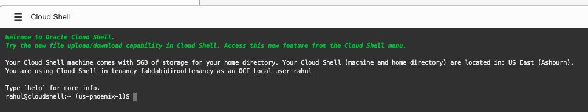

1. Follow first  **3** steps under Setup fn CLI on Cloud Shell .You can copy and paste to the cloud shell. 

    1. Set fn List context

        ```
        fn list context
        fn use context <oci region>

        ```   
        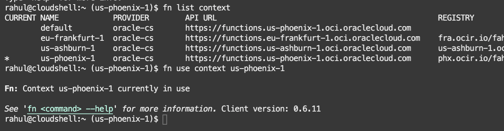

    1. Update the context with the function's compartment ID

        ```
        fn update context oracle.compartment-id ocid1.compartment.oc1..<id>

        ```
1. Validate that the application context is set right and display the functions .

    ```
    fn list apps
    fn list functions <name of the application>

    ```

    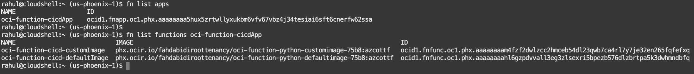

    Verify that two functions named as `oci-function-cicd-customImage` and `oci-function-cicd-defaultImage ` are listed 

1. Invoke the function `oci-function-cicd-defaultImage`

    ```
    fn invoke oci-function-cicdApp oci-function-cicd-defaultImage
    ```

    After few second the console should show a json output as below.

    ```
    {"status": "Hello World! with DefaultImage"}

    ```

    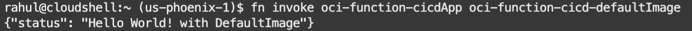
    
1. Invoke the function `oci-function-cicd-customImage`

    ```
    fn invoke oci-function-cicdApp oci-function-cicd-customImage
    ```

    After few second the console should show a json output as below.

    ```
    {"status": "Hello World! with customImage"}

    ```

    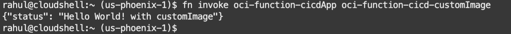


1. You will now verify the same via OCI Logging service as well .To do so ,got back to OCI cosnole. Under Resources tab select `Logs`

     

1. Click on the `log name` like `oci-function-cicd-<xxxx>-fnInvokeLog`.

    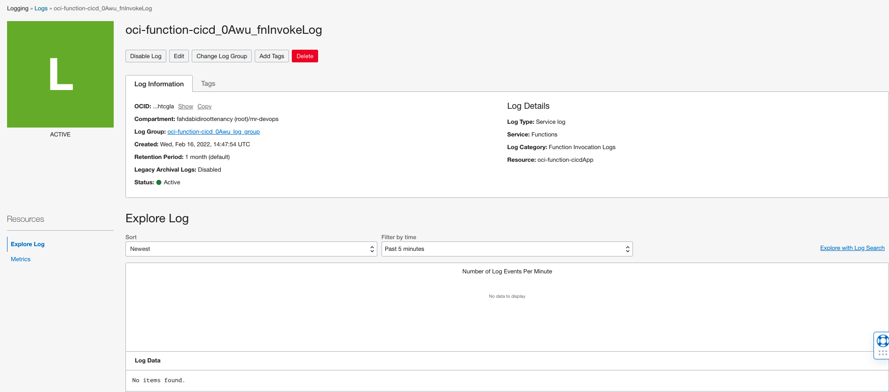

1. Change the option `Filterby time` to 15  minutes (or more).

    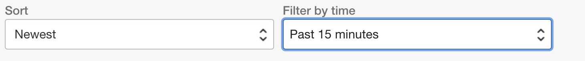

1. Expand the log data entries and verify the messages

    

    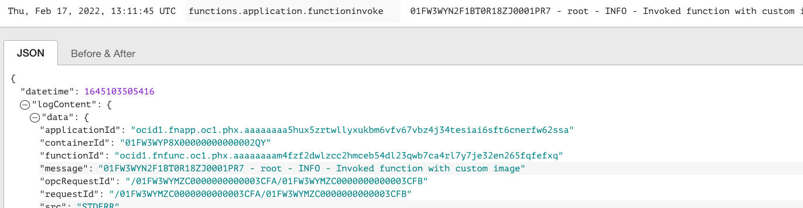

    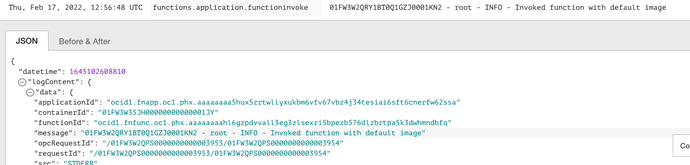


You may now **proceed to the next lab**.

## Learn More


* [OCI Devops documentation](https://docs.oracle.com/en-us/iaas/Content/devops/using/home.htm)


## Acknowledgements

* **Author** - Rahul M R
* **Contributors** -  
* **Last Updated By/Date** - Rahul M R - Feb 2022


    


