# Get to know OCI DevOps and related resources.

## Introduction

In this lab, you will be taking a close look at major OCI  resources, which were provisioned in the previous lab of this series. The same included OCI DevOps, OKE, VCN and other related resources mentioned below.


Estimated time: 20 minutes

### Objectives

In this lab, as a developer or SRE,

* Validate the OCI DevOps components.
* Validate the OCI canary deployment components.
* Do a manual build and deploy pipeline run.
*

## Task 1: Validate the OCI DevOps components.

1. Go to Navigation Menu (aka "Hamburger" menu on the top left side of the page ) on the OCI Console -> Developer Services

   

2. Select Devops -> Project

   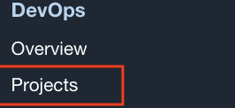

3. On the Project page ensure that you are on the right compartment, in our case, it should be `cicd`.

   

4. On the same page you should see a project named `DevOpsCanaryOKE_devopsproject_<Unique Key>`, click on it.

5. It will lead to a summary of all the DevOps resources that we created.

   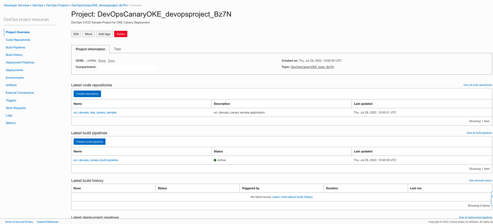

6. Click on the repository named `oci_devops_oke_canary_sample` under code repositories. That will lead to the code repo and the python code which will be deployed to the functions.

   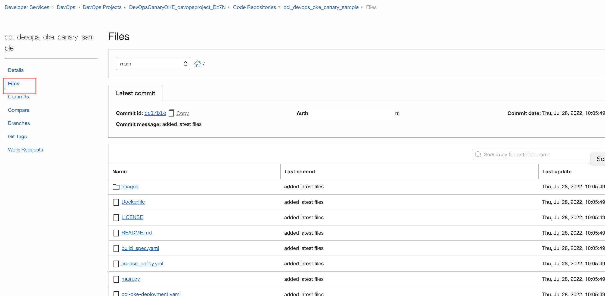

7. Open the file `build-spec. yaml` to know more about the build instructions.

   

   Optional: You can check all the options in the code repo and read more about [OCI code repo here.](https://docs.oracle.com/en-us/iaas/Content/devops/using/managing_coderepo.htm)

8. Go back to the project overview page, and click on the Latest Build Pipeline named `Function-Python-Buildpipeline`.It will open up the build pipeline and show the different stages.

   

9. Build pipeline contains four stages

   - A manage build stage to build the python application.
   - A deliver artifact stage to push the image to the OCI Container registry repo.
   - A trigger deployment task to invoke the deployment pipeline.

   

10. Click on the `3 dots` and view details for each of the stages.


Optional: You can refer more here about [OCI Build stages](https://docs.oracle.com/en-us/iaas/Content/devops/using/managing_build_pipelines.htm)

11. Go back to the `DevOps Project overview` and select a deployment pipeline named `devops-oke-pipeline_<ID>` to view the different stages.


12. Deployment pipeline will have 4 stages


- A Canary OKE Deployment to deploy the change to the canary namespace.
- A Traffic shift stage to shift a % of traffic via canary namespace.
- An approval stage for approving the deployment to production.
- A Deploy OKE to deploy the change to the production namespace.

Optional: You may refer to know more about [Devops Canary deployment stages.](https://docs.oracle.com/en-us/iaas/Content/devops/using/canaryoke_deploy.htm)

13. Switch back to Devops project overview and from `Latest environments` select the environment named `oke_environment_<ID>`.


14. We will be using an environment type as `Kubernetes Cluster Environment`.

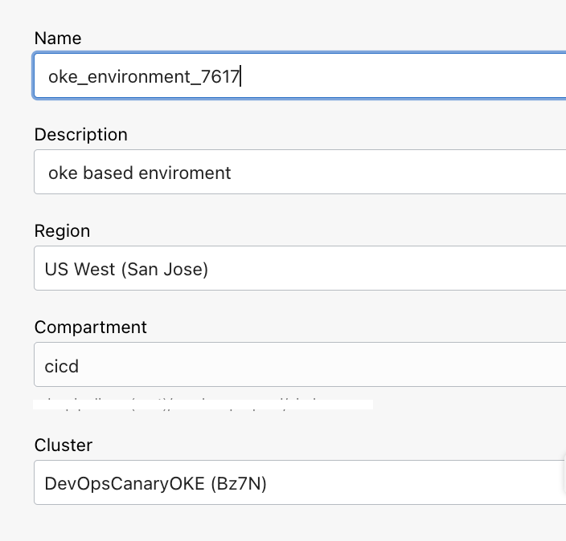

Optional: You may refer to know more about [OCI DevOps environment.](https://docs.oracle.com/en-us/iaas/Content/devops/using/create_oke_environment.htm)

15. Switch back to `DevOps Project overview` and refer to the DevOps artefacts created under `Latest artifacts`


16 . We are using two artifacts, where one is for `Docker image` and another one for  `Deployment - Kubernetes manifest`. Docker image artifact is used to push the docker image to the container registry repo during the `Deliver artifact` stage within the build pipeline. The `Kubernetes manifest` is for the deployment to OKE using the DevOps deployment pipeline.

Optional: You may refer here to read more about [OCI DevOps artifact](https://docs.oracle.com/en-us/iaas/Content/devops/using/artifacts.htm)


## Task 2: Validate the OCI Kubernetes Engine - OKE.

1. Use `OCI Console` > `Developer Services` > `Containers & Artfacts` and click on `Kubernetes Clusters (OKE)`

   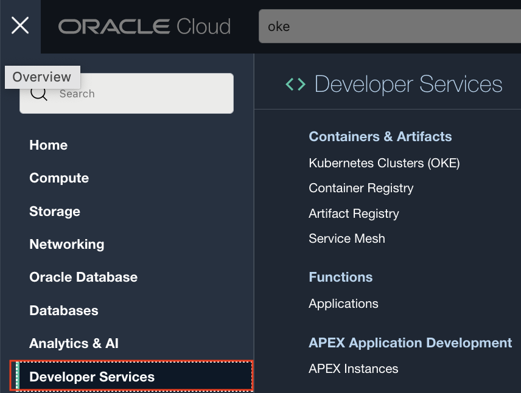

2. Click on the cluster named `DevOpsCanaryOKE (<ID>)`

   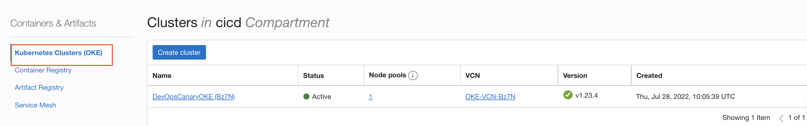

3. Under the OKE cluster, user option `Access Cluster` and Follow the `Cloud Shell Access` method.

   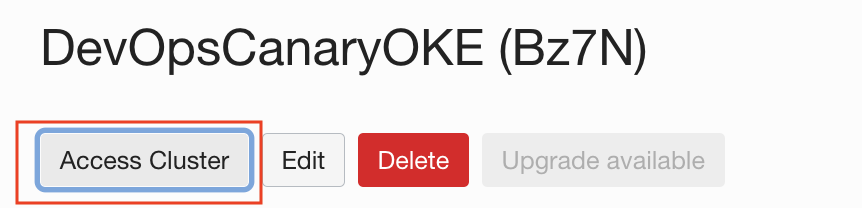

   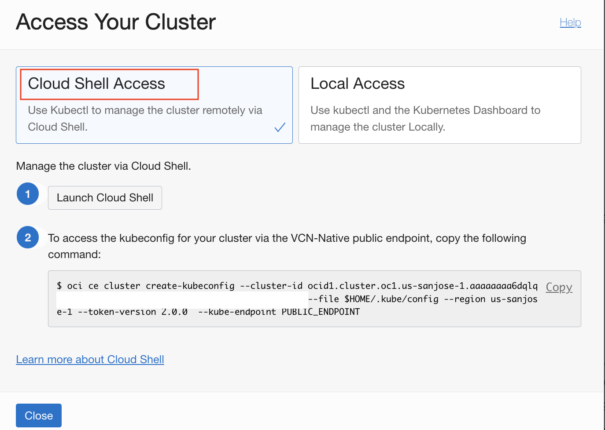

4. This will open the `OCI Cloud shell` and where in you need to copy and paste the command in the access instruction.

   

5. Run the command `kubectl cluster-info ` on the Cloud shell and validate the `Kubernetes API public endpoint` address with the information from the OCI Console view.

   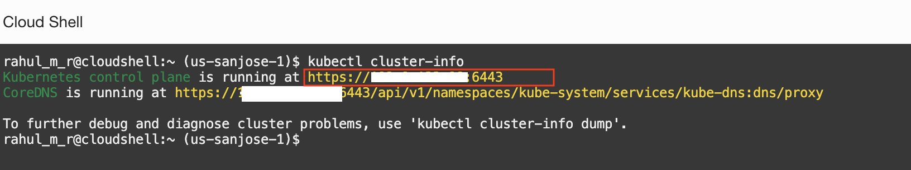

   

6. Run command `kubectl get ns` to validate that there are three namespaces created as
   - nscanaryprd for Prod traffics.
   - nscanarystage for Canary traffics.
   - ingress-Nginx for Nginx usages.

   

As the OKE cluster doesn't have an ingress controller by default, an NGINX ingress controller is explicitly installed when we created the infrastructure via ORM jobs.

## Task 3: Do the first build and deployment execution.

1. Switch back to `OCI DevOps Project` > `DevOpsCanaryOKE_devopsproject_<ID>`

   

2. Click on `Build Pipelines` and click `oci_devops_canary-build-pipeline`.In the pipeline, click on the `Start manual run` button in the top right corner.

   

3. Use the button `Start manual run` and start the execution.

   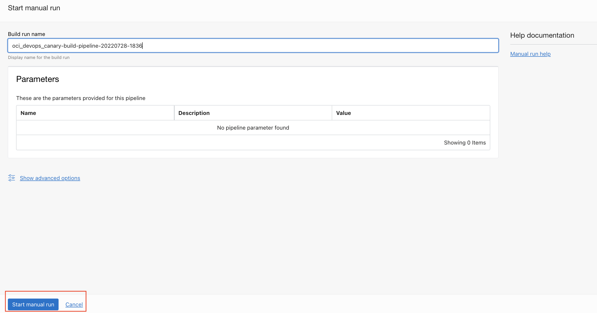

4. Build run will start.

   

5. Wait for all the stages to complete, This would take approximately 5 to 7 minutes.

   

6. Switch to `DevOps Project overview` >` Deployments`

   

7. Click the latest one in progress.

   

8. Once it's complete the first two stages are (Deploy to Canary namespace and Traffic shift), which will be pending in the  `Approval STage.`. As it's the very first execution we don't see any Canary effect here as there is nothing deployed into the production namespace to compare with.

   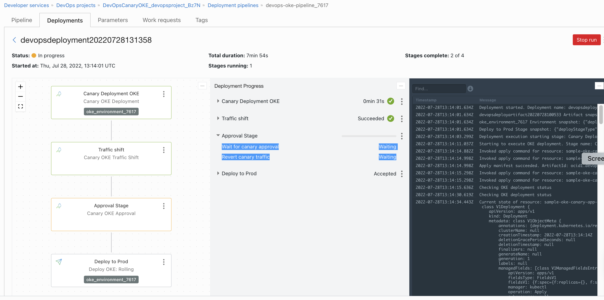

9. Click on the 3 dots next to the approval and click on `Approve.`

   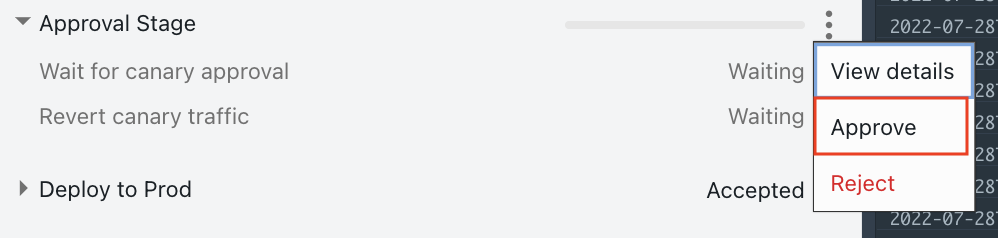

10. Provide comment and approve it.


11. Wait for all the stages to complete.


## Task 4: Validate the first deployment.

1. To validate, we will be using the `OCI Cloud shell` and fetch the information from the `OKE` namespace. Open cloud shell from the `OCI Console` top right corner.

   


2. Run the command `kubectl cluster-info ` on the Cloud shell and validate the `Kubernetes API public endpoint` address with the information from the OCI Console view.

   

   


3. Fetch the information from OKE namespace `nscanaryprd`, via running command `kubectl get all, ingress -n nscanaryprd` on cloud shell.

   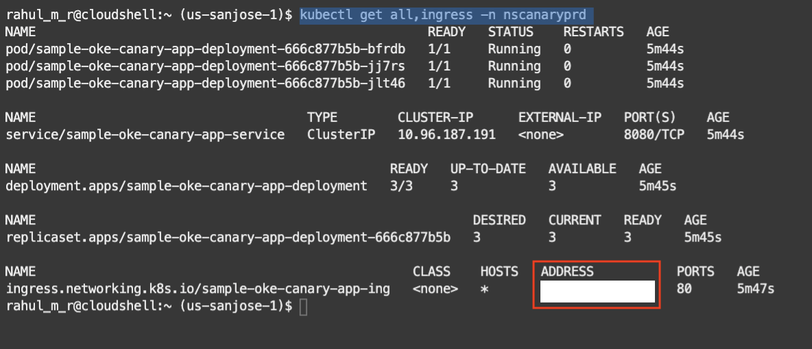

4. From the above get the ingress `ADDRESS`

   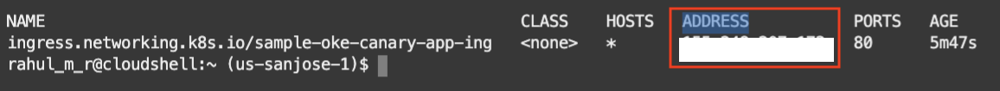

   Optional: You can run the command `kubectl get all, ingress -n nscanarystage` and fetch the information from the canary namespace which will be exactly that of the prod namespace, as its the very first deployment.

   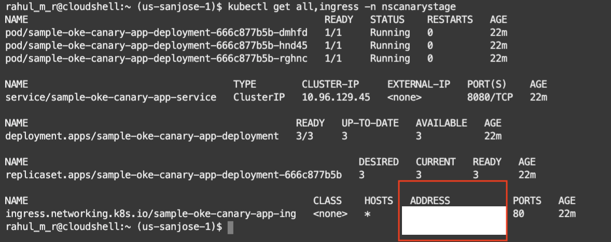

5. Use curl or a browser with the ingress address to launch the application.

```markdown
curl <ADDRESS>
```
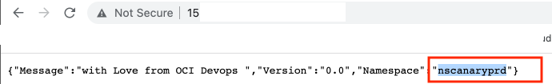


You may now **proceed to the next lab**.

## Learn More

* [OCI Devops documentation](https://docs.oracle.com/en-us/iaas/Content/devops/using/home.htm)


## Acknowledgements

* **Author** - Rahul M R
* **Contributors** -
* **Last Updated By/Date** - Rahul M R - July 2022


    


