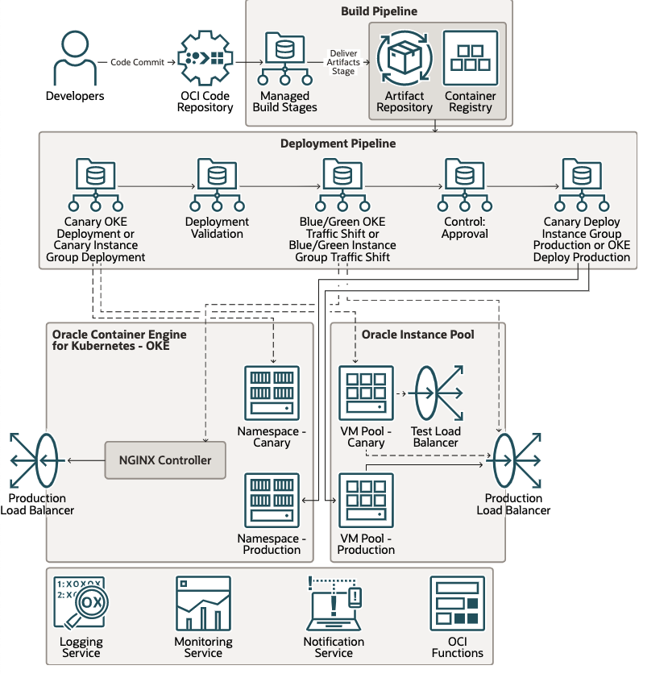

# Introduction

## About this workshop.

You will learn how to build your infrastructure and automate the build and deployment of a Cloud Native Python application to Oracle Kubernetes Engine(OKE), with a canary deployment model.

With a Canary deployment strategy, the application release happens incrementally to a subset of users. Initially, the new version gets deployed to a canary environment with no user traffic. The DevOps release pipeline can run validation tests against the new version and, once ready, route only a subset of users to the canary environment.

Estimated time: 90 minutes

### Objectives

In this lab, you will:

* Provisioning Infrastructure using IaC and OCI Resource Manager.
* Build and deploy a sample python application onto OCI OKE.
* Test and validate the canary deployment functionality.
* Clean up the infra.

### Prerequisites

1. An Oracle Free Tier(Trial), Paid or LiveLabs Cloud Account
1. [Familiarity with OCI console](https://docs.us-phoenix-1.oraclecloud.com/Content/GSG/Concepts/console.htm)
1. [Overview of Networking](https://docs.us-phoenix-1.oraclecloud.com/Content/Network/Concepts/overview.htm)
1. [Familiarity with Compartments](https://docs.us-phoenix-1.oraclecloud.com/Content/GSG/Concepts/concepts.htm)
1. [OCI DevOps services.](https://docs.oracle.com/en-us/iaas/Content/devops/using/home.htm)

## Cloud Native Applications Overview

"Cloud native technologies empower organizations to build and run scalable applications in modern, dynamic environments such as public, private, and hybrid clouds. Containers, service meshes, microservices, immutable infrastructure, and declarative APIs exemplify this approach.

These techniques enable loosely coupled systems that are resilient, manageable, and observable. Combined with robust automation, they allow engineers to make high-impact changes frequently and predictably with minimal toil."

## Oracle DevOps

Oracle Cloud Infrastructure DevOps service provides an end-to-end CI/CD platform for developers. OCI DevOps services broadly cover all the essential needs for a software lifecycle. Such as

- OCI Deployment pipelines  – automate releases with declarative Pipeline release strategies to OCI Platforms like VM and Baremetals, Oracle Container Engine for Kubernetes (OKE) and OCI Functions
- OCI Artifact repositories – A place to store versioned artifacts, including immutable ones.
- OCI Code repositories – OCI provided a scalable code repository service.
- OCI Build pipelines – A serverless, scalable service to automate build, test, artefacts and deployment invocations.

## Role Play Scenario

In this LiveLab, you will build and deploy a python application by using OCI DevOps and OCI OKE, with a canary deployment strategy

With a Canary deployment strategy, the application release happens incrementally to a subset of users. Initially, the new version gets deployed to a canary environment with no user traffic. The DevOps release pipeline can run validation tests against the new version and, once ready, route only a subset of users to the canary environment.

This technique allows the DevOps team to evaluate the new application version against real user traffic. They can compare the two application versions side-by-side before rolling out the new version to a larger user base. It also offers risk mitigation, as the new version is only enabled for a small subset of users. These users can easily switch back to the previous version if any issues arise.

Canary deployments offer these benefits:
- You can test two application versions side-by-side with real users.
- Zero downtime for new version releases.
- Rollback to a previous version is very easy and carries the least risk.

However, you should be aware of these drawbacks:

- Testing and validating a new release at scale can be complex.
- Fetching feedback from user testing against a new release is time-consuming.

You may now **proceed to the next lab**.

## Learn More

* [Reference Architecture: Understand modern app deployment strategies with Oracle Cloud Infrastructure DevOps ](https://docs.oracle.com/en/solutions/mod-app-deploy-strategies-oci/index.html)

## Acknowledgements

* **Author** - Rahul M R
* **Contributors** -
* **Last Updated By/Date** - Rahul M R - July 2022

