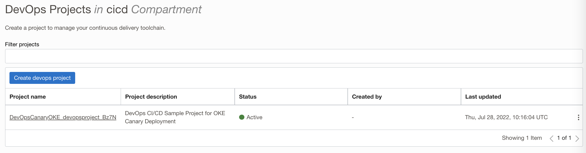

 # A new release and rollback to validate the canary deployment

## Introduction

In this lab as a developer /SRE you  will be updating the existing code against a bug or a new feature and publish back to the repo.Followed by an automated build and deploy with a canary deployment mode. We will be validating the changes via Canary stage first and then releasing it to the production .At the end we will also perform a rollback to the pervious version 

Estimated time: 30 minutes

### Objectives

In this lab, as a developer or SRE,

* Clone the code repo.
* Update the code base with a change.
* Push the content back to repo and wait for an automated build-deploy.
* Validate the canary deployment and proceed for production deployment.
* Do a rollback to previous version.

## Task 1: Clone the code repo..

1. Use `OCI Console ` > `Developer Services ` > `DevOps` >`Projects`

    

You may now **proceed to the next lab**.

## Acknowledgements

* **Author** - Rahul M R
* **Contributors** -  
* **Last Updated By/Date** - Rahul M R - Feb 2022

