# A new release and rollback to validate the canary deployment

## Introduction

In this lab as a developer /SRE you  will be updating the existing code against a bug or a new feature and publish back to the repo.Followed by an automated build and deploy with a canary deployment mode. We will be validating the changes via Canary stage first and then releasing it to the production .At the end we will also perform a rollback to the pervious version 


Estimated time: 30 minutes

### Objectives

In this lab, as a developer or SRE,

* Clone the code repo.
* Update the code base with a change.
* Push the content back to repo and wait for an automated build-deploy.
* Validate the canary deployment and proceed for production deployment.
* Do a rollback to previous version.

## Task 1: Clone the code repo.

1. Ensure that you have the `User access token ` (which was created during the previous lab ) before proceeding.

2. Use `OCI Console ` > `Developer Services ` > `DevOps` >`Projects`

    

3. Ensure on the right compartment ,in this samples it should cicd.

   

4. Click on the project `DevOpsCanaryOKE_devopsproject_<ID>`
5. Under `DevOps` project resources , click on the `Code Repositories`

   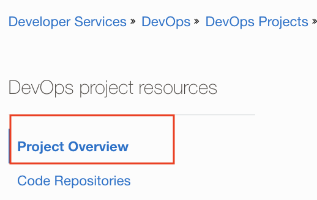

6. Click  code repo named `oci_devops_oke_canary_sample`

   

7. Click on the `Clone` button.

   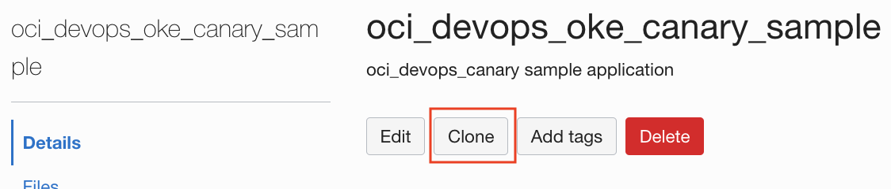

8. Copy the `Clone with HTTPS` url.

   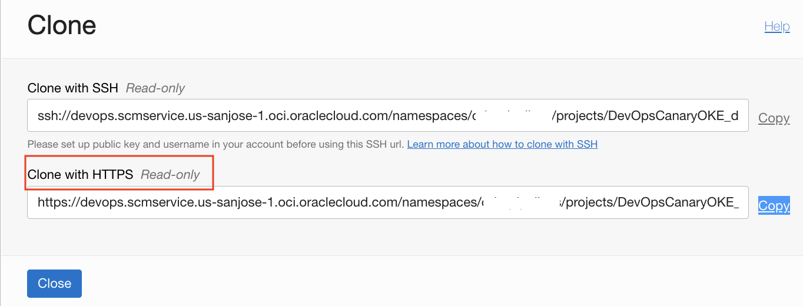

9 . From the top right hand corner on the `OCI console` open OCI Cloud shell.
10. Run command `git clone <HTTPS URL>` in the Cloud shell. Provide the username (with properformat) and the user access token created as password.

   

11. This will cone our code repo content under the directory `oci_devops_oke_canary_sample`.In order to make a new release ,we will making some changes in the code and push back to the core repo.
12. Switch to the clone directory by running command `cd oci_devops_oke_canary_sample`.Edit the file `main.py` and change the version as 1.0 and save.

```markdown
vi main.py
```
   

 As this is a python program ,the intentation is very important and incase of any confusion please use the copy of content from below


```markdown
from typing import Optional

from fastapi import FastAPI

import os

app = FastAPI()


@app.get("/")
def read_root():
    version="1.0"
    namespace = os.getenv('POD_NAMESPACE', default = 'ns-red')
    return {"Message": "with Love from OCI Devops ","Version":version,"Namespace":namespace}
```

13. Run command `git status` and you should see the edited file.

   

14. Run the set of commands and push the edited changes back to OCI repo.When promted provider the username and useraccess token.If its the first time that you are performing git actions ,it will ask you setup the configurations too 

```markdown
git add main.py
git config --global user.email "Your mail ID"
git config --global user.name "User Name"
git commit -m "version 1.0"
git push origin main
```

   
   
   
   

15. You may verify the changes via the OCI Code repo as well ,by switching back to OCI Console.

   
   

16. From the OCI DevOps project overview , click on the `Build Pipelines` > and open pipeline named `oci_devops_canary-build-pipeline`

   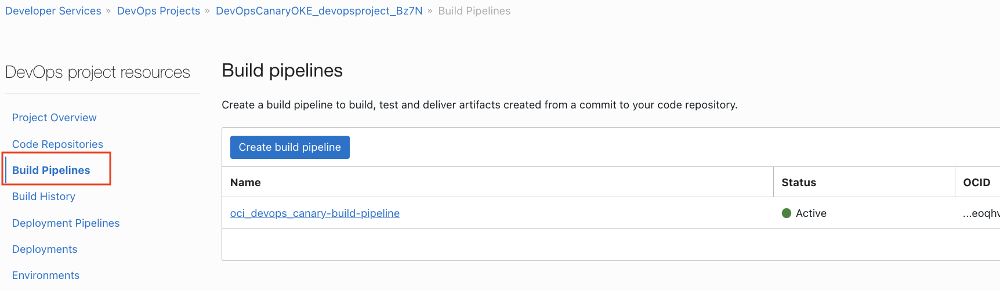

17. Use optin `Start manual run` and start  a build run.

   

18. Wait for all the build stages to complete ,it would take 6 to 8 minutes to finish the build stages.

   

19. Switch back to `Devops project overview ` and click `Deployment Pipelines`

   

20. Click on pipeline named `devops-oke-pipeline_<ID>` and Click on `Deployments`

   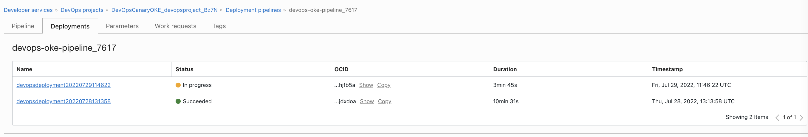

21. Click the one ,which is progress . Wait for couple of minutes and it will the first stages and hold at the Approval stage. 

   

22. At this stage the new version is deployed on the canary stage and 25% of calls will be routed via version 1.0. In order to test the application ,fetch the ingress IP by running below commands via cloud shell where its authenticated to interface with the OKE Cluster.Fetch the `ADDRESS` values form the command output

```markdown
kubectl get ingress -n nscanaryprd
```

   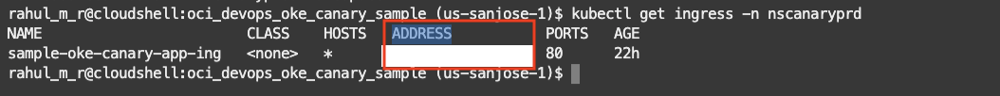

23. Using the curl or browser launch and test the application. If you using the browser keep referesing the page 4 to 5 times and you should see 1.0 version with namespace as nscanarystage intermittently.

   - Using Curl and fetch the output  via cloud shell
```markdown
for i in {1..10}; do curl http://<INGRESS ADDRESS>;echo ""; done
```
   

   - Using browser
   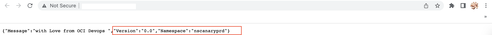
   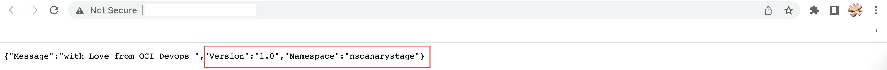

   -Using curl and with `redirect-to-canary` header. This would ensure that the traffic is always from canary namespace.

```markdown
for i in {1..10}; do curl http://<INGRESS ADDRESS> -H "redirect-to-canary:always" ;echo ""; done
```

   


24. Once we validated , let proceed to deploy the same to the production namespace. Switch to back to OCI Console , deployment view .Click on the 3 dots and select approve.

   

25. Provide a reason and click on approve .Wait for all the stages to complete.

   

26. Validate the changes using the ingress address and it should the version as 1.0 and the traffic will be served via production namespace.

   


## Task 2: Optional - View related artifacts and spec files.

Here we are going to take look on to the container images thats got created and push to the artifacts ,build and deploy speficications.

1. Use path `OCI Console` > `Developer Services` > `Container Registry`.Always ensure you are on the correct comparment.Once you expand you would see two images which has been pushed during the two build runs.

   
   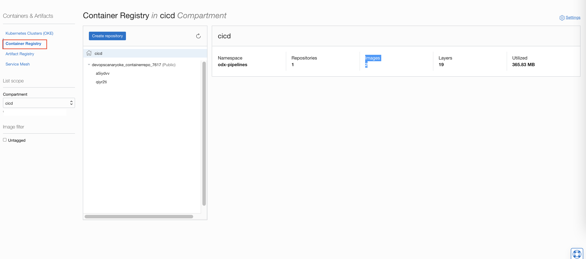
2. Switch to back to `Devops project` to do so ,type `project` with in the search bar under oci console.Click on `Projects` from service category.

   


3. Click on project `DevOpsCanaryOKE_devopsproject_<ID>` > Click on `Code Repositories` > and click on repo named as `oci_devops_oke_canary_sample`. Few of the key files here are 

   - Dockerfile - For building container images.
   - build_spec.yaml - For all steps under `managed build stages`.
   - oci-oke-deployment.yaml - For the deployment on to OKE.

4. The `build_spec.yaml` contains various steps as below .

   - Define unique image tag - To generate the tages what you could see on the contaimer images under OCI Container registry repos.
   - Build container image - Creating docker contaimer images with the app files.
   - outputArtifacts - Refers to the outcome ,in our case we have two references
     - oke_app_base : Container images
     - oke_deploy_manifest - OKE deployment manifest.
   
Thought the container images builds with `latest ` tag ,the same will be replaced with the uniq tag created here via the `OCI Devops Artifact` `Allow parameterization` options


   


5. The oci-oke-deployment.yaml is the manifest that does deploy below resourced on to OKE .
   - namespace
   - deployment
   - service
   - ingress 

```markdown
apiVersion: apps/v1
kind: Deployment
metadata:
  name: sample-oke-canary-app-deployment
spec:
  selector:
    matchLabels:
      app: sample-oke-canary-app
  replicas: 3
  template:
    metadata:
      labels:
        app: sample-oke-canary-app
    spec:
      containers:
        - name: sample-oke-canary-app
          # enter the path to your image, be sure to include the correct region prefix
          image: <REGION>.ocir.io/<NAMESPACE>/devopscanaryoke_containerrepo_<ID>:${BUILDRUN_HASH}
          imagePullPolicy: Always
          ports:
            - containerPort: 80
              protocol: TCP
          livenessProbe:
            exec:
              command:
              - cat
            initialDelaySeconds: 5
            periodSeconds: 5
          env:
            - name: POD_NAMESPACE
              valueFrom:
                fieldRef:
                  fieldPath: metadata.namespace

---
apiVersion: v1
kind: Service
metadata:
  name: sample-oke-canary-app-service
  annotations: 
    service.beta.kubernetes.io/oci-load-balancer-shape: "10Mbps"
spec:
  type: ClusterIP
  ports:
    - port: 8080
      protocol: TCP
      targetPort: 80
  selector:
    app: sample-oke-canary-app
---
apiVersion: networking.k8s.io/v1
kind: Ingress
metadata:
  name: sample-oke-canary-app-ing
  annotations:
    kubernetes.io/ingress.class: "nginx"
spec:
  # tls:
  # - secretName: tls-secret
  rules:
  - http:
      paths:
        - path: /
          pathType: Prefix
          backend:
            service:
              name: sample-oke-canary-app-service
              port:
                number: 8080
```


## Task 3: Rollback the deployment.

OCI Devops deployment with canary allows user to 
   - REJECT a change at the canary stage itself or 
   - ROLLBACK from a production deployed version to the pervious. 
Here we are going to look at a rollback from production version to pervious one .

1. Validate the application version - It should be in version `1.0`

   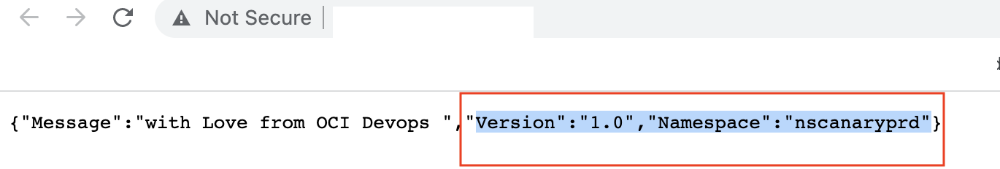

2. Using oci console , open the deloyments for the deployment pipeline.

   

3. Click on the last successful deployment.

   

4. Click on the 3 dots on the last stage - `Deployment OKE:Rolling` and click on `manual rollback`. It will lead you to a detailed page.

   

5. Expand the option `Deployment input` and verify the references used for that deployment.In our case the container images holding version 1.0.

   

6. Click on `Select Deployment` button and select the one of the previous successful deployment and click on `Save Change`.

   
   

7. Validate the container image tage and click on `Rollback Stage`

   

8. This will invoke a production deployment stage .Wait for the stage to complet.

   

9. Validate the application version via browser of curl command.This should show prwvious version 0.0 via production namespace.

   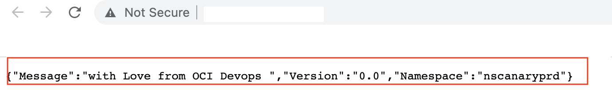

10 . So we rollback production to 0.0 version and the canary still hold version 1.0 incase of any isolated tests.


   Optional : Read more about different deployment strategies on OCI devops [here.](https://docs.oracle.com/en/solutions/mod-app-deploy-strategies-oci/index.html)


You may now **proceed to the next lab**.


## Acknowledgements

* **Author** - Rahul M R
* **Contributors** -  
* **Last Updated By/Date** - Rahul M R - Jul 2022


