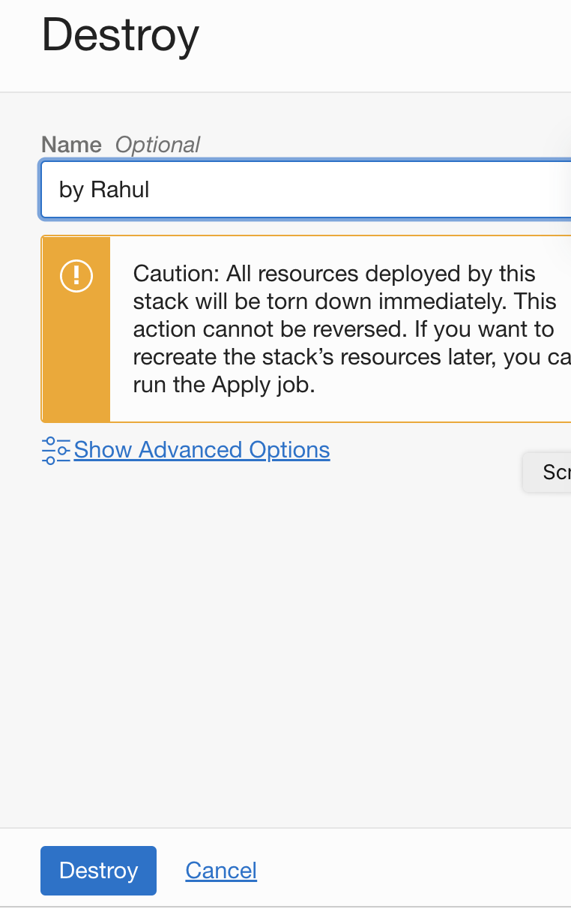
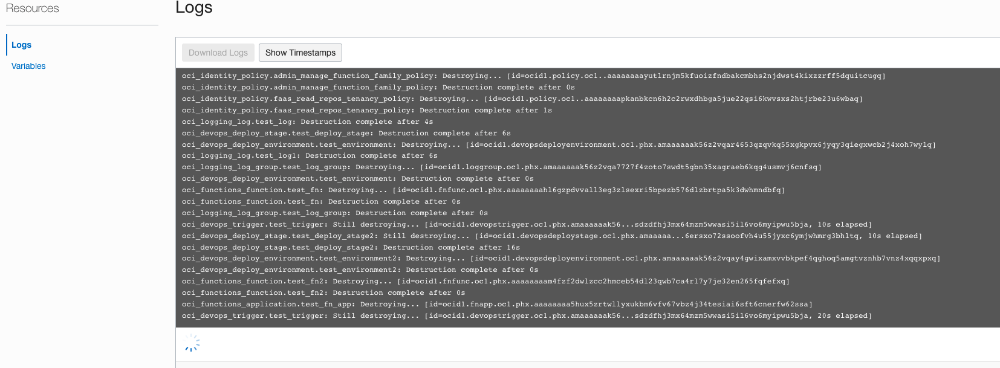
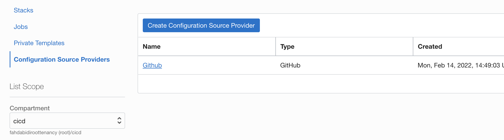
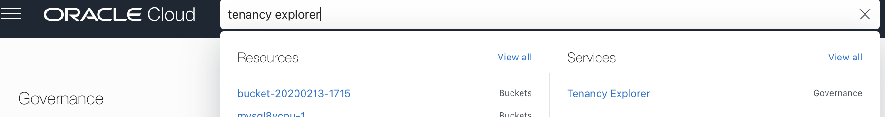
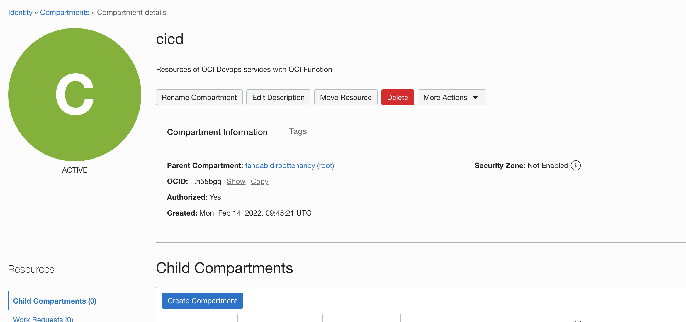
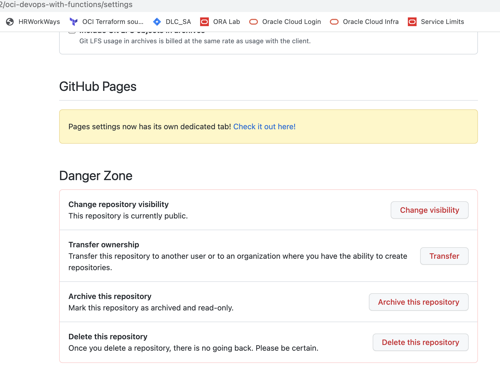

# Release resources created through the workshop

## Introduction

Congratulations, you complete the workshop. You may want to release the cloud resources created through this workshop. We first delete all resources using OCI Resource manager and then few of the manual ones later

---

Estimated Lab time: 30 minutes

### Objectives

In this lab, you will:

* Release Infrastructure Resources

### Prerequisites

* An Oracle Free Tier(Trial), Paid or LiveLabs Cloud Account
* GitHub account

## Task 1: Release ORM Stack Resources

All resources provisioned during this workshop that were managed exclusively via Resource Manager can be destroyed running a `Destroy` job associated with your Stack `oci-devops-functions`.

1. Open the navigation menu and click Developer Services. Under Resource Manager, click Stacks.

1. Choose the `cicd` compartment if you haven't selected before. The page updates to display only the resources in that compartment. 

1. Click the name of the stack `oci-devops-functions`.

1. The Stack Details page is displayed.

1. Click Destroy.
    

1. In the Destroy panel, you can enter a name for the job and click Destroy again to confirm your action.
    

    You can monitor the status and review the results of a destroy job by viewing the state or the logs.
        

    To view the Terraform state file (shows the state of your resources after running the job), click the name of the job to display the Job Details page, then click View State under Resources.

    To view the logs for the job, click the name of the job to display the Job Details page, then click Logs under Resources.

1. At the end, the Destroy job succeeds and your resources were released.

     

1. You can go back to the Stack Details page, and delete the Stack by clicking on `More Actions -> Delete Stack` and click again to confirm your action. 
      

## Task 2: Delete ORM Configuration Source Provider

The next step is to delete the GitHub Configuration Source Provider in the Oracle Resource Manager.

1. In the left hand side menu, under Resource Manager, click `Configuration Source Providers`.

      

    
1. Click the name of the configuration source provider that you want to delete - `GitHub`.

1. Click Delete Configuration Source Provider and then confirm the action.
      

## Task 2: Validate the tenacy resources and delete the left over resources.

Ideally once you finish the above tasks ,it must clean the resources inside the compartment `cicd`. But it will not clean anything it there are some resources created outside of the lab .

1. Use the search bar in the middle of the OCI console and type `Tenancy explorer` and select from the drop down list.

    

    

    From the compartment list select the compartment `cicd` and you should see some of the `build run` ,`deployments` and resource manager `jobs`.

1. Validate the resources and if they are associated to the lab (double confirm it) and if they are of above mentioned type you can safely ignore them 

1. You can now delete the compartment `cicd`.This is an optional step and delete the compartment when you are sure it does not used for any other resources or operations. Use OCI console search and select `compartments`

    

1. Click on the compartment name `cicd` and use `delete` option to delete it .
   Its an optional task that you can retain the compartment.The delete option is irreversible. 

    

    

## Task 3: Delete the github window .

Its an optional tasks , that you can delete the github repo we have imported .To do so login to http://github.com > select the repo > click on settings > and Use Delete repository options. Provide the necessary confirmation and agree it .
The delete option is irreversible.

You may now **proceed to the next lab**.

## Acknowledgements

* **Author** - Rahul M R
* **Contributors** -  
* **Last Updated By/Date** - Rahul M R - Feb 2022
