# Provision the Infrastructure using Resource Manager

## Introduction

In this lab exercise, you will provision all the Infrastructure resources used by your applications through Infrastructure As Code (IaC) using [Terraform](https://www.terraform.io) on [Oracle Cloud Infrastructure Resource Manager service (ORM)](https://docs.oracle.com/en-us/iaas/Content/ResourceManager/Concepts/resourcemanager.htm).  

If you are not familiar with Terraform, this is an open-source tool that allow you to write infrastructure as code using declarative configuration files that will represent the state of your infrastructure. OCI Resource Manager allows you to share and manage Terraform configurations and state files across multiple teams and platforms. You can connect Resource Manager to your Git repository by setting up a Configuration Source Provider.

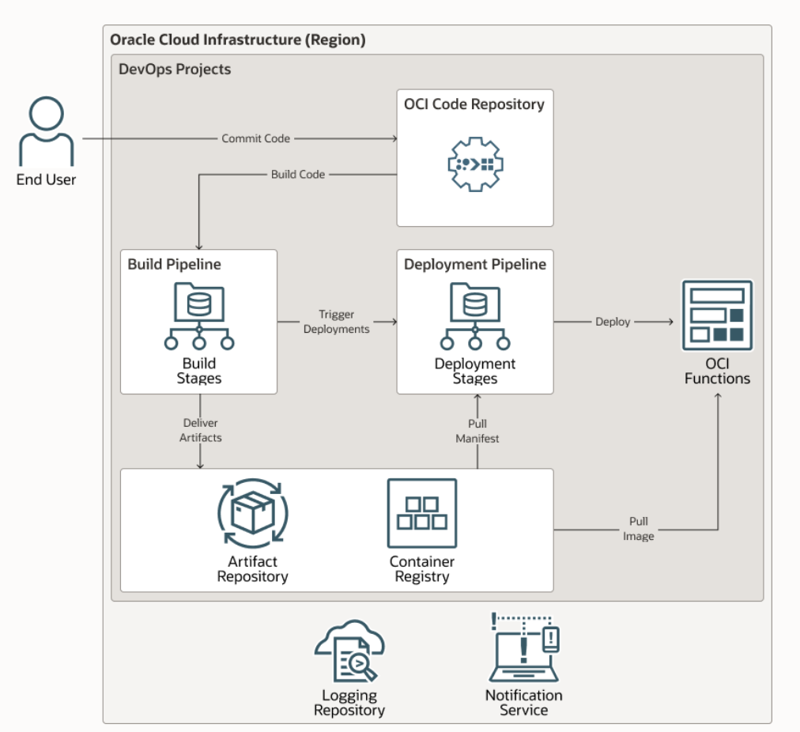

Estimated time: 30 minutes

### Objectives

In this lab, you will:

* Create an IAM compartment to isolate and organize your CI/CD cloud resources
* Create ORM Stack and configuration pointing to a git repository.
* Provision Infrastructure: Network, IAM, OCI Container registry,OCI Functions and ,DevOps elements.

### Prerequisites

* An Oracle Free Tier(Trial), Paid or LiveLabs Cloud Account
* GitHub account
* User that belongs to the Administrator group or has granted privileges to manage multiple OCI resources (IAM, ORM, DevOps, Functions, Network, etc).

## Task 1: Create CICD Compartment

Compartments are used to organize and isolate your cloud resources. It is always recommended to carefully design your compartment structure and which groups will have access to them. In this lab exercise, we will create the `cicd` compartment for managing all resources created through the cicd pipeline. You can create [IAM Groups and Policies](https://docs.oracle.com/en-us/iaas/Content/Identity/Concepts/policygetstarted.htm) to control who have access to visualize/manage the resources in that compartment.

1. Go to Navigation Menu (aka "Hamburger" menu on the top left side of the page ) -> Identity & Security -> Identity -> Compartments

1. To create a compartment in the tenancy (root compartment) click Create Compartment.
Otherwise, click through the hierarchy of compartments until you reach the detail page of the compartment in which you want to create the compartment. On the Compartment Details page, click Create Compartment.


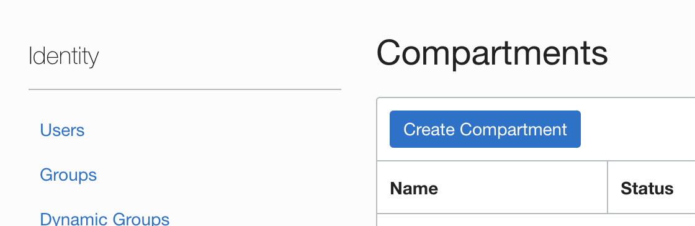

1. Enter the compartment name and description:


## Task 2: Import Git "deploy" repository 

Oracle has published a [Reference Architecture](https://docs.oracle.com/en/solutions/build-cicd-pipelines-devops-function/) which contains a [quickstart](https://github.com/oracle-quickstart/oci-arch-devops-cicd-with-functions) repository that contains Terraform templates and we will use them to automate the provisioning of OCI DevOps service and all target services/environments. Let's *import* that repository to your GitHub account.

1. Open up a new browser tab and go to [GitHub](https://github.com).

1. On the top navigation bar, click on the plus sign -> Import Repository.


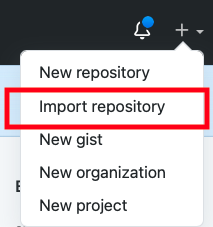

1. Enter the URL of the OCI Architecture DevOps repo: `https://github.com/oracle-quickstart/oci-arch-devops-cicd-with-functions`


1. Enter a name for the new *deploy* repository. To better identify it, let's name it: `oci-devops-with-functions`. 

1. Set privacy settings to `Private` and then click on Begin import button in the bottom of the page to create a new repo.


4. Open up the new repository URL.


## Task 3: Setup ORM Configuration Source Provider 

After importing the repository into our GitHub account, we are going to use OCI Resource Manager (ORM) to provision the infrastructure. ORM has a feature that integrates it with Version Control Systems/Platforms like GitHub and GitLab, etc. 

A Configuration Source Provider is a connection information to a source code control system where your Terraform configuration files are stored. 

But before jumping into setting up a Configuration Source Provider on ORM,  there are some additional preparation tasks.

### Generate GitHub Personal Access Token

 You need to generate a GitHub `Personal Access Token (PAT)` which allows the integration with GitHub through APIs (without using a regular user/password authentication). The PAT is associated with a set of permissions (scopes) which defines what operations can be executed through the API (used by ORM service). 
 
 To create a PAT on GitHub:

1. Go to your user settings. In the top right hand side corner of the GitHub page, click on the arrow underneath your profile picture.

    

1. We recommend to open up a new browser window/tab to keep the repository page opened. So, right click on `Settings` then click to open the page on a new Tab or Window.
    
    

    

1. In the new page, on the left hand side menu, click `Developer Settings`.

    


1. In the left hand side menu, click `Personal access tokens`.

    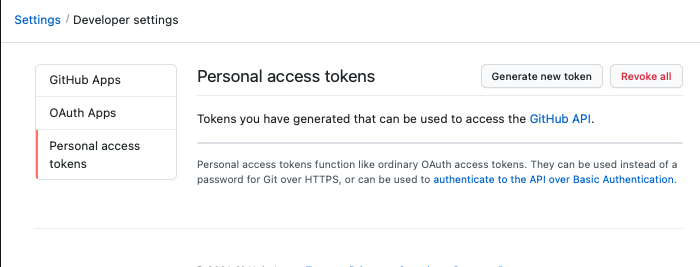


1. Click Generate new token. In order to proceed, you might be prompted to authenticate your GitHub account if you haven't done that before.
    
    

1. Enter a note to better identify the token, e.g. `oci-deploy-orm`. 

1. Then, you should define the expiration for your token, e.g. 30 days.

1. Finally, under `Select scopes` section, you should check only the top level `repo` scope which should automatically select its dependencies. All the remaining scopes must be left unselected. This will allow ORM to integrate with all your repositories.

    

1. In the bottom of the page, you should click on `Generate token`  

1. Then copy the token value and store it safely as we are going to use it soon and it won't be displayed again. If you couldn't make a capture of or lost  your token, you can safely generate a new one and update your configurations.

    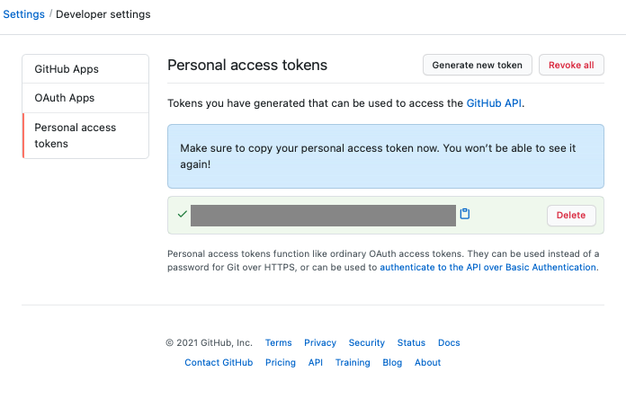


For more details about PAT, check the [GitHub documentation](https://docs.github.com/en/github/authenticating-to-github/keeping-your-account-and-data-secure/creating-a-personal-access-token)


### Create a user access token

We will be creating an *Auth Tokens* in this step.The same will be used while deploying the stack or creating new pull requests in the further steps.

1.  Go to OCI Console > Identity & Security

     
    

2. Select Users under Indentity option.

    

3. Click the name of the respective OCI user.

4. From the left pane select Auth Tokens.

    

5. Click on Generate Token.

    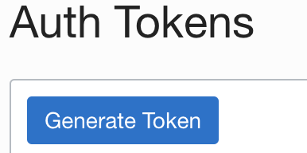

6. Give a description 

    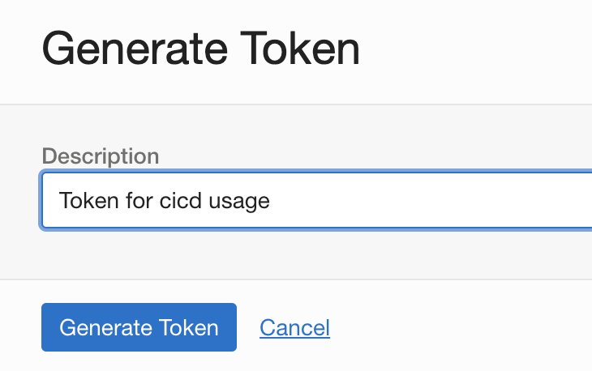

7. Click on Generate Token.
8. Copy and save the token securly.

    

The token is essential for further steps ,so save it securly and do not expose as it has same previledge as the user credentials.Read more [here](https://docs.oracle.com/en-us/iaas/Content/Identity/Tasks/managingcredentials.htm#Working)


### Change Terraform template

The existing Terraform template code we imported into the git repository was designed primarily to run through Terraform CLI which uses user/key authentication mode declared in the Terraform OCI provider template. However, when deploying the Terraform template through ORM, the OCI service itself uses an authentication mode based on Service principal, which identify the user and region logged in through the OCI Console (or CLI/API).

Therefore, deploying the template through ORM require us to make some changes to the code to remove the user/key authentication settings. 

There are 2 files we need to change:
    - providers.tf
    - variables.tf


#### Create Feature branch

To isolate the development work without affecting the default base branch, we are going to create a "Feature branch" on GitHub. The feature branch is a popular source code technique where developers open a branch when they start working on a new feature. All the code is pushed into that feature branch upon completion. At the end of the day (or development cycle) they integrate their changes into the default base branch with the rest of the team changes altogether to release their feature.

We are going to create a feature branch and change the code directly through Github. After that, we are going to merge the code into the default base branch through a process called `pull request`. The pull request on GitHub tell others about changes you make in the code and allow collaboration between team members before these changes get merged into the default base branch.

1. Go back to the main page of the GitHub repository we imported on STEP 2.

1. Click branch selector menu:
    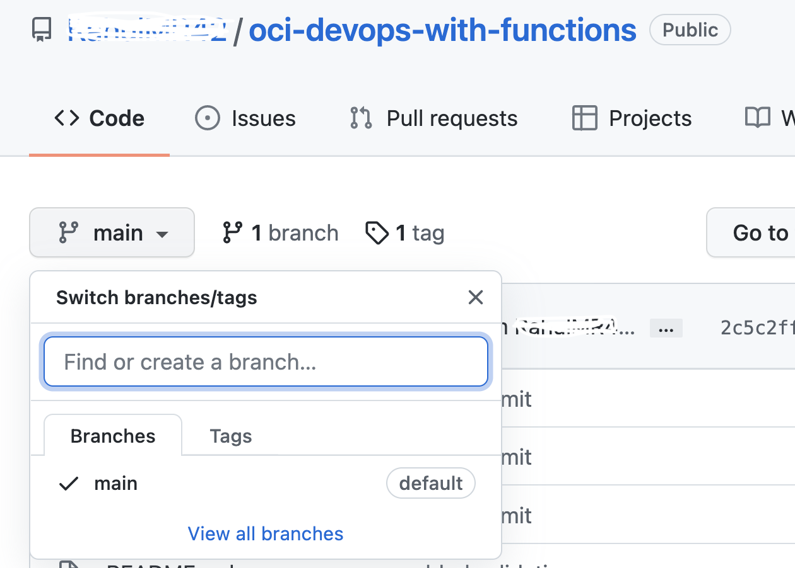

1. Enter a new branch name `update-tf` then select `Create branch`.
    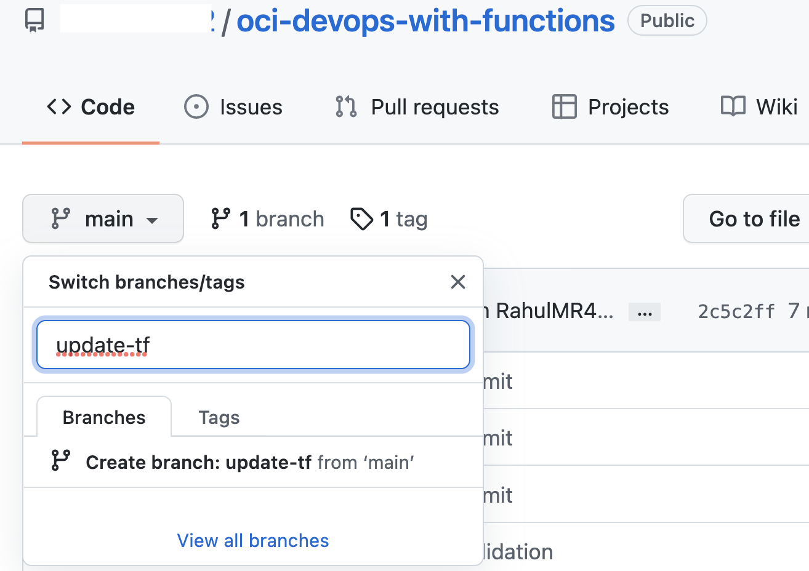

1. The `update-tf` branch was created and it should show up as the current selection in the branch menu. If not, make sure you select the `update-tf` branch before changing the code in the next steps.
    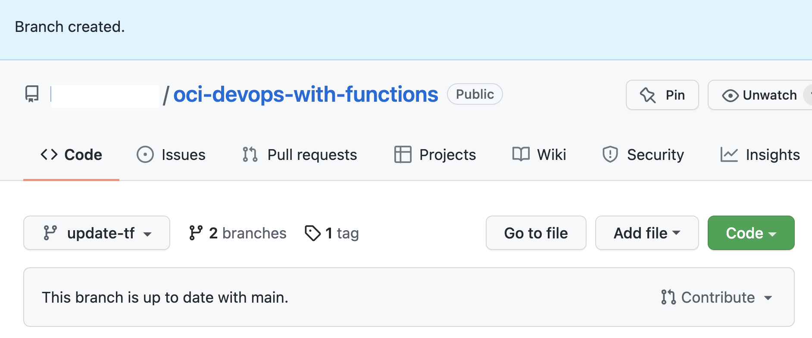


#### Edit Terraform template files

  
1. Click on `providers.tf` file. To start editing a file using the GitHub code editor just click on the pencil icon on the right hand side of the page.

    

1. We are going to delete the block of code containing the default declaration of the `oci` provider (the only one that do not contain the "alias" property). We also need to delete from the remaining providers the properties that are used exclusively with user/key authentication mode:
    - `user-ocid`
    - `fingerprint`
    - `private-key-path`.

    To make it easier, you can simply replace all the provider blocks with the code below:

    ```
    
            provider "oci" {
            tenancy-ocid = var.tenancy-ocid
            region       = var.region

            }

            provider "oci" {
            alias        = "home-region"
            tenancy-ocid = var.tenancy-ocid
            region       = lookup(data.oci-identity-regions.home-region.regions[0], "name")


            }

            provider "oci" {
            alias        = "current-region"
            tenancy-ocid = var.tenancy-ocid
            region       = var.region

            
            }
    ```
    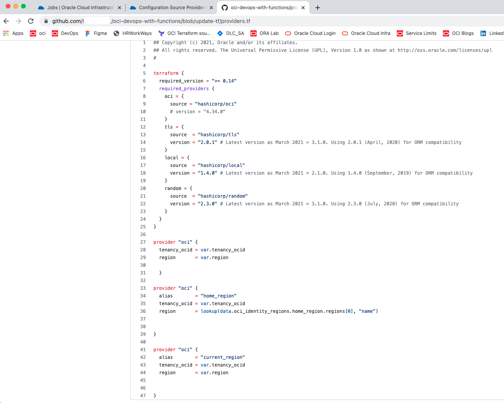


1. Next, we are going to commit these changes. At the bottom of the page in the `Commit changes` section, type a short commit message that describes the change we make to this file, e.g. `Update Terraform provider to deploy via ORM`. Then click Commit changes.

    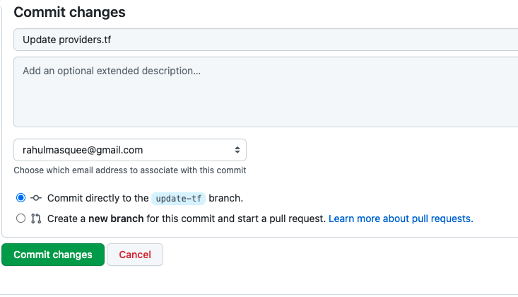
    

1. Next, go back and  edit `variables.tf` file using the GitHub editor. Make sure you selected `release-infra` on the branches selector. Delete the following variables:
    - `user-ocid`
    - `fingerprint`
    - `private-key-path`

    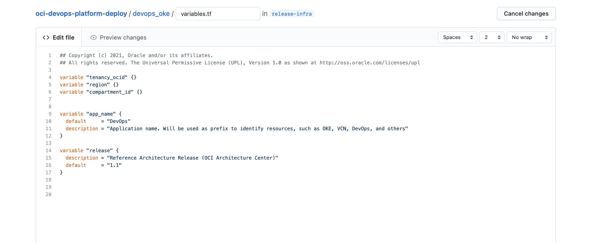

1. Commit the changes into the `update-tf` branch. 
    


`Note`: You can implement these changes to the Terraform provider block across all your Terraform projects to make them compatible with ORM.


#### Create a pull request

Finally, our code is ready to get reviewed and merged into the default base branch. We need to create a Pull request to give opportunity to other team members to review the code and ensure we are following project standard and security practices. 

1. To create a Pull request, go back to the main page of the repository - you can click on Code tab, or `oci-devops-with-functions` hyperlink in the top of the page or in the file navigation path which is located close to the branch name selector menu. 

1. Once you open the main navigation page, you can create the pull request by either click on `Compare & pull request` button or clicking on `Contribute -> Open pull request`. In the top level menu click on `Merge pull request` button. 

    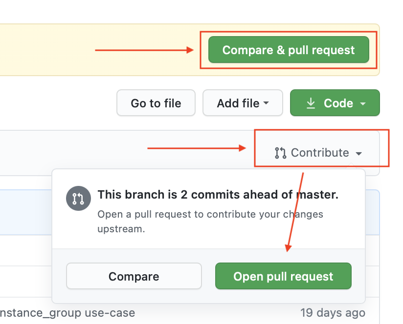


1. In the Open a pull request page, use the branch dropdown menu to select the branch you would like to merge your changes into. The branch on the left side is the target (base) branch, and the one on the right is the source (feature) branch.

    

1. Enter a Title and leave a comment so that a reviewer can understand the proposed changes and finally click on `Create pull request`.

    

1. After you create the pull request, you can ask a team member to review the changes you proposed. In this lab, we are going to skip this step and click on `Merge pull request` to complete the review process and merge the code into the base branch.

    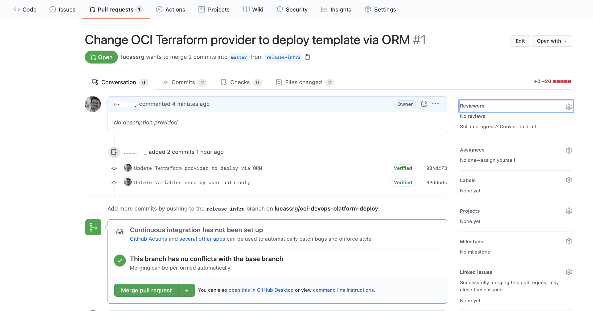

1. You will be prompted to provide some comments and then click on `Confirm merge` to complete the operation.

    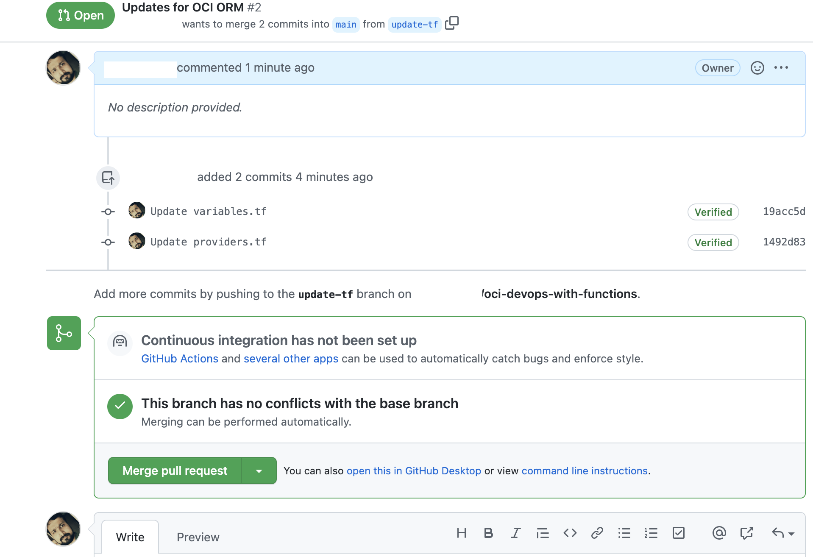

1. The Pull request should be successfully merged and closed and now you are ready to setup OCI Resource Manager to deploy the infrastructure. 

    

1. Click on `Create Configuration Source Provider` button and fill out the form:

    |Field|Value|
    |--|--|
    |Name|GitHub|
    |Description|GitHub Integration|
    |Compartment|cicd|
    |Type|GitHub|
    |Server URL*|`https://github.com`|
    |Personal Access Token|Enter the GitHub PAT value you copied earlier|
    
    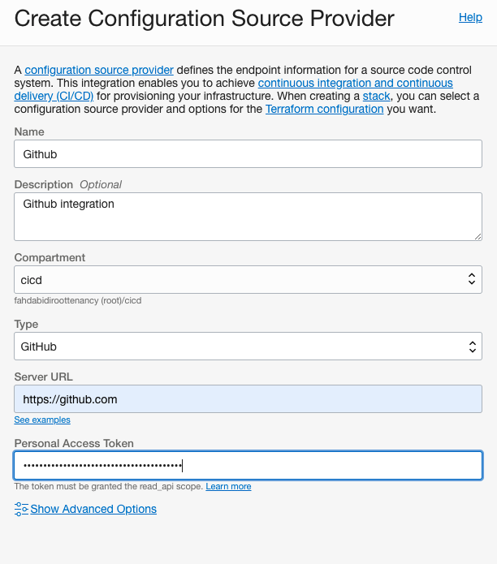

1. Click on Create button to finish this process. Once the configuration source provider was created you can click on the hyperlink in the name of the provider to go into `Configuration Source Provider Information` page. 

    

1. Then click on `Validate connection` link besides the Server URL to ensure ORM has connectivity with GitHub to fetch your repositories.

     
     


1. In case of issues with your connection, review your settings. If you are not using a GitHub free account, you may have to change the URL. Check [ORM documentation](https://docs.oracle.com/en-us/iaas/Content/ResourceManager/Tasks/managingconfigurationsourceproviders.htm#CreateConfigurationSourceProvider--exampleurls) for more details.


## Task 4: Create ORM Stack

Next step we are going to create a OCI Resource Manager Stack. The Stack is a collection of Oracle Cloud Infrastructure resources corresponding to a given Terraform configuration. Each stack resides in the compartment you specify, in a single region; however, resources on a given stack can be deployed across multiple regions. An OCID (unique identifier) is assigned to each stack.

1. Open up Resource Manager service. You can click directly on Resource Manager in the navigation path menu, otherwise, Go back to the main Navigation Menu -> Developer Services -> Resource Manager.

    

1. On the top bar, click on `Create Stack`. Make sure the `cicd` compartment is selected. 

    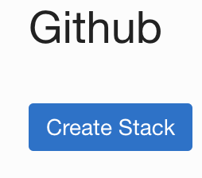

1. In the step 1. Stack information page, select `Source Control System` for the Origin of the Terraform configuration

1. In the `Stack Configuration` section, enter the following data:

    |Property|Value|
    |--|--|
    |Configuration Source Provider|GitHub|
    |Repository|oci-devops-with-functions|
    |Branch|The base branch, e.g. main|
   

1. In the Stack Information section, enter:

    |Property|Value|
    |--|--|
    |Name|oci-devops-with-functions|
    |Description|Create Function and DevOps Deploy service to manage your Functions deployments.|
    |Create in Compartment|cicd|
    |Terraform Version| leave the default option if you have the option to select it|

    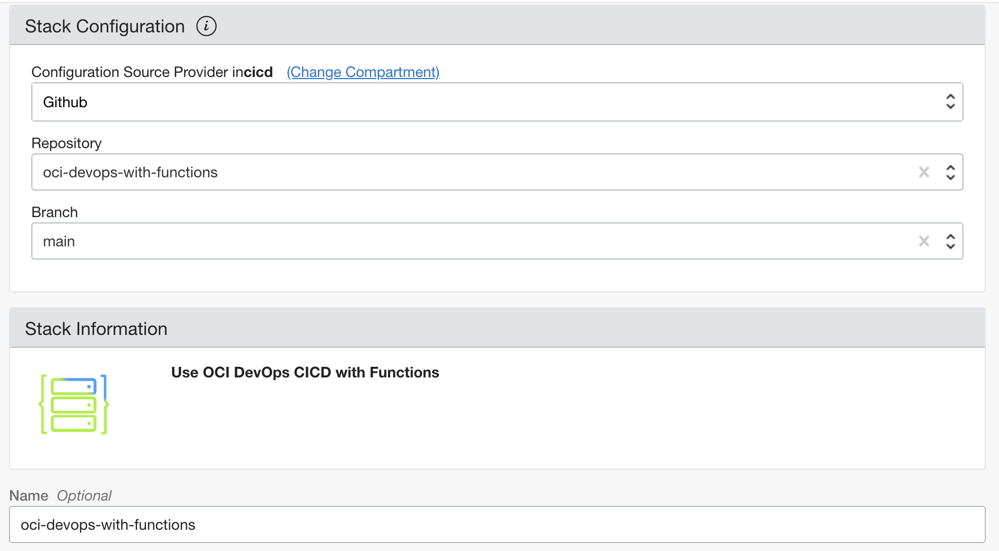

    

1. Click on Next in the bottom of the page to go to the `2. Configure variables` page.

1. In the `Configure Variables` page:
    1. set HelloWorldFn `oci-function-cicd`
    1. Set OCI Username with 'Username values'.Ensure to use proper format accordingly.
            Eg : tenancy/username or Identity provider values + Username etc.
    1. Make sure both `Execute deployment in DevOps Pipeline?` and `Show Advanced Options?` are unchecked.

    
    

    Network Configuration: No changes required, use the default values
    
    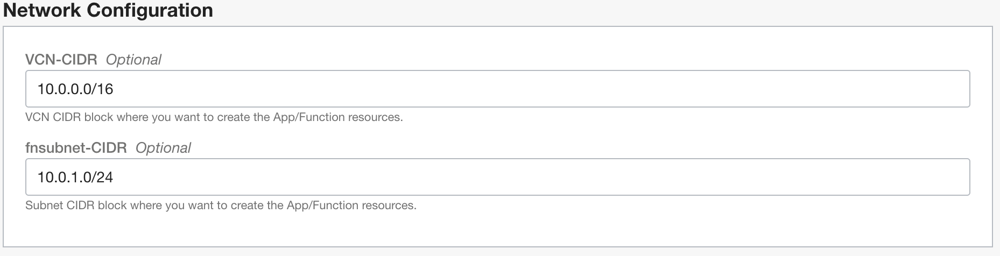

    Devops Project  :Select the right compartment.

    

    Git and OCI DevOps Repositories,stay with default values.
    
    


    Devops Build Pipeline , no changes required.

    


    : Create a Dynamic Group for DevOps Pipelines (checked).
    

    
1. Click on Next in the bottom of the page to proceed to the `3. Review` page.
    

1. After Reviewing the variable values that were modified, click on Create button to create the `infrastructure-onboard` Stack.
    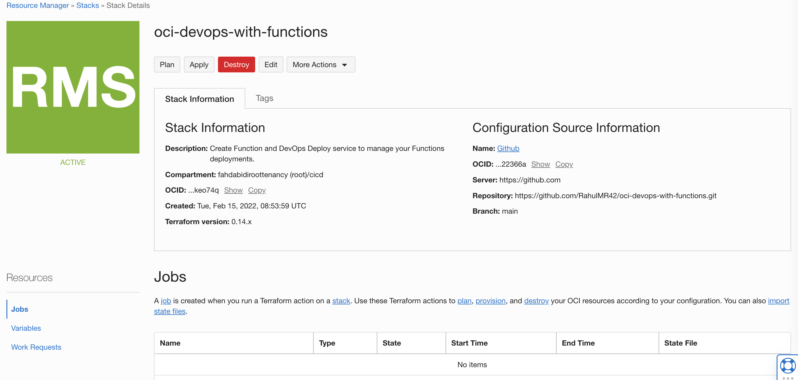

## Task 5: Provisioning the Infrastructure

1. After creating the Stack, you can perform some Terraform operations that are also known as `Jobs` in OCI. By clicking on `Plan` button and defining a name for your plan, e.g. `deploy1` Resource Manager will parse your Terraform configuration and creates an execution plan for the associated stack. The execution plan lists the sequence of specific actions planned to provision your Oracle Cloud Infrastructure resources. The execution plan is handed off to the apply job, which then executes the instructions.
    
    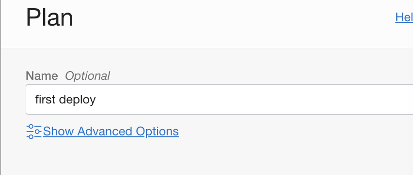


1. Once the job state is `Succeeded`, click on `Stack Details` navigation menu on the top of the page to go back to the previous page. 
    


1. Then, click `Apply` and enter a name (e.g `apply1`), select the Apply Job Plan resolution that was previously created (`first deploy`). This will apply the execution plan to create (or modify) your Oracle Cloud Infrastructure resources. This operation will take some time to complete (15-20 minutes) as it is going to provision all infrastructure resources needed by this lab .

    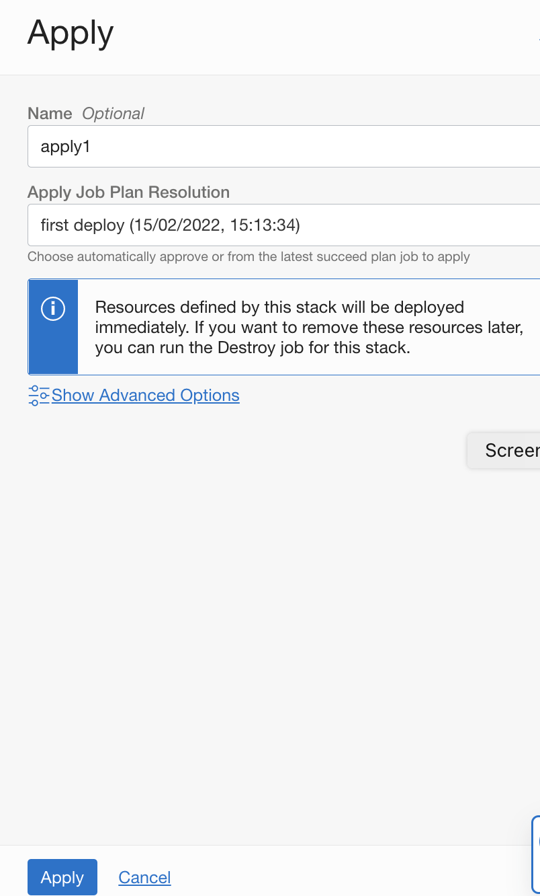

1. While the job is running, you can check the logs.
    

1. After the job succeeds, you can click on `Job Resources` menu to visualize the list of infrastructure resources provisioned.It might take 10 to 30mnts to finish the apply job.


    

1. After that, if you want to make any change to the variables, you can go back to the Stack details page, click on `Edit` button to change them. Then, you need to run Plan and Apply jobs to make these changes into the infrastructure. Always review the execution plan as some resources are immutable and they can be completely destroyed and recreated by Terraform/ORM after hitting `Apply`.

Note: in case of quota/service limit/permission issues, Apply job will fail and partial resources will be provisioned. Click on *Destroy* button will trigger the job to remove provisioned resources. 

You may now **proceed to the next lab**.

## Acknowledgements

* **Author** - Rahul M R
* **Contributors** -  
* **Last Updated By/Date** - Rahul M R, Feb 2021
