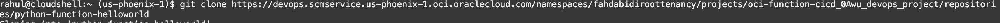
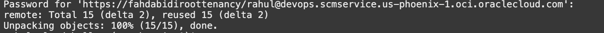
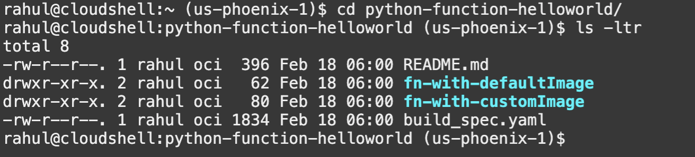
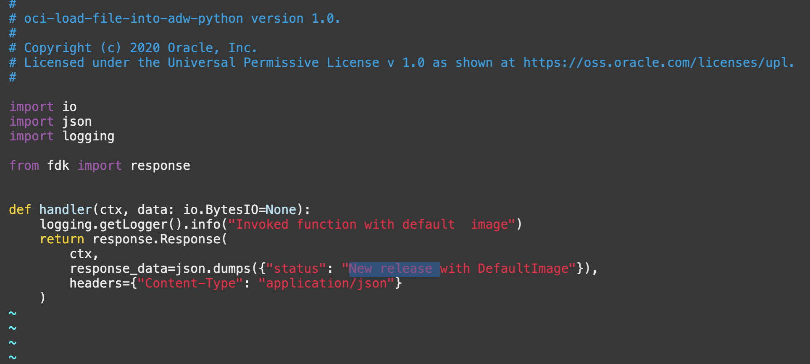
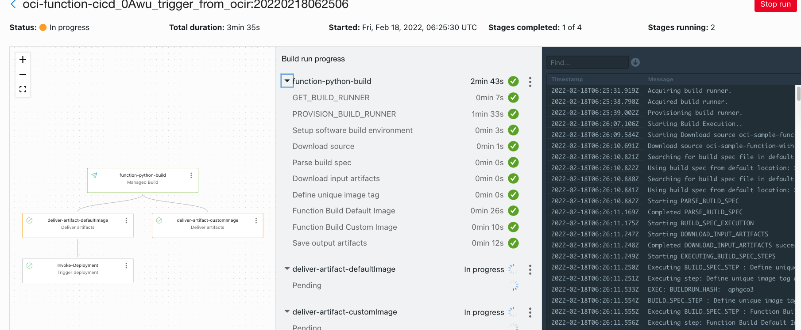
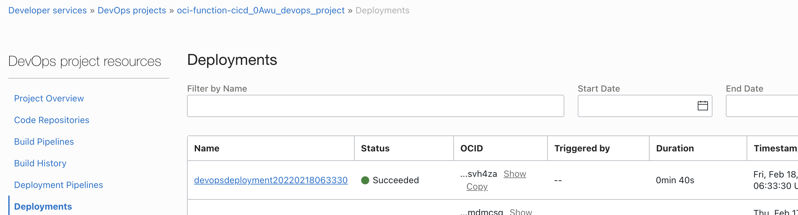
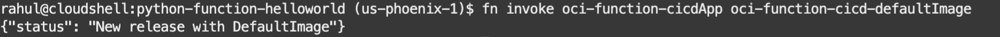
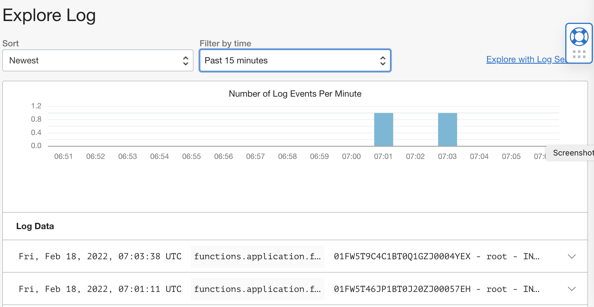
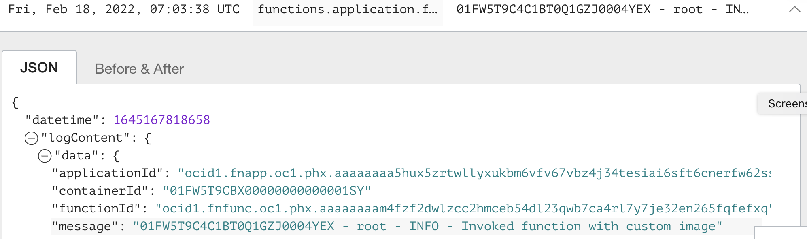

 # A new release to the existing application 

## Introduction

In this lab as a developer /SRE you  will be updating the existing code against a bug or a new feature and publish back to the repo.Followed by an automated build and deploy and a validation of application.


Estimated time: 30 minutes

### Objectives

In this lab, as a developer or SRE,

* Clone the code repo.
* Update the code base with a change.
* Push the content back to repo and wait for an automated build-deploy.
* A function invokation and validate the outcome.

## Task 1: Clone the code repo..

1. Go to Navigation Menu (aka "Hamburger" menu on the top left side of the page ) on the OCI Console -> Developer Services

    

1. Select Devops -> Project


    


1. On the Project page ensure that you are on the right compartment ,in our case it should be `cicd`.

    

1. In the samepage you should see a project named as `oci-function-cicd-<Unique Key>-devops-project`,click on it.

    


1. It will lead to a summary of all the devops resources that we created.

    

1. Click on the repository named `python-function-helloworld` under Latest code repositories.That will lead to the code repo and the python code which will be deployed to the functions.

    

     

1. Click the `clone` button.

    

1. Click `copy` option for Clone with Https url

    

1. Use the cloudshell to clone .If the cloudshell is not opened ,use the `cloudshell` icon on the top right side of the OCI console.

    

1. Clone the OCI Code repo.

    ```
    git clone https://devops.scmservice.<region>.oci.oraclecloud.com/namespaces/<name space >/projects/<project name>/repositories/<repo name>
    ```

    

1. When prompted enter the username and password .Username is the one used for login in to the OCI console prefixed with the tenancy name or identity service url

    example : mytenacy/myuser

    

1. Provide the password ,here the password is the `Auth token` that created and used while building the infra strecture.

    

1. Switch the clone repo.

    ```
    cd python-function-helloworld/
    ls -ltr 

    ```
    

## Task 2: Update the code base with a change.

1. Update the function code

    ```
    vi fn-with-defaultImage/func.py
    ```

1. Once it opened the vi prompt press  `ESC` and `i` and change to `insert` mode for vi editor.
   Use the cursor and update the status message with a new message

      

1. Press `ESC` and `wq!` and save the file.

    

1. Open the file and valid the content is as below.

    ```
    cat fn-with-defaultImage/func.py
    ```

    ```
    #
    # oci-load-file-into-adw-python version 1.0.
    #
    # Copyright (c) 2020 Oracle, Inc.
    # Licensed under the Universal Permissive License v 1.0 as shown at https://oss.oracle.com/licenses/upl.
    #

    import io
    import json
    import logging

    from fdk import response


    def handler(ctx, data: io.BytesIO=None):
        logging.getLogger().info("Invoked function with default  image")
        return response.Response(
            ctx, 
            response-data=json.dumps({"status": "New release with DefaultImage"}),
            headers={"Content-Type": "application/json"}
        )

    ```


1. Update the code base for custom function codebase.

    ```
    vi fn-with-customImage/func.py

    ```
1. Use `ESC` + `i` and switch to insert mode and change the status message.


    


1. Press `ESC` and `wq!` and save the file.

    

1. Open the file and valid the content is as below.

     ```   

    cat fn-with-customImage/func.py
    ```

    ```
    # Copyright (c) 2020 Oracle, Inc.
    # Licensed under the Universal Permissive License v 1.0 as shown at https://oss.oracle.com/licenses/upl.
    #

    import io
    import json
    import logging

    from fdk import response


    def handler(ctx, data: io.BytesIO=None):
        logging.getLogger().info("Invoked function with custom image") 
        return response.Response(
            ctx, 
            response-data=json.dumps({"status": "New Release with customImage"}),
            headers={"Content-Type": "application/json"}
        )

    ```
## Task 3: Push the content back to repo and wait for an automated build-deploy.

1. Push the changes back to the OCI code repo.


    ```
    git add -A
    git commit -m "updated the codebase"
    git push origin
    ```

1. Provide the `username` and `Auth token` when prompted.

    

1. Check the status back to `OCI Console Devops Project view`.From the `DevOps project resource` click on `Build History`.

    

    You should see an ongoing build .The build is triggered automatically based on the git push action completed.

1. Click on the `the same build run` progressing and wait for all the steps to complete.

    

    

1. Switch back to `Devops Project page` and from `DevOps project resources` click on the `Deployments`

    

1. Click on the very last deployment and ensure that all the steps are completed.

    


## Task 4:A function invokation and validate the outcome.

1. Switch back to cloud shell.Validate the function apps.

    ```
    fn list apps
    ```

    


    Incase the function app is not valid ,go back to `OCI Console` >`Developer Services` >`Functions`>`Applications`>`oci-function-cicdApp`>`Resources` > `Getting started` and follow till step 3.

    

1. List the functions.

    ```
    fn list functions oci-function-cicdApp

    ```

    

1. Invoke the function with deault image and validate the changes 

    ```
    fn invoke oci-function-cicdApp oci-function-cicd-defaultImage
    ```
    Output should  be 

    ```
    {"status": "New release with DefaultImage"}

    ```

    

1. Invoke the function with custom  image and validate the changes 

    ```
    fn invoke oci-function-cicdApp oci-function-cicd-customImage
    ```
    Output should  be 

    ```
    {"status": "New Release with customImage"}

    ```
    


    Optional: You may verify the execution via OCI Apps Log object as well ,via OCI `Function application view` >`Resources` >`Logs`>`Log Name`>`Explore Log`

    

    

    


You may now **proceed to the next lab**.


## Acknowledgements

* **Author** - Rahul M R
* **Contributors** -  
* **Last Updated By/Date** - Rahul M R - Feb 2022


