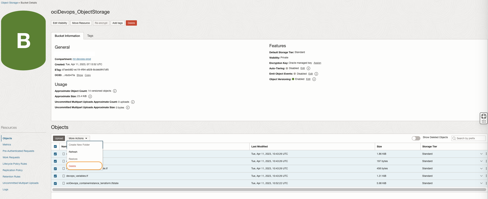
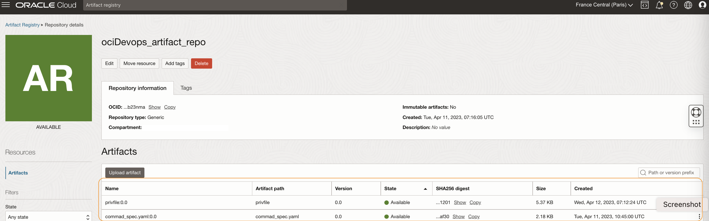
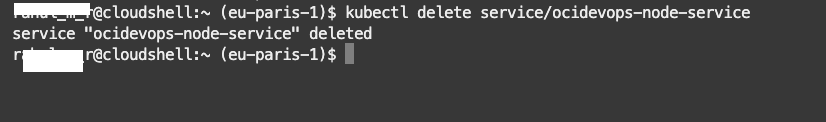
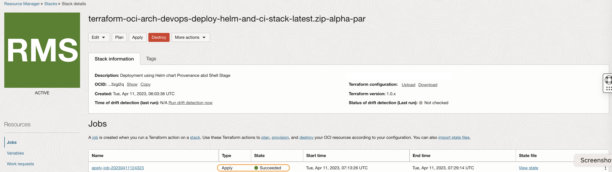
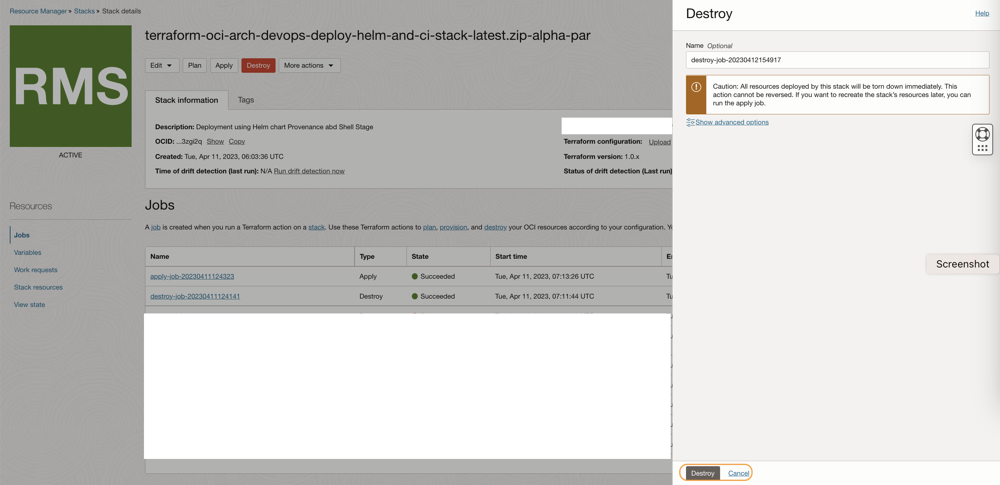
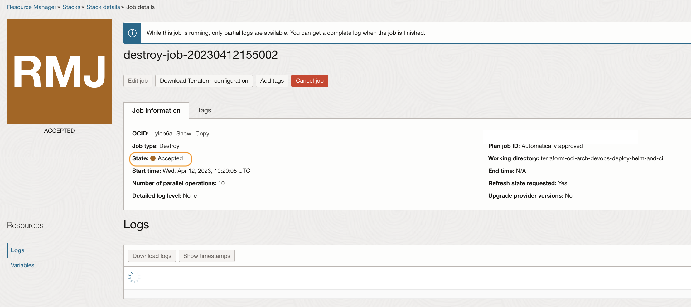
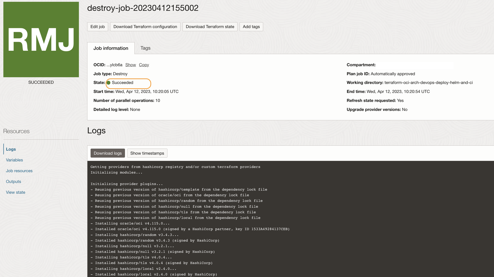
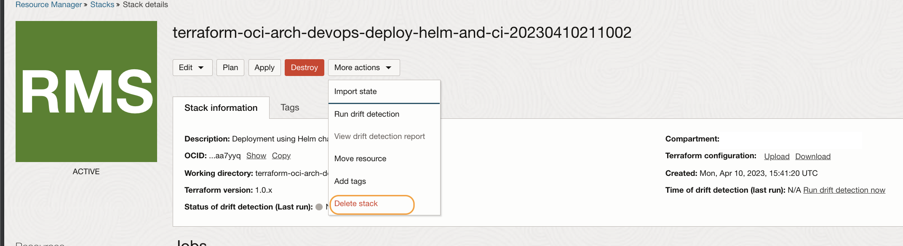
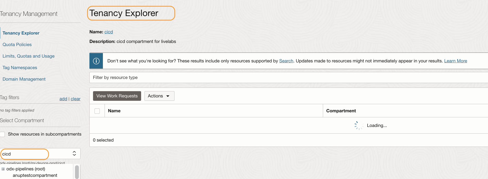

# Release resources created through the workshop.

## Introduction

Congratulations, you complete the workshop. You may want to release the cloud resources created through this workshop. We will perform certain manual release and the rest of the infrastructure resources via OCI Resource manager

Estimated Lab time: 15 minutes

### Objectives

In this lab, you will:

* Release Infrastructure Resources

### Prerequisites

* An Oracle Free Tier(Trial), Paid or LiveLabs Cloud Account
* GitHub account


## Task 1: Release resources manually.

1. The resources that are created outside of the resource manager need to delete manually. Always double-check and confirm before performing any deletion, as once deleted data or resources won't be recovered.

1. Open OCI Console. Search `Buckets` in the search tab and open the object storage bucket. Delete all the objects that are created during the lab within the bucket.

    

1. Search `Artifact Registry` within the search box and open the Artifact registry repo. Use the `3 dots` against the artefacts and delete them.

    

1. Launch the cloud shell where we have established our connection to the `OKE Cluster`.Run the below commands to delete the Load balancer got created as part of the helm deployments.

    ```java
   <copy>
    kubectl delete service/ocidevops-node-service
   </copy>
    ```

    

## Task 2: Clean up the OCI Resources.

1. We will be using OCI Resource Manager to remove all the infrastructures created at the beginning of this workshop. The actions will clean up all the resources (unattended).

1. Search `Stacks` within the search box and open the stack.

    

1. Click on the `Destroy` button. Provide a confirmation.

    

1. Wait for the destroy job to complete. In case of any error, check the logs and act accordingly.

    

1. It will take several minutes to finish the job.

    


1. Within the stack use option `Delete stack` and delete the stack entry.

    


## Task 3: Delete the compartment.

1. Search `Compartment` in the search box and open the concerned compartment.

    

1. Click on `Delete` and delete the compartment. As an option, You can use `tenancy explorer` and validate all the components are deleted within the compartment.

    

    


You may now **proceed to the next**.


## Acknowledgements

* **Author** - Rahul M R
* **Last Updated By/Date** - Rahul M R - April 2023

