# Provision the Infrastructure

## Introduction

In this lab exercise, you will provide all the Infrastructure resources used by your applications through Infrastructure As Code (IaC) using [Terraform](https://www.terraform.io) on [Oracle Cloud Infrastructure Resource Manager service (ORM)](https://docs.oracle.com/en-us/iaas/Content/ResourceManager/Concepts/resourcemanager.htm).

If you are not familiar with Terraform, this is an open-source tool that allows you to write infrastructure as code using declarative configuration files that will represent the state of your infrastructure. OCI Resource Manager allows you to share and manage Terraform configurations and state files across multiple teams and platforms. You can connect Resource Manager to your Git repository by setting up a Configuration Source Provider.

Estimated time: 30 minutes

### Objectives

In this lab, you will:

* Create an IAM compartment to isolate and organize your CI/CD cloud resources
* Create necessary prerequisites for infra creation.
* Provision Infrastructure: Network, IAM, OCI Container registry, OCI OKE and, DevOps elements.

### Prerequisites

* An Oracle Free Tier(Trial), Paid or LiveLabs Cloud Account
* User that belongs to the Administrator group or has granted privileges to manage multiple OCI resources (IAM, ORM, DevOps, OKE, Network, etc).

## Task 1: Create CICD Compartment

Compartments are used to organize and isolate your cloud resources. It is always recommended to carefully design your compartment structure and which groups will have access to them. In this lab exercise, we will create the `cicd` compartment for managing all resources created through the cicd pipeline. You can create [IAM Groups and Policies](https://docs.oracle.com/en-us/iaas/Content/Identity/Concepts/policygetstarted.htm) to control who has access to visualize/manage the resources in that compartment.

1. Go to Navigation Menu (aka "Hamburger" menu on the top left side of the page ) -> Identity & Security -> Identity -> Compartments

1. To create a compartment in the tenancy (root compartment) click Create Compartment.
   Otherwise, click through the hierarchy of compartments until you reach the detail page of the compartment in which you want to create the compartment. On the Compartment Details page, click Create Compartment.

    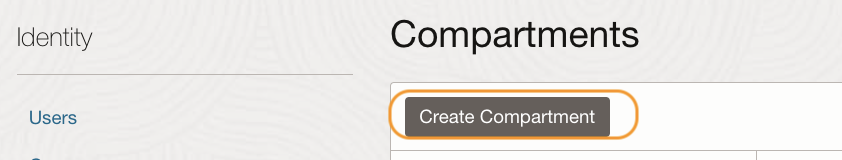

1. Enter the compartment name and description and create a compartment:

    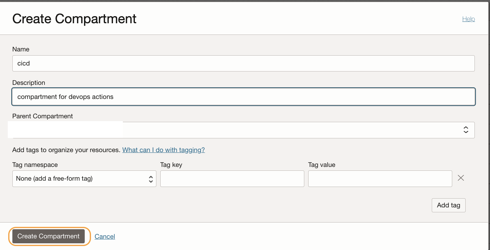

## Task 2: Create a user access token

We will be creating *Auth Tokens* in this step. The same will be used while deploying the stack or creating new pull requests in further steps.

1. Go to OCI Console > Identity & Security

    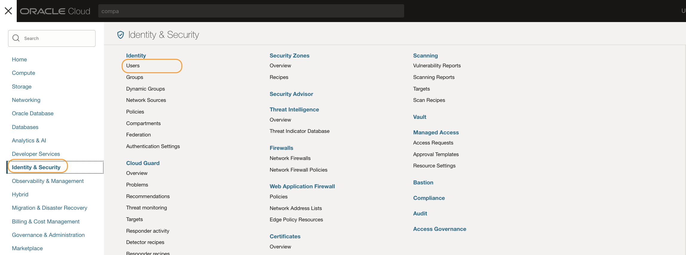

2. Select Users under the Identity option.

    

3. Click the name of the respective OCI user.

4. From the left pane select Auth Tokens.

    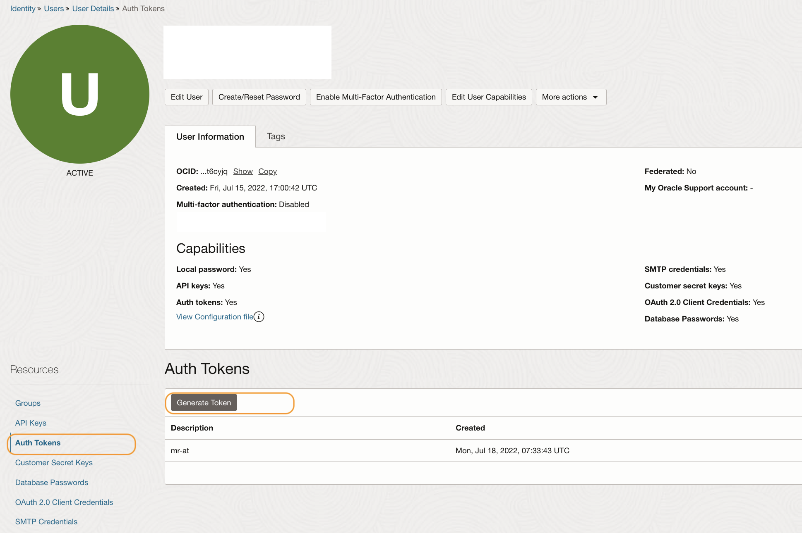

5. Click on Generate Token.
6. Give a description and Generate the token
    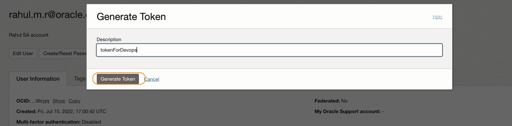
8. Copy and save the token securely.

The token is essential for further steps, so save it securely and do not expose it as it has the same privilege as the user credentials. Read more [here](https://docs.oracle.com/en-us/iaas/Content/Identity/Tasks/managingcredentials.htm#Working)

## Task3: Create a Customer Secret Key.

We will be using a Customer secret key to provide object storage access as a
backend for Terraform (via S3 compatible mode). To create, from the same user page select option Customer Secret Key. 
    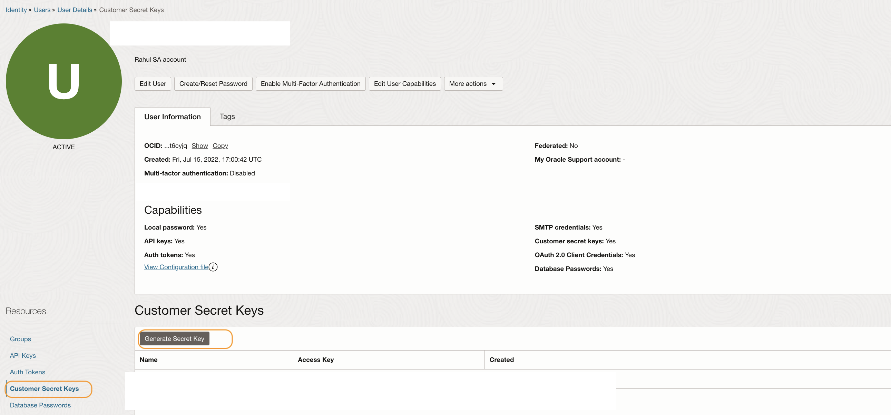

1. Click the `Generate Secret Key` button.
1. Provide a description and create the key.
1. Copy and paste the key.
1. Also copy the `Access Key ID` as well.

    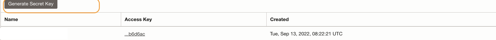

The key and id are essential for further steps, so save it securely and do not expose it as it has the same privilege as the user credentials. Read more [here](https://docs.oracle.com/en-us/iaas/Content/Identity/Tasks/managingcredentials.htm#Working)

## Task 4: Provision of the infrastructure

Oracle has published a `Reference Architecture` with a `Deploy to Cloud` option for the necessary infrastructure used. The same can be accessed using the link [here.](https://github.com/oracle-devrel/terraform-oci-arch-devops-deploy-helm-and-ci)

1. Open the link to the concerned repository's [README](https://github.com/oracle-devrel/terraform-oci-arch-devops-deploy-helm-and-ci/tree/development#deploy-using-oracle-resource-manager) file.

1. Click the `Deploy to Cloud` button.

    

1. It will launch OCI Console, provide your `Cloud Account name` and click `Next.`

    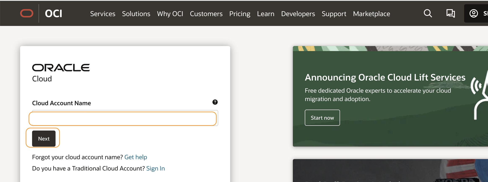

1. Use necessary login methods (local users Or with Identity) and Sigin to the console.
1. It will open the resource manager to create a stack page.

    

1. Ensure to change the OCI region on the `top right-hand corner` if needed.

1. Use the checkbox and accept the `Oracle terms of use`.

    

1. Select the compartment (Example: cd) name within the option `Create in Compartment`.

    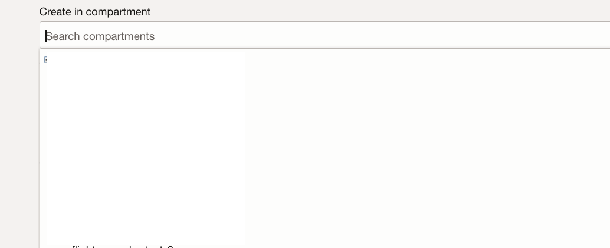

1. Click `Next` to configure the variables.
1. With the `Required configuration` provide the necessary values as below.

    - OCI username: The username that is used for Signing In.
    - OCI user auth token: The value of auth token created.
    - OCI Customer Secret Key: The value of the customer secret key created.
    - OCI Customer Secret Key ID: The ID of the customer secret key created.

   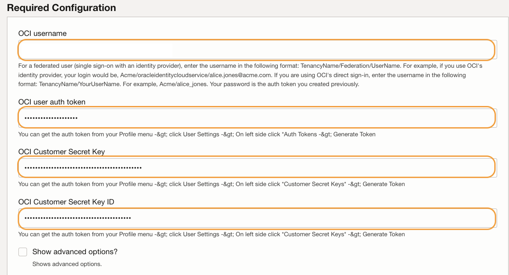

11. For `A strong password for GPG Key`, provide a strong password with the necessary complexity. The password must be more than 8 characters and include at least one uppercase letter, one lowercase letter, one number, and one of the following special characters: !@#%^*_+-:?.,[]{}. Keep a note of this password as we will be using this while creating GPG Key.

    

12. With the `DevOps Project Configuration` variable block select the desired compartment for DevOps projects.

    

13. Scroll down and can check/update any variables as optional.
14. Uncheck option `Create new OCI Vault?` if you would wish to use an existing vault and ensure to add all the necessary policies.

    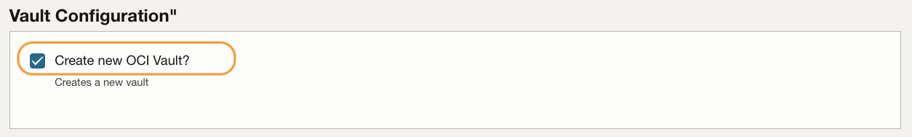

15. Likewise uncheck option `Create new OKE cluster?` to reuse an existing OKE. You need to ensure relevant policies /VCN configurations accordingly.

16. Click `Next` to review the configuration.

    

17. Click `create` to start the stack `apply job`

    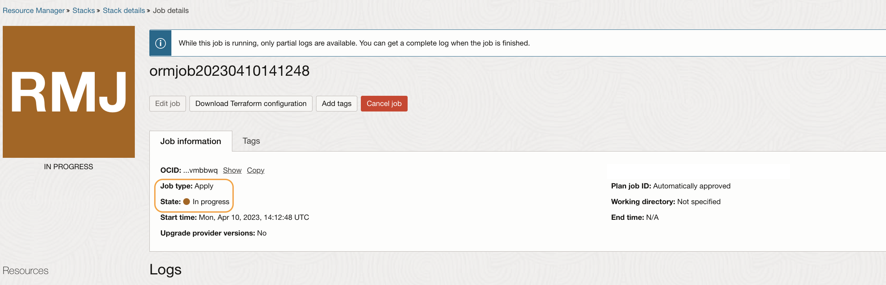

18. The apply job would take 20 or more minutes to complete. Follow the logs to know the progress.

19. In case of failure, refer to the logs and act accordingly. You may fix the concern and can apply again accordingly. Some resources may incur costs, so ensure to clean them using destroy if you would like not to proceed further.

20. Once the stacking job completes successfully you can move to the next lab.

    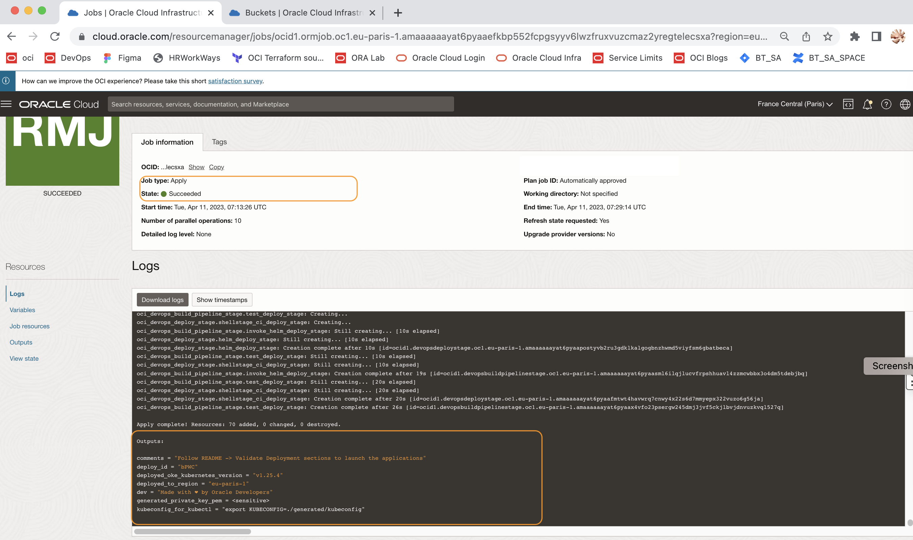

*Optional Information*

21. Incase to edit the stack configuration, from the `Stack details` page, select the `Edit terraform configuration in code editor` options.

    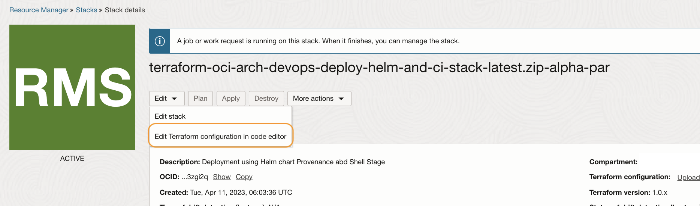

22. It will launch the OCI Code editor.

    

23. Within the code editor, under `Resource Manager`, select the desired compartment and select the stack.

    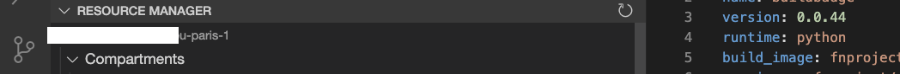

24. Post the update, we can plan or apply job initiation directly from the code editor itself.

    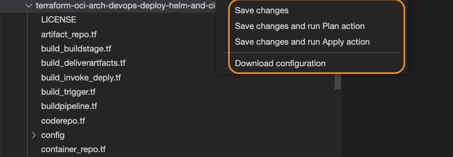

25. Check the status of the job via Resource Manager UI.

    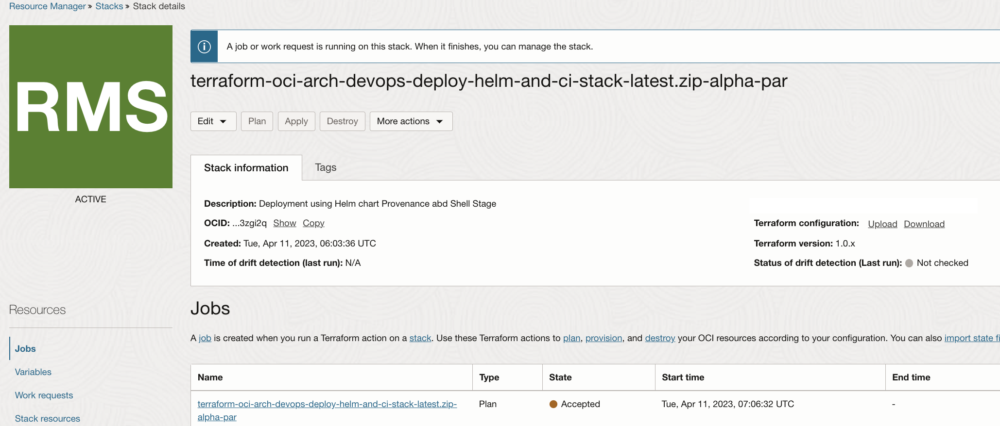

You may now **proceed to the next lab**.

## Acknowledgements

* **Author** - Rahul M R
* **Last Updated By/Date** - Rahul M R, July 2022

