# Know more about OCI Devops resources.

## Introduction

In this lab, you will be taking a close look at major OCI  resources, which were provisioned in the previous lab of this series. The same included OCI DevOps, OKE, VCN and other related resources mentioned below.

Estimated time: 10 minutes

### Objectives

In this lab, as a developer or SRE,

* Validate the OCI DevOps components.
* Validate the OCI  deployment components.

## Task 1: Validate the OCI DevOps components.

1. Go to Navigation Menu (aka "Hamburger" menu on the top left side of the page ) on the OCI Console -> Developer Services

    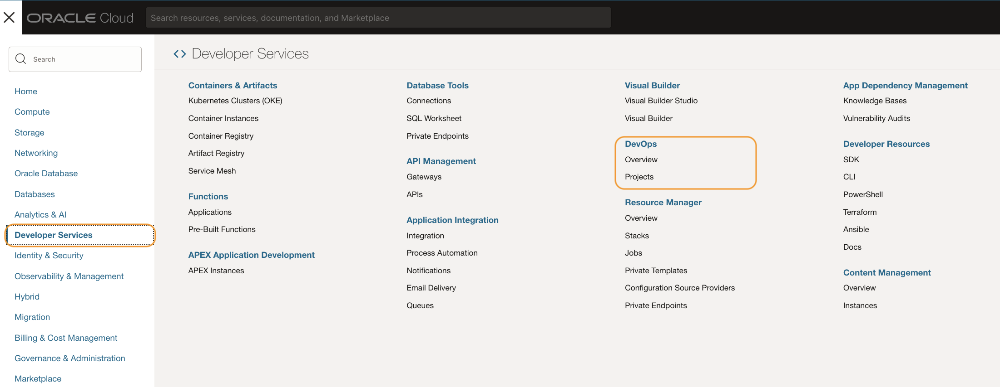

1. Select `DevOps` -> `Projects`.Always ensure that you are in the correct OCI Region/compartment.

    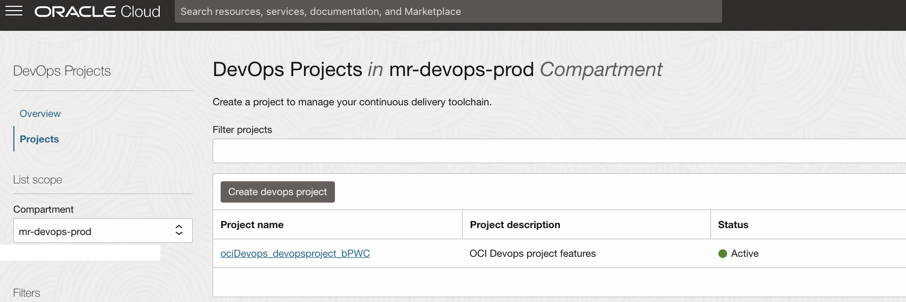

1. Click on the `name of the project` to view its subresources.

    

1. From the `DevOps project resources` list, click `Code repository` -> `name of the code repository` > `Files`

    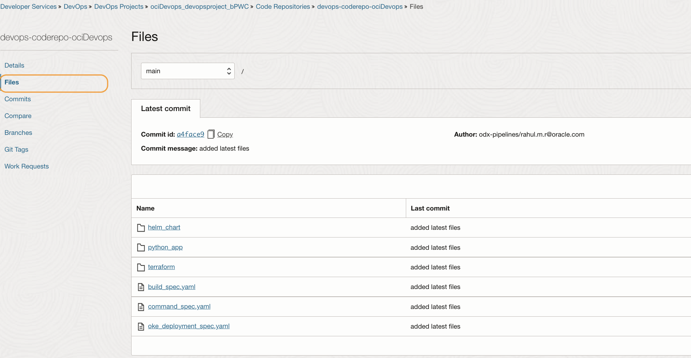

1. You should see below a list of files/folders accordingly.

    - helm_chart - A node js-based helm chart for helm deployment.
    - python_app - A sample python application for container instance deployment.
    - terraform - Contains terraform files to manage container instance creation and states.
    - build_spec.yaml - Build pipeline instructions.
    - command_spec.yaml - Instructions for shell stage.

6. Switch back to the `DevOps project resources` list and click `Build pipelines` and check the stages within each of the pipelines created. Click each one of them and verify the stages.

    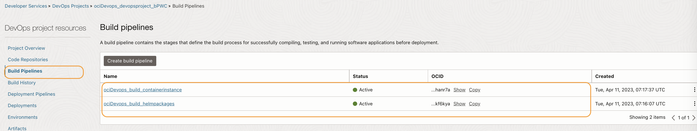

7. Switch back to the `DevOps project resources` list and click `Deployment pipelines’. There will be two of them and click each one of them to verify the stages.

    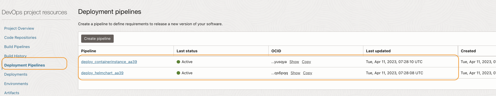

8. The deployment pipeline for container instances contains a single shell stage to perform the deployment of new images onto container instances.

    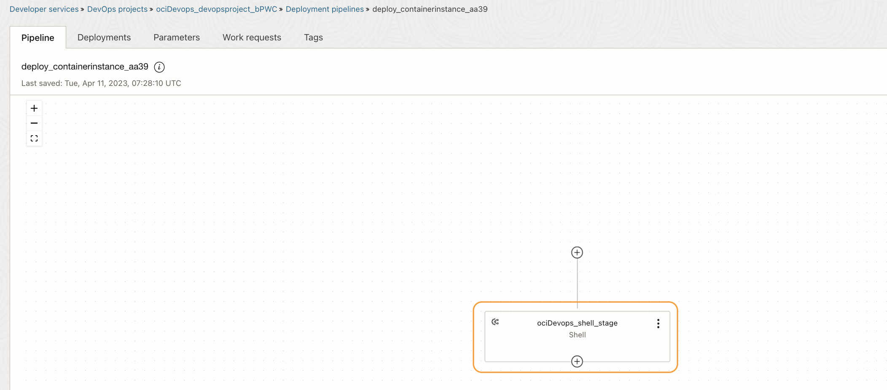

9. Likewise for the deployment pipeline for `helm chart deployment`, there will be a stage names `helm chart` for the actions.

    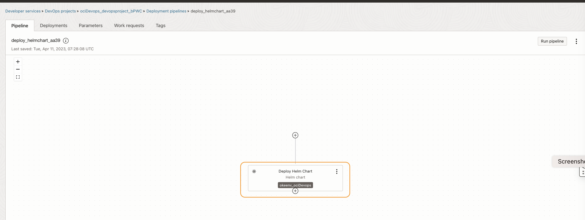

10. Switch back to the `DevOps project resources` list and click `Artifacts` and verify the various artefacts and their target paths accordingly. Refer to the table below to know more about various artifacts and their usages

    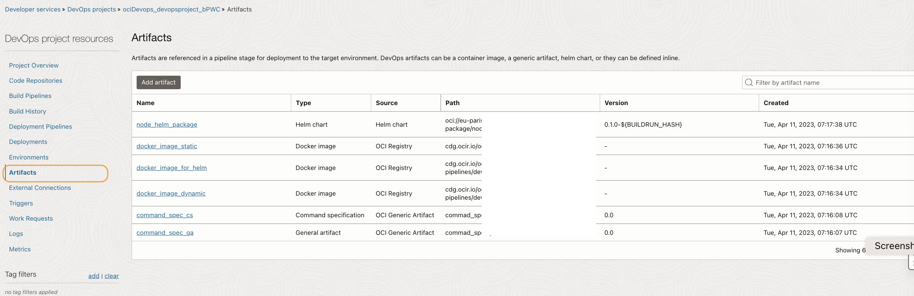

|          Name           |     Type     | Remarks                                                                                                                             |
|:-----------------------:|:------------:|:------------------------------------------------------------------------------------------------------------------------------------|
|   node\_helm\_package   |  Helm chart  | It refers to the helm chart that will be pushed to the OCI Container registry and then will be used during helm chart deployment.       |
|  docker\_image\_static  | Docker image | It is the docker image URL with a static tag for container instance deployment.                                                     |
| docker\_image\_for_helm | Docker image | It is the docker image URL for the helm chart                                                                                       |
| docker\_image\_dynamic  |     Docker image      | t is the docker image URL with a unique tag to ensure an immutable image reference for any rollback scenarios on the container instance. |
|command\_spec\_cs    |     Command specification      | It's a yaml-based instruction for the shell stage to execute.                                                                            |
|command\_spec\_ga    |     General artifact      | It is a yaml-based file that will generate as an outputArtifact from a build and then gets pushed to Oci artifactory registry.        |

11. Switch back to the `DevOps project resources` list and click `Triggers`.Using the `3 dots` against the name, click `view details

    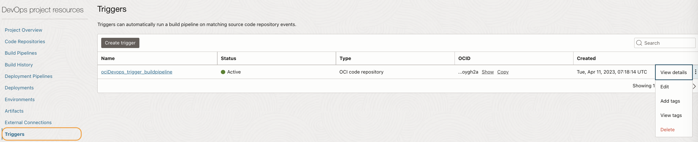

12. The details will display the `file-based triggers` configured with what to be considered (`Files to include:`) and what not to be considered (`Files to exclude`) from a code repo's merge events to trigger a build pipeline.

    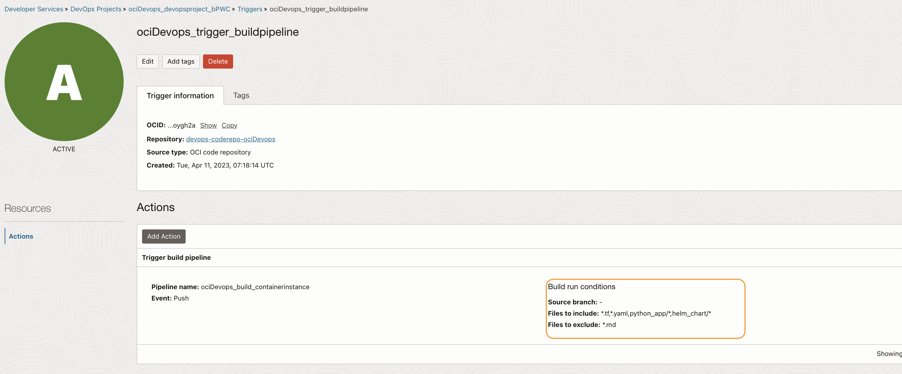

## Task 2: Optional: Validate Other OCI Resources.

1. Search for `policies` within the search box. In Identity > Policies, there will be two policies created. Click on the policies and check their statements.

    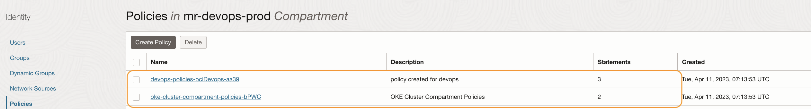

1. Within `Identity` click on `Dynamic groups` and validate the various dynamic groups and their statements.

    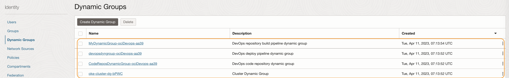

1. Search for `vault` within the search box. An OCI Vault will be used here (If you are not opted to reuse an existing vault).

    

1. Click on the `name of the vault` and select `secrets` from the left-hand pane. You will see necessary secrets are set up already.

    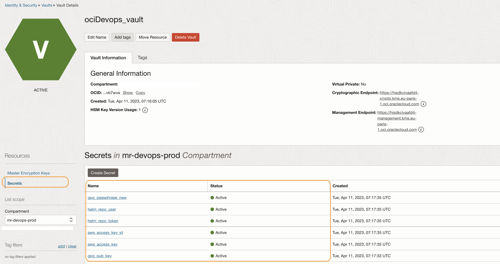

1. Search for `buckets` and validate the object storage bucket created to host the terraform backend when performing container instance creation and updation. With the backend, we will ensure that the external IP for the container instance is always the same despite the new image deployment. It's a workaround as for now container instance does not have the option to update the images. So in our lab, we will be using an image with a static tag and restarting the instance as a whole

    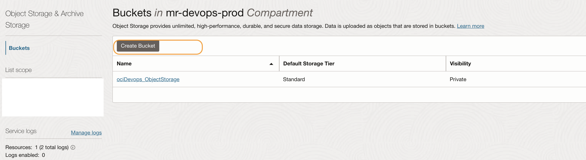

1. Search for `container registry` within the search box. There will be 3 container registry repo in alignment with the 3 docker image DevOps artifacts verified in the earlier step.

    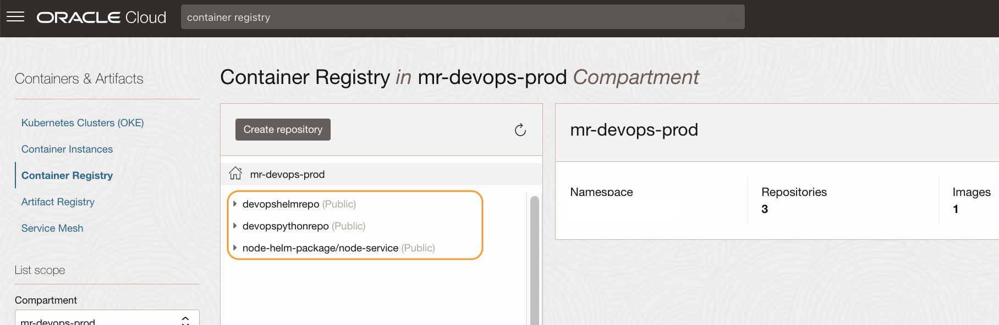

1. Search for `Artifact Registry` and validate the artifact registry repo created. The repo will be used to store all the artifacts that will be uploaded /downloaded during various DevOps pipeline actions.

    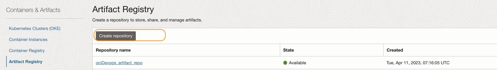

1. Search for `OKE` in the search box and there should be an OKE (Kubernetes Clusters (OKE)) created for this lab unless selected not to create a new Cluster.

    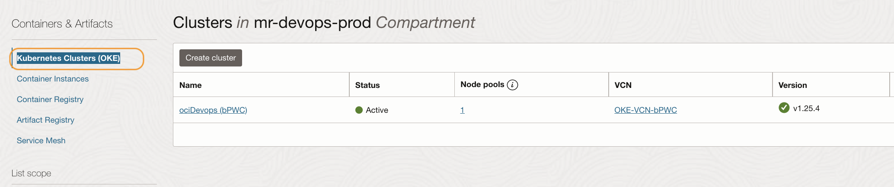

1. Search for `vcn` in the search box and there should be a virtual cloud network which will be used for container instances and Kubernetes cluster network traffics. Click on the name of the vcn and check for more.

    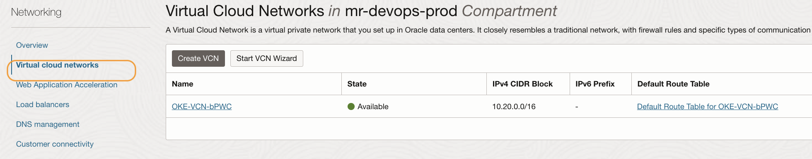

You may now **proceed to the next lab**.

## Learn More

* [OCI Devops documentation](https://docs.oracle.com/en-us/iaas/Content/devops/using/home.htm)

## Acknowledgements

* **Author** - Rahul M R
* **Last Updated By/Date** - Rahul M R - April 2023