# Validate and deploy Helm chart via OCI Devops

## Introduction

In this lab, you will be running the OCI DevOps pipeline to deploy a packaged helm chart with validation of its origin and signature.


Estimated time: 20 minutes

### Objectives

In this lab, as a developer or SRE,

* Create necessary keys for helm chart verification
* Run a build and deployment pipeline with a helm chart.
* Validate the helm deployment

## Task 1: GPG Key Setup (For Helm Signing and Verification).

1. We are using GnuPG (gpg) to set up the key for signing and verifying the helm chart. Read more about gpg [here](https://gnupg.org/).

1. We are going to install gpg and the instruction here is related to a Linux machine. You may change the procedure accordingly - https://www.gnupg.org/howtos/card-howto/en/ch02.html.


1. Follow the below instructions and download the stable version of gpg onto your workstation.

    ```java
   <copy>
    $ mkdir ~/gpg
    $ cd ~/gpg
    $  curl -O https://gnupg.org/ftp/gcrypt/gnupg/gnupg-2.4.0.tar.bz2 (Use the latest version)
    $ tar xvf gnupg-x.y.z.tar.bz2
    $ cd gnupg-x.y.z
    $ ./configure, make, make install
    $ gpg --version
    </copy> 
   ```

    

1. Create a file named `gpg_template.txt` and copy the below contents to it.

    ```java
    <copy>
    Key-Type: 1
    Key-Length: 4096
    Subkey-Type: 1
    Subkey-Length: 4096
    Name-Real: oci_devops
    Name-Email: ocidevops@domain.com
    Expire-Date: 0
    </copy>
    ```

1. Set up a strong passphrase for the key. Use the same passphrase enter during the resource manager's actions.

    ```java
    <copy>
    $ passphrase="AStrongPassword@198"
    $ echo "Passphrase: ${passphrase}" >> ./gpg_template.txt
    </copy>
    ```

1. Generate a gpg key.

    ```java
    <copy>
    $ gpg --gen-key --batch ./gpg_template.txt
    $ gpg -k
    $ rm -f ./gpg_template.txt
    </copy>
    ```
   


1. Fetch the keys and files, we will be using the private key to sign the chart and the public key and passphrase for the OCI Vault as secrets to verify during the deployment.

    ```markdown
    <copy>
    $ echo "use-agent" > ~/.gnupg/gpg.conf
    $ echo "pinentry-mode loopback" >> ~/.gnupg/gpg.conf
    $ echo "allow-loopback-pinentry" > ~/.gnupg/gpg-agent.conf
    $ echo RELOADAGENT | gpg-connect-agent
    $ echo $passphrase | gpg --batch --no-tty --export-secret-keys  --passphrase-fd 0 oci_devops >./secring.gpg 
    $ gpg --output ./helm-attestation-public-key.pgp --export oci_devops
    </copy>
    ```

   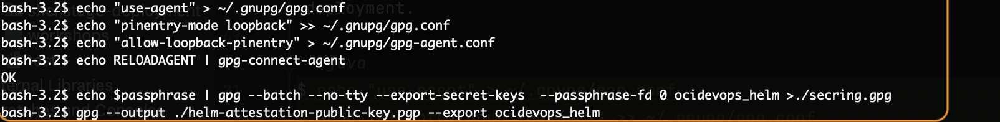


8. The file `./secring.gpg` contains the private key and ..`/helm-attestation-public-key.pgp` contains the public key. You won't be able to read them unless convert into a base64 format.

9. Search `artifact registry` in the search box and open the page

    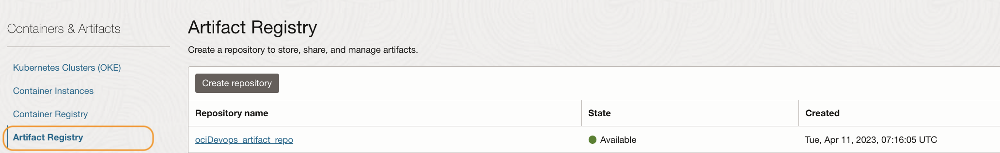

10. Click on the repo. Click the `upload artifact` button.

    

11. Upload the file ./secring.gpg to the artifact repo. You may use version 0.0 with any name.

    

12. Use the `3 dots` and copy the OCID of the artifacts.

    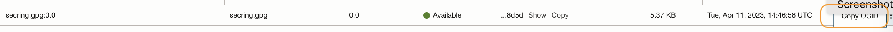

13. We will be using OCI Vault to store the base64 value of the gpg public key and the passphrase to sign and verify the helm chart. Search `vault` in the search box and open the vault.

    

14. With the secret a dummy placeholder is created with the name `gpg_pub_key`

    

15. Fetch the base64 value of file helm-attestation-public-key.pgp

    ```java
    <copy>
    $ base64 -i helm-attestation-public-key.pgp 
    </copy>
    ```
    
    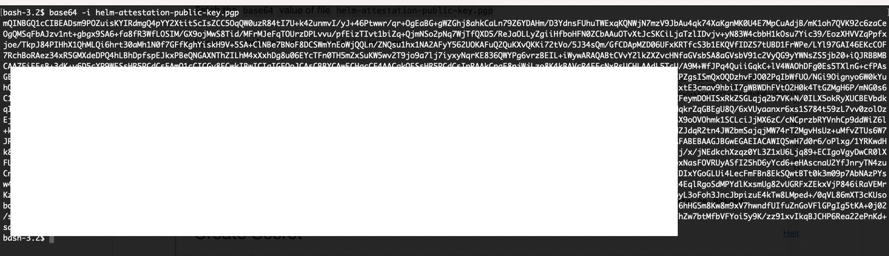

16. Click the vault secret `gpg_pub_key` and click the `Create Secret Version` button.

    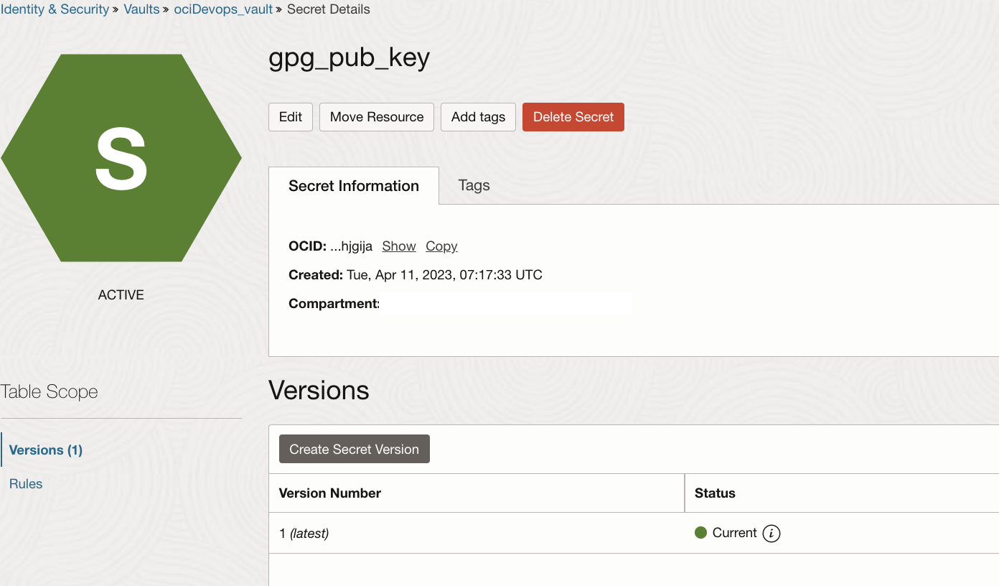

17. Create a secret for the public key and copy the base64 value to it. Ensure to use the secret Type Template as `Base64`.Click creates.

    

## Task 2: Run the DevOps pipeline.

1. If you will be using an OKE cluster, which is outside of the resource manager, be aware the deployment uses the below parameters. You can override them by manually editing the `helm chart` deployment stage within the deployment pipeline.

    ```java
    Namespace: Default
    Helm Release Name: ocidevops
    ```


1. Search `Projects` in the search box and open the DevOps projects.

    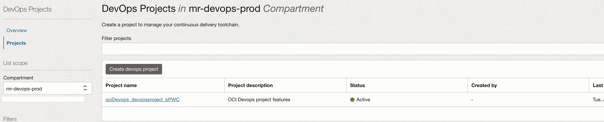

1. Click on the project name.

    

1. Within `DevOps Project resources` and click `Build pipeline` and click on pipeline named `<STRING>_build_helmpackages`.

    

1. click `Parameters` and edit the value for `GPG_ARTIFACT_OCID` using the `pen` icon.

    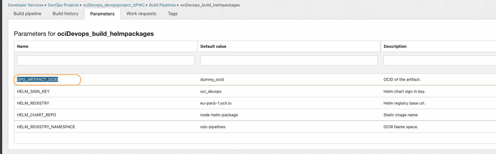

1. Update the value with `OCID of Artifacts uploaded` and use the `tick` symbol and save it.

    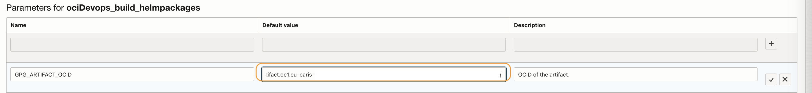

1. Switch back to `build a pipeline` and click on `Start manual run` and start a building job.

    

1. This will start the build job. While waiting for the job to complete, switch back to the `Build pipeline` tab, Click `View details` under managed build stage.

    

1. It will show the custom resource setups for the builder machines.

    

1. Close the tab, Switch to `Build history and follow the current ongoing tasks and wait for it to finish.

    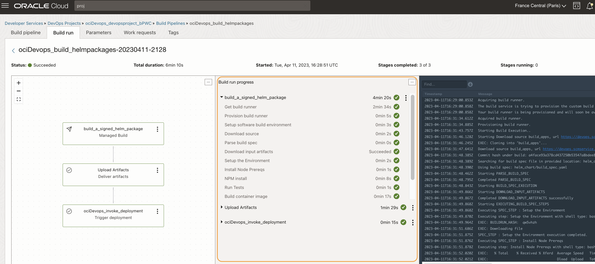

1. Switch to `DevOps Project Resources` > `Deployment pipelines`

    

1. Click the pipeline named `deploy_helmchart_<ID>`.In the pipeline use `3 dots` and view details of the helm chart stage.

    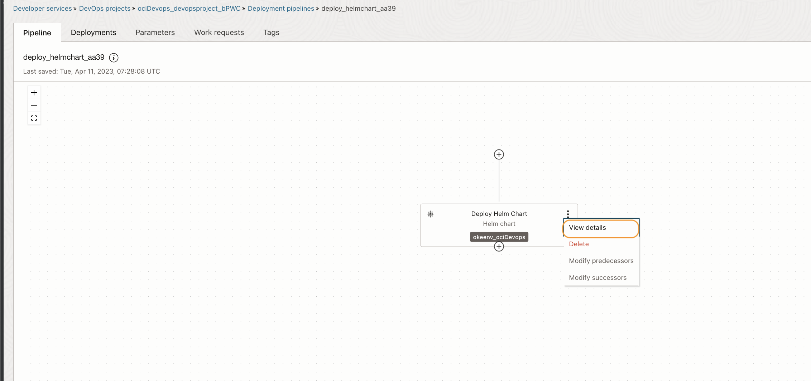

1. You can verify the different helm options and dynamic values set for the deployments.

    

1. Close and click on the `Deployments` tab and open the recent deployments done or ongoing.

    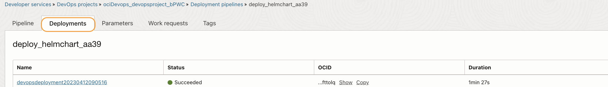

1. Click on the deployment and validate the stages and logs.

    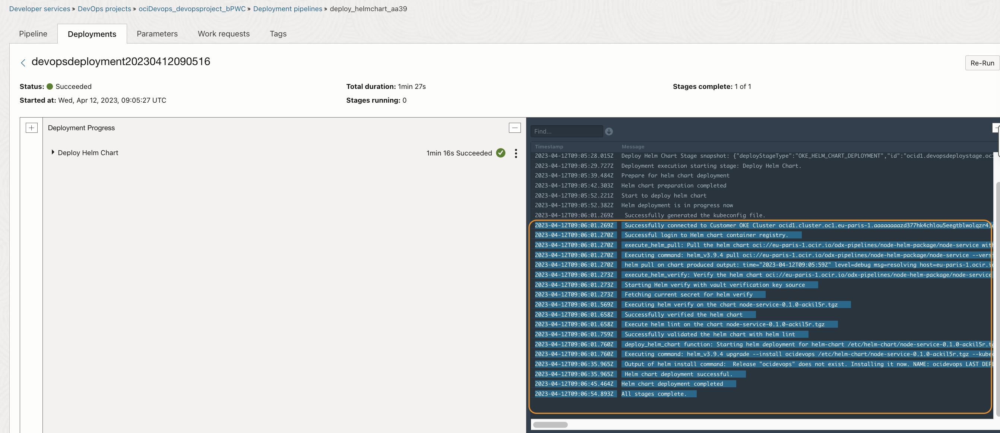

1. Search `OKE` in the search bar and open the OKE Cluster to view the deployment.

    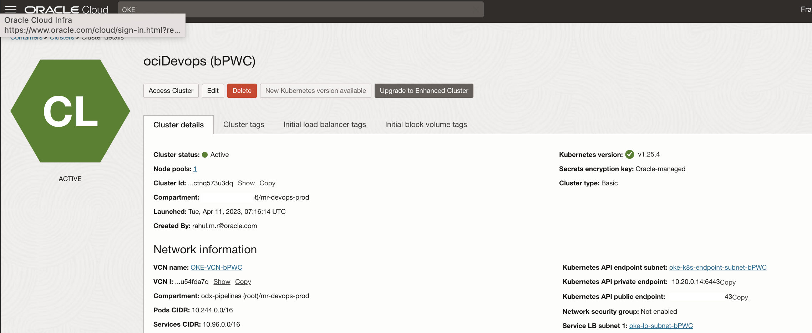

1. Click on the `Access Cluster` button.

    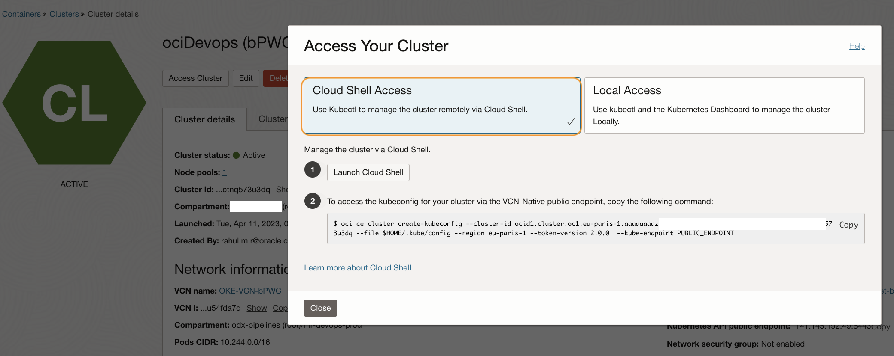

1. Preferably use `Cloud Shell Access` and set up access to your OKE Cluster.

    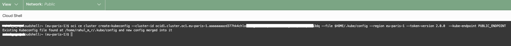

1. On the cloud shell run `kubectl get service/ocidevops-node-service` and fetch the Load Balancer IP address.

    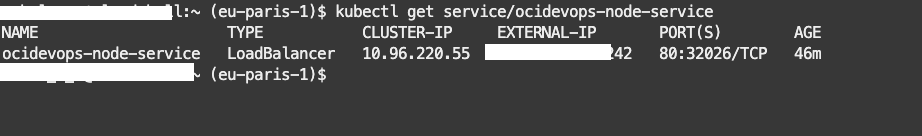

1. Launch the application by using the URL `http://LoadBalancer IP`

    

1. Optionally you can update the helm chart of the application and re-deploy the application, by running a manual build once the updated code is pushed back to the code repo.

You may now **proceed to the next lab**.

## Learn More

* [OCI Devops documentation](https://docs.oracle.com/en-us/iaas/Content/devops/using/home.htm)


## Acknowledgements

* **Author** - Rahul M R
* **Last Updated By/Date** - Rahul M R - April 2023
