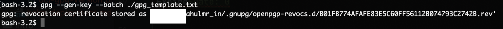
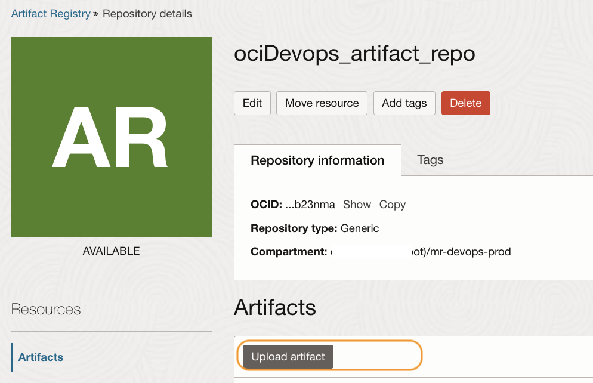
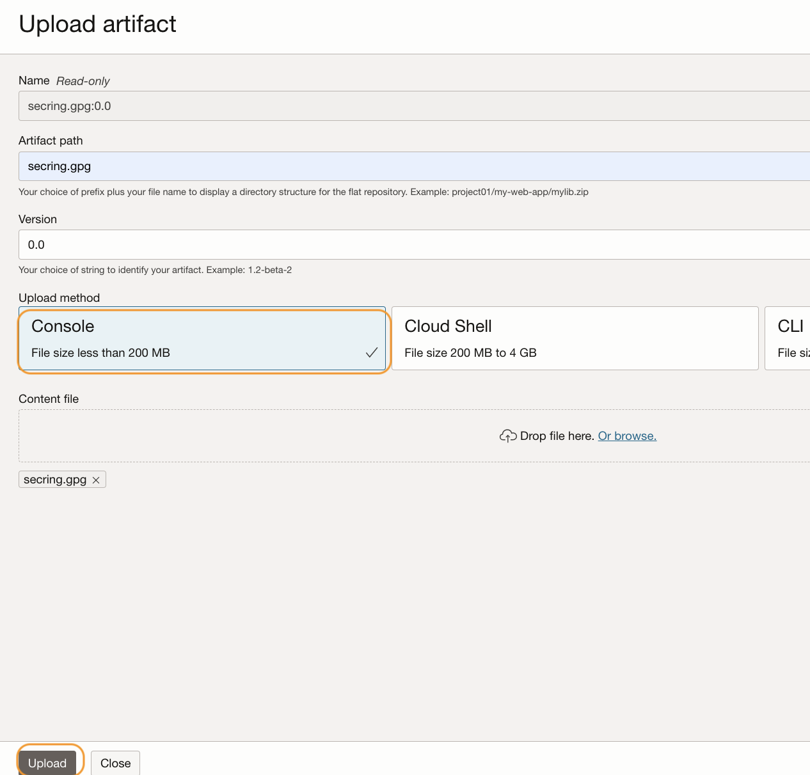
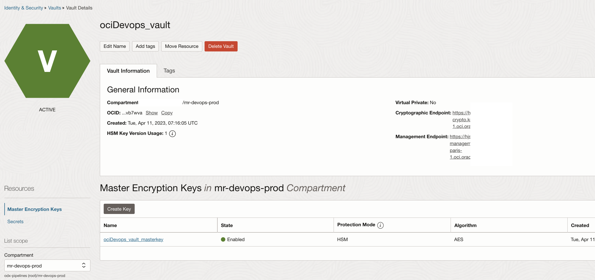
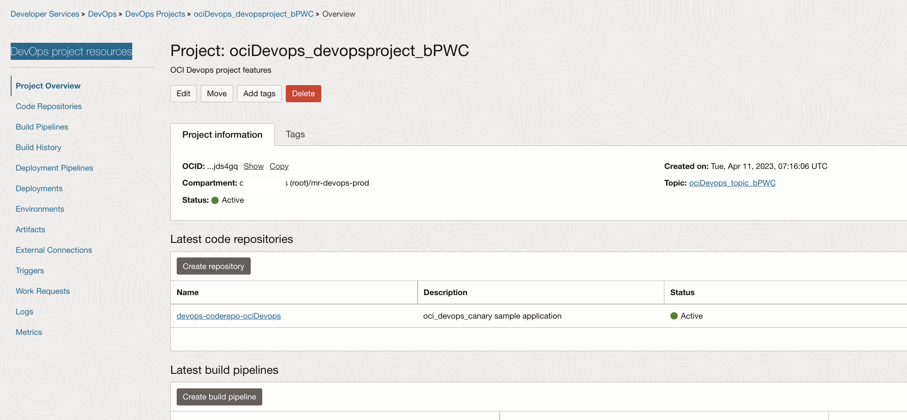
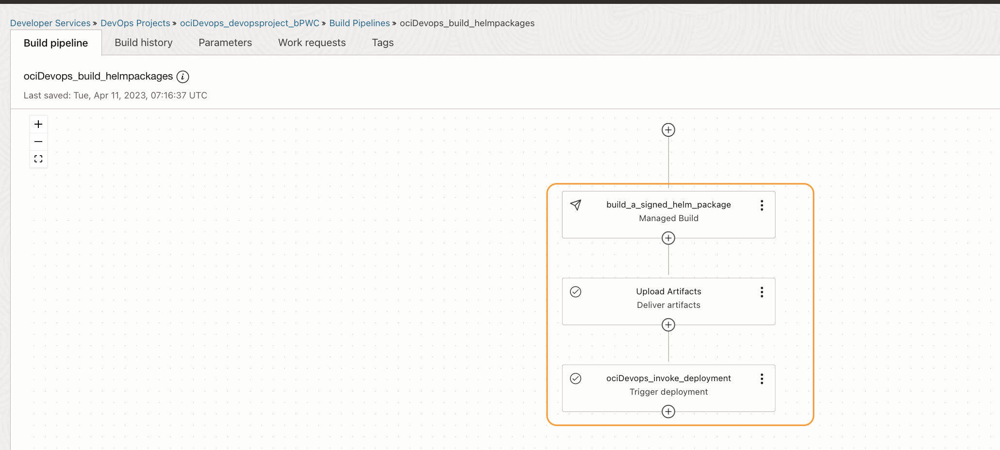
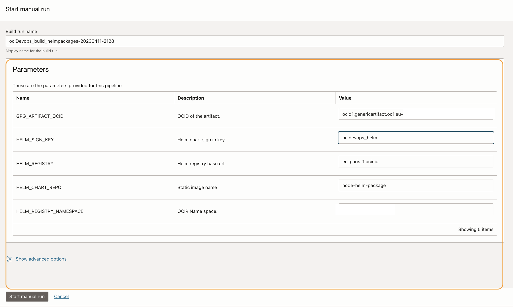
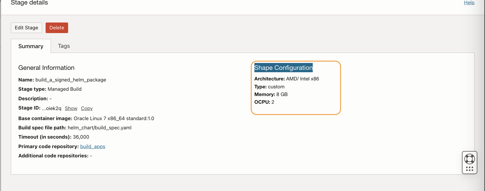
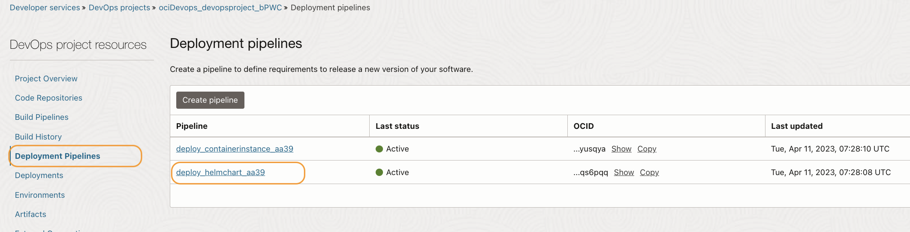

# Deployment of helm chart with valid provenance and integrity checks.

## Introduction

In this lab, you will be running the OCI DevOps pipeline to deploy a packaged helm chart with validation of its origin and signature.


Estimated time: 20 minutes

### Objectives

In this lab, as a developer or SRE,

* Create necessary keys for helm chart verification
* Run a build and deployment pipeline with helm chart.
* Validate the helm deployment

## Task 1: GPG Key Setup (For Helm Signing and Verification).

1. We are using GnuPG (gpg) to set up the key for signing and verifying the helm chart. Read more about gpg [here](https://gnupg.org/).

1. We are going to install gpg and the instruction here is related to a Linux machine. You may change the procedure accordingly - https://www.gnupg.org/howtos/card-howto/en/ch02.html.


1. Follow below instructions and download the stable version of gpg onto your workstation.

```java
$ mkdir ~/gpg
$ cd ~/gpg
$  curl -O https://gnupg.org/ftp/gcrypt/gnupg/gnupg-2.4.0.tar.bz2 (Use the latest version)
$ tar xvf gnupg-x.y.z.tar.bz2
$ cd gnupg-x.y.z
$ ./configure, make, make install
$ gpg --version
```


1. Create a file named `gpg_template.txt` and copy the below contents to it.

```java

Key-Type: 1
Key-Length: 4096
Subkey-Type: 1
Subkey-Length: 4096
Name-Real: oci_devops
Name-Email: ocidevops@domain.com
Expire-Date: 0
```

1. Setup a strong passphrase for the key.Use the same passphrase enter during the resource manager actions.

```java
$ passphrase="AStrongPassword@198"
$ echo "Passphrase: ${passphrase}" >> ./gpg_template.txt
```

1. Generate a gpg key.

```java
$ gpg --gen-key --batch ./gpg_template.txt
$ rm -f ./gpg_template.txt
```



1. Fetch the keys and files, we will be using the private key to sign the chart and the public key and passphrase for the OCI Vault as secrets to verify during the deployment.

```java
$ echo "use-agent" > ~/.gnupg/gpg.conf
$ echo "pinentry-mode loopback" >> ~/.gnupg/gpg.conf
$ echo "allow-loopback-pinentry" > ~/.gnupg/gpg-agent.conf
$ echo RELOADAGENT | gpg-connect-agent
$ echo $passphrase | gpg --batch --no-tty --export-secret-keys  --passphrase-fd 0 oci_devops >./secring.gpg 
$ gpg --output ./helm-attestation-public-key.pgp --export oci_devops
```


1. The file `./secring.gpg` contains the private key and ..`/helm-attestation-public-key.pgp` contains the public key. You won't be able to read them unless convert into a base64 format.

1. Search `artifact registry` in the search box and open the page


1. Click on the repo.Click `upload artifact` button.



1. Upload the file ./secring.gpg to the artifact repo. You may use version 0.0 with any name.



1. Use the `3 dots` and copy the OCID of the artifacts.


1. We will be using OCI Vault to store the base64 value of the gpg public key and the passphrase to sign and verify the helm chart.Search `vault` in the search box and open the vault.



1. With the secret a dummy placeholder is created with name `gpg_pub_key`


1. Fetch the base64 value of file helm-attestation-public-key.pgp

```java
$ base64 -i helm-attestation-public-key.pgp 
```


1. Click the vault secret `gpg_pub_key` and click `Create Secret Version` button.


1. Create a secret for the public key and copy the base64 value to it. Ensure to use the secret Type Template as `Base64`.Clck create.


## Task 2: Run devops pipeline.

1. Search `Projects` in the search box and open the devops projects.


1. Click on the project name .



1. With in `Devops Project resources` and click `Build pipeline` and click on pipeline named as `<STRING>_build_helmpackages`.



1. click `Paramters` and edit the value for `GPG_ARTIFACT_OCID` using the `pen` icon.


1. Update the value with `OCID of Artifacts uploaded` and use `tick` symbol and save it .


1. Switch back to `build pipeline` and click on `Start manual run` and start a build job.



1. This will start the build job .While waiting for the job to complete ,switch back to `Build pipeline` tab ,Click `view details` under managed build stage.


1. It will show the custom resource setups for the builder machines.



1. Close the tab,Switch to `Build histroy` and follow the current ongoing taks and wait for it to finish.


1. Switch to `Devops Project Resources` > `Deployment pipelines`



1. Click the pipeline named `deploy_helmchart_<ID>` and click on `Deployments` tab.

