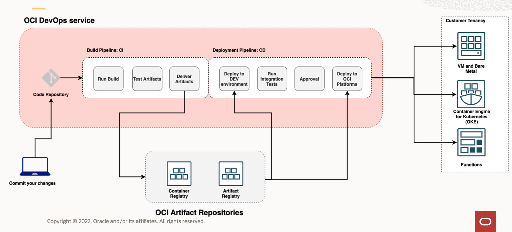
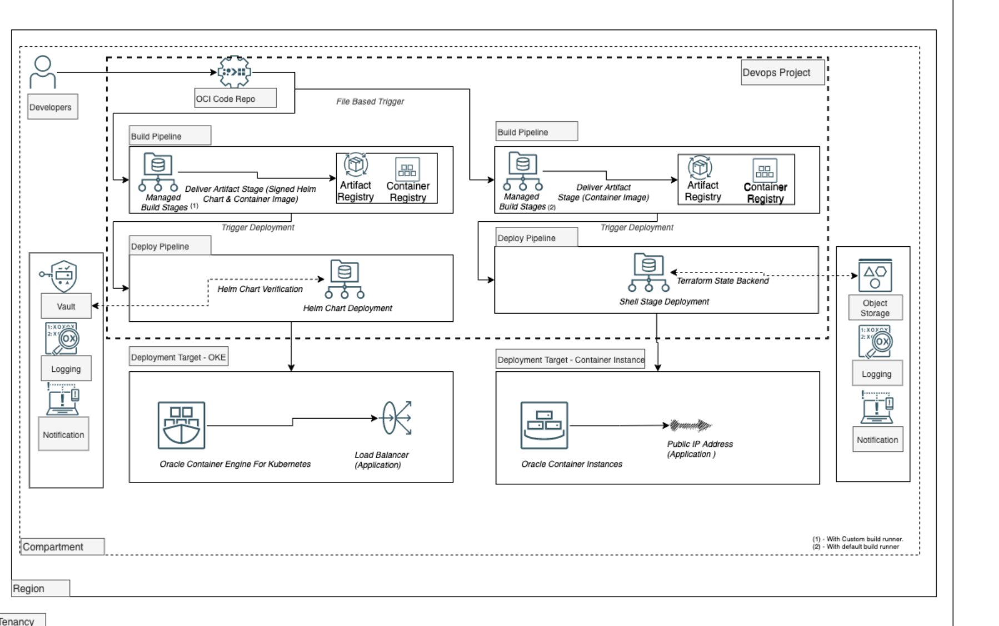

# Introduction

## About this workshop.

You will learn to use OCI DevOps helm deployment with provenance and integrity checks as well as deployment of a sample application onto Oracle container instances.

Estimated total time: 90 minutes

### Features covered

- Helm Chart Deployment with Provenance & Integrity checks: Signing a helm package and validating the integrity, by using GNU Privacy guard keys via deployment pipelines.
- Using the Shell stage to deploy the application to the OCI Container instance. : Shell stage allows you to run custom commands in the deployment pipeline. This stage can be added at any point in the deployment pipeline. Here we will be using the stage to deploy an application to the OCI Container instance.
- File-based trigger of OCI Build pipeline. : In Oracle Cloud Infrastructure (OCI) DevOps, a build run can be automatically triggered when you commit your changes to a code repository. Using this we can set the exclusion and inclusion of a set of files /folders against which the build pipelines execute during a code change.
- Managed build stage using custom build runner. : Custom build runner allows to set desired OCPU and Memory for the build runner to support necessary resources for build instructions to run.
- Using terraform with Remote state backend from OCI DevOps build pipeline. : The S3-compatible OCI Object storage bucket will be used as a remote backend to store the terraform states. The terraform will be executed from the OCI Build pipeline, which is enabled with resource principal so that the client can control the resource access based on policies.

### Objectives

In this lab, you will:

* You will provision OCI infrastructure using Oracle resource managers.
* Build and deploy a sample helm packages application with provenance and integrity checked.
* Deploy a sample application to OCI Container instances.

### Prerequisites
- An Oracle Free Tier(Trial), Paid or LiveLabs Cloud Account
- [Familiarity with OCI console](https://docs.us-phoenix-1.oraclecloud.com/Content/GSG/Concepts/console.htm)
- [Overview of Networking](https://docs.us-phoenix-1.oraclecloud.com/Content/Network/Concepts/overview.htm)
- [Familiarity with Compartments](https://docs.us-phoenix-1.oraclecloud.com/Content/GSG/Concepts/concepts.htm)
- [OCI DevOps services.](https://docs.oracle.com/en-us/iaas/Content/devops/using/home.htm)

## Oracle DevOps

Oracle Cloud Infrastructure DevOps service provides an end-to-end CI/CD platform for developers. OCI DevOps services broadly cover all the essential needs for a software lifecycle. Such as

- OCI Deployment pipelines  – automate releases with declarative Pipeline release strategies to OCI Platforms like VM and Baremetals, Oracle Container Engine for Kubernetes (OKE) and OCI Functions
- OCI Artifact repositories – A place to store versioned artifacts, including immutable ones.
- OCI Code repositories – OCI provided a scalable code repository service.
- OCI Build pipelines – A serverless, scalable service to automate build, test, artefacts and deployment invocations.

    

## Role Play Architecture

You will be building and deploying the below-mentioned architecture using OCI services and features.
    

You may now **proceed to the next lab**.

## Learn More

* [Reference Architecture: Understand modern app deployment strategies with Oracle Cloud Infrastructure DevOps ](https://docs.oracle.com/en/solutions/mod-app-deploy-strategies-oci/index.html)

## Acknowledgements

* **Author** - Rahul M R
* **Last Updated By/Date** - Rahul M R - April 2023

