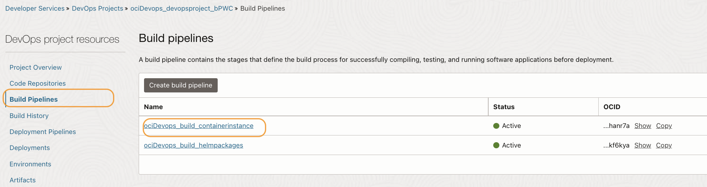
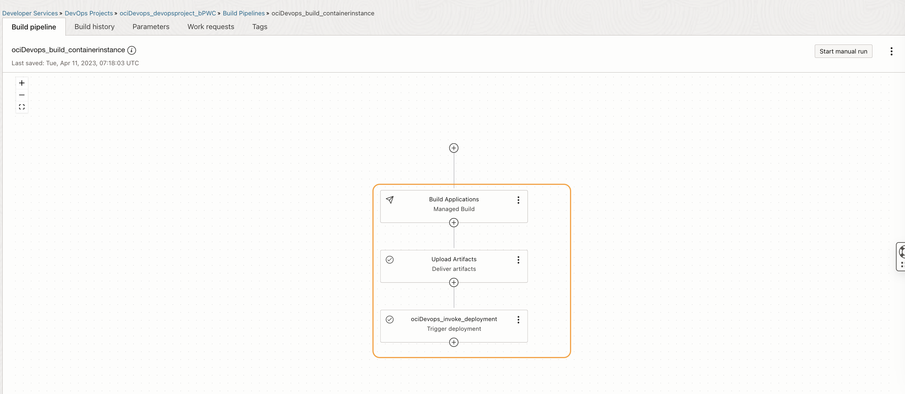
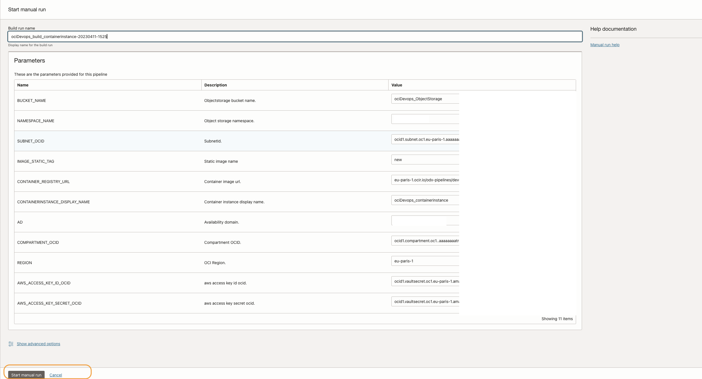
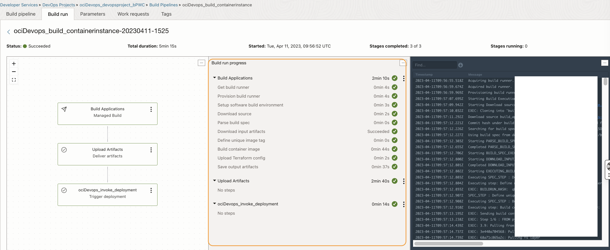
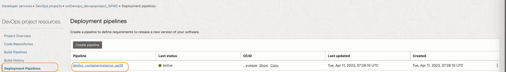
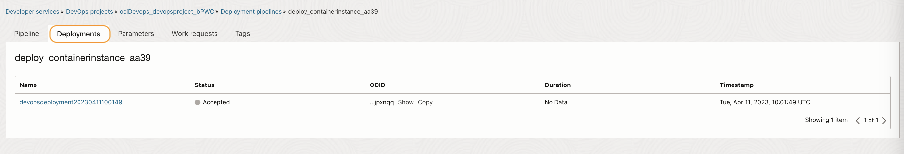
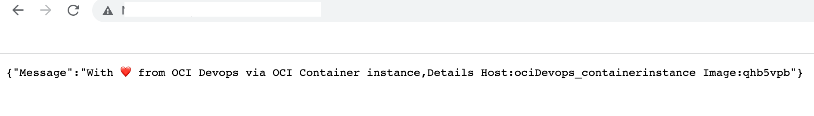
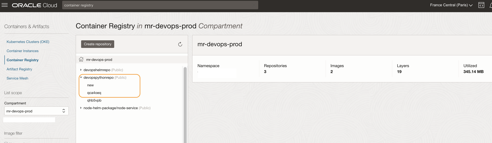
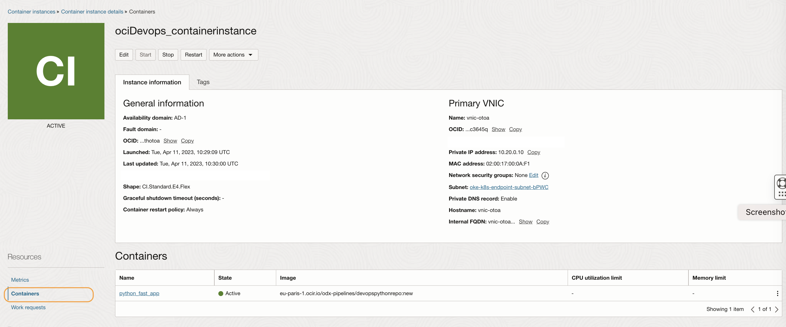
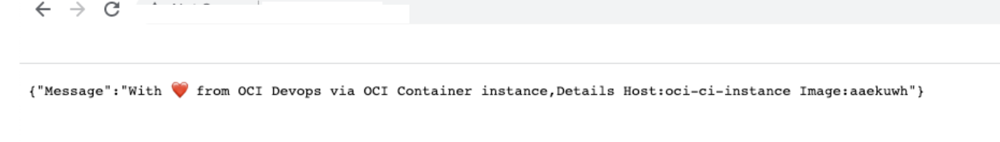

# Deployment onto container instance via OCI Devops

## Introduction

In this lab, you will be running the OCI DevOps pipeline to deploy a sample Python applications image onto OCI Container instances.

Estimated time: 10 minutes

### Objectives

In this lab, as a developer or SRE,

* Run OCI Build and deploy pipeline.
* Validate the container instance deployment

## Task 1: Run OCI Build and deploy pipeline.

1. Using OCI Console > `Developer Services` > `Devops` >` Projects`.Click on the project name.

    

1. Within the `DevOps project resources`, click on `Build pipelines`.

    

1. Click on the pipeline named as `<Some String>_build_containerinstance`.Click `Start manual run`.

    

1. Verify the parameters and start the manual run.

    

    

1. Wait for all the stages to complete. The job will automatically trigger a deployment as well.

    

1. To check the deployment status, from `DevOps project resources` click `Deployment pipelines` and click the one named `deploy_containerinstance_<SOME ID>`.

    

1. Click the `Deployments` tab and validate the deployment in progress.

    

1. Within the `shell stage`, we are running terraform actions (with object storage as the backend) to create and deploy/re-deploy a container image onto container instances. Post the completion, fetch the public IP address of the container instance from the deployment logs.

    

1. Launch the application via a browser using url http://<Public IP address>

    

1. Search `container registry` within the search box and open the registry repo named `devopspythonrepo`.The repo will list the individual images with unique tags and an image with a static tag (eg: new). We are using the static tagged image to reflect the latest image for the new deployment on to container instance.

    

1. Search `container instances` within the search box and validate the container instance created. The name will be <APP Name>_containerinstance.

    

1. You may try (optional) to launch a new build pipeline manual run followed by a deployment to validate a new unique image and the same will be reflected within the same public IP address.

    

You may now **proceed to the next lab**.

## Learn More

* [OCI Devops documentation](https://docs.oracle.com/en-us/iaas/Content/devops/using/home.htm)

## Acknowledgements

* **Author** - Rahul M R
* **Last Updated By/Date** - Rahul M R - April 2023

