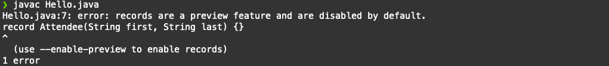
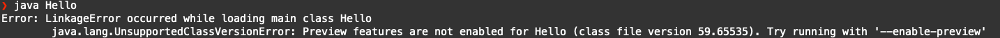

# Java SE Preview Features

## Introduction

The Preview Feature mechanism enables to add non-final, fully specified, and implemented features into the Java platform. The goal is to allow developers to use those non-final features, to gather feedback, and to make necessary changes if needed before those features are made final and permanent into the Java platform.

⚠️ Preview Features should be confused with Experimental Features or with Incubator Modules. For details, please check this [article](https://blogs.oracle.com/javamagazine/the-role-of-previews-in-java-14-java-15-java-16-and-beyond). 

Estimated Lab Time: 5 minutes

### Objectives
This lab will give you an introduction to the Java SE *Preview Feature* mechanism.

## Hello Preview 

1. Create a basic application

   In a new directory, create a simple _Hello.java_ application:

   `
   nano Hello.java
   `

   with the following content:

      ```java
      class Hello {
         public static void main (String ... args) {
            System.out.println(new Attendee("Jane", "Doe"));
         }
      }

      record Attendee(String first, String last) {}

      ```


2. Compile it

   `javac Hello.java`

      


3. This simple application uses a Record (see Lab 6) which is a Preview Feature in Java 15. This error simply informs you that preview features are disabled by default. To use those, you need to explicitly enable them using the `--enable-preview` java compiler flag. Note that, you also need to confirm to the Java compiler which version of the Preview Feature you are using (ex. using the `--release` flag). 

   ` javac --enable-preview --release 15 Hello.java`

   Those 2 flags are simply a safeguard mechanism to make sure that you are aware that you are using features from the platform that are not final, and hence those might change in a future version.

      

   The compilation now succeeds. Notice that you are still warned that preview features are used in the code.


4. Run the application

   `java Hello`

      

5. You are facing the same safeguard as Preview Features are also disabled at runtime! To be used, they should be explicitly enabled using the `--enable-preview`. The difference is that at runtime, you don't need to use a flag to confirm that version that you are using.

   `java --enable-preview Hello`

      

It now works!

## Preview Features & Helidon

Likewise, to use Preview Feature in Helidon, those should be enabled at both compile-time and runtime.

#### Compile time configuration

In an Helidon project's `pom.xml`, configure the Java compiler plugin to enable Preview Feature. You will have to do this in Lab 5.

```xml
…
<plugins>
   …
   <plugin>
      <groupId>org.apache.maven.plugins</groupId>
      <artifactId>maven-compiler-plugin</artifactId>
      <version>3.8.0</version>
      <configuration>
        <compilerArgs>--enable-preview</compilerArgs>
        <release>15</release>
      </configuration>
   </plugin>
</plugins>
…
```
#### Runtime configuration

To run the application, use the following command:

```
java --enable-preview -jar target/myapp.jar
```

Similarly, to use Preview Features via the Helidon CLI 'devloop', you need to pass the same `--enable-preview` argument to the JVM running the application:

```
helidon dev --app-jvm-args "--enable-preview"
```

## Wrap-up

In this section, you have used Records, a Preview Feature in Java 15. You have also seen how to enable Preview Features in Helidon applications.

In summary, the _Preview Feature_ mechanism:

* allows introducing non-final features into the Java platform (ex. Language Feature)

* allow developers to use those and provide feedback

* enables Oracle to gather that feedback and make changes if needed

* Preview Features are disabled by default, they should explicitly be enabled at both compile-time and runtime

* a given Preview Feature is specific to a given Java version

<br>
Java 15 includes several *Preview Features* which will be discussed in upcoming sections.

* JEP 360: Sealed Classes (Preview)

* JEP 375: Pattern Matching for instanceof (Second Preview)

* JEP 384: Records (Second Preview)

## Acknowledgements

 - **Author** - [David Delabassee](https://delabassee.com)
 - **Last updated By** - Kamryn Vinson, October 2020

