# Setup your Oracle Cloud environment

## Introduction


In this lab, you will prepare your Oracle Cloud environment to run the rest of the lab.

Estimated Lab Time: 10 minutes

### Objectives
- Create a Virtual Cloud Network (VCN)
- Create an OCI Compute Instance
- Configure the instance or Java development

### Pre-Requisites

1. [OCI Training](https://cloud.oracle.com/en_US/iaas/training)
2. [Familiarity with OCI console](https://docs.us-phoenix-1.oraclecloud.com/Content/GSG/Concepts/console.htm)
3. [Overview of Networking](https://docs.us-phoenix-1.oraclecloud.com/Content/Network/Concepts/overview.htm)
4. [Familiarity with Compartment](https://docs.us-phoenix-1.oraclecloud.com/Content/GSG/Concepts/concepts.htm)
5. [Connecting to a compute instance](https://docs.us-phoenix-1.oraclecloud.com/Content/Compute/Tasks/accessinginstance.htm)
 
## Task 1: Create a Virtual Cloud Network

In this step, you will create a *Virtual Cloud Network (VCN)*, i.e. a software-defined private network in the Oracle Cloud Infrastructure. See [here](https://docs.cloud.oracle.com/en-us/iaas/Content/Network/Tasks/managingVCNs.htm) for more details on VCN.

1. Click the **Navigation Menu** in the upper left, navigate to **Networking**, and select **Virtual Cloud Networks**.

	

2. Make sure your "root" compartment is selected.

    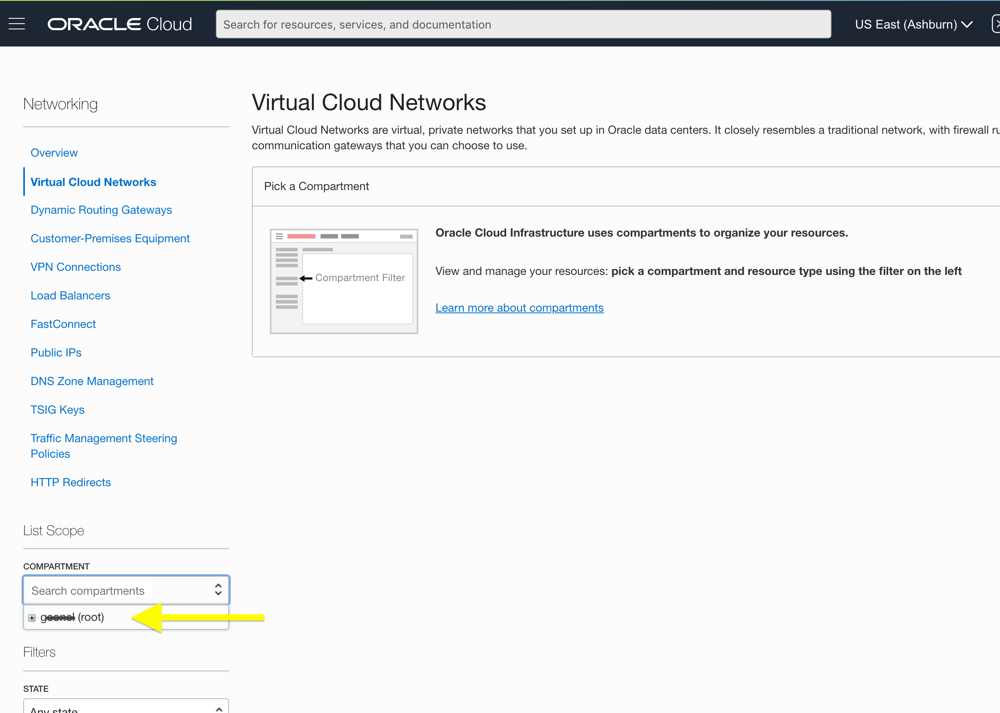

3. You will now create a Virtual Cloud Networks using the VCN Wizard, click **Start VCN Wizard**.

    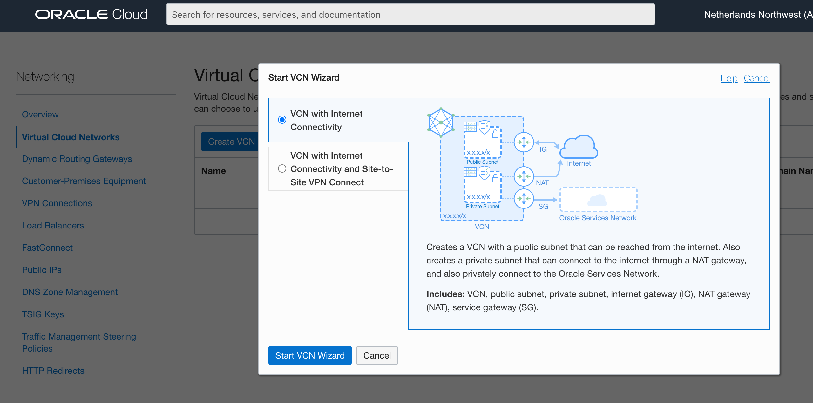

4. Select **VCN with Internet Connectivity** ➡ **Start VCN Wizard**.

5. Give it a meaningful name, ex. "HOL_VCN", and keep other default values.

    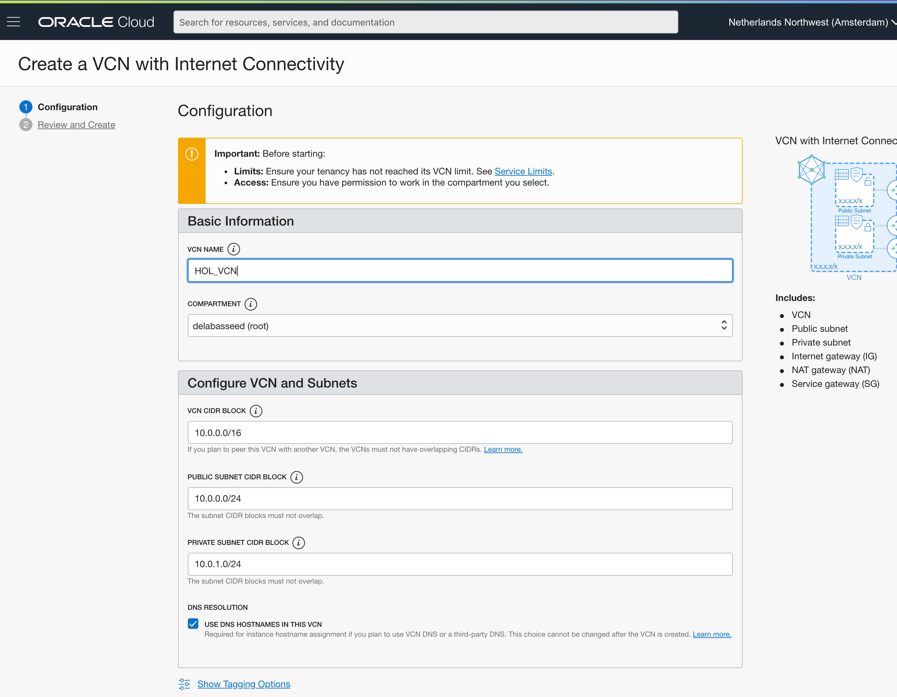

6. Clicking **Next** will display a summary of the VCN configuration. Review it and click **Create** to actually create the VCN. After a couple of seconds, your VCN will be created (including a public and a private subnet, routing tables, an internet gateway, etc.).

    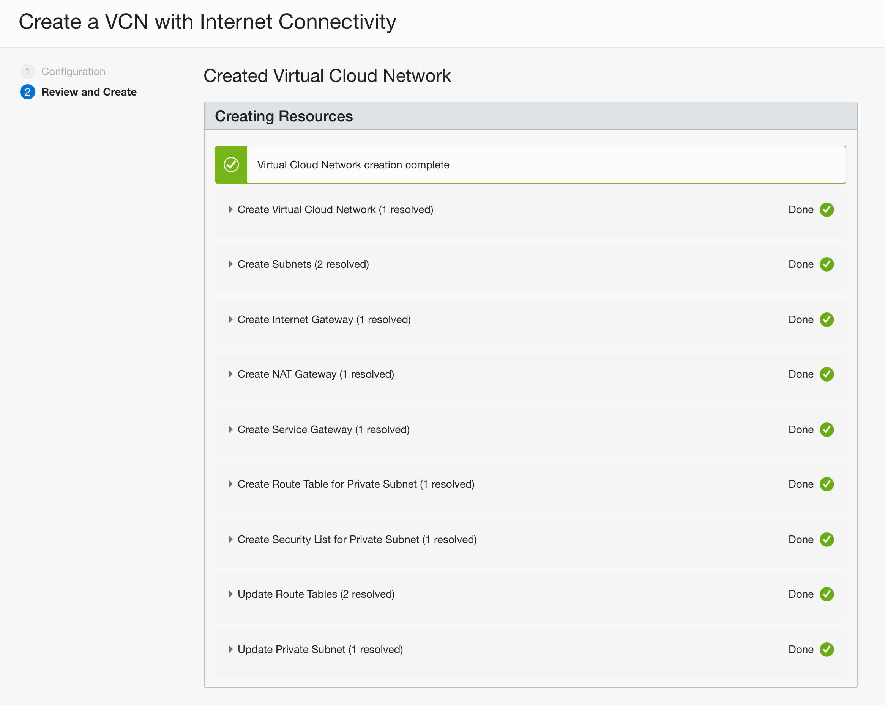

You still need to do one thing, i.e. configure a security rule to allow requests coming from the Internet to reach your Java application(s) running on OCI. For this, you will define an *Ingress Rule* on the VCN public subnet (not the private one!) to open port 8080.

7. From the top left hamburger menu, select **Core Infrastructure** ➡ **Networking** ➡ **Virtual Cloud Networks**, click on your newly created VCN to see its details.

    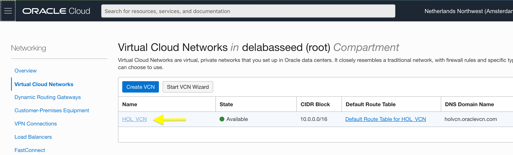

8. Click on the public subnet (not the private one!)

    

9. Click on the default security list and **Add Ingress Rules**.

    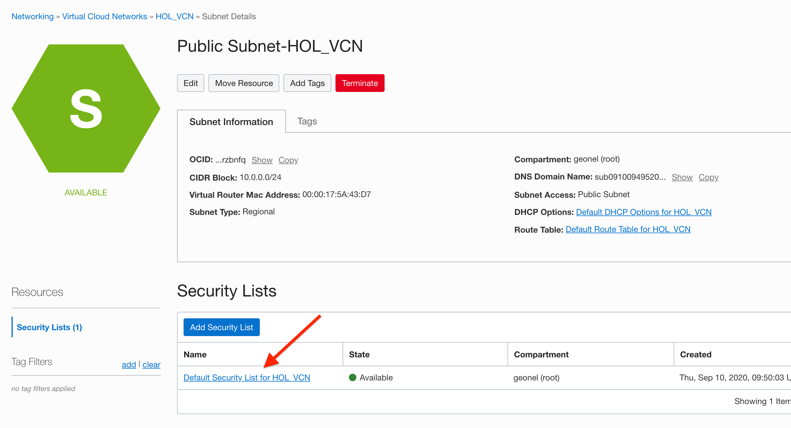
    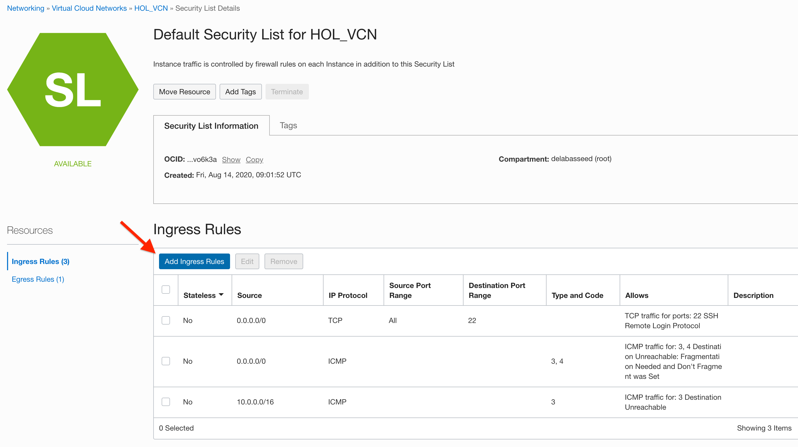

10. Fill in the **Source CIDR** and the **Destination port** as follow, and click **Add Ingress Rules**.

    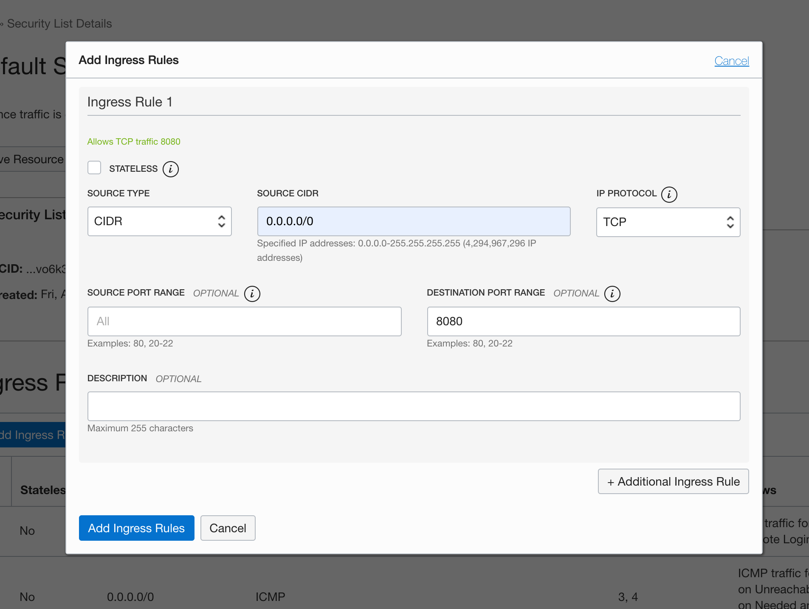

You now have a VCN properly configured, you can move on to the next step.

## Task 2: Provision a Compute Instance

In this step, you will configure and provision a *Compute Instance* that will be used to test new Java features.

Compute Instances can be physical (bare metal) or virtual, they come in different shapes (memory, CPUs, storage, network, GPUs…). You can also choose between different OS…

For this lab, you will configure a _VM_ based instance using the _Oracle Linux 7.8_ (OEL) image.

1. From the top left hamburger menu, select **Core Infrastructure** ➡ **Compute** ➡ **Instances**, click **Create Instance**.

💡 If you don't see **Create Instance** button, make sure that your **root** compartment is selected (check left sidebar **List Scope** - 
**COMPARTMENT**).


2. Keep the default OS image, i.e. _Oracle Linux 7.8_.

    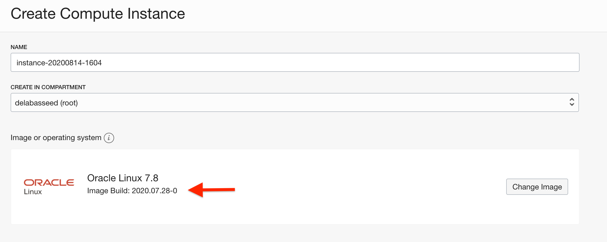


3. Select a Virtual Machine shape: **Show Shape, Network, Storage Options ➡ Change Shape ➡ Virtual Machine**, pick **VM.Standard2.1** or any similarly sized **VM.Standardx.x** shape as it is more than enough to run the lab. You can now confirm with  **Select Shape**.

    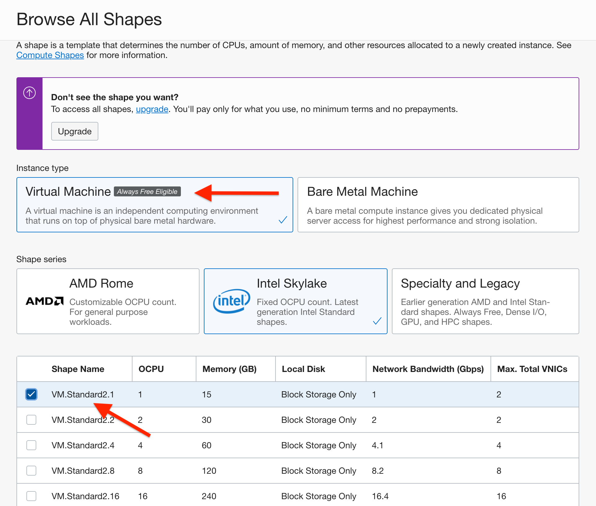


4. Check the network settings. By default, the network should be configured to use your VNC with a public IP address.

    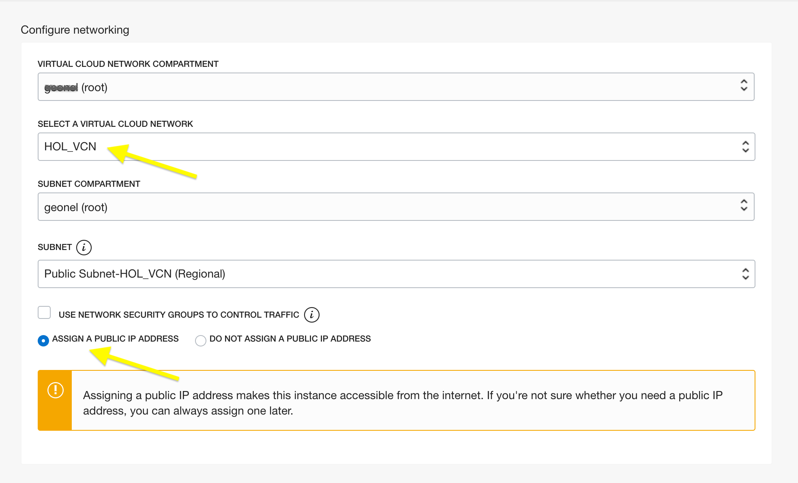


⚠️ OCI will generate the SSH keys pair required to authenticate in this new instance.
You must save the generated private key on your machine. Without it, your instance will be useless as you won't be able to log in! The generated public key will be automatically configured in the instance during its provisioning.


5. Hit **Save Private Key**. Depending on your browser, the private key will either be downloaded and saved on your machine (ex. in the `~/Downloads` folder) or you might get a prompt asking where it should be saved.

    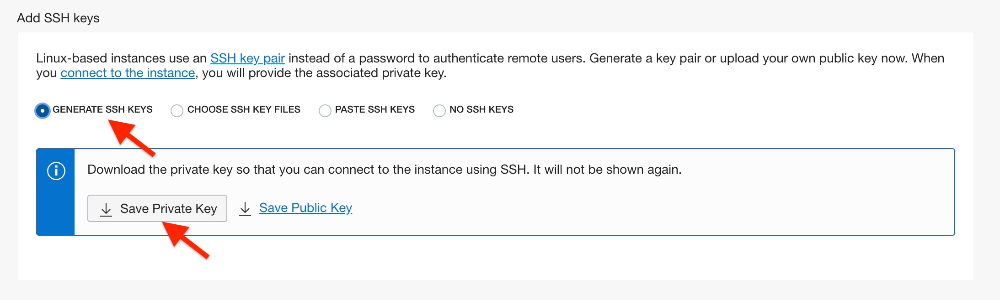 

6. You can now click **Create**.

- After 60~90 seconds, the big left square will switch from the **PROVISIONING** state (orange) to the **RUNNING** state (green). That means that your instance is up and running.

    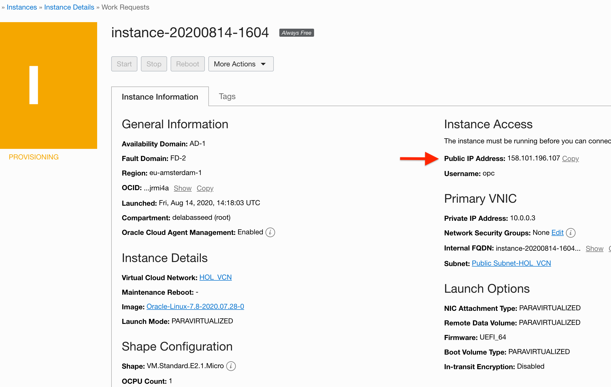 

⚠️ Make sure to write down the Public IP Address of your instance as you will need it!

Your instance is now up and running, you can connect to it!

In a shell on your computer, use `ssh` to connect to the instance on OCI: `ssh {username}@{public_ip}`.

💡 If you are on Windows, check [here](https://docs.cloud.oracle.com/en-us/iaas/Content/Compute/Tasks/accessinginstance.htm#linux) how to use OpenSSH. 
💡 Regardless of the OS you are using, if you have other issues related to ssh (ex. you are unable to alter key permissions or only have PuTTY, etc.), you can try to use [Chrome Secure Shell Extension](https://delabassee.com/ssh-OCI-Chrome/).

The default OEL username is **opc**. You also need to specify the path of the private key using the `-i` flag.
The final command should look like :

`ssh -i ~/Downloads/ssh-key-2020-09-xx.key -o IdentityAgent=none opc@158.xxx.xxx.xxx`

💡 Some OS (ex. OSX) might refuse to establish the connection, and complain about your private key's permissions being too loose (ex. "WARNING: UNPROTECTED PRIVATE KEY FILE!"). If that's the case, make sure to adjust your private key's permissions so that it can't be read by others:

 `chmod 400 ~/Downloads/ssh-key-2020-xxx.key`

You will get a message saying "The authenticity of host '158.xxx.xxx.xxx' can't be established…", you can ignore it by typing **yes**. You are now connected to your OCI instance!

💡 You can also ignore the "LC_CTYPE: cannot change locale" warning, this will be corrected in the next step.


## Task 3: Configure the instance for Java development


You now have a VM running Linux on OCI. Next, you will install the latest version of OpenJDK and other tools required for the Lab (Maven, Git, Helidon).

1. In your instance, run the following command:

    ```
    source <(curl -L https://gist.githubusercontent.com/delabassee/a11e09dcf5a85dae87a5fd6a96ce77ea/raw/ed200268f5d6cdcbb2a9f16d91e5b5f23a4a682e/vm-setup.sh)
    ```

2. The script should take around ~90 seconds. In the meantime, you can check what it is doing by typing its URL (https://gist.githubusercontent.com/delabassee/...) in a browser. In a nutshell, the script: 
* fixes the "LC_CTYPE: cannot change locale" warning,
* installs various tools (git, tree, bat)
* installs the latest OpenJDK version,
* installs Apache Maven,
* installs the Helidon CLI,
* configures the VM firewall to open the 8080 port,
* handles some miscellaneous details (ex. setting the path). 

3. Once the script has been executed, you can test your instance by issuing, for example, `java -version`.

*Congratulations, everything is now correctly set-up! You can proceed to the next lab…*

## Acknowledgements

 - **Author** - [David Delabassee](https://delabassee.com)
 - **Last updated By** - Kamryn Vinson, October 2020

