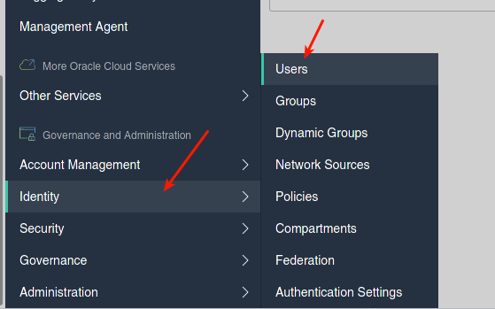
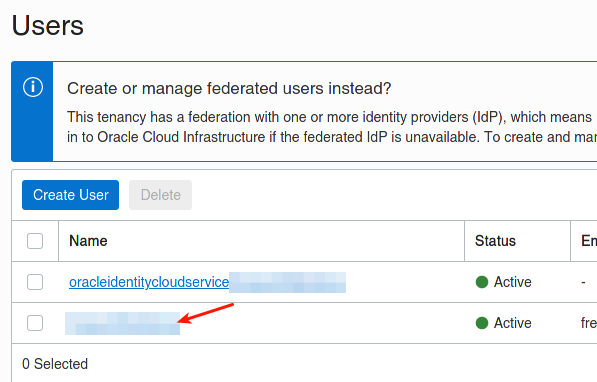
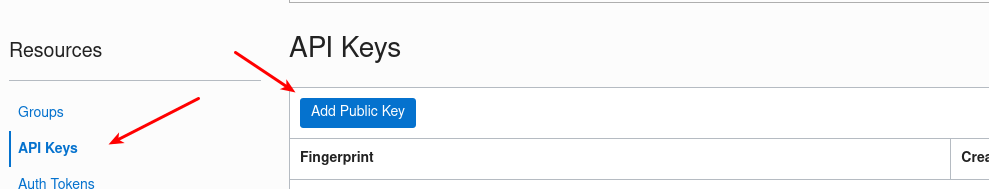
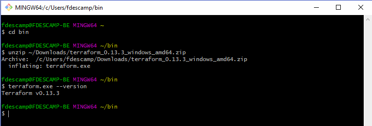

# Prepare your Oracle Cloud environment

## Introduction

In this lab, you will prepare your local machine and your Oracle Cloud API keys to run the rest of the Hands-on Lab.

Estimated Lab Time: 15 minutes
 
## Task 1: Create your API Keys

1. In this step, you will create your Oracle Cloud API keys. See [here](https://docs.cloud.oracle.com/en-us/iaas/Content/API/Concepts/apisigningkey.htm#two) for more details on API signing keys.

    ```
    $ mkdir ~/.oci
    $ openssl genrsa -out ~/.oci/oci_api_key.pem 2048
    $ chmod go-rwx ~/.oci/oci_api_key.pem
    $ openssl rsa -pubout -in ~/.oci/oci_api_key.pem -out ~/.oci/oci_api_key_public.pem
    ```

2. For Windows users, please use [Git for Windows](https://github.com/git-for-windows/git/releases/latest) that allows you to use bash and other GNU tools.


## Task 2: Create your SSH Keys

1. In this step, you will generate your SSH Keys to allow secure connections from your machine to the servers we will create on OCI. **Pay attention that you should not enter a passphrase, leave it blank!**

    ```
    $ ssh-keygen -t rsa
    Generating public/private rsa key pair.
    Enter file in which to save the key (/home/fred/.ssh/id_rsa): id_rsa_oci
    Enter passphrase (empty for no passphrase): 
    Enter same passphrase again: 
    Your identification has been saved in id_rsa_oci
    Your public key has been saved in id_rsa_oci.pub
    ```


## Task 3: Deploying the API Public Key


1. The API Key you created earlier needs to be linked to your OCI account: 

    

    

    

2. You need to upload the public key: `oci_api_key_public.pem`

## Task 4: Installing Terraform

1. Terraform is proposed as a unique binary that you can download [here](https://www.terraform.io/downloads.html).

    ### For Linux users

    ```
    $ cd ~bin
    $ wget \
    https://releases.hashicorp.com/terraform/0.13.4/terraform_0.13.4_linux_amd64.zip
    $ unzip terraform_0.13.4_linux_amd64.zip 
    Archive:  terraform_0.13.4_linux_amd64.zip
      inflating: terraform 
    $ terraform --version
    Terraform v0.13.4
    ``` 

    ### For Windows users

    

Congratulations, everything is now correctly set-up! *You can proceed to the next lab…*

## Acknowledgements

- **Author** - [Frédéric Descamps](https://lefred.be)
- **Contributors** - Kamryn Vinson, Database Product Management
- **Last Updated By/Date** - Frédéric Descamps, September 2020

