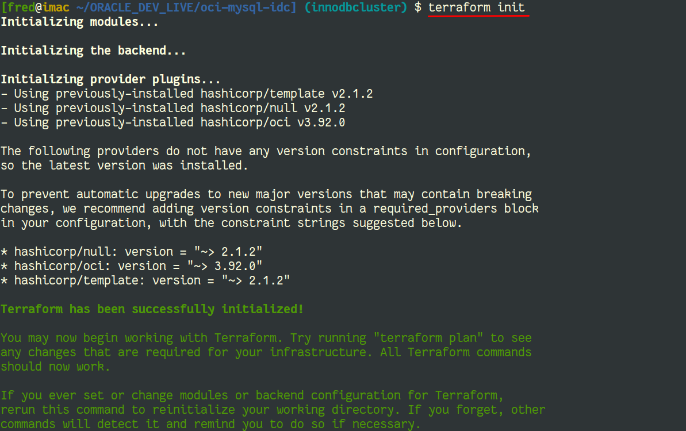
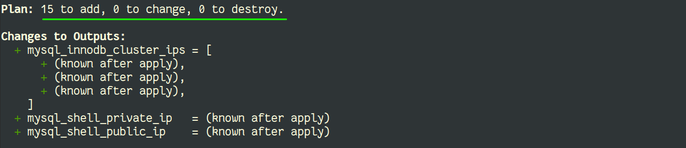
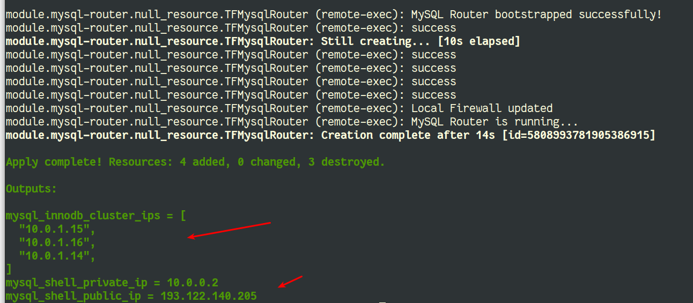
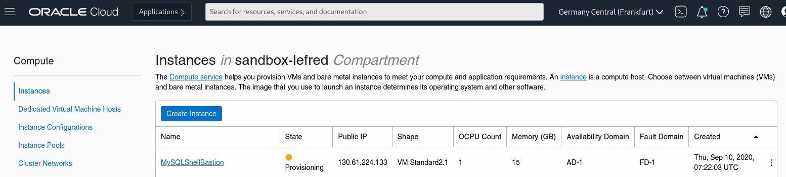
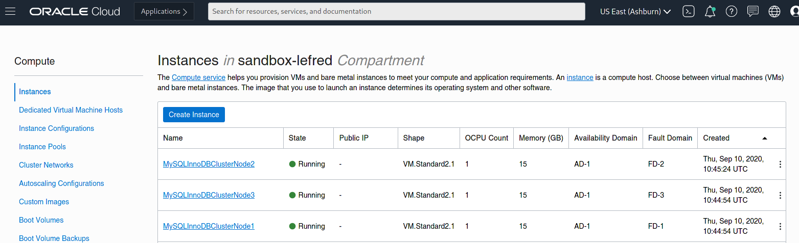

# Terraform - Deployment

## Introduction

In this lab, you will deploy your infrastructure code to Oracle Cloud.

Estimated Lab Time: 5 minutes

## Task 1: Environment Initialization 

1. The `terraform init` command is used to initialize a working directory containing Terraform configuration files. 
This is the first command that should be run after writing a new Terraform configuration or cloning an existing one from version control. 

    💡 It is safe to run this command multiple times.


    ```
    $ terraform init
    ```

    

    ⚠️ verify that you are in the correct directory (the one cloned from GitHub where you created the `terraform.tfvars` file.

## Task 2: Execution Plan

1. The `terraform plan` command is used to create an execution plan. Terraform will determine what actions are necessary to achieve the desired 
state specified in the configuration files. In our case, a VCN, gateways, compute instances, firewall rules, ... all should be planned:

    ```
    $ terraform plan
    ```

    

    💡 You can see how many operations are required: new resources, changed resources and resource to destroy.

## Task 3: Deployment

1. It's finally time to deploy our code to Oracle Cloud Infrastructure. We use `terraform apply`, this is the command used to apply the changes required to reach 
the desired state of the configuration (see `terraform plan`).

    ```
    $ terraform apply
    ``` 

    

2. While the deployment is happening, you can verify in OCI Dashboard, the creation of the compute instances:

    

    

*You can proceed to the next lab…*

## Acknowledgements

- **Author** - [Frédéric Descamps](https://lefred.be)
- **Contributors** - Kamryn Vinson, Database Product Management
- **Last Updated By/Date** - Frédéric Descamps, September 2020

