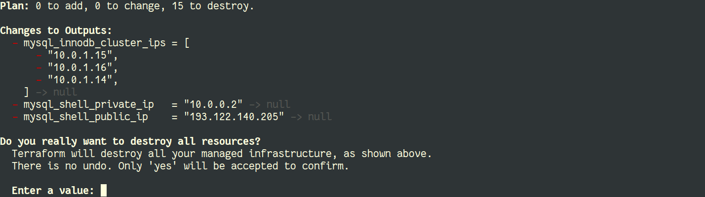
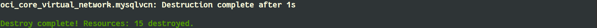

# Destroy

## Introduction

In this lab, we will clean up everything. We will terminate the full environment.

Estimated Lab Time: 2 minutes

## Task: Destroy

1. The `terraform destroy` command is used to destroy the Terraform-managed infrastructure. All resources will be terminated.

    ```
    $ terraform destroy
    ```

    

    

*You can proceed to the next lab…*

## Acknowledgements

- **Author** - [Frédéric Descamps](https://lefred.be)
- **Contributors** - Kamryn Vinson, Database Product Management
- **Last Updated By/Date** - Frédéric Descamps, September 2020

